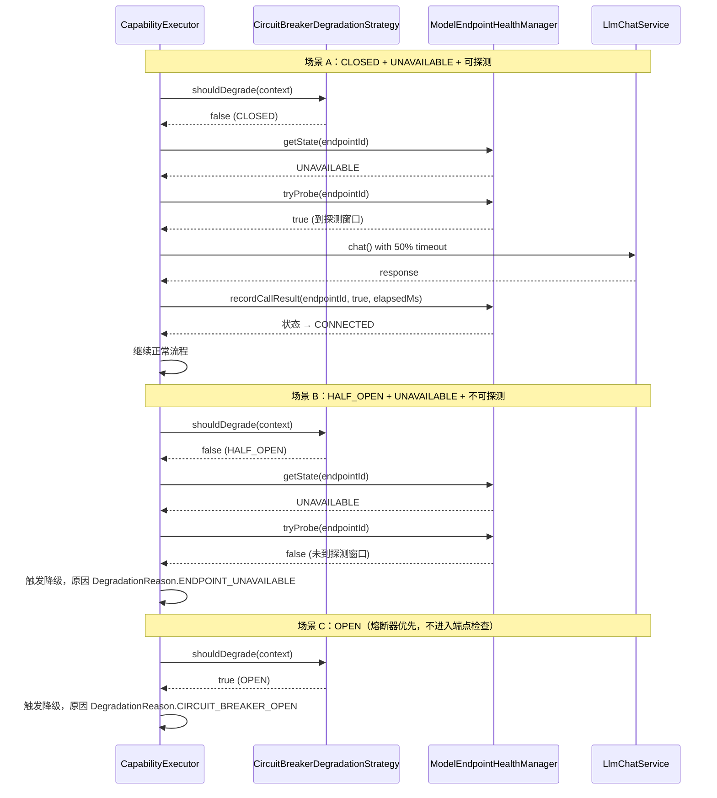

# Phase 5 包 G — AI 进阶底座 架构级 OOD 设计方案（v23）

## 1. 概述

### 1.1 设计目标

Phase 5 包 G 交付 AI 进阶底座（AI Advanced Platform），为平台全部 AI 能力提供统一的运行时基础设施。设计目标如下：

- **能力迁移统一化**：将 Phase 2~4 各阶段独立接入的核心 AI 能力（3.4.1/3.4.2/3.4.3/3.4.10）以及 Phase 5 首次落地的能力（3.4.8/3.4.12/3.4.13）统一迁移至本底座，消除分散接入导致的重复代码和不一致的降级/超时/重试策略；Phase 4 已独立接入的 6 项 AI 能力（3.4.4/3.4.5/3.4.6/3.4.7/3.4.9/3.4.11）不迁移至底座，通过薄适配器集成到 AiOrchestrator 路由框架
- **模型对接标准化**：实现大模型统一对接层，支持多供应商模型路由与切换，业务层不感知具体模型实现
- **对话模板可配置化**：AI 对话模板（Prompt Template）按能力/科室维度可配置、可版本化管理，支持运行时热加载
- **A/B 实验可控化**：提供轻量级 A/B 实验框架，支持按能力维度分配流量到不同模型或 Prompt 版本，实验结果可观测
- **性能观测内建化**：为全部 AI 能力提供统合的调用指标采集、耗时分布、降级率统计与告警能力

### 1.2 整体架构思路

AI 进阶底座定位为 **ai-impl 子模块内部的分层架构**，在现有 `AiService` 接口不变的前提下，将原来 `MockAiService` 的扁平实现替换为多层管线：

```
业务模块 → AiService 接口（ai-api，不变）
              ↓
         FallbackAiService（装饰器，不变接口但内部装配策略变更）
              ↓
         AiOrchestrator（编排层）
              ↓
          ┌───────────────────────────────┐
          │  AI 进阶底座                   │
          │  ├── ModelRouter              │  模型路由
          │  ├── PromptTemplateManager    │  Prompt 模板管理
          │  ├── ExperimentManager         │  A/B 实验
          │  ├── AiMetricsCollector       │  性能观测
          │  ├── LlmChatService           │  大模型对话客户端（含 chat + structuredChat）
          │  ├── LlmChatStreamService     │  大模型流式对话客户端（Flux）
          │  └── ModelEndpointHealthManager
          └───────────────────────────────┘
               ↓
          外部大模型服务（HTTP API / Spring AI ChatModel）
```

**设计风格一致性**：本设计的章节结构、抽象描述粒度、类型形态选择逻辑与设计决策记录格式参照了 Phase0（AiService 降级策略体系）和 Phase1ABD（能力管线编排）的 OOD 设计成果，保持跨阶段设计规范和术语体系的一致性。

### 1.3 核心抽象一览

| 抽象 | 类型形态 | 职责定位 |
|------|---------|---------|
| `AiOrchestrator` | class | 统一编排路由层，实现 `AiService` 接口全部 13 个方法，通过能力标识映射表查找并委托给对应的 `CapabilityExecutor` 实例；持有共享基础设施（`SlidingWindowMetricsStore`），不介入管线内部步骤 |
| `CapabilityExecutor<T, R>` | interface | 单项 AI 能力的泛型执行契约，定义 `execute()` 方法签名 |
| `AbstractCapabilityExecutor<T, R>` | abstract class | CapabilityExecutor 的抽象骨架实现，封装降级预检（前置至容器线程执行，不入线程池排队）、整体端到端超时（`CompletableFuture.orTimeout()`）、指标采集等公共模板方法，子类仅需特化管线差异化步骤 |
| `ModelRouter` | interface | 模型路由契约，根据能力标识与实验分组决定本次调用使用哪个模型配置 |
| `ModelRoute` | class | 模型路由条目值对象，封装模型标识、端点地址、权重等路由元数据 |
| `ClientType` | enum | 模型客户端类型枚举，`HTTP_API`（直连 HTTP 调用）/ `SPRING_AI`（Spring AI ChatModel 封装），用于 `ModelRoute` 字段和 `DelegatingLlmChatService` 分发决策 |
| `LlmChatService` | interface | 大模型对话客户端接口，包含 `chat(LlmChatRequest)`（同步对话）和 `structuredChat(LlmChatRequest, Class<T>)`（结构化输出）两个方法，屏蔽 HTTP API / Spring AI ChatModel 等底层差异 |
| `LlmChatStreamService` | interface | 大模型流式对话客户端接口（独立于 LlmChatService，隔离 Reactor 依赖），提供 `chatStream(LlmChatRequest) → Flux<LlmChatResponse>` 流式方法 |
| `DelegatingLlmChatService` | class | LlmChatService 分发层实现，按 `ModelRoute.clientType` 将 `chat()`/`structuredChat()` 调用派发至 `HttpApiLlmChatService` 或 `SpringAiLlmChatService`，消除双实现 Bean 装配二义性 |
| `HttpApiLlmChatService` | class | HTTP API 同步对话实现，仅实现 `LlmChatService`（chat + structuredChat），不持有 reactor-core 依赖 |
| `HttpApiLlmChatStreamService` | class | HTTP API 流式对话实现，仅实现 `LlmChatStreamService`（chatStream），持有 reactor-core 依赖 |
| `SpringAiLlmChatService` | class | Spring AI ChatModel 同步对话实现，仅实现 `LlmChatService`（chat + structuredChat），不持有 reactor-core 依赖 |
| `SpringAiLlmChatStreamService` | class | Spring AI ChatModel 流式对话实现，仅实现 `LlmChatStreamService`（chatStream），持有 reactor-core 依赖 |
| `LlmChatRequest` | class | 大模型对话请求值对象，包含 `messages: List<LlmChatMessage>`（多轮消息列表）和 `options: LlmChatOptions`（模型参数配置） |
| `LlmChatMessage` | class | 对话消息值对象，封装消息角色（`LlmChatMessageRole`）与文本内容 |
| `LlmChatMessageRole` | enum | 对话消息角色枚举，含 `SYSTEM` / `USER` / `ASSISTANT` 三个常量 |
| `LlmChatOptions` | class | 对话参数配置值对象，封装 `modelId`、`temperature`、`maxTokens`、`stopSequences` 等模型参数，提供编译期类型安全替代 `Map<String, Object>` |
| `LlmChatResponse` | class | 大模型对话响应值对象，携带助手消息文本、Token 用量统计（内嵌 `LlmChatUsage` 静态类）与模型标识 |
| `LlmChatUsage` | static class | Token 用量静态内嵌类，封装 promptTokens/completionTokens/totalTokens 三个字段，作为 `LlmChatResponse` 的内嵌组件，不独立使用 |
| `PromptTemplateManager` | interface | Prompt 模板管理契约，支持按能力/科室/版本检索与渲染模板 |
| `PromptTemplate` | class | Prompt 模板值对象，含模板标识、能力标识、科室标识、模板内容、版本号与启用状态 |
| `ExperimentManager` | interface | A/B 实验管理契约，根据能力标识与上下文决定实验分组 |
| `ExperimentAssignment` | class | 实验分组结果值对象，含实验标识、分组标识与目标模型/Prompt版本 |
| `AiMetricsCollector` | interface | AI 性能指标采集契约，记录每次调用的能力标识、耗时、是否降级、Token 用量等 |
| `AiCallRecord` | class | 单次 AI 调用记录值对象，作为 `AiMetricsCollector` 的入参与 `AI 调用日志`（5.2）持久化的数据源 |
| `AiCallLogEntity` | JPA @Entity | AI 调用日志 JPA 实体，与 `AiCallRecord` 字段对等 |
| `AiRequestBase` | abstract class | AI 能力请求 DTO 基类，封装 visitId/patientId/sessionId 等跨能力通用字段，归属 `ai-api/dto/base/` |
| `StructuredOutputParser` | interface | 结构化输出解析契约，将 LLM 原始文本输出解析为各能力对应的 Java DTO |
| `DegradationStrategy` | interface | 降级策略契约（Phase 0 已定义，本阶段扩展 `DegradationContext` 字段） |
| `DegradationContext` | class | 降级判定上下文（Phase 0 已定义骨架，本阶段扩展字段，含 Builder 模式） |
| `LocalRuleFallback` | interface | 本地规则降级契约，为 3.4.2 处方审核等需要本地规则兜底的能力提供降级执行入口 |
| `SlidingWindowMetricsStore` | class | 每个能力标识的调用指标滑动窗口存储，为降级策略提供数据源 |
| `ModelEndpointHealthManager` | class | 模型端点健康状态管理器，维护每个端点的 CONNECTED/DEGRADED/UNAVAILABLE 状态与探测触发逻辑 |
| `CredentialProvider` | interface | 凭据查询接口，按 endpointId 从 Vault/配置中心查询认证凭据，返回含 API Key/OAuth2 Token 的 Credential 值对象 |
| `EndpointRateLimiter` | class | 端点限流器，基于 Guava 令牌桶算法按 endpointId 维度独立限流，在 LlmChatService 调用入口处执行速率检查 |
| `StructuredChatResult<T>` | class | 结构化调用结果值对象，包裹解析后的 DTO、LLM 重试计数与 Token 用量，使 structuredChat 成功路径也能携带调用元数据 |
| `StructuredOutputNotSupportedException` | class (extends RuntimeException) | 结构化输出格式不支持异常，语义为"模型不支持 JSON mode / tool_use，回退到 chat() + StructuredOutputParser.parse()"；由 LlmChatService 实现层在模型不支持结构化输出时抛出，在 CapabilityExecutor doExecuteInternal() 中被捕获并触发回退路径 |
| `LlmInfrastructureException` | class (extends RuntimeException) | LLM 基础设施异常，语义为"HTTP 5xx、连接超时、网络抖动等基础设施故障，直接降级不尝试 chat() 回退"；与 StructuredOutputNotSupportedException 区分，两个独立 catch 分支处理 |
| `AiPlatformEnvironmentPostProcessor` | class | 配置转发前置处理器，在 Spring 启动早期将 `ai.platform.enabled` 反向转发至 `ai.mock.enabled`，与 `AiPlatformConfig` 生命周期分离 |

---

## 2. 模块划分

### 2.1 目录结构

```
backend/modules/ai/
├── ai-api/ src/main/java/com/aimedical/modules/ai/api/
│   ├── AiService.java                      # 不变
│   ├── AiResult.java                       # 不变
│   ├── degradation/
│   │   ├── DegradationStrategy.java         # 不变（接口签名冻结）
│   │   └── DegradationContext.java          # 扩展字段（保持二进制兼容）
│   └── dto/                                # 不变
│
├── ai-impl/ src/main/java/com/aimedical/modules/ai/impl/
│   ├── orchestrator/
│   │   ├── AiOrchestrator.java             # 统一编排层，实现 AiService
│   │   ├── CapabilityExecutor.java         # 能力执行器泛型接口
│   │   ├── AbstractCapabilityExecutor.java # 能力执行器抽象骨架（封装降级预检、指标采集等公共模板方法）
│   │   └── impl/
│   │       ├── TriageCapabilityExecutor.java
│   │       ├── PrescriptionCheckCapabilityExecutor.java
│   │       ├── MedicalRecordGenCapabilityExecutor.java
│   │       ├── PrescriptionAssistCapabilityExecutor.java
│   │       ├── KbQueryCapabilityExecutor.java
│   │       ├── ScheduleCapabilityExecutor.java
│   │       ├── DiscussionConclusionCapabilityExecutor.java
│   │       ├── DiagnosisCapabilityExecutor.java
│   │       ├── AnalysisReportForInspectionCapabilityExecutor.java
│   │       ├── AnalysisReportForLabTestCapabilityExecutor.java
│   │       ├── ImageAnalysisCapabilityExecutor.java
│   │       ├── RecommendExaminationCapabilityExecutor.java
│   │       └── RecommendExecutionOrderCapabilityExecutor.java
│   ├── router/
│   │   ├── ModelRouter.java                # 模型路由接口
│   │   ├── DefaultModelRouter.java         # 默认路由实现（基于能力标识 + 配置映射）
│   │   └── ModelRoute.java                # 路由条目值对象
│   ├── client/
│   │   ├── LlmChatService.java            # 大模型对话客户端接口（chat + structuredChat）
│   │   ├── LlmChatStreamService.java      # 大模型流式对话客户端接口（Flux）
│   │   ├── HttpApiLlmChatService.java     # HTTP API 同步对话实现（仅实现 LlmChatService）
│   │   ├── HttpApiLlmChatStreamService.java # HTTP API 流式对话实现（仅实现 LlmChatStreamService）
│   │   ├── SpringAiLlmChatService.java    # Spring AI ChatModel 同步对话实现（仅实现 LlmChatService）
│   │   ├── SpringAiLlmChatStreamService.java # Spring AI ChatModel 流式对话实现（仅实现 LlmChatStreamService）
│   │   ├── DelegatingLlmChatService.java # LlmChatService 分发层（按 ClientType 路由到对应实现）
│   │   ├── LlmChatRequest.java            # 对话请求值对象（messages + options）
│   │   ├── LlmChatMessage.java            # 对话消息值对象（role + content）
│   │   ├── LlmChatMessageRole.java        # 对话消息角色枚举
│   │   ├── LlmChatOptions.java            # 对话参数配置值对象（强类型）
│   │   ├── LlmChatResponse.java           # 对话响应值对象（含内嵌 LlmChatUsage）
│   │   ├── LlmChatUsage.java              # Token 用量内嵌静态类
│   │   ├── StructuredChatResult.java      # 结构化调用结果值对象（含 data/retryCount/usage）
│   │   ├── CredentialProvider.java        # 凭据查询接口
│   │   ├── EndpointRateLimiter.java       # 端点限流器（令牌桶）
│   │   └── exception/
│   │       ├── StructuredOutputNotSupportedException.java # 结构化输出格式不支持异常
│   │       └── LlmInfrastructureException.java             # LLM 基础设施异常
│   ├── template/
│   │   ├── PromptTemplateManager.java      # 模板管理接口
│   │   ├── PromptTemplate.java            # 模板值对象（JPA Entity）
│   │   ├── DatabasePromptTemplateManager.java # 数据库持久化实现
│   │   └── PromptTemplateRepository.java  # JPA Repository
│   ├── experiment/
│   │   ├── ExperimentManager.java          # 实验管理接口
│   │   ├── ExperimentAssignment.java       # 分组结果值对象
│   │   ├── Experiment.java                # 实验配置值对象（JPA Entity）
│   │   ├── ExperimentRepository.java      # JPA Repository
│   │   └── HashBucketExperimentManager.java # 哈希分桶实现
│   ├── metrics/
│   │   ├── AiMetricsCollector.java         # 指标采集接口
│   │   ├── AiCallRecord.java              # 调用记录值对象
│   │   ├── AiCallLogEntity.java           # AI 调用日志 JPA 实体（新增）
│   │   ├── AiCallLogRepository.java       # AI 调用日志 JPA Repository
│   │   ├── LoggingMetricsCollector.java   # 日志输出实现
│   │   ├── SlidingWindowMetricsStore.java # 调用指标滑动窗口存储（新增）
│   │   └── ModelEndpointHealthManager.java # 模型端点健康状态管理器（新增）
│   ├── parser/
│   │   ├── StructuredOutputParser.java     # 结构化输出解析接口
│   │   └── JsonStructuredOutputParser.java # JSON 结构化解析实现
│   ├── fallback/
│   │   ├── LocalRuleFallback.java         # 本地规则降级接口
│   │   └── PrescriptionLocalRuleFallback.java # 处方审核本地规则实现
│   ├── mock/
│   │   └── MockAiService.java             # 保留，Phase 5+ 仅用于开发/测试
│   ├── degradation/
│   │   ├── NoOpDegradationStrategy.java    # 保留
│   │   ├── TimeoutDegradationStrategy.java # 超时降级策略
│   │   └── CircuitBreakerDegradationStrategy.java # 熔断降级策略
│   ├── config/
│   │   ├── AiPlatformConfig.java                      # 底座 Bean 装配与配置属性绑定
│   │   └── AiPlatformEnvironmentPostProcessor.java    # 配置转发前置处理器（EnvironmentPostProcessor）
│   └── FallbackAiService.java             # 装饰器（装配策略变更）
```

### 2.2 模块依赖方向

```
ai-api ←──────────────────────────── ai-impl
  │                                      │
  │  (interface + DTO, no impl dep)     ├── orchestrator/ ──> router/, template/, experiment/, client/, fallback/, degradation/, metrics/
  │                                     ├── router/ ──> config (YaML/DB)
  │                                     ├── client/ ──> Spring AI / HTTP (外部依赖)
  │                                     ├── template/ ──> JPA Repository
  │                                     ├── experiment/ ──> JPA Repository
  │                                     ├── metrics/ ──> JPA Repository + Micrometer
  │                                     ├── parser/ ──> ai-api DTO
  │                                     ├── fallback/ ──> ai-api DTO + 业务规则
  │                                     └── thin-adapter/ ──> Phase 4 业务服务模块

**依赖规则**：
- `ai-api` 保持不变，业务模块仅依赖 `ai-api`
- `ai-impl` 内部各子包之间按单向依赖：orchestrator 为顶层编排，依赖其余子包；其余子包之间不互相依赖
- `client/` 是唯一引入外部大模型依赖（Spring AI / HTTP 客户端）的子包，包含 `LlmChatService`、`LlmChatStreamService` 及消息 DTO 类型
- `template/`、`experiment/`、`metrics/` 各自拥有一套 JPA Repository + Entity，数据持久化独立
- `orchestrator/impl/` 中的 6 个薄适配器型 CapabilityExecutor 各持有对应 Phase 4 业务服务的引用。ai-impl 模块在 Maven 层面声明对 Phase 4 业务服务模块的依赖，作用域使用 `provided` 而非 `compile`。理由如下：(1) `provided` 避免 ai-impl 对 Phase 4 业务模块产生编译期强耦合——薄适配器作为 ai-impl 内部的可选组件，其编译期类型引用仅存在于薄适配器实现类中，`provided` 作用域确保 ai-impl 主体代码不感知 Phase 4 接口；(2) 运行时 Phase 4 业务模块的 JAR 已部署在同一 JVM 中（单体架构或同一 Spring Boot 容器），ClassLoader 可正常加载，不存在 `test` 作用域下的运行期类加载失败风险；(3) 若后续某项能力从薄适配器升级为底座完整管线（调用 `ModelRouter` + `LlmChatService`），只需移除 `provided` 依赖并交还 Maven 依赖管理权。Phase 4 业务服务接口不在 ai-api 中重新定义——薄适配器直接引用 Phase 4 模块中的现有业务接口（如 `com.aimedical.modules.diagnosis.service.DiagnosisService`），通过构造器注入获取服务实例。依赖方向为 `ai-impl → Phase 4 modules`（出向依赖，包 G 依赖外部模块），不产生循环依赖。⚠️ **Spring Boot uber-JAR 部署的运行时风险**：`spring-boot-maven-plugin` 默认不将 `provided` 作用域的依赖打包进 uber-JAR。使用 `provided` 意味着部署时需确保 Phase 4 业务模块的 JAR 作为外部依赖部署（如放置在 `WEB-INF/lib/` 或通过容器共享类路径加载）。若项目使用 `spring-boot-maven-plugin` 的 `repackage` 目标打包为可执行 JAR，需在构建配置中将 Phase 4 业务模块显式声明为 `compile` 作用域或通过 `extraLib` 机制将其纳入 uber-JAR。此风险在 §2.2 显式记录作为已知约束，实现者在搭建构建流水线时需根据部署方式选择适配方案

### 2.3 类图

```mermaid
classDiagram
    class AiService {
        <<interface>>
        +triage(TriageRequest) CompletableFuture~AiResult~TriageResponse~~
        +prescriptionCheck(PrescriptionCheckRequest) CompletableFuture~AiResult~PrescriptionCheckResponse~~
        +generateMedicalRecord(MedicalRecordGenRequest) CompletableFuture~AiResult~MedicalRecordGenResponse~~
        +prescriptionAssist(PrescriptionAssistRequest) CompletableFuture~AiResult~PrescriptionAssistResponse~~
        +knowledgeBaseQuery(KbQueryRequest) CompletableFuture~AiResult~KbQueryResponse~~
        +schedule(ScheduleRequest) CompletableFuture~AiResult~ScheduleResponse~~
        +discussionConclusion(DiscussionConclusionRequest) CompletableFuture~AiResult~DiscussionConclusionResponse~~
        +diagnosis(DiagnosisRequest) CompletableFuture~AiResult~DiagnosisResponse~~
        +analysisReportForInspection(AnalysisReportForInspectionRequest) CompletableFuture~AiResult~AnalysisReportForInspectionResponse~~
        +analysisReportForLabTest(AnalysisReportForLabTestRequest) CompletableFuture~AiResult~AnalysisReportForLabTestResponse~~
        +imageAnalysis(ImageAnalysisRequest) CompletableFuture~AiResult~ImageAnalysisResponse~~
        +recommendExamination(RecommendExaminationRequest) CompletableFuture~AiResult~RecommendExaminationResponse~~
        +recommendExecutionOrder(RecommendExecutionOrderRequest) CompletableFuture~AiResult~RecommendExecutionOrderResponse~~
    }

    class FallbackAiService {
        <<decorator>>
        -AiService delegate
        +triage() CompletableFuture~AiResult~TriageResponse~~
        +prescriptionCheck() CompletableFuture~AiResult~PrescriptionCheckResponse~~
        +... (委托给 delegate + 降级兜底)
    }

    class AiOrchestrator {
        -Map~String, CapabilityExecutor~ executorMap
        -SlidingWindowMetricsStore metricsStore
        -AiMetricsCollector metricsCollector
        +triage() CompletableFuture~AiResult~TriageResponse~~
        +prescriptionCheck() CompletableFuture~AiResult~PrescriptionCheckResponse~~
        +... (13 个方法统一委托 handle())
        +handle(capabilityId, request) CompletableFuture~AiResult~R~~
    }

    class CapabilityExecutor~T, R~ {
        <<interface>>
        +execute(T request, String capabilityId) CompletableFuture~AiResult~R~~
        +getCapabilityId() String
        +getInputType() Class~T~
        +getOutputType() Class~R~
    }

    class AbstractCapabilityExecutor~T, R~ {
        <<abstract>>
        #Map~String,Duration~ capabilityTimeoutConfig
        #Duration thinAdapterTimeout
        #doDegrade(startTime, degradeReason, request, capabilityId, departmentId, callerRole, callerId, visitId, patientId, sessionId, inputSummary, outputSummary, promptVersion) AiResult~R~~
        +execute(T request, String capabilityId) CompletableFuture~AiResult~R~~ (template method)
        #doExecuteInternal(startTime, request, capabilityId, departmentId, userId, sessionId, callerRole, callerId, visitId, patientId, inputSummary) AiResult~R~~
        #extractVariables(T request) Map~String,Object~
        #doExtractDepartmentId(T request) String
        #doExtractVisitId(T request) String
        #doExtractPatientId(T request) String
        #doExtractSessionId(T request) String
        #extractOutputSummary(Object result) String
    }

    class TriageCapabilityExecutor {
    }
    class PrescriptionCheckCapabilityExecutor {
    }
    class MedicalRecordGenCapabilityExecutor {
    }
    class PrescriptionAssistCapabilityExecutor {
    }
    class KbQueryCapabilityExecutor {
    }
    class ScheduleCapabilityExecutor {
    }
    class DiscussionConclusionCapabilityExecutor {
    }
    class DiagnosisCapabilityExecutor {
    }
    class AnalysisReportForInspectionCapabilityExecutor {
    }
    class AnalysisReportForLabTestCapabilityExecutor {
    }
    class ImageAnalysisCapabilityExecutor {
    }
    class RecommendExaminationCapabilityExecutor {
    }
    class RecommendExecutionOrderCapabilityExecutor {
    }

    class ModelRouter {
        <<interface>>
        +route(String capabilityId, ExperimentAssignment assignment) ModelRoute
    }
    class DefaultModelRouter {
    }
    class ModelRoute {
        +String endpointId
        +String modelId
        +String endpoint
        +ClientType clientType
        +Duration connectionTimeout
        +Duration readTimeout
        +Map~String,Object~ parameters
    }

    class LlmChatService {
        <<interface>>
        +chat(LlmChatRequest) CompletableFuture~AiResult~LlmChatResponse~~
        +structuredChat(LlmChatRequest, Class~T~) CompletableFuture~AiResult~StructuredChatResult~T~~~
    }
    class LlmChatStreamService {
        <<interface>>
        +chatStream(LlmChatRequest) Flux~LlmChatResponse~
    }
    class DelegatingLlmChatService {
        <<delegator>>
        -Map~ClientType, LlmChatService~ delegates
        +chat(LlmChatRequest) CompletableFuture~AiResult~LlmChatResponse~~
        +structuredChat(LlmChatRequest, Class~T~) CompletableFuture~AiResult~StructuredChatResult~T~~~
    }
    class ClientType {
        <<enum>>
        HTTP_API
        SPRING_AI
    }
    class HttpApiLlmChatService {
    }
    class SpringAiLlmChatService {
    }
    class LlmChatRequest {
        +List~LlmChatMessage~ messages
        +LlmChatOptions options
        +ClientType clientType
    }
    class LlmChatMessage {
        +LlmChatMessageRole role
        +String content
    }
    class LlmChatMessageRole {
        <<enum>>
        SYSTEM
        USER
        ASSISTANT
    }
    class LlmChatOptions {
        +String modelId
        +Double temperature
        +Integer maxTokens
        +List~String~ stopSequences
    }
    class LlmChatResponse {
        +String content
        +LlmChatUsage usage
        +String modelId
    }
    class LlmChatUsage {
        +int promptTokens
        +int completionTokens
        +int totalTokens
    }
    class StructuredChatResult~T~ {
        +T data
        +int retryCount
        +LlmChatUsage usage
    }
    class StructuredOutputNotSupportedException {
        <<exception>>
    }
    class LlmInfrastructureException {
        <<exception>>
    }
    LlmChatResponse *--> "1" LlmChatUsage : has
    LlmChatService ..> StructuredChatResult : returns
    LlmChatService ..> StructuredOutputNotSupportedException : throws
    LlmChatService ..> LlmInfrastructureException : throws
    LlmChatRequest *--> "1..*" LlmChatMessage : has
    LlmChatMessage --> "1" LlmChatMessageRole : uses

    class PromptTemplateManager {
        <<interface>>
        +render(String capabilityId, String departmentId, Map~String,Object~ variables, Integer promptVersion) String
    }
    class DatabasePromptTemplateManager {
    }
    class PromptTemplate {
        +Long id
        +String capabilityId
        +String departmentId
        +String content
        +int version
        +TemplateStatus status
    }
    class PromptTemplateRepository {
        <<JPA Repository>>
    }

    class ExperimentManager {
        <<interface>>
        +assign(String capabilityId, String userId, String sessionId) ExperimentAssignment
    }
    class HashBucketExperimentManager {
    }
    class Experiment {
        +Long id
        +String capabilityId
        +List~ExperimentGroup~ groups
        +ExperimentStatus status
        +LocalDateTime startTime
        +LocalDateTime endTime
    }
    class ExperimentAssignment {
        +String experimentId
        +String groupId
        +String targetModelId
        +Integer targetPromptVersion
    }

    class AiMetricsCollector {
        <<interface>>
        +record(AiCallRecord record) void
    }
    class LoggingMetricsCollector {
    }
    class AiRequestBase {
        <<abstract>>
        +String visitId
        +String patientId
        +String sessionId
        +String departmentId
    }

    class AiCallRecord {
        +LocalDateTime callTime
        +String capabilityId
        +String capabilityName
        +String visitId
        +String patientId
        +String departmentId
        +String callerRole
        +String callerId
        +String inputSummary
        +String outputSummary
        +boolean degraded
        +String degradationReason
        +long elapsedMs
        +String errorCode
        +String errorMessage
        +String modelId
        +int retryCount
        +String sessionId
        +Integer promptVersion
        +Integer promptTokens
        +Integer completionTokens
        +Integer totalTokens
    }
    class AiCallLogEntity {
        <<JPA @Entity>>
        +Long id
        +LocalDateTime callTime
        +String capabilityId
        +String capabilityName
        +String visitId
        +String patientId
        +String departmentId
        +String callerRole
        +String callerId
        +String inputSummary
        +String outputSummary
        +boolean degraded
        +String degradationReason
        +long elapsedMs
        +String errorCode
        +String errorMessage
        +String modelId
        +int retryCount
        +String sessionId
        +Integer promptVersion
        +Integer promptTokens
        +Integer completionTokens
        +Integer totalTokens
    }
    class AiCallLogRepository {
        <<JPA Repository>>
    }

    class SlidingWindowMetricsStore {
        +recordSuccess(String capabilityId, long elapsedMs) void
        +recordDegraded(String capabilityId, long elapsedMs) void
        +recordFailure(String capabilityId) void
        +getFailureRate(String capabilityId) double
        +getEffectiveFailureRate(String capabilityId) double
        +getAverageElapsed(String capabilityId) double
        +buildDegradationContext(String capabilityId, String requestType) DegradationContext
    }

    class ModelEndpointHealthManager {
        +getState(String endpointId) EndpointState
        +recordCallResult(String endpointId, boolean success, long elapsedMs) void
        +tryProbe(String endpointId) boolean
    }

    class EndpointRateLimiter {
        +tryAcquire(String endpointId) boolean
    }

    class Credential {
        +AuthType authType
        +String credentialValue
        +Instant expiresAt
        +String vaultPath
    }
    class CredentialProvider {
        <<interface>>
        +getCredential(String endpointId) Credential
    }
    CredentialProvider ..> LlmChatService : authenticates
    CredentialProvider ..> Credential : returns

    class AiPlatformConfig {
        <<@Configuration>>
        <<@EnableConfigurationProperties>>
        +llmCallExecutor() Executor
        +metricsAsyncExecutor(MetricsAsyncProperties) Executor
        +degradationStrategyMap() Map
        +capabilityTimeoutConfig(AiExecutionProperties) Map
    }
    class AiPlatformEnvironmentPostProcessor {
        <<EnvironmentPostProcessor>>
        +postProcessEnvironment(ConfigurableEnvironment, SpringApplication) void
    }
    AiPlatformConfig ..> EndpointRateLimiter : configures

    class DegradationStrategy {
        <<interface>>
        +shouldDegrade(DegradationContext context) boolean
        +getOrder() int [default method returns 0]
    }
    class DegradationContext {
        <<Serializable>>
        +int invocationCount
        +long lastFailureTime
        +long elapsedTime
        +String requestType
        +int failureCount
        +String departmentId
        +long serializedTimestamp
        +postDeserializationValidate() void
        +isFresh() boolean
        +isInitialized() boolean
        +setDepartmentId(String departmentId) void
        +getDepartmentId() String
        +Builder builder()
    }
    class TimeoutDegradationStrategy {
        +shouldDegrade() boolean
    }
    class CircuitBreakerDegradationStrategy {
        +shouldDegrade() boolean
    }
    class NoOpDegradationStrategy {
    }

    class StructuredOutputParser {
        <<interface>>
        +parse(LlmResponse response, Class~T~ targetClass) T
    }
    class JsonStructuredOutputParser {
    }

    class LocalRuleFallback~T, R~ {
        <<interface>>
        +fallback(T request) AiResult~R~
    }
    class PrescriptionLocalRuleFallback {
    }

    AiService <|.. FallbackAiService : implements
    AiService <|.. AiOrchestrator : implements
    AiService <|.. MockAiService : implements

    FallbackAiService o--> AiService : wraps (delegate)

    AiOrchestrator o--> "1..*" CapabilityExecutor : routes via Map
    AiOrchestrator o--> "1" SlidingWindowMetricsStore : has
    AiOrchestrator o--> "1" AiMetricsCollector : has

    CapabilityExecutor <|.. AbstractCapabilityExecutor : implements
    AbstractCapabilityExecutor <|-- TriageCapabilityExecutor : extends
    AbstractCapabilityExecutor <|-- PrescriptionCheckCapabilityExecutor : extends
    AbstractCapabilityExecutor <|-- MedicalRecordGenCapabilityExecutor : extends
    AbstractCapabilityExecutor <|-- PrescriptionAssistCapabilityExecutor : extends
    AbstractCapabilityExecutor <|-- KbQueryCapabilityExecutor : extends
    AbstractCapabilityExecutor <|-- ScheduleCapabilityExecutor : extends
    AbstractCapabilityExecutor <|-- DiscussionConclusionCapabilityExecutor : extends
    AbstractCapabilityExecutor <|-- DiagnosisCapabilityExecutor : extends
    AbstractCapabilityExecutor <|-- AnalysisReportForInspectionCapabilityExecutor : extends
    AbstractCapabilityExecutor <|-- AnalysisReportForLabTestCapabilityExecutor : extends
    AbstractCapabilityExecutor <|-- ImageAnalysisCapabilityExecutor : extends
    AbstractCapabilityExecutor <|-- RecommendExaminationCapabilityExecutor : extends
    AbstractCapabilityExecutor <|-- RecommendExecutionOrderCapabilityExecutor : extends

    CapabilityExecutor --> ModelRouter : uses
    CapabilityExecutor --> LlmChatService : uses
    CapabilityExecutor --> LlmChatStreamService : optional uses
    CapabilityExecutor --> PromptTemplateManager : uses
    CapabilityExecutor --> ExperimentManager : uses
    CapabilityExecutor --> StructuredOutputParser : uses
    CapabilityExecutor --> AiMetricsCollector : uses
    CapabilityExecutor --> LocalRuleFallback : optional uses
    CapabilityExecutor --> SlidingWindowMetricsStore : uses
    CapabilityExecutor --> DegradationStrategy : uses (per-capability injection)
    CapabilityExecutor --> ModelEndpointHealthManager : optional uses

    ModelRouter <|.. DefaultModelRouter
    ModelRouter --> ModelRoute : returns

    LlmChatService <|.. DelegatingLlmChatService : implements
    LlmChatService <|.. HttpApiLlmChatService
    LlmChatService <|.. SpringAiLlmChatService
    DelegatingLlmChatService --> "1" HttpApiLlmChatService : dispatches
    DelegatingLlmChatService --> "1" SpringAiLlmChatService : dispatches
    DelegatingLlmChatService ..> ClientType : dispatch key
    LlmChatStreamService <|.. HttpApiLlmChatStreamService
    LlmChatStreamService <|.. SpringAiLlmChatStreamService
    LlmChatService --> LlmChatRequest : receives
    LlmChatService --> LlmChatResponse : returns
    LlmChatService ..> StructuredOutputParser : optionale uses (structuredChat fallback)

    PromptTemplateManager <|.. DatabasePromptTemplateManager
    DatabasePromptTemplateManager --> PromptTemplateRepository : reads/writes
    PromptTemplateRepository --> PromptTemplate : manages

    ExperimentManager <|.. HashBucketExperimentManager
    HashBucketExperimentManager --> ExperimentRepository : reads
    ExperimentRepository --> Experiment : manages

    AiMetricsCollector <|.. LoggingMetricsCollector
    LoggingMetricsCollector --> AiCallLogRepository : writes
    AiCallLogRepository --> AiCallLogEntity : persists

    DegradationStrategy <|.. NoOpDegradationStrategy
    DegradationStrategy <|.. TimeoutDegradationStrategy
    DegradationStrategy <|.. CircuitBreakerDegradationStrategy
    TimeoutDegradationStrategy --> SlidingWindowMetricsStore : reads
    CircuitBreakerDegradationStrategy --> SlidingWindowMetricsStore : reads

    StructuredOutputParser <|.. JsonStructuredOutputParser

    LocalRuleFallback <|.. PrescriptionLocalRuleFallback
```



---

## 3. 核心抽象

### 3.1 编排层

#### `AiOrchestrator` — 统一编排路由器（class，归属 `ai-impl/orchestrator/`）

**职责**：替代原 `MockAiService` 成为 `FallbackAiService` 的实际委托对象（`ai.platform.enabled=true` 时激活），实现 `AiService` 全部 13 个方法。每个方法的执行流程为按能力标识查找对应的 `CapabilityExecutor` 并委托其完成完整执行管线：

1. **查找执行器**：按能力标识从内部映射表（`Map<String, CapabilityExecutor>`）中查找匹配的 `CapabilityExecutor`
2. **委托执行**：调用 `executor.execute(request, capabilityId)` 返回 `CompletableFuture<AiResult<R>>`
3. **返回结果**：将执行器返回的 `AiResult` 直接返回给调用方

`AiOrchestrator` 不介入管线内部步骤（模板渲染、实验分流、模型路由、LLM 调用、结果解析、指标采集、降级判定与降级兜底），上述步骤由 `CapabilityExecutor.execute()` 在其内部完整执行。

**能力标识到 CapabilityExecutor 的映射机制**（v4 新增，v5 补全）：
- 所有 `CapabilityExecutor` 实现注册为 Spring Bean（`@Component`），通过 `getCapabilityId()` 返回能力标识
- `AiOrchestrator` 在 `@PostConstruct` 阶段扫描 `List<CapabilityExecutor>` 自动注入，按 `getCapabilityId()` 构建 `Map<String, CapabilityExecutor>` 映射表
- 未注册对应执行器的能力标识在被 `AiOrchestrator` 接收时将抛出明确的配置异常（启动期 fail-fast 而非运行时静默降级）

**AiService 方法到能力标识的映射约定**（v5 新增）：

| AiService 方法 | capabilityId | 归属 |
|---------------|-------------|------|
| triage() | `"TRIAGE"` | Phase 5 底座 |
| prescriptionCheck() | `"RX_AUDIT"` | Phase 5 底座 |
| generateMedicalRecord() | `"MEDICAL_RECORD_GEN"` | Phase 5 底座 |
| prescriptionAssist() | `"RX_ASSIST"` | Phase 5 底座 |
| knowledgeBaseQuery() | `"KB_QUERY"` | Phase 5 底座 |
| schedule() | `"SCHEDULE"` | Phase 5 底座 |
| discussionConclusion() | `"DISCUSSION_CONCLUSION"` | Phase 5 底座 |
| diagnosis() | `"DIAGNOSIS"` | Phase 4 薄适配器 |
| analysisReportForInspection() | `"ANALYSIS_REPORT_INSPECTION"` | Phase 4 薄适配器 |
| analysisReportForLabTest() | `"ANALYSIS_REPORT_LABTEST"` | Phase 4 薄适配器 |
| imageAnalysis() | `"IMAGE_ANALYSIS"` | Phase 4 薄适配器 |
| recommendExamination() | `"RECOMMEND_EXAM"` | Phase 4 薄适配器 |
| recommendExecutionOrder() | `"RECOMMEND_EXEC_ORDER"` | Phase 4 薄适配器 |

映射表在 `AiPlatformConfig` 中以常量 `Map<String, String>` 维护（非强制校验，仅用于文档和启动期配置检查），实际路由遵从 `CapabilityExecutor.getCapabilityId()` 返回值。

**Phase 4 能力的处理策略**（v4 新增）：
- 13 项 AI 能力中，7 项归属 Phase 5 底座范围（3.4.1/3.4.2/3.4.3/3.4.8/3.4.10/3.4.12/3.4.13），使用完整 CapabilityExecutor 管线
- 其余 6 项（3.4.4 AI 智能诊断 / 3.4.5 AI 智能检查报告 / 3.4.6 AI 智能检验报告 / 3.4.7 AI 影像分析 / 3.4.9 AI 开立检查检验 / 3.4.11 AI 执行顺序推荐）已在 Phase 4 完成独立接入，不迁移至 Phase 5 底座
- 这 6 项能力在 `AiOrchestrator` 中注册为薄适配器型 CapabilityExecutor，其 `execute()` 方法直接委托给 Phase 4 的现有业务服务接口，不做底座管线绕行；底座仅为它们提供统一的降级判定入口与指标采集入口

**协作对象**：
- 实现 `AiService`，被 `FallbackAiService` 委托调用
- 内部持有 `Map<String, CapabilityExecutor>`（按能力标识索引的映射表）、`SlidingWindowMetricsStore`、`AiMetricsCollector`（用于兜底记录 handle() 层面意外异常的指标）
- 每个 `AiService` 方法的实现通过能力标识从映射表中查找对应的 `CapabilityExecutor` 并调用其 `execute()` 方法

**为何使用 class 而非 interface**：编排器是唯一的运行时实现实例，不需要多态；其核心职责是路由委托而非管线编排。Bean 装配通过 `AiPlatformConfig` 显式完成。

**线程安全模型**：AiOrchestrator 内部持有可变状态（通过 `SlidingWindowMetricsStore` 维护的滑动窗口），其线程安全性取决于被编排组件的线程安全性。`AiOrchestrator` 本身不引入 `synchronized` 大锁；并发瓶颈由各子组件独立承担。编码层面：`SlidingWindowMetricsStore` 内部使用 `ConcurrentHashMap` 和 `AtomicLong` 保证并发安全；`Map<String, CapabilityExecutor>` 在初始化后不再变更，读操作无竞争。

**Bean 装配策略**（v2 修订，解决二义性）：
- `FallbackAiService`：标注 `@Primary`，通过 `ObjectProvider<AiService>` 延迟解析被装饰的 `AiService` 实例。由于 `@ConditionalOnProperty` 保证同时只有一个非装饰器 `AiService` 实现有效，`ObjectProvider.getIfUnique()` 可正确解析
- `AiOrchestrator`：标注 `@ConditionalOnProperty(name = "ai.platform.enabled", havingValue = "true")`
- `MockAiService`：标注 `@ConditionalOnProperty(name = "ai.mock.enabled", havingValue = "true", matchIfMissing = true)`，与现有代码兼容
- `AiPlatformEnvironmentPostProcessor`：作为独立配置转发前置处理器，通过 `EnvironmentPostProcessor` 机制在 Spring 启动早期（`@ConditionalOnProperty` 评估之前）将 `ai.platform.enabled` 反向转发到 `ai.mock.enabled` 配置项：`ai.platform.enabled=true` → `ai.mock.enabled=false`（底座激活时关闭 Mock），`ai.platform.enabled=false` → `ai.mock.enabled=true`（底座关闭时回退 Mock）。此反向转发确保 `MockAiService` 的条件注解与现有代码兼容，且两个开关互斥生效。转发在 `AiPlatformEnvironmentPostProcessor.postProcessEnvironment()` 中执行，早于任何 `@Bean` 初始化，与 YAML/PropertySource 属性的优先级关系为：EnvironmentPostProcessor 写入的值为最低优先级（在 YAML 和系统属性之后），仅当 PropertySource 中不存在 `ai.mock.enabled` 时才生效，不影响用户显式指定的覆盖值。`AiPlatformConfig` 不再承担此职责，专注容器内 Bean 装配
- `FallbackAiService` 不参与 `ai.platform.enabled` 条件，始终存在，且通过 `@Primary` 确保业务模块注入时优先选择

```yaml
ai:
  platform:
    enabled: true                     # true → AiOrchestrator 激活；false → 底座关闭
  mock:
    enabled: false                    # false → MockAiService 不激活（true 时激活，仅开发/测试）
```

#### `CapabilityExecutor<T, R>` — 能力执行泛型接口（interface，归属 `ai-impl/orchestrator/`）

**职责**：定义单项 AI 能力的完整执行管线契约。每个 AI 能力（如智能分诊、处方审核等）对应一个 `CapabilityExecutor` 实现，封装该能力的完整执行流程：

1. **降级预检**：通过 `SlidingWindowMetricsStore.buildDegradationContext()` 构建降级判定上下文，遍历注入的降级策略链；任一策略判定降级则直接跳至第 8 步降级兜底
2. **实验分流**：委托 `ExperimentManager` 判定当前请求是否命中 A/B 实验，若命中则返回分组信息（含目标 Prompt 版本号）
3. **模板渲染**：委托 `PromptTemplateManager` 按能力标识、科室标识和目标 Prompt 版本号检索模板，将业务 DTO 字段注入模板变量，生成渲染后 Prompt
4. **模型路由**：委托 `ModelRouter` 根据能力标识与实验分组选择目标模型配置（`ModelRoute`）；若返回 null 则直接跳至第 8 步降级兜底
5. **模型调用**：委托 `LlmChatService` 向目标模型发送对话请求（`chat()` 或 `structuredChat()`），获取响应结果；调用前设置硬超时
6. **结果解析**：委托 `StructuredOutputParser` 将原始文本输出解析为对应能力的 Java DTO
7. **指标采集**：委托 `AiMetricsCollector` 记录本次调用的能力标识、耗时、是否降级、Token 用量、错误码等；同时将耗时和结果记录到 `SlidingWindowMetricsStore`
8. **降级兜底**：若有 `LocalRuleFallback` 实现则执行本地规则降级，否则返回 `AiResult.degraded()`

**方法签名**（v2 新增）：
```
CompletableFuture<AiResult<R>> execute(T request, String capabilityId)
    入参: T request — 能力对应的业务请求 DTO（如 TriageRequest）
    入参: String capabilityId — 能力标识（如 "TRIAGE"），用于路由、模板检索和指标上报
    返回值: CompletableFuture<AiResult<R>> — 异步返回包裹能力对应的业务响应 DTO，成功时通过 CompletableFuture.complete() 返回，失败或降级时以 CompletableFuture.complete(降级结果) 完成
    异常: 不抛出业务异常；LLM 调用失败、解析失败等均通过降级路径以 CompletableFuture 完成（非异常路径）

String getCapabilityId()
    返回值: 该执行器对应的能力标识字符串

Class<T> getInputType()
Class<R> getOutputType()
    返回值: 输入/输出 DTO 的 Class 对象，用于 AiOrchestrator 的泛型路由与参数校验
```

**Request DTO 线程安全契约**（v8 新增）：`CapabilityExecutor.execute()` 接收的 `request` DTO 在整个执行管线中约定为**只读对象**，任何下游组件不得修改 `request` 或其嵌套字段。推荐各能力 DTO 设计为**不可变对象**（所有字段 `final`，无 setter 方法，Jackson 反序列化通过 `@ConstructorProperties` 或 `@JsonCreator` 完成）。若现有 DTO 由于历史原因无法改为不可变，则在 `AbstractCapabilityExecutor.execute()` 模板方法入口处对 `request` 执行防御性拷贝（通过 `ObjectMapper.convertValue(request, request.getClass())`），子类及下游组件操作拷贝副本。此约定在 `CapabilityExecutor` 接口的 Javadoc 中以 `@implNote` 形式声明。

⚠️ **不可变 DTO 与防御性拷贝的兼容性说明**：若 DTO 已按推荐设计为不可变（所有字段 `final`，无 setter 方法），则必须同时标注 Jackson 反序列化注解（`@JsonCreator` + `@ConstructorProperties`，或 Lombok 的 `@Jacksonized`），否则 `ObjectMapper.convertValue()` 将因无法构造实例而抛出异常。处理策略如下：(1) DTO 为不可变且标注了 Jackson 注解 → 防御性拷贝正常工作；(2) DTO 为可变（有 setter / 无参构造器） → 防御性拷贝正常工作；(3) DTO 为不可变但未标注 Jackson 注解 → 实现者须在 `doExtractVariables()` 或子类 `execute()` 中自行完成防御性拷贝（如手动构造副本），或在 DTO 上补全 Jackson 注解后依赖默认拷贝。此策略在 `CapabilityExecutor` 接口 Javadoc 中以 `@apiNote` 形式声明。

**UserId、SessionId、callerRole、callerId 的上下文来源与提取时机**（v5 新增，v11 修正提取时机）：
- `userId` 在 `AbstractCapabilityExecutor.execute()` 入口处（`supplyAsync()` 调用之前）从 Spring `SecurityContextHolder.getContext().getAuthentication()` 提取当前操作用户标识。采用 null-safe 操作：若 `getAuthentication()` 返回 null（如定时任务、匿名访问场景），回退使用 `"SYSTEM"` 作为 userId。提取后以局部变量捕获到 lambda 闭包中，闭包内不再访问 ThreadLocal
- `sessionId` 从业务请求 DTO（`AiRequestBase.sessionId`）继承，或由 `AiOrchestrator` 在委托前从 HTTP Request 的 `X-Session-ID` Header 注入。在 `execute()` 入口处提取后传给管线
- `callerRole` 和 `callerId` 在 `execute()` 入口处从 `SecurityContext` / `RequestContext` 提取当前操作用户的角色和标识，与 userId 同步提取，传入 `AiCallRecord` 工厂方法用于指标记录
- 提取后的 userId、sessionId、callerRole、callerId 与 `inputSummary` 均在 `execute()` 入口处捕获为局部变量，以显式参数形式传入 `doExecuteInternal()` 和 `doDegrade()` 方法，方法体内不再通过闭包捕获局部变量
- `promptVersion` 在 `doExecuteInternal()` 中由 `experimentManager.assign()` 返回的 `assignment.getTargetPromptVersion()` 提供，以显式参数形式传入 `doDegrade()`；预检降级路径（实验分流前）和超时降级路径中 `promptVersion=null`

**协作对象**：
- 被 `AiOrchestrator` 在对应方法中通过 `getCapabilityId()` 匹配查找并调用 `execute()`
- 内部使用注入的 `PromptTemplateManager`、`ModelRouter`、`LlmChatService`、`StructuredOutputParser`、`AiMetricsCollector`、`SlidingWindowMetricsStore`、`ModelEndpointHealthManager` 完成管线
- 内部持有注入的 `List<DegradationStrategy>`（按能力标识配置的策略列表，由 `AiPlatformConfig` 按白名单分配，各实现不共享策略列表实例）
- 可选关联 `LocalRuleFallback`（仅处方审核等需要本地规则降级的能力）

**降级策略注入机制**（v4 新增，v5 细化装配路径，v6 统一命名约定，v8 明确推导规则）：每个 `CapabilityExecutor` 实现注入各自的 `List<DegradationStrategy>`，策略列表通过 Spring `@Qualifier` 按能力标识注入。**Bean name 推导规则**：`capabilityId` 全大写字符串（如 `"TRIAGE"`、`"RX_AUDIT"`）先按 `_` 切分为段，每段转小写后以驼峰拼接（首段全小写，后续段首字母大写），再追加 `"Strategies"` 后缀。例如 `"TRIAGE"` → `"triageStrategies"`、`"RX_AUDIT"` → `"rxAuditStrategies"`、`"MEDICAL_RECORD_GEN"` → `"medicalRecordGenStrategies"`。此规则由 `AiPlatformConfig` 在构建策略映射表 `Map<String, List<DegradationStrategy>>` 时内部执行，对外透明。

**YAML 配置到 Bean 引用的装配路径**（v5 新增，v6 修正初始化时序风险）：
```
1. application.yml → ai.degradation.strategies:
       TRIAGE: [timeout, circuit-breaker]
       RX_AUDIT: [timeout, noop]
2. AiPlatformConfig 通过 @ConfigurationProperties 绑定 YAML 到 Map<String, List<String>>
3. 注册 Strategy Bean：每个策略实现（TimeoutDegradationStrategy、CircuitBreakerDegradationStrategy、NoOpDegradationStrategy）作为 @Component 注册到 Spring 容器。
   ⚠️ Bean name 映射约定：YAML 配置简名（如 "timeout"、"circuit-breaker"、"noop"）与 @Component 默认生成的 Bean name（如 "timeoutDegradationStrategy"）不匹配。
   因此每个策略实现必须显式声明 @Component 的 Bean name 以与 YAML 引用名保持一致：
   - `@Component("timeout")` 对应 TimeoutDegradationStrategy
   - `@Component("circuit-breaker")` 对应 CircuitBreakerDegradationStrategy
   - `@Component("noop")` 对应 NoOpDegradationStrategy
   此约定确保 YAML 中的简名可直接用于 ApplicationContext.getBean("timeout", DegradationStrategy.class) 查找。
4. AiPlatformConfig 实现 ApplicationContextAware，在 @PostConstruct 阶段（上下文初始化完成后）注入 Map<String, DegradationStrategy>（Spring 自动按 Bean name 注入全部策略实现）
5. 根据 YAML 配置的能力→策略名称映射，从策略 Map 中查找并构建 Map<String, List<DegradationStrategy>>（key 为 capabilityId），存入实例字段
6. 通过 @Bean 方法暴露该 Map，CapabilityExecutor 在构造时注入此 Map，由 getCapabilityId() 选择对应的策略列表
```

⚠️ **时序风险缓解**：步骤 5 使用 `@PostConstruct`（此时所有 `@Component` 均已注册完成）替代 `@Bean` 方法内调用 `getBeansOfType()`，避免了 `@Bean` 初始化阶段 ApplicationContext 未完全就绪的问题。此机制在 `AiPlatformConfig` 中集中实现，确保策略装配路径可测试、可追踪。

**变量提取约定**（v4 新增）：`CapabilityExecutor` 实现从业务请求 DTO 中提取 Prompt 模板变量，采用以下两种方式之一：
- **方式 A（默认）**：通过 Jackson `ObjectMapper.convertValue(request, Map.class)` 将 DTO 转为扁平键值对，适用于字段结构简单的 DTO
- **方式 B**：实现自定义 `extractVariables(T request)` 方法，适用于需要字段变换、拼接或条件过滤的场景
- 选择规则：若 DTO 字段名与模板变量名直接对应且无需预处理，使用方式 A；否则实现方式 B

**薄适配器型 CapabilityExecutor 的管线行为**（v5 新增）：
Phase 4 的 6 项能力（DIAGNOSIS / ANALYSIS_REPORT_INSPECTION / ANALYSIS_REPORT_LABTEST / IMAGE_ANALYSIS / RECOMMEND_EXAM / RECOMMEND_EXEC_ORDER）使用简化的薄适配器管线，与完整管线相比：
- **包含**：降级预检（同完整管线）、直接委托 Phase 4 业务服务（不含模型路由，Phase 4 服务内部自行处理模型调用）、指标采集与 `recordSuccess/Failure/Degraded`（同完整管线）。薄适配器**不包含**实验分流步骤——departmentId 通过 `doExtractDepartmentId()` 独立提取而非实验管理器获取
- **不包含**：模板渲染（`PromptTemplateManager.render()`）、模型路由到 LLM 调用的完整链路、结构化输出解析
- **降级路径**：同完整管线——降级预检命中后走本地规则降级或 `AiResult.degraded()`

**Phase 4 业务服务注入方式**（v12 新增）：
6 个薄适配器型 CapabilityExecutor 各自通过构造器注入对应的 Phase 4 业务服务。依赖获取方式如下：

```
// 示例：DiagnosisCapabilityExecutor 注入 Phase 4 的诊断服务
// Phase 4 业务服务接口归属其原有模块（com.aimedical.modules.diagnosis），ai-impl 在 Maven pom.xml 中声明对 Phase 4 各业务模块的 provided 依赖
// 使用 provided 作用域的理由：(1) 避免 ai-impl 对 Phase 4 业务模块产生编译期强耦合；(2) 运行时 Phase 4 业务模块的 JAR 已部署在同一 Spring Boot 容器中，ClassLoader 可正常加载。
// ⚠️ Spring Boot uber-JAR 部署中 provided 作用域的运行时风险：spring-boot-maven-plugin 默认不将 provided 作用域的依赖打包进 uber-JAR，
// 因此依赖的 Phase 4 业务模块 JAR 必须显式作为外部依赖部署（如放置在容器 lib/ 目录或通过 java -cp 手动指定）。
// 若项目使用 `spring-boot-maven-plugin` 的 `layers` 模式或 `repackage` 打包，需在构建配置中通过 `excludeGroupIds`/`executable` 或
// 显式添加 Phase 4 业务模块为 `compile` 作用域的运行时依赖来确保类加载正确性。
// 若运行期出现 ClassNotFoundException，回退方案为改为 compile 作用域 + 在 §7 设计决策表中记录耦合约束的附加决策理由。
@Component
@ConditionalOnProperty(name = "ai.platform.enabled", havingValue = "true")
class DiagnosisCapabilityExecutor extends AbstractCapabilityExecutor<DiagnosisRequest, DiagnosisResponse> {
    private final DiagnosisService diagnosisService;  // Phase 4 已有接口

    // 薄适配器构造器签名：仅注入实际使用的依赖，不注入 PromptTemplateManager/ModelRouter/LlmChatService/StructuredOutputParser/ModelEndpointHealthManager
    // 这些基础设施组件由 Phase 4 服务内部自行管理，底座薄适配器不直接调用
    DiagnosisCapabilityExecutor(
            DiagnosisService diagnosisService,        // Phase 4 业务服务（必须）
            AiMetricsCollector metricsCollector,      // 指标采集（必须）
            SlidingWindowMetricsStore metricsStore,   // 滑动窗口（必须）
            @Qualifier("diagnosisStrategies") List<DegradationStrategy> strategies,  // 降级策略（必须）
            @Autowired(required = false) LocalRuleFallback<DiagnosisRequest, DiagnosisResponse> localRuleFallback) {  // 本地规则降级（可选）
        super(null, null, null, null,
              metricsCollector, metricsStore, null, strategies, localRuleFallback);
        this.diagnosisService = diagnosisService;
    }
}
```

**条件注册保护**（v20 新增）：6 个薄适配器型 CapabilityExecutor 均标注 `@ConditionalOnProperty(name = "ai.platform.enabled", havingValue = "true")`，确保 `ai.platform.enabled=false` 时底座关闭，这些 CapabilityExecutor 不被 Spring 扫描实例化，避免因 Phase 4 业务服务未加载导致容器启动失败。完整管线型 CapabilityExecutor（7 项底座能力）同样继承此条件（`AiPlatformConfig` 中统一注册条件，见 §3.9）。

**依赖隔离说明**：薄适配器直接依赖 Phase 4 模块的 service 接口，不在 ai-api 中额外定义 SPI。此设计基于以下考量：(1) Phase 4 服务接口的定义权归属各业务模块，包 G 作为消费方直接引用；(2) 薄适配器仅做一层委托转发，不引入多态替换需求，额外 SPI 层无法带来解耦收益但增加接口维护成本；(3) Maven 依赖为出向依赖（ai-impl → Phase 4 modules），不影响包 G 内部的模块分层。若后续 Phase 6 需要将某项能力从薄适配器升级为底座完整管线，只需将对应 CapabilityExecutor 实现从委托 Phase 4 服务改为调用底座管线组件（ModelRouter + LlmChatService），替换 Maven 依赖方向，CapabilityExecutor 接口本身不变。

**departmentId 提取策略**（v8 新增，v11 修正提取时机）：`departmentId` 的提取在 `AbstractCapabilityExecutor.execute()` 入口处（`supplyAsync()` 之前）调用 `doExtractDepartmentId(request)` 完成，此时所在线程为 Tomcat 容器线程，Spring `RequestContextHolder` 上下文可用。Phase 4 薄适配器型 CapabilityExecutor 的 `request` DTO 尚未继承 `AiRequestBase` 基类，无 `getDepartmentId()` 方法，故重写 `doExtractDepartmentId()` 从 `RequestContextHolder` 或 HTTP `X-Department-ID` Header 中获取科室标识。若无法获取则不传入（departmentId=null），Prompt 模板回退到通用模板。Phase 5 底座能力的 DTO 已继承 `AiRequestBase`，`doExtractDepartmentId()` 默认实现直接从 `request.getDepartmentId()` 返回，不依赖 RequestContextHolder。

薄适配器的模板方法特化伪代码（v11 修正——departmentId 通过 execute() 入口提取后传入）：
```
// ThinAdapterCapabilityExecutor — Phase 4 DTO 公共字段提取策略
// Phase 4 的 6 项能力的 DTO 尚未继承 AiRequestBase（参见 §3.5 过渡策略），因此 visitId/patientId/sessionId/departmentId 无法通过 DTO getter 获取。
// 提取策略：departmentId 通过 doExtractDepartmentId() 从 RequestContext / HTTP Header 独立提取；
// visitId/patientId/sessionId 同样从 RequestContext / HTTP Header 独立提取，或者在 execute() 入口处
// 通过 SecurityContext / RequestContext 获取当前就诊上下文。

// ThinAdapterCapabilityExecutor
// — 重写 departmentId 提取方式（同 doExtractDepartmentId），额外提取 visitId/patientId/sessionId
// 注意：此方法在 execute() 入口处（supplyAsync 之前，容器线程）调用，RequestContextHolder 可用
// 与 §3.10 非 HTTP 回退策略一致：HTTP 场景优先从 RequestContext 提取，非 HTTP 场景回退到 request 对象中由调用方显式传递的对应字段
doExtractDepartmentId(request):
    // Phase 4 DTO 尚未继承 AiRequestBase，从 RequestContext / HTTP Header 独立提取
    departmentId = RequestContextUtils.extractFromRequestContext("X-Department-ID")
    if departmentId == null:
        // 非 HTTP 场景（MQ/定时任务）下 RequestContext 不可用，回退到 request 对象中由调用方显式传递的对应字段
        // 具体实现根据 Phase 4 DTO 的实际类型决定提取方式：若 DTO 有 getDepartmentId() 方法则优先使用，
        // 否则尝试通过反射或通用字段映射获取；若均不存在则返回 null（AiCallRecord 中 departmentId 可空）
        departmentId = extractDepartmentIdFromDto(request)
    return departmentId

doExtractVisitId(request):
    // Phase 4 DTO 无 getVisitId()，从 RequestContext / HTTP Header / 当前就诊上下文独立提取
    visitId = RequestContextUtils.extractFromRequestContext("X-Visit-ID")
    if visitId == null:
        visitId = extractVisitIdFromDto(request)  // 非 HTTP 场景回退到 request 显式字段
    return visitId

doExtractPatientId(request):
    // Phase 4 DTO 无 getPatientId()，从 RequestContext / HTTP Header / 当前就诊上下文独立提取
    patientId = RequestContextUtils.extractFromRequestContext("X-Patient-ID")
    if patientId == null:
        patientId = extractPatientIdFromDto(request)  // 非 HTTP 场景回退到 request 显式字段
    return patientId

// ThinAdapterCapabilityExecutor.doExecuteInternal() — 薄适配器特化管线
// departmentId/callerRole/callerId 从 execute() 入口处传入（已在容器线程提取，线程安全）
// visitId/patientId/sessionId 在 execute() 入口处通过独立提取方法获取后传入
// inputSummary 由 execute() 入口处定义并以参数形式传入
doExecuteInternal(startTime, request, capabilityId, departmentId, userId, sessionId, callerRole, callerId,
                   visitId, patientId, inputSummary):
    try {
      // 薄适配器委托调用：使用独立的超时控制
      // phase4ServiceDelegate.execute(request) 在 Phase 4 服务内部可能包含多个重试步骤（如 3 次重试每次30秒可达 90 秒），
      // 底座无法控制其内部行为，故引入独立超时阈值，超时后降级
      // 使用公共 ForkJoinPool.commonPool()（默认线程池）而非 llmCallExecutor，避免嵌套提交到同一线程池产生的排队死锁风险
      // ⚠️ 阻塞等待约束：本方法运行在 llmCallExecutor 线程池的 Worker 线程中，对 ForkJoinPool.commonPool() 提交任务后通过
      // delegateFuture.get() 阻塞等待结果。此模式潜在线程饥饿风险——当 llmCallExecutor 线程池的活跃线程全部处于
      // ForkJoinPool 阻塞等待状态（核心线程 = 可用模型端点数，默认不超过 CPU 核数），且 ForkJoinPool 的并行度不足时，
      // 未完成的 Phase 4 委托任务可能因缺乏调度线程而得不到执行，形成"线程耗尽→无法推进→持续阻塞"循环。
      // 约束条件：(1) 薄适配器并发度 ≤ llmCallExecutor 核心线程数，避免所有 Worker 线程同时阻塞；
      // (2) ForkJoinPool.commonPool() 并行度（默认 = Runtime.availableProcessors() - 1）应大于薄适配器峰值并发数；
      // (3) 若 Phase 4 服务内部也依赖同一 ForkJoinPool（如使用 parallelStream），则需隔离到独立线程池；
      // (4) thinAdapterTimeout 不宜过短（低于 Phase 4 服务 P99 响应时间），否则频繁超时将放大阻塞效应。
      // 若生产环境出现线程饥饿指标（llmCallExecutor 队列堆积且活跃线程全部阻塞），应考虑将薄适配器改为
      // phase4ServiceDelegate 直接调用（同步阻塞当前 llmCallExecutor 线程，避免跨线程池阻塞），或为薄适配器
      // 引入独立线程池隔离（参考 §6.1 指标采集线程池隔离做法）。
      CompletableFuture<R> delegateFuture = CompletableFuture.supplyAsync(
          () -> phase4ServiceDelegate.execute(request))
      result = delegateFuture.get(thinAdapterTimeout.toMillis(), TimeUnit.MILLISECONDS)
    } catch (TimeoutException e):
      // 薄适配器委托超时：走降级路径
      // 注意：CompletableFuture.cancel(true) 仅标记 Future 为 cancelled 状态，不会产生线程中断或任务取消效果，
      // Phase 4 服务将在后台继续执行至完成（资源消耗由 Phase 4 服务内部自行管理）。底座通过 WARN 日志记录此场景，
      // 便于运维侧评估薄适配器超时导致的资源浪费——若生产环境此类 WARN 高频出现，表明 thinAdapterTimeout 阈值过紧
      // 或 Phase 4 服务性能退化，需在运行态监控大盘中配置针对 Phase 4 委托超时的告警规则
      log.warn("ThinAdapter 委托超时: capabilityId={}, thinAdapterTimeout={}ms, Phase 4 服务将在后台继续执行", capabilityId, thinAdapterTimeout.toMillis())
      return doDegrade(startTime, DegradationReason.TIMEOUT + ":ThinAdapterTimeout", request, capabilityId, departmentId, callerRole, callerId, visitId, patientId, sessionId, inputSummary, null, null)
    } catch (BusinessException e):
      // 业务异常（如参数校验失败、数据不存在）：直接返回失败，不走降级路径
      elapsedMs = System.currentTimeMillis() - startTime
      metricsCollector.record(AiCallRecord.failure(capabilityId, LocalDateTime.now(), elapsedMs, e.getClass().getSimpleName(), e.getMessage(), departmentId, inputSummary, visitId, patientId, sessionId, callerRole, callerId, null))
      slidingWindowMetricsStore.recordFailure(capabilityId)
      return AiResult.failure(e.getMessage())
    } catch (Exception e):
      // 基础设施异常（网络超时、服务不可用）：走降级路径（使用父类 doDegrade 方法）
      // 拆解 ExecutionException（CompletableFuture.get() 包装的原始异常），使降级原因记录真实异常类型而非统一的 ExecutionException
      originalCause = (e instanceof java.util.concurrent.ExecutionException) ? e.getCause() : e
      originalType = (originalCause != null ? originalCause.getClass().getSimpleName() : e.getClass().getSimpleName())
      return doDegrade(startTime, DegradationReason.INFRASTRUCTURE_ERROR + ":" + originalType, request, capabilityId, departmentId, callerRole, callerId, visitId, patientId, sessionId, inputSummary, null, null)

     elapsedMs = System.currentTimeMillis() - startTime
     outputSummary = StringUtils.truncate(result.toString(), 500)
     // ⚠️ 薄适配器 retryCount 限制：此处硬编码 retryCount=0，因为 Phase 4 服务的内部重试行为对底座不可见。
     // Phase 4 服务接口（如 DiagnosisService.execute()）当前未暴露重试计数或调用元数据，底座无法感知其内部重试次数。
     // 此限制的影响：(1) 底座指标系统无法区分"首次调用成功"与"重试 3 次后成功"，薄适配器成功调用的 retryCount 恒为 0；
     // (2) 降级判定（熔断器/超时策略）不受此限制影响——降级判定基于底座视角的超时/异常结果，不依赖 retryCount 字段。
     // 若后续 Phase 4 服务接口升级暴露重试元数据，AiCallRecord.success() 调用中的 0 应替换为从 Phase 4 响应中提取的重试计数
     metricsCollector.record(AiCallRecord.success(capabilityId, LocalDateTime.now(), elapsedMs, departmentId, null, 0, null, null, inputSummary, outputSummary, visitId, patientId, sessionId, callerRole, callerId, null))
     slidingWindowMetricsStore.recordSuccess(capabilityId, elapsedMs)
     return AiResult.success(result)
```

**为何使用泛型 interface + 独立实现**：
- 13 项能力输入/输出类型各不相同，泛型 `T` / `R` 使 `execute()` 方法签名类型安全，避免 Object 强制转型
- 独立实现使每个能力的降级预检、模板变量映射、输出解析逻辑可独立定制与单元测试
- 新增 AI 能力只需新增一个 `CapabilityExecutor` 实现即可自动注册到 `AiOrchestrator` 的映射表中

#### `AbstractCapabilityExecutor<T, R>` — 能力执行器抽象骨架（abstract class，v8 新增，归属 `ai-impl/orchestrator/`）

**职责**：作为 13 个 `CapabilityExecutor` 实现的公共抽象基类，封装降级预检和指标采集等所有实现均需执行的公共步骤，子类仅需特化管线中的差异化步骤。

**模板方法模式**（v14 修正——降级预检前移至 supplyAsync 之前，inputSummary 作为显式参数传递）：
```
AbstractCapabilityExecutor.execute(request, capabilityId):
  // 在 supplyAsync 之前提取 ThreadLocal 上下文，避免在线程池中丢失
  startTime = System.currentTimeMillis()
  auth = SecurityContextHolder.getContext().getAuthentication()
  userId = auth != null ? auth.getName() : "SYSTEM"
  departmentId = doExtractDepartmentId(request)    // 容器线程上调用，ThreadLocal 可用
  visitId = doExtractVisitId(request)              // base 从 AiRequestBase 获取，thin adapter 从 RequestContext 获取
  patientId = doExtractPatientId(request)          // 同上
  sessionId = doExtractSessionId(request)          // 同上
  callerRole = extractCallerRole()
  callerId = extractCallerId()

  // 防御性拷贝：将拷贝结果存入新局部变量 defensiveCopy，使原始 request 变量保持 effectively final，确保 lambda 可捕获
  defensiveCopy = objectMapper.convertValue(request, request.getClass())

  // 预先计算 inputSummary（降级路径和正常管线均需使用，以参数形式传入 doDegrade 和 doExecuteInternal）
  inputSummary = StringUtils.truncate(defensiveCopy.toString(), 500)

  // 降级预检（移至 supplyAsync 之前，容器线程执行，熔断器 OPEN 状态的请求无需排队等待线程池）
  context = slidingWindowMetricsStore.buildDegradationContext(capabilityId, this.getClass().getSimpleName())
  context.setDepartmentId(departmentId)
  for each strategy in this.degradationStrategies (sorted by getOrder() asc):
    if strategy.shouldDegrade(context):
      // 预检降级路径中 promptVersion=null（降级发生在实验分流之前，无实验分组上下文）
      // 使用 DegradationReason.STRATEGY_TRIGGERED 拼接策略类名，与枚举体系一致
      return CompletableFuture.completedFuture(doDegrade(startTime, DegradationReason.STRATEGY_TRIGGERED + ":" + strategy.getClass().getSimpleName(), defensiveCopy, capabilityId, departmentId, callerRole, callerId, visitId, patientId, sessionId, inputSummary, null, null))

  // 正常请求入线程池执行
  future = CompletableFuture.supplyAsync(() -> {
    return doExecuteInternal(startTime, defensiveCopy, capabilityId, departmentId, userId, sessionId, callerRole, callerId, visitId, patientId, inputSummary)
  }, llmCallExecutor)

  // 整体管线端到端超时兜底（各能力独立配置，默认 60 秒）
  capabilityTimeout = capabilityTimeoutConfig.getOrDefault(capabilityId, Duration.ofSeconds(60))
  return future.orTimeout(capabilityTimeout.toMillis(), TimeUnit.MILLISECONDS)
    .exceptionally(ex -> {
      if (ex instanceof TimeoutException):
        log.warn("CapabilityExecutor 整体执行超时: capabilityId={}, timeout={}ms", capabilityId, capabilityTimeout.toMillis())
        // 超时降级路径中 promptVersion=null（整体超时可能发生在实验分流完成前或后，但超时场景下 promptVersion 来源不可靠，统一传 null）
        return doDegrade(startTime, DegradationReason.TIMEOUT, defensiveCopy, capabilityId, departmentId, callerRole, callerId, visitId, patientId, sessionId, inputSummary, null, null)
      throw new CompletionException(ex)
    })

// 子类需实现的步骤
abstract doExecuteInternal(startTime, request, capabilityId, departmentId, userId, sessionId, callerRole, callerId, visitId, patientId, inputSummary):
    // 模板渲染（完整管线）/ 直接委托（薄适配器）
    // 实验分流（完整管线）/ 跳过（薄适配器）
    // 模型路由
    // LLM 调用
    // 结果解析
    // 指标采集（通过参数接收的 callerRole/callerId/inputSummary 构建 AiCallRecord）

// 变量提取（子类可选重写——默认使用 ObjectMapper.convertValue 方式 A）
extractVariables(request):
    // 默认：ObjectMapper.convertValue(request, Map.class)
    // 复杂场景（字段变换、拼接、条件过滤）子类重写自定义逻辑

// 子类可选重写——departmentId 提取方式
doExtractDepartmentId(request):
    // 默认：从 AiRequestBase.getDepartmentId() 获取
    // 薄适配器重写：从 RequestContext 独立提取

// 子类可选重写——visitId 提取方式
doExtractVisitId(request):
    // 默认：从 AiRequestBase.getVisitId() 获取
    // 薄适配器重写：从 RequestContext / HTTP Header 独立提取

// 子类可选重写——patientId 提取方式
doExtractPatientId(request):
    // 默认：从 AiRequestBase.getPatientId() 获取
    // 薄适配器重写：从 RequestContext / HTTP Header 独立提取

// 子类可选重写——sessionId 提取方式
doExtractSessionId(request):
    // 默认：从 AiRequestBase.getSessionId() 获取
    // 薄适配器重写：从 RequestContext / HTTP Header 独立提取

// 输出摘要提取（子类可选重写——默认使用 StringUtils.truncate(result.toString(), 500)）
// doExecuteInternal() 中的 parsedResult 和 doDegrade() 中的 localRuleFallback.fallback() 返回值
// 均通过此默认方式提取摘要，子类可按需重写以提取结构化输出中的关键字段而非整体 toString()
extractOutputSummary(result):
    return StringUtils.truncate(result.toString(), 500)

// 辅助方法——提取调用方角色（子类可按需重写）
extractCallerRole():
    // 提取策略：从 SecurityContextHolder.getContext().getAuthentication() 获取认证对象，
    // 取第一个 GrantedAuthority.getAuthority() 的返回值作为角色字符串。
    // 选择第一条权限而非拼接全部权限的理由：(1) Spring Security 典型配置中 Authentication
    // 仅包含一个 GrantedAuthority（如 "ROLE_DOCTOR"、"ROLE_NURSE"），多 authority 场景少见；
    // (2) 拼接全部角色（如 "ROLE_DOCTOR,ROLE_ADMIN"）会增加 AiCallRecord.callerRole 字段的
    // 存储成本和查询复杂度，且角色联合判定场景极少。若后续出现多角色业务需求，可通过子类重写
    // 实现自定义拼接逻辑。
    // 若 Authentication 或 GrantedAuthority 为空（未登录、定时任务等），回退到 "SYSTEM"。
    auth = SecurityContextHolder.getContext().getAuthentication()
    if auth != null && auth.getAuthorities() != null && !auth.getAuthorities().isEmpty():
        return auth.getAuthorities().iterator().next().getAuthority()
    return "SYSTEM"

// 辅助方法——提取调用方标识（子类可按需重写）
extractCallerId():
    // 提取策略：取 Authentication.getName() 返回值。
    // 选择 getName() 而非自定义 principal 类型提取字段的理由：(1) getName() 在 Spring Security
    // 的所有 Authentication 实现中均有标准实现（UsernamePasswordAuthenticationToken 返回用户名，
    // AnonymousAuthenticationToken 返回 "anonymousUser"），无需感知具体 principal 类型；
    // (2) 若业务需要从自定义 principal 类型中提取特定字段（如 employeeId），子类可重写此方法。
    // 若 Authentication 为 null（未登录、定时任务等），回退到 "SYSTEM"。
    auth = SecurityContextHolder.getContext().getAuthentication()
    return auth != null ? auth.getName() : "SYSTEM"
```

**为何使用 abstract class 而非 interface**：子类共享降级预检循环、指标采集和 `doDegrade()` 方法等公共实现代码，abstract class 提供实现复用。同时声明 `execute()` 为模板方法（`final` 以防止子类重写跳过降级预检），仅暴露 `doExecuteInternal()` 给子类特化，确保降级预检不可绕过。

**子类分类**：
- **完整管线子类**（7 项底座能力）：`TriageCapabilityExecutor` 等——特化 `doExecuteInternal()` 实现模板渲染→实验分流→模型路由→LLM 调用→结果解析→指标采集全流程
- **薄适配器子类**（6 项 Phase 4 能力）：`DiagnosisCapabilityExecutor` 等——特化 `doExecuteInternal()` 实现降级预检→直接委托 Phase 4 业务服务→指标采集简化流程

**薄适配器构造器简化**（v20 补充）：薄适配器 CapabilityExecutor 的构造器签名与完整管线子类不同，仅注入 Phase 4 Service、`AiMetricsCollector`、`SlidingWindowMetricsStore`、`List<DegradationStrategy>`、`LocalRuleFallback`，不注入 `PromptTemplateManager`、`ModelRouter`、`LlmChatService`、`StructuredOutputParser`、`ModelEndpointHealthManager` 等薄适配器管线不使用的基础设施组件。`AbstractCapabilityExecutor` 构造器以 null 接收这些无用参数，并在 `doExecuteInternal()` 中对 null 引用做防御（跳过对应的管线步骤而非调用时 NPE）。此设计消除不必要的 Bean 依赖和内存开销，且避免底座关闭时因基础设施 Bean 未初始化导致的构造失败。

**整体管线超时机制**（v13 新增，v18 补充字段声明与注入来源，v20 补充显式注入伪代码，v23 明确超时层级关系）：
- `AbstractCapabilityExecutor.execute()` 通过 `CompletableFuture.orTimeout()` 为整体执行管线引入端到端超时兜底，超时后进入降级路径记录 `DegradationReason.TIMEOUT`
- 覆盖场景：`experimentManager.assign()`（JPA 查询）、`promptTemplateManager.render()`（数据库+渲染）、`extractVariables()`（Jackson 转换）、`llmChatService.chat()`（LLM HTTP 调用）等所有管线步骤
- 超时阈值按能力独立配置，存储在 `capabilityTimeoutConfig`（`Map<String, Duration>`），通过 `AiPlatformConfig` 从 YAML 绑定（见 §9.5 `execution.timeout.per-capability` 配置块），默认值 60 秒。`capabilityTimeoutConfig` 在 `AbstractCapabilityExecutor` 构造器中注入，注入方式见下方构造器伪代码。YAML 中的配置键为 `ai.execution.timeout.per-capability`。类图 §2.3 已补充该字段声明
- 薄适配器子类额外引入 `thinAdapterTimeout` 独立超时阈值（默认 30 秒），通过 `@Value("${ai.execution.timeout.thin-adapter-default:30s}")` 注入，在 `doExecuteInternal()` 中通过 `CompletableFuture.supplyAsync(() -> phase4ServiceDelegate.execute(request)).get(thinAdapterTimeout.toMillis(), TimeUnit.MILLISECONDS)` 包裹委托调用，超时后同样走降级路径
- **超时层级关系**（v23 明确）：完整管线场景下 `capabilityTimeout`（通过 `orTimeout()` 设置）与薄适配器场景下 `thinAdapterTimeout`（通过 `delegateFuture.get()` 设置）同时存在时，两超时值的关系定义如下：
  - **薄适配器场景**：`capabilityTimeout` 应设置为 `thinAdapterTimeout` + 合理缓冲值（如 +5 秒），确保内部 `delegateFuture.get(thinAdapterTimeout)` 优先触发并进入已定义的降级路径，外层 `orTimeout` 仅作为兜底保护。例如 §9.5 配置中薄适配器的 `per-capability` 超时值（30 秒）应与 `thin-adapter-default: 30s` 匹配，且必须 >= `thinAdapterTimeout`。若 `thinAdapterTimeout` 设置为 30 秒，`capabilityTimeout` 建议设置为 35 秒（30 + 5 秒缓冲），防止两超时同时触发导致同一请求被降级两次
  - **完整管线场景**（无薄适配器）：`capabilityTimeout` 是唯一的端到端超时保护，覆盖模板渲染→实验分流→模型路由→LLM 调用的全流程，`orTimeout` 按配置值直接生效
  - **配置约束**：§9.5 YAML 中薄适配器能力的 `per-capability` 超时值添加注释说明其与 `thin-adapter-default` 的层级关系，指导运维配置
- **注入方式伪代码**（AbstractCapabilityExecutor 构造器）：
  ```
  // capabilityTimeoutConfig 通过 AiPlatformConfig 的 @Bean("capabilityTimeoutConfig") 注入
  // AiPlatformConfig 中绑定 YAML 配置 ai.execution.timeout.per-capability 为 Map<String, Duration>
  // thinAdapterTimeout 通过 @Value 注入默认 30 秒，薄适配器子类构造器可覆盖
  AbstractCapabilityExecutor(
      PromptTemplateManager promptTemplateManager,
      ModelRouter modelRouter,
      LlmChatService llmChatService,
      StructuredOutputParser structuredOutputParser,
      AiMetricsCollector metricsCollector,
      SlidingWindowMetricsStore metricsStore,
      ModelEndpointHealthManager endpointHealthManager,
      @Qualifier("{capabilityId}Strategies") List<DegradationStrategy> strategies,
      @Autowired(required = false) LocalRuleFallback<T, R> localRuleFallback,
      @Qualifier("capabilityTimeoutConfig") Map<String, Duration> capabilityTimeoutConfig,
      @Value("${ai.execution.timeout.thin-adapter-default:30s}") Duration thinAdapterTimeout) {
    this.capabilityTimeoutConfig = capabilityTimeoutConfig;
    this.thinAdapterTimeout = thinAdapterTimeout;
    // ... 其余字段注入
  }
  ```

### 3.2 模型对接层

#### `LlmChatService` — 大模型对话客户端接口（interface，归属 `ai-impl/client/`）

**职责**：封装与大语言模型交互的核心对话能力，包括同步对话与结构化输出。屏蔽 HTTP API 直接调用与 Spring AI ChatModel 两种底层接入方式的差异，为上层（`CapabilityExecutor`）提供一致的调用体验。

**关键行为契约**：
- `chat(LlmChatRequest)` → `CompletableFuture<AiResult<LlmChatResponse>>`：同步对话方法，输入消息列表与可选配置，输出模型响应文本与使用统计
- `structuredChat(LlmChatRequest, Class<T>)` → `CompletableFuture<AiResult<StructuredChatResult<T>>>`：结构化输出方法，强制模型输出符合给定 Java 类型的结构化数据，优先使用模型原生 tool_use / function_call / JSON mode 能力。返回值 `StructuredChatResult<T>` 同时包含解析后的 DTO（`data`）、LLM 内部重试计数（`retryCount`）与 Token 用量（`usage`），使 `CapabilityExecutor` 管线在成功路径下也能完整获取调用元数据。输入校验与 chat() 相同，目标类型 `Class<T>` 必须可由 Jackson 反序列化
- **异常分类**（v21 新增）：`structuredChat()` 实现层应区分两类异常——(1) 模型不支持结构化输出时的 `StructuredOutputNotSupportedException`（`@throws` 文档标注），语义为"回退到 `chat()` + `StructuredOutputParser.parse()`"；(2) 基础设施异常（HTTP 5xx、连接超时等）的 `LlmInfrastructureException`（`@throws` 文档标注），语义为"直接降级，不尝试回退"。`CapabilityExecutor` 在 `doExecuteInternal()` 中根据异常类型分别处理。两异常类型均归属 `ai-impl/client/exception/` 包，继承 `RuntimeException`

**输入校验契约**：`LlmChatRequest.messages` 列表不得为 null 或空列表，至少包含一条消息；`role=SYSTEM` 消息至多一条且必须位于列表首位；违反时返回 `AiResult.failure("LLM_AI_INPUT_INVALID")`。

**与 CapabilityExecutor 的协作**：`CapabilityExecutor.doExecuteInternal()` 中构建 `LlmChatRequest`（将模板渲染结果作为 SYSTEM 消息、DTO 数据作为 USER 消息），调用 `llmChatService.chat()` 或 `structuredChat()`。结构化输出优先走 `structuredChat()`，模型原生不支持时回退到 `chat()` + `StructuredOutputParser.parse()`。

**为何使用 interface**：模型接入方式存在 HTTP API 和 Spring AI 两种异构实现，且未来可能新增 gRPC 或其他协议接入方式。`chat()` 与 `structuredChat()` 合并到同一接口，因为结构化输出是对标准对话的补充，多数 LLM 供应商在同一 API 端点上同时支持两种模式；独立接口会导致调用方在每次调用前按能力判断使用哪个接口，增加不必要的路由复杂度。

**客户端限流保护**（v18 新增）：为保护对供应商端点的调用不超过其速率限制（如每分钟请求数上限、每分钟 Token 数上限），引入 `EndpointRateLimiter` 组件，在 `LlmChatService.chat()/structuredChat()` 调用之前、`CredentialProvider` 凭据获取之后执行限流检查。设计要点如下：
- **限流器类型**：令牌桶算法（`RateLimiter.create()` Guava 实现或自定义滑动窗口实现），按 `endpointId` 维度独立限流。每个端点维护一个令牌桶实例，key 为 `endpointId`
- **配置维度**：`ai.rate-limiting.endpoints.{endpointId}.{permits-per-second / max-burst-seconds / queue-wait-millis}`，YAML 配置示例见 §9.5
- **执行位置**：`LlmChatService` 实现类入口处按 `ModelRoute.endpointId` 获取对应的 `RateLimiter` 实例，调用 `tryAcquire(timeout, unit)` 等待令牌。若在 `queueWaitMillis` 内获取到令牌则放行调用；若超时则抛出 `RateLimitExceededException`，由 `CapabilityExecutor` 捕获后走基础设施异常降级路径（降级原因 `DegradationReason.INFRASTRUCTURE_ERROR + ":RateLimitExceeded"`）
- **线程安全**：`EndpointRateLimiter` 使用 `ConcurrentHashMap<String, RateLimiter>` 存储各端点限流器实例，Guava `RateLimiter` 本身线程安全
- **限流后的请求重试**：限流超时**不重试**（限流导致超时表明已到达瞬时容量上限，重试将加剧拥塞），直接降级。此行为有别于 HTTP 5xx 调用的 1 次重试策略

**组件状态**：`EndpointRateLimiter` 作为独立 `@Component` 归属 `ai-impl/client/`，通过构造器注入 `AiPlatformConfig` 的限流配置。`LlmChatService` 实现类在调用中通过 `endpointRateLimiter.tryAcquire(endpointId)` 完成限流检查。

**线程模型**：`LlmChatService` 本身**无状态，线程安全**。HTTP 客户端基于连接池实现，每次调用不持有端点级别可变状态。`chat()` 与 `structuredChat()` 均返回 `CompletableFuture`，由实现层自行决定同步/异步执行。`CapabilityExecutor` 通过 `supplyAsync()` 包装以统一异步边界，确保不阻塞 Tomcat 容器线程。

#### `LlmChatStreamService` — 大模型流式对话客户端接口（interface，归属 `ai-impl/client/`）

**职责**：封装与大语言模型交互的流式对话能力，返回 Reactor `Flux` 逐字输出。此接口独立于 `LlmChatService`，将 Reactor 依赖隔离到仅使用流式能力的场景。Phase 6 流式病历输出通过本接口获取 `Flux` 并转换为 Server-Sent Events。

**关键行为契约**：
- `chatStream(LlmChatRequest)` → `Flux<LlmChatResponse>`：流式输出方法，返回 Reactor Flux 支持背压控制
- 输入校验约束与 `LlmChatService.chat()` 相同；违反约束时返回 `Flux.error(AiAbilityInputInvalidException)`

**为何独立于 `LlmChatService`**：
- `LlmChatService` 的方法签名不涉及 `Flux`，无需 `reactor-core` 编译期依赖
- 独立接口后，`reactor-core` 仅作为流式使用方的可选依赖，非流式场景无需引入
- Phase 6 引入流式输出时，CapabilityExecutor 管线根据能力类型选择调用 `LlmChatService` 或 `LlmChatStreamService`，不影响现有同步管线

#### `DelegatingLlmChatService` — LlmChatService 分发层实现（class，归属 `ai-impl/client/`）

**职责**：作为 `LlmChatService` 接口的统一入口实现，根据 `ModelRoute.clientType`（`HTTP_API` / `SPRING_AI`）将 `chat()` 和 `structuredChat()` 调用派发至对应的底层实现（`HttpApiLlmChatService` 或 `SpringAiLlmChatService`）。消除双实现 Bean 装配的二义性——`CapabilityExecutor` 仅依赖 `LlmChatService` 接口并注入 `DelegatingLlmChatService` 实例（标注 `@Primary`），`HttpApiLlmChatService` 和 `SpringAiLlmChatService` 作为非 `@Primary` 的具名 Bean 注册于容器，不直接对外暴露。

**分发机制**：
- `DelegatingLlmChatService` 内部持有 `Map<ClientType, LlmChatService> delegates`，由 `AiPlatformConfig` 在启动期初始化
- `chat(LlmChatRequest)` 从 `request.getClientType()` 获取目标客户端类型，从 `delegates` 查找对应实现并转发
- 若 `clientType` 为 null 或 `delegates` 中无对应实现，回退到默认实现（优先 `HttpApiLlmChatService`），日志 WARN
- **Spring AI 可选依赖保护**：`springAiLlmChatService` 标注 `@ConditionalOnClass(name = "org.springframework.ai.chat.ChatModel")`，项目未引入 Spring AI 依赖时该 Bean 不被注册。`delegatingLlmChatService` 通过 `ObjectProvider<LlmChatService>` 注入 `springAiLlmChatService`，`getIfAvailable()` 返回 null 时 `delegates` 中仅包含 `HTTP_API` 分发项。此时若请求的 `clientType=SPRING_AI`，分发层按"无对应实现"回退逻辑处理（日志 WARN 后使用 `HttpApiLlmChatService` 作为默认实现），确保底座在无 Spring AI 环境下完全可用

**协作对象**：
- 实现 `LlmChatService`，被 `CapabilityExecutor` 通过 `LlmChatService` 接口引用
- 持有 `HttpApiLlmChatService` 和 `SpringAiLlmChatService` 引用
- 与 `ModelRoute.clientType` 协作——`CapabilityExecutor` 在 `doExecuteInternal()` 中构造 `LlmChatRequest` 时，将 `modelRoute.getClientType()` 设置到 `request.clientType` 字段，供 `DelegatingLlmChatService` 分发

**为何采用分发层而非 `@Qualifier`**：
- `CapabilityExecutor` 在运行时才能从 `ModelRouter.route()` 返回的 `ModelRoute` 中获知本次调用应使用哪个客户端实现（`HTTP_API` 或 `SPRING_AI`），编译期无法通过 `@Qualifier` 固定注入
- 分发层使 `CapabilityExecutor` 无需感知客户端实现选择逻辑，保持其对 `LlmChatService` 接口的单一依赖视图
- `HttpApiLlmChatService` 和 `SpringAiLlmChatService` 作为非 `@Primary` 的具名 Bean 注册，不影响 `LlmChatService` 接口的自动装配

**线程安全**：`Map<ClientType, LlmChatService>` 初始化后不变，读操作无竞争；底层 `LlmChatService` 实现自身线程安全。

**Bean 装配方式（v23 修正 —— 使用 ObjectProvider 处理 Spring AI 可选依赖）**：
```java
@Configuration
class AiPlatformConfig {
    @Bean("httpApiLlmChatService")
    LlmChatService httpApiLlmChatService() { return new HttpApiLlmChatService(credentialProvider, endpointRateLimiter); }

    @Bean("springAiLlmChatService")
    @ConditionalOnClass(name = "org.springframework.ai.chat.ChatModel")
    LlmChatService springAiLlmChatService() { return new SpringAiLlmChatService(...); }

    @Primary
    @Bean
    LlmChatService delegatingLlmChatService(
            @Qualifier("httpApiLlmChatService") LlmChatService httpApi,
            ObjectProvider<LlmChatService> springAiProvider) {
        // springAiLlmChatService 标注了 @ConditionalOnClass，项目未引入 Spring AI 时该 Bean 不存在
        // 使用 ObjectProvider.getIfAvailable() 避免强制注入导致的 NoSuchBeanDefinitionException
        Map<ClientType, LlmChatService> delegates = new HashMap<>();
        delegates.put(ClientType.HTTP_API, httpApi);
        LlmChatService springAi = springAiProvider.getIfAvailable();
        if (springAi != null) {
            delegates.put(ClientType.SPRING_AI, springAi);
        }
        return new DelegatingLlmChatService(delegates);
    }
}
```

#### `HttpApiLlmChatService` / `SpringAiLlmChatService` — 同步对话实现（class，归属 `ai-impl/client/`）

**职责**：`LlmChatService` 接口的同步实现。`HttpApiLlmChatService` 基于 HTTP API 直连（OkHttp / WebClient），`SpringAiLlmChatService` 基于 Spring AI `ChatModel` 抽象。两实现**仅实现 `LlmChatService`**，不实现 `LlmChatStreamService`，确保非流式使用方无需引入 `reactor-core` 编译期依赖。两实现均不标注 `@Component` 或 `@Primary`，作为 `AiPlatformConfig` 中的具名 `@Bean` 方法注册。

#### `HttpApiLlmChatStreamService` / `SpringAiLlmChatStreamService` — 流式对话实现（class，归属 `ai-impl/client/`）

**职责**：`LlmChatStreamService` 接口的流式实现。两实现**仅实现 `LlmChatStreamService`**，持有 `reactor-core` 依赖以返回 `Flux<LlmChatResponse>`。流式能力仅在 Phase 6 引入，此隔离确保 Phase 5 同步管线无需引入 `reactor-core`。

#### `ModelEndpointHealthManager` — 模型端点健康状态管理器（class，归属 `ai-impl/metrics/`）

**职责**：为每个模型端点（由 `ModelRoute.endpointId` 标识）维护独立的健康状态，供 `CapabilityExecutor` 在管线执行中、模型调用之前判定目标模型端点是否健康。`LlmChatService` 本身不持有此状态，仅做调用转发。

**状态模型**（v11 修正）：
```
每个模型端点维护独立的状态：
  CONNECTED ←→ DEGRADED ←→ UNAVAILABLE
  CONNECTED ──────────────────→ UNAVAILABLE (直接跳转)

状态定义：
  - CONNECTED: 正常状态，调用直接发送
  - DEGRADED: 近窗口内连续 3 次调用耗时 > 阈值，启动降级（仍尝试调用但上报告警）
  - UNAVAILABLE: 连续 5 次调用失败（HTTP 5xx / 连接拒绝），不再发送调用，直接返回失败

状态转换表：
  | 起始状态 | 触发条件 | 目标状态 | 说明 |
  |---------|---------|---------|------|
  | CONNECTED | 连续 3 次调用耗时 > 阈值 | DEGRADED | 性能退化，仍尝试调用 |
  | CONNECTED | 连续 N 次（可配置，默认 5 次）调用失败 | UNAVAILABLE | 直接跳转，跳过 DEGRADED 中间态 |
  | DEGRADED | 1 次调用正常（耗时 < 阈值） | CONNECTED | 性能恢复 |
  | DEGRADED | 累积失败次数 >= N（默认 5 次） | UNAVAILABLE | 从退化到不可用 |
  | UNAVAILABLE | 探测成功（tryProbe 返回 true，调用正常） | CONNECTED | 端点恢复，直接从 UNAVAILABLE 回到 CONNECTED |
  | UNAVAILABLE | 探测失败 | UNAVAILABLE | 重置 30 秒探测计时器，保持不可用 |

CONNECTED→UNAVAILABLE 直接跳转理由：当端点突然彻底宕机（如 HTTP 500 连续响应、连接拒绝），等待经过 DEGRADED 的耗时阈值再触发熔断会延长不可用持续时间。直接跳转使熔断决策仅依赖失败次数而非耗时阈值，对突发性故障响应更快。
```

**探测调用触发机制**：`CapabilityExecutor` 在管线执行中（模型路由之后、LLM 调用之前）调用 `ModelEndpointHealthManager.getState()` 检查目标模型端点的健康状态。若为 UNAVAILABLE 且距离上次探测超过 30 秒，`tryProbe()` 返回 true，允许一次探测调用（`LlmChatService.chat()` 正常发送，但超时阈值缩短为正常值的 50%）；探测成功则将状态回退至 CONNECTED，探测失败则重置 30 秒等待计时。若 `tryProbe()` 返回 false（未到探测窗口），则跳过 LLM 调用直接触发降级。

**与 CircuitBreakerDegradationStrategy 的交互优先级**（v5 新增，v11 统一探测机制）：
- 两个组件维护不同维度的健康视图，但执行时序与探测逻辑统一：
  1. **降级预检阶段**（`CapabilityExecutor.execute()` 管线第一步）：`CircuitBreakerDegradationStrategy.shouldDegrade()` 评估熔断状态。若为 OPEN 状态，直接降级，`ModelEndpointHealthManager` 的健康检查步骤被跳过（LLM 调用不会发生）
  2. **端点健康检查阶段**（模型路由之后、LLM 调用之前）：若熔断器为 CLOSED（或 HALF_OPEN 允许探测），`ModelEndpointHealthManager.getState()` 检查端点级别健康。UNAVAILABLE 时同样触发降级
- **交互规则**：
  - 熔断器优先于端点健康检查——熔断器 OPEN 时端点检查不会执行
  - 两者互不覆盖：熔断器状态是针对"能力"级别的失败率统计，端点健康是针对"模型端点"级别的可用性探测，两个维度的判定各自独立
   - 降级原因标识区分两种来源：`CircuitBreakerDegradationStrategy` 命中时降级原因为 `DegradationReason.CIRCUIT_BREAKER_OPEN`，`EndpointUnavailable` 时降级原因为 `DegradationReason.ENDPOINT_UNAVAILABLE`
- **统一探测机制**（v11 新增）：
  - `ModelEndpointHealthManager` 作为端点健康探测的**单一决策者**，维护端点级别的探测计时器（UNAVAILABLE 下每 30 秒允许一次探测调用）
  - `CircuitBreakerDegradationStrategy` 在 HALF_OPEN 状态下不再独立发起探测，而是委托 `ModelEndpointHealthManager.tryProbe()` 判断是否允许探测调用；若 `tryProbe()` 返回 false（未到探测窗口），熔断器暂不发送探测，保持 OPEN 状态
  - **时序**：熔断器状态 OPEN→HALF_OPEN 的窗口到期后，熔断器不立即发送请求，而是检查目标端点的 `ModelEndpointHealthManager` 健康状态——若端点回复 UNAVAILABLE 且未到探测窗口，熔断器暂不执行探测；若端点健康或允许探测，则熔断器发送探测调用
  - **统一后的探测路径**：无论降级原因来自熔断器还是端点健康管理器，探测调用均通过 `ModelEndpointHealthManager.tryProbe()` 统一裁定。CLOSED 路径的正常调用不受影响
  - 此举消除两个组件独立计时器可能产生的冲突（如图 A 允许探测但图 B 阻止，浪费探测窗口）

**统一探测决策表**（v12 新增）：

| 熔断器状态 | 端点健康状态 | tryProbe() | 决策 |
|-----------|------------|-----------|------|
| CLOSED | CONNECTED | 不调用 | 正常调用，无需探测 |
| CLOSED | DEGRADED | 不调用 | 正常调用（DEGRADED 仍允许调用，仅告警） |
| CLOSED | UNAVAILABLE | true（到探测窗口） | 发送探测调用（超时阈值为 50%），成功则端点回 CONNECTED，失败继续 UNAVAILABLE |
| CLOSED | UNAVAILABLE | false（未到窗口） | 直接降级，降级原因 `DegradationReason.ENDPOINT_UNAVAILABLE` |
| OPEN | — | 不调用 | 直接降级，不进入端点检查，降级原因 `DegradationReason.CIRCUIT_BREAKER_OPEN` |
| HALF_OPEN | CONNECTED | true | 熔断器发送探测调用，成功回 CLOSED，失败回 OPEN |
| HALF_OPEN | DEGRADED | true | 同上（端点 DEGRADED 仍允许探测） |
| HALF_OPEN | UNAVAILABLE | true（到窗口） | 熔断器等待探测窗口，发送探测调用，成功回 CLOSED 且端点到 CONNECTED，失败熔断回 OPEN 且端点重置 30s 计时 |
| HALF_OPEN | UNAVAILABLE | false（未到窗口） | 熔断器暂不执行探测，保持 OPEN 状态；待 tryProbe() 允许后重试 |

**时序图**（统一探测流程）：



#### `LlmChatRequest` — 大模型对话请求 DTO（class，归属 `ai-impl/client/`）

**职责**：封装完整的对话请求，包含消息列表与可选配置。替换原 `LlmRequest` 的扁平化设计（仅 `prompt: String` + `parameters: Map`），引入多轮消息支持与强类型配置。

**字段级契约**：
- `messages`（`List<LlmChatMessage>`，非空）：对话消息列表，有序排列，顺序即对话上下文顺序。至少包含一条消息（`role=USER`）
- `options`（`LlmChatOptions`，可空）：对话配置，为 null 时使用所有默认值
- `clientType`（`ClientType`，可空）：目标客户端类型枚举，`CapabilityExecutor` 在 `doExecuteInternal()` 中从 `ModelRoute.clientType` 设置，`DelegatingLlmChatService` 据此将请求派发至对应的底层实现（`HTTP_API` → `HttpApiLlmChatService`、`SPRING_AI` → `SpringAiLlmChatService`）。null 时由 `DelegatingLlmChatService` 回退到默认实现

**为何替换 `LlmRequest`**：原 `LlmRequest` 仅含 `prompt: String` + `modelId: String` + `parameters: Map<String, Object>`，无法表达多轮对话结构（SYSTEM/USER/ASSISTANT 角色），且 `parameters` 为弱类型 Map 丢失编译期类型保护。`LlmChatRequest` 以 `messages` 列表替代单一 prompt，以强类型 `LlmChatOptions` 替代弱类型 Map。

#### `LlmChatMessage` — 对话消息值对象（class，归属 `ai-impl/client/`）

**职责**：表示一次对话中的单条消息，区分用户、助手与系统三种角色。

**字段级契约**：
- `role`（`LlmChatMessageRole`，非空）：消息角色——SYSTEM / USER / ASSISTANT
- `content`（String，非空）：消息文本内容

#### `LlmChatMessageRole` — 对话消息角色枚举（enum，归属 `ai-impl/client/`）

**职责**：定义对话消息的角色类型，枚举值为 `SYSTEM`（系统提示）、`USER`（用户输入）、`ASSISTANT`（助手响应）。使用 enum 而非裸 String 提供编译期类型安全。

#### `ClientType` — 模型客户端类型枚举（enum，归属 `ai-impl/client/`）

**职责**：定义大模型对接的底层客户端实现类型，枚举值为 `HTTP_API`（通过 HTTP API 直连大模型）和 `SPRING_AI`（通过 Spring AI ChatModel 抽象接入）。作为 `ModelRoute.clientType` 字段的类型和 `DelegatingLlmChatService` 分发决策的依据，提供编译期类型安全替代字符串字面量。

**为何使用 enum 而非 string**：`ModelRoute` 作为路由配置值对象，`clientType` 影响 `DelegatingLlmChatService` 的运行时 Bean 选择，string 类型无法在编译期约束合法值，新增客户端实现类型后若配置层误填不存在的类型名将静默回退。enum 确保配置层和代码层使用同一封闭类型集合。

#### `LlmChatOptions` — 对话参数配置值对象（class，归属 `ai-impl/client/`）

**职责**：封装 LLM 调用的可调参数，使调用方可在默认值基础上按需定制。使用强类型字段替代 `Map<String, Object>`，提供编译期类型保护。

**字段级契约**：
- `modelId`（String，可空）：模型标识
- `temperature`（Double，可空）：控制输出随机性
- `maxTokens`（Integer，可空）：限制单次响应的最大 token 数
- `stopSequences`（`List<String>`，可空）：停止序列列表

**与 `ModelRoute.parameters` 的合并策略**（两阶段填充）：
`LlmChatOptions` 构造时采用两阶段策略将 `ModelRoute.parameters`（`Map<String, Object>`）映射为强类型字段：

1. **阶段一（基值填充）**：`CapabilityExecutor.doExecuteInternal()` 管线中构造 `LlmChatOptions` 时，以 `modelRoute.getParameters()` 返回的 Map 为基值，按约定 key 名提取并设置对应字段。key 名与字段名的映射关系为：`"temperature"` → `temperature`、`"maxTokens"` → `maxTokens`、`"stopSequences"` → `stopSequences`。Map 中不存在的 key 对应字段保持 null（`LlmChatService` 实现层使用各供应商 SDK 的默认值）。此阶段在 `new LlmChatOptions(...)` 构造时通过类似 `options.setTemperature((Double) parameters.get("temperature"))` 的转换逻辑完成
2. **阶段二（调用方覆盖）**：`CapabilityExecutor` 在阶段一构造完成后，可根据本次调用的上下文在 `options` 上调用 setter 覆盖特定字段。例如 A/B 实验中若 `ExperimentAssignment.getTargetModelId()` 指定了覆盖模型，则在 `options.setModelId(assignment.getTargetModelId())` 中覆盖。阶段二的赋值**始终优先生效**，即 `CapabilityExecutor` 的显式覆盖优先级高于 `ModelRoute.parameters` 中的值

**优先级总则**：`CapabilityExecutor` 调用方显式赋值 > `ModelRoute.parameters` Map 配置值 > `LlmChatOptions` 字段类型默认值（null，由实现层 SDK 使用默认值）。此策略使 `ModelRoute.parameters` 承载端点级别的参数默认值（如 `temperature: 0.3`），同时允许 `CapabilityExecutor` 按本次调用上下文（如实验分组、不同科室需求）覆盖特定参数，两阶段职责分离、覆盖优先级明确。

#### `LlmChatResponse` — 大模型对话响应 DTO（class，归属 `ai-impl/client/`）

**职责**：封装 LLM 的响应结果，包含助手消息文本、Token 用量统计（内嵌 `LlmChatUsage` 静态类）与模型标识。替换原 `LlmResponse`。

**字段级契约**：
- `content`（String，非空）：助手消息文本内容
- `usage`（`LlmChatUsage`，可空）：Token 使用统计
- `modelId`（String，可空）：实际响应的模型标识

#### `LlmChatUsage` — Token 用量静态内嵌类（static class，归属 `LlmChatResponse` 内嵌）

**职责**：封装一次 LLM 调用的 Token 消耗详情，作为 `LlmChatResponse` 的内嵌静态类。Token 使用统计是 LLM 响应的附属信息，不存在独立使用的场景，内嵌到 `LlmChatResponse` 中更紧凑。管线代码通过 `chatResponse.getUsage().getPromptTokens()` 等调用获取 Token 用量。

**字段级契约**：
- `promptTokens`（int，默认 0）：输入 token 数
- `completionTokens`（int，默认 0）：输出 token 数
- `totalTokens`（int，默认 0）：总 token 数

#### `StructuredChatResult<T>` — 结构化调用结果值对象（class，归属 `ai-impl/client/`）

**职责**：封装 `LlmChatService.structuredChat()` 的完整返回结果，使成功路径也能携带调用元数据（重试计数、Token 用量），消除原设计中成功路径下 `retryCount` 和 `tokenUsage` 无法获取的设计缺口。

**字段级契约**：
- `data`（`T`，非空）：解析后的能力 DTO
- `retryCount`（int，默认 0）：`LlmChatService` 实现层内部重试次数
- `usage`（`LlmChatUsage`，可空）：Token 使用统计，模型未返回用量数据时为 null

#### `ModelRouter` — 模型路由契约（interface，归属 `ai-impl/router/`）

**职责**：根据能力标识与可选的实验分组信息，决定本次调用应使用哪个模型配置（端点地址、模型名称、客户端类型）。

**协作对象**：
- 被 `CapabilityExecutor` 在模型路由步骤中调用
- 返回 `ModelRoute` 值对象供 `LlmChatService` 选择实例与构建 `LlmChatRequest`
- 与 `ExperimentManager` 协作：若实验分组指定覆盖模型，优先采用分组的模型配置

**路由配置热加载**（v21 补充）：管理端变更路由配置后，通过 Spring `ApplicationEvent` 触发 `ModelRouter` 缓存刷新。缓存失效事件 `RouteConfigChangedEvent` 定义如下：
```java
class RouteConfigChangedEvent extends ApplicationEvent {
    String endpointId;           // 变更的端点标识（null=影响全部端点）
    ChangeType changeType;       // CREATED / UPDATED / DELETED
    Instant changedAt;           // 变更时间戳
}
```
`DefaultModelRouter` 作为 `@EventListener` 接收 `RouteConfigChangedEvent`，清除对应 `endpointId` 的缓存条目。若 `endpointId=null` 则清空全部路由缓存。下次 `route()` 调用时从配置源重新加载。与 `TemplateChangedEvent`/`ExperimentChangedEvent` 一致的兜底策略——消费异常日志 ERROR，兜底 Caffeine expireAfterWrite 5 分钟自动过期。

#### `ModelRoute` — 模型路由条目（class，归属 `ai-impl/router/`）

**职责**：封装一条模型路由的目标信息，包括模型标识、端点 URL、客户端类型（HTTP_API / SPRING_AI）、生成参数默认值与权重、端点级超时配置。

**字段扩展**（v11 新增，v18 补充 parameters）：
| 字段 | 类型 | 说明 |
|------|------|------|
| endpointId | String | 端点唯一标识，用于 ModelEndpointHealthManager 健康状态索引和 Vault 密钥查询 |
| connectionTimeout | Duration | 连接超时（默认 5s），LLM HTTP 调用连接建立的最大等待时间 |
| readTimeout | Duration | 读取超时（默认 30s），LLM HTTP 调用响应读取的最大等待时间 |
| parameters | Map<String, Object> | 模型调用参数集合，包含 temperature、maxTokens、topP 等 LLM 生成参数。`LlmChatOptions` 构造时从此 Map 提取参数值设置到对话配置。每个 endpointId 可独立配置，YAML 中在路由条目中以 `parameters: {temperature: 0.7, maxTokens: 2048}` 形式声明。空 Map 时 `LlmChatService` 使用内置默认值 |
| authType | AuthType enum (API_KEY / OAUTH2 / NONE) | 端点认证方式。API 密钥不直接存储在 ModelRoute 中，认证凭据通过 `endpointId` 从 Vault/配置中心按需查询，实现密钥与路由配置的分离。`LlmChatService` 实现类在调用 `chat()/structuredChat()` 时，通过 `endpointId` 从密钥存储中动态获取认证头 |

**凭据查询接口 `CredentialProvider`**（新增，归属 `ai-impl/client/`）：

```java
interface CredentialProvider {
    /**
     * 根据端点标识查询认证凭据。
     * @param endpointId 端点唯一标识（对应 ModelRoute.endpointId）
     * @return 包含 API Key / OAuth2 Token 的凭据对象，endpointId 不存在时返回 empty Optional
     */
    Optional<Credential> getCredential(String endpointId);

    /**
     * 凭据值对象，封装认证方式与凭证值
     */
    class Credential {
        AuthType authType;   // API_KEY / OAUTH2 / NONE
        String credentialValue; // API Key 明文 / OAuth2 Access Token / null (NONE时)
        Instant expiresAt;   // 凭证过期时间（OAUTH2 场景），可空
        String vaultPath;    // Vault 中的凭据路径，用于审计追踪
    }
}
```

**凭据缓存策略**：
- `CredentialProvider` 内部维护 `Cache<String, Credential>`（基于 Caffeine 或 Guava Cache），TTL 默认 5 分钟
- OAuth2 Token 根据 `Credential.expiresAt` 提前 60 秒自动过期，触发异步刷新
- 缓存未命中时查询 Vault/配置中心，查询结果写入缓存后返回
- 缓存刷新使用 `CompletableFuture.supplyAsync()` 异步执行，不阻塞调用线程

**凭据缓存 Caffeine 实现方案**（v23 补充）：`Cache<String, Credential>` 基于 Caffeine，`expireAfterWrite` 固定 TTL 无法在 CACHE_ONLY 状态下动态延长。实现方案采用 Caffeine `Expiry` 接口替代 `expireAfterWrite`：

```java
Cache<String, Credential> cache = Caffeine.newBuilder()
    .maximumSize(1000)
    .expireAfter(new Expiry<String, Credential>() {
        @Override
        public long expireAfterCreate(String key, Credential credential, long currentTime) {
            // OAUTH2 场景：根据 expiresAt 动态计算过期时间（提前 60 秒），最长不超过 5 分钟
            if (credential.getExpiresAt() != null) {
                Duration ttl = Duration.between(Instant.now(), credential.getExpiresAt()).minusSeconds(60);
                return Math.min(ttl.toNanos(), Duration.ofMinutes(5).toNanos());
            }
            return Duration.ofMinutes(5).toNanos();
        }

        @Override
        public long expireAfterUpdate(String key, Credential credential, long currentTime, long currentDuration) {
            return currentDuration; // 更新不修改过期时间
        }

        @Override
        public long expireAfterRead(String key, Credential credential, long currentTime, long currentDuration) {
            // CACHE_ONLY 状态下的 TTL 延长：每次读取时额外延长 30 秒（不超过原始 TTL 的 2 倍）
            if (credentialProvider.getState() == CredentialProviderState.CACHE_ONLY) {
                return Math.min(currentDuration + Duration.ofSeconds(30).toNanos(),
                    Duration.ofMinutes(5).toNanos() * 2); // 上限为原始 TTL 的 2 倍（10 分钟）
            }
            return currentDuration;
        }
    })
    .build();
```

**备选方案**：若不希望引入 `Expiry` 接口的复杂度，可采用"重新 put 同一 key 以刷新 TTL"方案——CACHE_ONLY 状态下降级为：每次读取缓存命中后，将 `Credential` 重新 `cache.put(key, credential)` 以重置 `expireAfterWrite` 计时器。此方案更简单但牺牲了 `Expiry` 接口的精细化控制能力。Phase 5 推荐优先使用 `Expiry` 接口方案，将 CACHE_ONLY 的 TTL 延长逻辑封装在 `expireAfterRead()` 中，使缓存 TTL 管理集中在单一配置点。

**Vault 不可达降级行为 — 状态模型**（v22 以正式状态模型替换原有文本描述）：
`CredentialProvider` 内部维护 Vault 连接的状态机，与 `ModelEndpointHealthManager`（§3.2）和 `CircuitBreakerDegradationStrategy`（§3.8）一致的形式化程度：

```
状态定义：
  NORMAL:      正常状态，Vault 查询正常发送，缓存 TTL=5 分钟
  CACHE_ONLY:  Vault 连续不可达阈值触发，仅使用缓存数据，不再查询 Vault；缓存中旧凭据的 TTL 延长 30 秒
  BACKOFF:     Vault 连续不可达超过 5 次，进入 30 秒退避窗口，期间不查询 Vault，仅使用缓存数据

状态转换条件：
  | 起始状态 | 触发条件 | 目标状态 | 说明 |
  |---------|---------|---------|------|
  | NORMAL | Vault 查询超时（默认 2s），缓存中存在旧凭据 | CACHE_ONLY | 旧凭据 TTL 延长 30 秒，WARN 日志 |
  | NORMAL | Vault 查询超时，且缓存中无数据 | NORMAL | 抛出 CredentialUnavailableException，不改变状态 |
  | NORMAL | Vault 返回正常结果 | NORMAL | 写回缓存，重置连续失败计数器 |
  | CACHE_ONLY | Vault 查询超时，连续失败计数 < 5 | CACHE_ONLY | 仍使用缓存，WARN 日志递增失败计数 |
  | CACHE_ONLY | Vault 连续不可达计数达到 5 | BACKOFF | 启动 30 秒退避定时器 |
  | CACHE_ONLY | Vault 返回正常结果 | NORMAL | 重置连续失败计数器，恢复正常查询 |
  | BACKOFF | 30 秒退避窗口到期 | NORMAL | 窗口期结束后触发一次探测查询 |
  | BACKOFF | 窗口期内再次调用 | BACKOFF | 直接返回缓存数据，不查询 Vault |

并发请求处理策略：
  - NORMAL 状态：并发请求各自独立查询 Vault，Caffeine 缓存保证相同 endpointId 的查询结果仅写入一次
  - CACHE_ONLY 状态：并发请求全部通过缓存读取，不进入 Vault 查询路径；第一个检测到超时的线程触发状态转换
  - BACKOFF 状态：所有请求直接从缓存读取，退避定时器由单一 `@Scheduled` 或 `ScheduledExecutorService` 驱动，仅在定时器到期时发起一次探测查询；探测成功回 NORMAL，失败回 CACHE_ONLY（重置 5 次计数器）

故障计数清除时机：
  - 连续失败计数器在 Vault 返回正常结果时清零
  - 不设置时间窗口自动衰减（Phase 5 精简策略，避免 Vault 间歇性波动下状态反复抖动；若生产环境观察到抖动可引入窗口衰减机制）
```

**认证分离理由**：API 密钥属于敏感凭据，不应随路由配置明文存储在 YAML 或数据库中；Vault/配置中心提供密钥轮转、审计和权限控制能力。`ModelRoute` 作为纯值对象，不持有密钥引用。

**`LlmChatService` 密钥查询时序**（v15 补充，v17 修正）：`LlmChatService.chat()/structuredChat()` 在构造 `LlmChatRequest` 之前，通过 `CredentialProvider.getCredential(modelRoute.getEndpointId())` 获取认证凭据。凭据查询失败时（`CredentialUnavailableException`），`LlmChatService` 将异常抛出至 `CapabilityExecutor`，由 `doExecuteInternal()` 的 catch 块捕获后走基础设施异常降级路径（`DegradationReason.INFRASTRUCTURE_ERROR`）。凭据查询不重试（避免放大 Vault 压力），由 `CapabilityExecutor` 的整体管线超时兜底。

### 3.3 Prompt 模板管理层

#### `PromptTemplateManager` — Prompt 模板管理契约（interface，归属 `ai-impl/template/`）

**职责**：
- 按能力标识与可选科室标识，以及可选的 Prompt 版本号检索当前生效的 Prompt 模板
- 支持模板渲染：将业务 DTO 字段注入模板变量占位符，生成最终 Prompt 文本
- 模板版本管理：同一能力+科室可存在多个版本，同一时刻仅一个版本为启用状态；A/B 实验可通过 `promptVersion` 参数指定版本号，实现实验分组级别的 Prompt 版本分流
- 支持运行时热加载：管理员在管理端修改模板后通过 Spring ApplicationEvent 通知缓存失效。缓存失效事件 `TemplateChangedEvent` 定义如下：
  - **Event Payload**：
    ```java
    class TemplateChangedEvent extends ApplicationEvent {
        String capabilityId;      // 模板所属能力标识
        String departmentId;      // 科室标识（null=影响全部科室）
        Integer promptVersion;    // 变更的版本号（null=全部版本）
        ChangeType changeType;    // CREATED / UPDATED / DELETED / STATUS_CHANGED
        Instant changedAt;        // 变更时间戳
    }
    ```
  - **重建策略**：`DatabasePromptTemplateManager` 作为 `@EventListener` 接收 `TemplateChangedEvent`，清除对应 `(capabilityId, departmentId)` 组合的缓存条目。若 `departmentId=null` 则清除该能力下所有科室的缓存。清除后下次 `render()` 调用时从数据库重新加载。缓存使用 `Caffeine`（expireAfterWrite=5 分钟 + maximumSize=1000），事件驱动清除为主动策略，过期自动清除为兜底策略
  - **发布/消费方时序**：管理端保存模板后发布 `TemplateChangedEvent`，`DatabasePromptTemplateManager` 同步消费（同一事务内），确保后续请求使用新模板。若事件消费失败（如消费者抛出异常），兜底策略为 Caffeine 的 expireAfterWrite 自动过期——最多容忍 5 分钟的不一致窗口。为减少异常窗口，`DatabasePromptTemplateManager` 的 `@EventListener` 使用 try-catch 包裹，消费异常时日志 ERROR 但不阻止事务提交
- 提供兜底 Prompt 获取方法 `getFallbackPrompt(capabilityId)`：当模板渲染异常时返回各能力内置的硬编码兜底 Prompt，确保 LLM 调用可继续执行

**`getFallbackPrompt(capabilityId)` 返回值契约**：
- **非空非空字符串**：`getFallbackPrompt()` 约定始终返回非 null 且非空（`length() > 0`）的字符串。`CapabilityExecutor` 调用方无需判空。实现层通过以下机制保证：各能力在数据库初始化时同步插入一条兜底 Prompt，或以能力 ID 为 key 在配置文件中声明兜底模板内容；若某能力既无兜底配置也无兜底初始化数据，`DatabasePromptTemplateManager` 返回一条通用兜底 Prompt（如 `"请根据以下信息提供{{capabilityName}}分析结果：{{userInput}}"`），确保永远不会返回 null
- **格式一致性**：返回的兜底 Prompt 与 `render()` 正常输出的格式一致（同为 SYSTEM 角色模板文本），但**不含 DTO 变量注入**（兜底场景发生在模板渲染异常之后，DTO 变量提取可能已失败，兜底模板中不引用 `{{key}}` 占位符）。`CapabilityExecutor` 使用兜底 Prompt 时需确保 USER message 包含足够完整的 DTO 输入信息（通过 `request.toString()`）以补偿缺失的变量注入
- **各能力兜底 Prompt 的管理方式**：兜底 Prompt 不作为硬编码字符串直接写在 `PromptTemplateManager` 实现类中，而是通过配置项管理——在 `ai.template.fallback.{capabilityId}` YAML 配置项中声明，或通过 `PromptTemplate` 表初始化 DRAFT 状态记录（status=DRAFT 的模板在渲染时不可用，但作为兜底配置可被 `getFallbackPrompt()` 读取）。设计理由：(1) 配置化使兜底 Prompt 可在运行态调整而无需重新编译；(2) 避免 `PromptTemplateManager` 实现类因持有所有能力的兜底文本而丧失单一职责

**协作对象**：
- 被 `CapabilityExecutor` 在模板渲染步骤中调用，由 `ExperimentAssignment.getTargetPromptVersion()` 提供目标版本号
- 从 `PromptTemplateRepository` 加载模板（数据库持久化）
- `getFallbackPrompt(capabilityId)` 在模板渲染异常时由 `CapabilityExecutor.doExecuteInternal()` 调用

#### `PromptTemplate` — Prompt 模板值对象 / JPA Entity（class，归属 `ai-impl/template/`）

**状态模型**：
```
DRAFT → ACTIVE → DEPRECATED
- DRAFT: 草稿状态，仅管理端可见，不参与运行时渲染
- ACTIVE: 启用状态，运行时以此版本渲染。同一 capabilityId + departmentId 组合同时仅一个 ACTIVE
- DEPRECATED: 废弃状态，历史数据保留但不再用于渲染
状态转换:
- DRAFT → ACTIVE（管理端发布）
- ACTIVE → DEPRECATED（新版本发布后旧版本自动废弃）
- DEPRECATED → ACTIVE（管理端手动回滚。用于新版本上线发现 Bug 时的紧急恢复场景——将上一个 ACTIVE 版本重新激活。回滚操作自动将当前 ACTIVE 版本降级为 DEPRECATED，保持"同一 capabilityId + departmentId 组合同时仅一个 ACTIVE"的不变量）
```

### 3.4 A/B 实验管理层

#### `ExperimentManager` — A/B 实验管理契约（interface，归属 `ai-impl/experiment/`）

**职责**：
- 判断当前请求是否命中某个 A/B 实验
- 若命中，返回实验分组信息（`ExperimentAssignment`），包括应使用的模型标识或 Prompt 版本
- 支持按能力标识维度配置实验，按用户标识或会话标识做确定性分桶
- 实验配置缓存：`HashBucketExperimentManager` 内部维护 `Caffeine<CacheKey, List<Experiment>>` 缓存（expireAfterWrite=5 分钟），管理端变更实验配置后通过 Spring ApplicationEvent 通知缓存失效。缓存失效事件 `ExperimentChangedEvent` 定义如下：
  - **Event Payload**：
    ```java
    class ExperimentChangedEvent extends ApplicationEvent {
        String capabilityId;      // 实验所属能力标识（null=影响全部能力）
        Long experimentId;        // 变更的实验 ID（null=影响该能力下全部实验）
        ChangeType changeType;    // CREATED / UPDATED / DELETED / STATUS_CHANGED
        Instant changedAt;        // 变更时间戳
    }
    ```
  - **重建策略**：`HashBucketExperimentManager` 作为 `@EventListener` 接收 `ExperimentChangedEvent`，清除对应 `capabilityId` 的缓存条目（若 `capabilityId=null` 则清空全部缓存）。下次 `assign()` 调用时从 `ExperimentRepository` 重新加载，重新执行哈希分桶
  - **发布/消费方时序**：管理端保存实验配置后发布 `ExperimentChangedEvent`，`HashBucketExperimentManager` 同步消费。与 TemplateChangedEvent 一致的兜底策略：事务内消费，消费异常日志 ERROR，兜底 Caffeine expireAfterWrite 5 分钟自动过期

#### `Experiment` — 实验配置值对象 / JPA Entity（class，归属 `ai-impl/experiment/`）

**状态模型**：
```
DRAFT → ACTIVE → PAUSED → COMPLETED
- DRAFT: 编辑中，不分流
- ACTIVE: 运行中，参与流量分配
- PAUSED: 暂停分流，所有流量回退到默认模型
- COMPLETED: 结束，所有流量回到默认模型
状态转换: DRAFT → ACTIVE（管理端启动）；ACTIVE → PAUSED（管理端暂停）；ACTIVE/PAUSED → COMPLETED（到达 endTime 或管理端手动结束）
```

#### `ExperimentAssignment` — 实验分组结果值对象（class，归属 `ai-impl/experiment/`）

**职责**：封装一次实验分流的结果。

**构造方式**：`ExperimentAssignment` 提供两种构造方法：
- **全参数构造器**：`ExperimentAssignment(String experimentId, String groupId, String targetModelId, Integer targetPromptVersion)`——所有字段通过构造器显式赋值，不提供 setter 方法，实例化为不可变对象。管线伪代码中使用此构造器显式传递全参数
- **无参默认工厂方法**：`ExperimentAssignment.createDefault()`——返回 `groupId="default"`、其余字段均为 null 的实例，语义为"无实验命中"。"无实验命中"场景和实验分流异常场景（走降级到 default 分组）均使用此工厂方法

**"无实验命中"的返回值语义**：`ExperimentManager.assign()` 在未命中任何实验时返回**非 null** 的 `ExperimentAssignment` 实例，其字段值为：

调用方（`CapabilityExecutor` 管线）无需对 `assignment` 做 null 检查，可直接调用 `assignment.getTargetPromptVersion()` 等方法。返回非 null 而非 `Optional` 的理由：(1) 消除所有调用点判空负担——管线中约 3 处直接引用了 `assignment` 的 getter，若使用 `Optional` 则每处均需 `.orElse(null)`，增加伪代码噪音且易遗漏；(2) "无实验"本身是业务常态而非边界异常，非 null 返回使调用方关注点落在"命中后的影响"而非"判空防卫"；(3) `targetPromptVersion = null` 作为"使用默认 ACTIVE 模板"的信号，在 `PromptTemplateManager.render()` 契约（§4.5）中已明确 null 时不指定版本号、回退默认模板检索策略，与 null 语义一致。

#### `Experiment` 数据生命周期（v15 新增）

实验数据在 COMPLETED 状态后的生命周期策略如下：

**数据保留策略**：
- 实验配置数据（`Experiment` + `ExperimentGroup`）：永久保留，用于历史实验效果回溯和审计
- 实验分流记录：不单独存储（`ExperimentManager` 为无状态哈希分桶，不维护分流记录表），调用记录中的 `promptVersion` 字段（归属 `AiCallLogEntity`）作为实验效果分析的数据来源

**历史分析支持能力**：
- 查询 COMPLETED 实验的执行历史时，通过 `ExperimentRepository` 的按时间范围查询方法 `findByStatusAndEndTimeBetween(ExperimentStatus status, LocalDateTime start, LocalDateTime end)` 获取在指定时间窗口内结束的实验列表
- 按能力标识查询该能力所有历史实验：`findByCapabilityIdOrderByEndTimeDesc(String capabilityId)`
- 实验效果分析报表通过 `AiCallLogRepository` 的聚合查询（`promptVersion` + `capabilityId` + `callTime` 维度）获取调用记录，结合实验分组配置进行对比分析

**索引策略**（`Experiment` + `ExperimentGroup` JPA 表）：
- `idx_experiment_capability_status` — `(capability_id, status)`：按能力标识+状态查询活跃实验
- `idx_experiment_end_time` — `(end_time DESC)`：按结束时间查询历史实验
- `idx_experiment_group_capability` — `(experiment_id, group_id)`：分组标识唯一索引

### 3.5 性能观测层

#### `AiMetricsCollector` — AI 性能指标采集契约（interface，归属 `ai-impl/metrics/`）

**职责**：
- 接收每次 AI 能力调用的完整记录（`AiCallRecord`），执行异步持久化写入 `AI 调用日志`
- 同时将关键指标推送到 Micrometer 指标体系
- Phase 5 默认实现为日志输出 + 数据库持久化

**异步队列溢出策略**（v2 新增，v8 修正饥饿风险）：
- `AiMetricsCollector` 使用 Spring `@Async` + 专用指标采集线程池，与 `LlmCallExecutor` 线程池完全隔离，消除 `CallerRunsPolicy` 回退时阻塞 LLM 调用路径的风险
- 线程池配置：核心线程 1，最大线程 2，队列容量 1000
- **拒绝策略**：`DiscardPolicy` + 日志 WARN——队列满时丢弃指标记录而非阻塞调用路径。指标丢失在系统峰值时是可接受的降级行为，不应因此影响 LLM 调用主流程的可用性。此决策适用于 Phase 5 初始阶段；未来 Phase 6 可替换为独立的消息队列（Kafka / RabbitMQ）保障零丢失
- **指标记录调用方式**：`CapabilityExecutor` 管线中通过 `metricsCollector.record(record)` 调用后不等待异步写入完成即返回，写入操作在线程池中延迟执行。LLM 调用路径与指标写入路径完全解耦

#### `AiCallRecord` — AI 调用记录值对象（class，归属 `ai-impl/metrics/`）

**职责**：封装一次 AI 能力调用的全部可观测性字段，与 `AiCallLogEntity` 字段对等。作为 `AiMetricsCollector` 的输入参数与持久化数据源。

**字段定义**（与 `AiCallLogEntity` 对等，不包含 JPA 主键）：

| 字段 | 类型 | 说明 |
|------|------|------|
| callTime | LocalDateTime | 调用时间 |
| capabilityId | String | 能力标识 |
| capabilityName | String | 能力名称 |
| visitId | String | 关联就诊标识（可空） |
| patientId | String | 患者标识（可空） |
| departmentId | String | 科室标识（可空），用于按科室维度分析 |
| callerRole | String | 调用方角色 |
| callerId | String | 调用方标识 |
| inputSummary | String | 输入摘要 |
| outputSummary | String | 输出摘要 |
| degraded | boolean | 是否降级 |
| degradationReason | String | 降级原因（可空） |
| elapsedMs | long | 耗时毫秒 |
| errorCode | String | 错误码（可空） |
| errorMessage | String | 错误消息（可空） |
| modelId | String | 模型标识 |
| retryCount | int | 重试次数 |
| sessionId | String | 会话标识（可空） |
| promptVersion | Integer | Prompt 模板版本号（可空），用于 A/B 实验效果分析 |
| promptTokens | Integer | Prompt Token 用量 |
| completionTokens | Integer | Completion Token 用量 |
| totalTokens | Integer | 总 Token 用量 |

**工厂方法签名**（v8 显式定义，v11 补充 callerRole/callerId/promptVersion/outputSummary）：
```java
static AiCallRecord success(String capabilityId, LocalDateTime callTime, long elapsedMs,
    String departmentId, String modelId, int retryCount, Integer promptTokens,
    Integer completionTokens, String inputSummary, String outputSummary,
    String visitId, String patientId, String sessionId,
    String callerRole, String callerId, Integer promptVersion)

static AiCallRecord failure(String capabilityId, LocalDateTime callTime, long elapsedMs,
    String errorCode, String errorMessage, String departmentId,
    String inputSummary, String visitId, String patientId, String sessionId,
    String callerRole, String callerId, Integer promptVersion)

static AiCallRecord degraded(String capabilityId, LocalDateTime callTime, long elapsedMs,
    String degradationReason, String departmentId, String modelId,
    String inputSummary, String outputSummary, String visitId, String patientId, String sessionId,
    String callerRole, String callerId, Integer promptVersion)
```
所有工厂方法的 `callTime` 参数类型统一为 `LocalDateTime`，管线伪代码中传入 `LocalDateTime.now()`；`elapsedMs` 参数类型统一为 `long`，从 `System.currentTimeMillis() - startTime` 计算。

**字段填充策略**：
- `capabilityId`、`modelId`、`elapsedMs`、`degraded`：由管线执行过程中直接获取
- `callerRole`、`callerId`：在 `AbstractCapabilityExecutor.execute()` 入口处（`supplyAsync()` 之前，容器线程）从 Spring `SecurityContextHolder` 中提取，以参数形式传入 `doExecuteInternal()` 和 `doDegrade()`，最终传入 `AiCallRecord` 工厂方法。不在 lambda 内部访问 ThreadLocal
- `inputSummary`：在 `AbstractCapabilityExecutor.execute()` 入口处（`supplyAsync()` 之前）调用 `StringUtils.truncate(request.toString(), 500)` 预计算，以参数形式传入 `doExecuteInternal()` 和 `doDegrade()`. ⚠️ **敏感信息治理**：`toString()` 实现必须显式排除敏感字段（如身份证号、电话号码、患者姓名等），通过 `@ToString.Exclude`（Lombok）或自定义 `toString()` 实现。各能力 DTO 的 `toString()` 在继承 `AiRequestBase` 时统一启用敏感字段排除
- `outputSummary`：取 LLM 响应的结构化输出后摘要截断；降级路径中来自 `LocalRuleFallback` 的输出摘要
- `visitId`、`patientId`、`sessionId`、`departmentId`：从业务请求 DTO 中提取（各能力 DTO 均继承 `AiRequestBase` 基类携带这些字段）
- `promptVersion`：来自 `ExperimentAssignment.getTargetPromptVersion()`，未命中实验时为空
- `errorCode`、`errorMessage`：LLM 调用失败或解析失败时记录，成功时为空
- `tokenUsage` 系列：从 `LlmResponse` 中提取
- `retryCount`：由 `LlmChatService` 实现层内部重试计数器提供

#### `AiRequestBase` — AI 能力请求基类（abstract class，归属 `ai-api/dto/base/`）

**职责**：所有 AI 能力业务请求 DTO 的基类，封装跨能力通用的上下文字段。各能力的具体请求 DTO（如 `TriageRequest`、`PrescriptionCheckRequest` 等）均继承此类。

**公共字段**：
| 字段 | 类型 | 说明 |
|------|------|------|
| visitId | String | 关联就诊标识（可空） |
| patientId | String | 患者标识（可空） |
| sessionId | String | 会话标识（可空） |
| departmentId | String | 科室标识（可空），用于 Prompt 模板按科室维度检索 |

**类型定位**：使用抽象类而非接口，因为字段需要被具体子类直接继承且允许增加公共构造/工厂方法。归属 `ai-api/dto/base/` 子包。

**现有 DTO 影响评估与向后兼容策略**（v4 新增）：
- **现状**：当前代码库中 13 项 AI 能力的请求 DTO（`TriageRequest`、`DiagnosisRequest` 等）各自独立定义 `visitId`/`patientId`/`sessionId` 字段，未继承任何公共基类
- **迁移代价**：引入 `AiRequestBase` 需要完成以下操作：
  1. 在 `ai-api/dto/base/` 包中创建 `AiRequestBase` 抽象类，声明 `visitId`/`patientId`/`sessionId` 三个 protected 字段
  2. 将现有 13 个请求 DTO 的公共字段声明改为 `extends AiRequestBase`，删除重复字段
  3. 检查各 DTO 是否存在字段名/类型不兼容（如某 DTO 的 `visitId` 类型为 `Long` 而非 `String`），若发现则统一为 `String`
  4. 确保 Jackson 序列化/反序列化兼容（`@JsonIgnoreProperties(ignoreUnknown = true)` 在基类级别有效）
- **过渡策略**：采用分步迁移而非一次性全量修改：
  - Phase 5 底座切流时仅要求 7 项底座能力的 DTO 完成基类继承改造
  - 其余 6 项 Phase 4 能力的 DTO 暂维持现状，通过 `AiCallRecord` 字段填充逻辑中的独立提取方法获取公共字段，待后续统一改造
  - 基类引入后不影响现有业务方接口（新增父类对接口契约无变更），序列化兼容性通过 Jackson 多态注解保障
- **风险缓解**：引入基类前在单元测试层添加反序列化兼容性测试，验证新旧 DTO 形态下的 JSON 互读

#### `AiCallLogEntity` — AI 调用日志 JPA 实体（新增 `@Entity`，归属 `ai-impl/metrics/`）

**职责**：与 `AiCallRecord` 字段一一对应的 JPA Entity，映射到 `ai_call_log` 表，为 AI 调用日志提供持久化契约。

**字段定义**（与 `AiCallRecord` 对等，含 JPA 主键）：
| 字段名 | Java 类型 | 数据库类型 | 说明 |
|--------|----------|-----------|------|
| id | Long | BIGINT (PK, AUTO) | 主键 |
| call_time | LocalDateTime | DATETIME(3) | 调用时间（毫秒精度，`@Column(columnDefinition = "DATETIME(3)")`） |
| capability_id | String | VARCHAR(50) | 能力标识 |
| capability_name | String | VARCHAR(100) | 能力名称 |
| visit_id | String | VARCHAR(50) | 关联就诊标识（可空） |
| patient_id | String | VARCHAR(50) | 患者标识（可空） |
| department_id | String | VARCHAR(50) | 科室标识（可空），用于按科室维度分析 |
| caller_role | String | VARCHAR(20) | 调用方角色 |
| caller_id | String | VARCHAR(50) | 调用方标识 |
| input_summary | String | VARCHAR(500) | 输入摘要 |
| output_summary | String | VARCHAR(500) | 输出摘要 |
| degraded | boolean | TINYINT(1) | 是否降级 |
| degradation_reason | String | VARCHAR(200) | 降级原因（可空） |
| elapsed_ms | long | BIGINT | 耗时毫秒 |
| error_code | String | VARCHAR(20) | 错误码（可空） |
| error_message | String | VARCHAR(500) | 错误消息（可空） |
| model_id | String | VARCHAR(50) | 模型标识 |
| retry_count | int | INT | 重试次数 |
| session_id | String | VARCHAR(50) | 会话标识（可空） |
| prompt_version | Integer | INT | Prompt 模板版本号（可空），用于 A/B 实验效果分析 |
| prompt_tokens | Integer | INT | Prompt Token 用量（可空） |
| completion_tokens | Integer | INT | Completion Token 用量（可空） |
| total_tokens | Integer | INT | 总 Token 用量（可空） |

**表索引策略**：
- `idx_call_time` — `(call_time DESC)`：按时间降序查询近期调用记录
- `idx_capability_call_time` — `(capability_id, call_time DESC)`：按能力标识 + 时间查询
- `idx_degraded_call_time` — `(degraded, call_time DESC)`：降级记录维度查询
- `idx_model_call_time` — `(model_id, call_time DESC)`：模型维度查询与统计
- `idx_caller_role_call_time` — `(caller_role, call_time DESC)`：角色维度查询与统计
- `idx_visit_id` — `(visit_id)`：按就诊标识查询关联的 AI 调用
- `idx_patient_id` — `(patient_id)`：按患者标识查询
- `idx_department_call_time` — `(department_id, call_time DESC)`：按科室维度查询与统计
- `idx_prompt_version_call_time` — `(prompt_version, call_time DESC)`：按 Prompt 版本号 + 时间降序查询与效果分析。`prompt_version` 为 Integer 类型（通常仅几十到几百个不同值），单列索引选择性差，追加 `call_time DESC` 后 MySQL 优化器可执行索引范围扫描 + 行定位，避免全表扫描
- `idx_capability_prompt_call_time` — `(capability_id, prompt_version, call_time DESC)`：覆盖 A/B 实验分析的核心查询模式——按能力维度查询指定 Prompt 版本号在时间范围内的调用记录。此索引支持 `(capability_id, prompt_version)` 等值过滤 + `(call_time)` 范围排序

**数据保留与清理策略**（v18 新增）：`ai_call_log` 表随运行时间持续增长，需制定数据生命周期的治理方案。Phase 5 的初始策略如下：
- **分区策略**：按 `call_time` 按月分区（MySQL `RANGE COLUMNS` 分区，每月一个分区），分区命名格式 `p_202601`、`p_202602`。创建表时预先创建未来 3 个月的分区，并由定时任务每月自动创建下月分区。分区键与 `idx_call_time` 索引协同，按时间范围查询时自动分区裁剪
- **保留期限**：`ai_call_log` 数据保留 **180 天**（约 6 个月），超过保留期限的分区直接 `DROP PARTITION` 清理。180 天覆盖 AI 调用效果回溯（A/B 实验评估需跨 1~3 个月）、投诉审计（法务要求 90 天）和运维排障（30 天）的需求。清理操作通过 `@Scheduled(cron = "0 0 3 * * ?")`（每日凌晨 3 点）执行，调用 `ALTER TABLE ai_call_log DROP PARTITION p_yyyyMM` 删除超过 180 天的分区
- **清理的副作用控制**：`DROP PARTITION` 为 DDL 操作，执行期间会对表施加短暂的 Metadata Lock（MDL），影响同一表上的 DML 操作。缓解措施：(1) 清理安排在凌晨低峰期；(2) 在 `@Scheduled` 方法前检查当前连接数，高负载时跳过本次清理；(3) 使用 `pt-online-schema-change` 或直接 `DROP PARTITION`——Phase 5 选择直接 `DROP PARTITION`，因其执行时间通常在毫秒级（仅删除元数据不扫描数据页），对生产影响可接受
- **分区前的数据清理转储**：在删除分区前，`@Scheduled` 方法将过期分区的数据汇总为月度统计记录（按 capabilityId + call_time 月份聚合的成功/失败/降级计数 + P50/P95/P99 耗时分布）写入独立的 `ai_call_log_stats` 表（保留 3 年），确保精细统计数据在分区删除后仍有汇总级可查
- **运行时监控**：`AiCallLogRepository` 暴露 `countByCallTimeBefore(LocalDateTime cutoff)` 查询方法，在监控大盘上显示 `ai_call_log` 表的数据量与清理延迟。若数据量超过 500 万行且清理任务连续 3 天未执行，触发告警

**为何定义为独立 Entity 而非共用 `AiCallRecord`**：`AiCallRecord` 是值对象，作为内存中的数据传输载体。JPA Entity 需要携带 JPA 注解和索引声明，与纯值对象的职责分离，避免污染 `ai-api` 模块的依赖。

**过渡期兼容保证**（v23 新增）：`DegradationContext` 的无参构造器必须永久保留，以确保 `FallbackAiService.applyStrategies()`（在 Phase 5 `applyStrategies()` 被移除之前）的零值构造行为不被破坏。具体约定如下：
1. **无参构造器不可移除**：`DegradationContext()` 无参构造器是 Phase 0 代码冻结的接口——`FallbackAiService.applyStrategies()` 在第 187 行通过 `new DegradationContext()` 创建零值实例。Phase 5 不得修改此构造器的行为（新增字段均通过 Builder 或 setter 赋值，构造器内不包含任何初始化逻辑）
2. **新增字段默认值安全**：所有新增字段在无参构造器中取语言默认值（数值=0/0L，对象=null），确保 Phase 0 代码通过 `new DegradationContext()` 创建的空上下文不会产生字段初始化副作用
3. **`applyStrategies()` 移除的前置条件**：`FallbackAiService.applyStrategies()` 方法的移除必须以"Phase 5 底座已完全切流、Phase 0 代码冻结已解除"为前置条件，而非依赖概念冻结。底座切流验证通过前，`applyStrategies()` 方法体保留（标记 `@Deprecated`），避免降级路径在新旧代码共存期间出现行为空白

#### `SlidingWindowMetricsStore` — 调用指标滑动窗口存储（class，归属 `ai-impl/metrics/`，v2 新增）

**职责**：为每个能力标识维护独立的调用指标滑动窗口（时间窗口可配置，默认 60 秒），供 `DegradationStrategy` 实现读取实时调用数据。

**核心方法**：
```
recordSuccess(capabilityId, elapsedMs)
    记录一次正常成功调用（调用 LLM 后返回正常结果）

recordDegraded(capabilityId, elapsedMs)
    记录一次降级兜底调用（降级路径中本地规则执行成功）。与 recordSuccess 区分存储，使 CircuitBreakerDegradationStrategy 在计算失败率时只考虑"真正"的成功调用，不被降级路径的成功次数稀释

recordFailure(capabilityId)
    记录一次失败调用（LLM 调用失败且无本地规则兜底）

getFailureRate(capabilityId) → double
    返回当前窗口内的失败率（仅统计 recordSuccess 和 recordFailure，排除 recordDegraded）
    **使用场景**：供 `CircuitBreakerDegradationStrategy` 判定熔断状态。熔断器关注的是"LLM 调用本身的成功率"，降级兜底成功不应稀释失败率，否则熔断器无法真实反映模型端点的健康程度

getEffectiveFailureRate(capabilityId) → double
    返回有效失败率（recordFailure / (recordSuccess + recordDegraded + recordFailure)），将降级兜底成功计入分母
    **使用场景**：供 `TimeoutDegradationStrategy` 作为参考指标。超时策略关注的是"整体退化程度"而非纯粹的 LLM 成功率，降级兜底增多本身也是系统退化的信号

getAverageElapsed(capabilityId) → double
    返回当前窗口内的平均耗时

buildDegradationContext(capabilityId, requestType) → DegradationContext
    从窗口数据构建完整的 DegradationContext 实例，窗口指标包含 successCount、failureCount、degradedCount 等细分字段
```

**线程安全**：内部使用 `ConcurrentHashMap<String, Deque<WindowedEvent>>`（滑动窗口事件队列），事件添加使用 `synchronized` 保护队列尾写入，统计读取通过快照方式（先复制当前窗口的快照数组再计算，读写分离）。

**WindowedEvent 值对象**（v23 补充字段定义）：
```java
class WindowedEvent {
    EventType type;         // NORMAL_SUCCESS / DEGRADED / FAILURE 三类
    long timestamp;         // System.currentTimeMillis() 事件发生时间戳
    long elapsedMs;         // 0（FAILURE 场景）或实际耗时 ms（NORMAL_SUCCESS / DEGRADED）
}
```

**滑动窗口边界判定规则**：采用**惰性淘汰**策略——每次向 Deque 尾部追加新事件时，从头部开始移除 `timestamp < System.currentTimeMillis() - windowSeconds * 1000` 的过期事件。此淘汰动作在 `recordSuccess()/recordDegraded()/recordFailure()` 方法入口处同步执行，不引入定时器线程。读取方法（`getFailureRate()`、`getAverageElapsed()`）在快照复制前同样执行一次惰性淘汰，确保统计一致性。

**快照策略触发条件**（v23 明确）：快照复制仅在 `getFailureRate()`、`getEffectiveFailureRate()`、`getAverageElapsed()`、`buildDegradationContext()` 等**读取方法**调用时触发。`recordSuccess()`/`recordDegraded()`/`recordFailure()` 等写操作方法**不触发快照复制**——它们在加锁写入后直接返回，不执行数组复制。此策略避免每次 record 调用产生 O(n) 的内存复制开销，仅在统计读取时（调用频率远低于写入频率）执行复制，实现读写分离的最终目标。

**`max-events-per-capability` 上限行为**（v23 明确）：当某个能力标识的事件队列长度超过 `max-events-per-capability`（默认 10000）时，采用**丢弃最旧事件**策略——在新事件入队前，从 Deque 头部移除过剩事件，而非拒绝新事件记录。选择"丢弃最旧"而非"拒绝新记录"的理由：(1) 降级策略依赖最新窗口数据，丢弃旧事件对判定准确性影响最小；(2) 拒绝新记录将导致当前调用指标丢失，而这正是降级策略最需要的数据点。此上限作为安全阀防止内存泄漏，正常负载下事件量不应达到此值（`10000 events / 60s ≈ 166 events/s` 每能力）。

**为何新增此类**：v1 设计中 `DegradationStrategy` 无法获取实时调用数据，导致新增策略（超时/熔断）成为死代码。`SlidingWindowMetricsStore` 作为数据中枢，使所有策略可基于统一的实时指标窗口做出判定。

### 3.6 结构化输出解析层

#### `StructuredOutputParser` — 结构化输出解析契约（interface，归属 `ai-impl/parser/`）

**职责**：定义从 LLM 原始文本输出中解析出 Java DTO 的统一协议。

**协作对象**：
- 被 `CapabilityExecutor` 在结果解析步骤中调用
- `JsonStructuredOutputParser`（默认实现）：假设 LLM 输出为 JSON 格式，基于 Jackson 反序列化

### 3.7 本地规则降级层

#### `LocalRuleFallback` — 本地规则降级契约（interface，归属 `ai-impl/fallback/`）

**职责**：定义 AI 能力降级到本地规则校验时的执行入口。仅特定能力需要实现此接口（当前仅为 3.4.2 AI 处方审核）。

**协作对象**：
- 被 `CapabilityExecutor` 在降级兜底步骤中调用
- `PrescriptionLocalRuleFallback`（实现）：执行 3.4.2 规定的本地规则校验最小检查项

### 3.8 降级策略扩展

#### `SlidingWindowMetricsStore` 与降级策略的协作模式（v2 新增）

v1 设计中，`FallbackAiService.applyStrategies()` 创建空值 `DegradationContext`，导致策略实现无法获取调用耗时窗口数据或失败率数据，形成死代码。

v2 修正：降级判定移入编排层管线内部，`FallbackAiService` 剥离策略调用职责。流程如下：

```
CapabilityExecutor.execute(request):
  1. 调用前: SlidingWindowMetricsStore.buildDegradationContext(capabilityId, requestType) → context
  2. 遍历 DegradationStrategy 链（按 `default` 方法 `getOrder()` 升序）:
     - 任一 shouldDegrade(context) 返回 true → 跳过 LLM 调用，直接降级
     - 全部返回 false → 继续 LLM 调用
  3. LLM 调用后: 记录结果到 SlidingWindowMetricsStore.recordSuccess/Failure()
```

此模式下：
- `DegradationContext` 由 `SlidingWindowMetricsStore` 根据实时窗口数据填充，策略实现获取到真实的 `invocationCount`、`failureCount`、`elapsedTime`、`lastFailureTime`
- `FallbackAiService.applyStrategies()` 被移除，`FallbackAiService` 不再持有或管理 `DegradationStrategy` 列表，其职责收敛为：`AiService` 降级装饰（调用失败时返回 `AiResult.degraded()`） + `@Primary` Bean 装配协调。降级判定统一在 `CapabilityExecutor` 管线内完成

#### `TimeoutDegradationStrategy` — 超时降级策略（class，归属 `ai-impl/degradation/`）

**职责**：基于 `DegradationContext` 中的最近调用耗时信息判定是否触发降级。若某能力的最近 N 次（可配置）调用平均耗时超过其硬超时阈值的 80%，触发降级。

**协作对象**：
- 实现 `DegradationStrategy`
- 读取 `DegradationContext` 中的 `elapsedTime`、`requestType`、`invocationCount`、`lastFailureTime`
- 数据的实时性由 `SlidingWindowMetricsStore` 确保

#### `CircuitBreakerDegradationStrategy` — 熔断降级策略（class，归属 `ai-impl/degradation/`）

**职责**：当某能力的最近调用失败率超过阈值（可配置，默认 50%）时，触发熔断——在熔断窗口（默认 30 秒）内所有对该能力的调用直接走降级路径。

**协作对象**：
- 实现 `DegradationStrategy`
- 读取 `DegradationContext` 中的 `failureCount` 和 `invocationCount`
- 内部维护每个能力标识的熔断状态与失败计数滑动窗口

**状态模型**（v2 明确）：
```
CLOSED ←→ OPEN ←→ HALF_OPEN
  - CLOSED: 正常通过，记录成功/失败
  - OPEN: 所有请求直接降级，不尝试 LLM 调用
  - HALF_OPEN: 允许一次探测请求通过
    - 探测成功 → 回到 CLOSED
    - 探测失败 → 回到 OPEN
  触发条件:
  - CLOSED → OPEN: getFailureRate(capabilityId) ≥ 阈值（默认 50%）
  - OPEN → HALF_OPEN: 熔断窗口到期（默认 30 秒），无需人工干预
```

**状态可观测性**（v21 新增）：
`CircuitBreakerDegradationStrategy` 新增 `getState(String capabilityId)` 方法，返回熔断器指定能力的瞬时状态：

```java
// 熔断器状态枚举
enum CircuitBreakerState {
    CLOSED,
    OPEN,
    HALF_OPEN
}

// 状态查询接口
CircuitBreakerState getState(String capabilityId)
```

运维侧可通过以下方式观测熔断器状态：
- **Micrometer Gauge**：`CircuitBreakerDegradationStrategy` 在初始化时向 `MeterRegistry` 注册 `Gauge`，命名为 `aimedical.ai.circuit-breaker.state`，tag 为 `capabilityId`。Gauge 值映射：CLOSED=0、HALF_OPEN=1、OPEN=2。运维可在监控大盘上按能力维度查询熔断器实时状态
- **JMX**：通过 `@ManagedOperation` 暴露 `getState()` 方法，运维工具可直接查询
- **日志**：熔断器状态转换时（CLOSED→OPEN 或 OPEN→HALF_OPEN→CLOSED）输出 INFO 日志，包含能力标识、转换前状态、转换后状态及触发原因

#### `DegradationContext` — 降级判定上下文（class implements `Serializable`，归属 `ai-api/degradation/`，扩展）

**职责**：Phase 0 定义为零值构造器骨架。Phase 5 扩展以下字段（保持向后二进制兼容）。声明 `implements Serializable` 以确保在分布式缓存、事件序列化等场景下的二进制兼容性。

**扩展字段**（v2，v22 补充 departmentId）：
| 字段 | 类型 | 默认值 | 说明 |
|------|------|--------|------|
| invocationCount | int | 0 | 该能力近窗口内调用次数 |
| lastFailureTime | long | 0L | 最近一次失败时间戳 epoch ms |
| elapsedTime | long | 0L | 最近一次调用耗时 ms |
| requestType | String | null | 能力标识，如 "TRIAGE"/"RX_AUDIT" |
| failureCount | int | 0 | 该能力近窗口内失败次数 |
| departmentId | String | null | 科室标识，供降级策略按科室维度差异化判定；由 AbstractCapabilityExecutor.execute() 入口处在降级预检前通过 context.setDepartmentId(departmentId) 设置 |

**二进制兼容性分析**（v2 新增，v8 增强缓解措施）：
- **serialVersionUID**：声明 `private static final long serialVersionUID = 1L`（或显式声明与 Phase 0 生成值一致），确保序列化兼容
- **无参构造器保留**：新增字段取语言默认值（0 / 0L / null），旧代码反序列化后不会因缺少字段而抛出异常
- **新增字段默认值静默下界问题**：若某字段（如 `failureCount`）在旧序列化数据反序列后默认为 0，可能导致 `shouldDegrade()` 统计失准（熔断器认为失败率为 0%）。**缓解措施**（v8 强化三层防护）：
  1. **构造时保证**：`builder()` 工厂方法生成实例，确保字段显式赋值；新增 `serializedTimestamp` 字段记录序列化时间戳，反序列化后校验时间新鲜度，超过 `DegradationContext.TTL`（默认 60 秒）的缓存数据视为过期，由 `SlidingWindowMetricsStore` 重新构建
  2. **校验时补偿**：`DegradationContext` 新增 `postDeserializationValidate()` 后置校验方法——检测到所有统计字段（`invocationCount`、`failureCount`、`elapsedTime`）均为默认值（0/0L）时，将 `requestType` 置空标记为"未初始化"，降级策略实现中识别此标记后回退到保守策略（不触发降级）
  3. **策略层防御**：降级策略内部同时使用字段 > 0 判定（适用于二值场景，新增 binary+百分比双模式）和 `DegradationContext.isFresh()` / `DegradationContext.isInitialized()` 守卫判定。对于百分比阈值场景（如熔断器 50% 阈值），若 `invocationCount` 为 0 或 `isInitialized()` 为 false，则不触发熔断（回退到 CLOSED 状态）。**不依赖字段绝对值的百分比计算**
- **缓存淘汰机制**（v8 新增）：在 `AiPlatformConfig` 中配置 `degradation.context-ttl-seconds: 60`，`SlidingWindowMetricsStore.buildDegradationContext()` 返回前将当前时间戳写入 `serializedTimestamp`。反序列化后的 `DegradationContext` 若超过 TTL，由调用方（`CapabilityExecutor` 的降级预检步骤）丢弃并重新从 `SlidingWindowMetricsStore` 构建
- **策略自动注册抑制**（v4 修订，v6 同步命名约定）：新增的 `TimeoutDegradationStrategy` 和 `CircuitBreakerDegradationStrategy` 作为 `@Component` 不会自动注入 `FallbackAiService` 的策略列表（降级判定已移至 `CapabilityExecutor` 管线内部），而是由 `AiPlatformConfig` 按能力配置的策略白名单驱动，通过 Spring `@Qualifier("{capabilityId}Strategies")` 模式注入到各 `CapabilityExecutor` 实现。各能力的策略列表在 `AiPlatformConfig` 中按能力标识配置：

```yaml
ai:
  degradation:
    strategies:
      TRIAGE: [timeout, circuit-breaker]
      RX_AUDIT: [timeout, noop]
      # 未配置的能力默认使用 [noop]
```

#### `DegradationReason` — 降级原因/错误码枚举（enum，归属 `ai-api/degradation/`）

**职责**：集中管理所有降级原因和错误码常量，消除伪代码和设计文档中散落的字符串字面量。所有降级路径伪代码及 §5.1 错误分类表中涉及的降级原因均引用此枚举的常量而非字面量。

**枚举常量定义**：
| 常量名 | code 值 | 使用场景 |
|--------|---------|---------|
| `NO_AVAILABLE_ROUTE` | `"NoAvailableRoute"` | 模型路由无可用端点 |
| `ENDPOINT_UNAVAILABLE` | `"EndpointUnavailable"` | 模型端点健康状态为 UNAVAILABLE |
| `CIRCUIT_BREAKER_OPEN` | `"CircuitBreakerOpen"` | 熔断器处于 OPEN 状态 |
| `PARSE_FAILURE` | `"ParseFailure"` | LLM 输出解析失败 |
| `TIMEOUT` | `"Timeout"` | 超时场景：超时降级策略命中 / 整体管线 orTimeout 触发 / 薄适配器委托超时 |
| `STRATEGY_TRIGGERED` | `"StrategyTriggered"` | 降级预检循环中非特定策略触发降级（如自定义 DegradationStrategy），降级原因拼接为 `DegradationReason.STRATEGY_TRIGGERED + ":" + strategy.getClass().getSimpleName()`；特定策略（CircuitBreakerDegradationStrategy、TimeoutDegradationStrategy）仍使用各自对应的枚举值 |
| `INTERNAL_ERROR` | `"InternalError"` | 不可预知异常（AiOrchestrator.handle 层面） |
| `INFRASTRUCTURE_ERROR` | `"InfrastructureError"` | 基础设施异常（网络超时、服务不可用等） |

**伪代码引用约定**：降级路径中不再使用字符串字面量（如 `"NoAvailableRoute"`、`"ParseFailure"`），改为引用枚举常量 `DegradationReason.NO_AVAILABLE_ROUTE` 等。在伪代码中以 `DegradationReason.NO_AVAILABLE_ROUTE` 表示。策略类名称（如 `CircuitBreakerDegradationStrategy.getSimpleName()`）不属于降级原因枚举，仍使用字符串传递。此约定适用于 §4.1 所有降级调用点和 §5.1 错误分类表。

### 3.9 `AiPlatformConfig` — 底座配置装配类（class，归属 `ai-impl/config/`）

**职责**：作为 Phase 5 底座的统一配置入口，集中管理以下装配职责：
1. 通过 `@EnableConfigurationProperties` 引入多个独立的配置属性类（非单一 `@ConfigurationProperties(prefix = "ai")` 大配置类），各配置组职责分离
2. 通过 `@Bean` 方法暴露公共基础设施 Bean（线程池、策略 Map、超时配置等）
3. 实现 `ApplicationContextAware` 在 `@PostConstruct` 阶段构建降级策略映射表
4. `ai.platform.enabled` 到 `ai.mock.enabled` 的反向转发职责由独立类 `AiPlatformEnvironmentPostProcessor` 承担，与 `AiPlatformConfig` 分离

**配置属性类拆分**（v23 补充）：将原本单一 `@ConfigurationProperties(prefix = "ai")` 拆分为以下独立配置属性类，`AiPlatformConfig` 通过 `@EnableConfigurationProperties` 逐个引入：

| 配置属性类 | 前缀 | 绑定配置组 | 说明 |
|-----------|------|-----------|------|
| `AiRouterProperties` | `ai.router` | `routes` 路由映射表 | 模型路由配置，各能力的 endpointId/model/clientType/parameters |
| `AiExecutionProperties` | `ai.execution` | `timeout.per-capability`、`timeout.thin-adapter-default` | 执行超时配置，各能力独立超时阈值 |
| `AiDegradationProperties` | `ai.degradation` | `strategies`、`circuit-breaker.*`、`timeout.*`、`context-ttl-seconds` | 降级策略配置，策略白名单与参数 |
| `AiRateLimitingProperties` | `ai.rate-limiting` | `enabled`、`endpoints.*` | 端点限流配置，各 endpointId 独立限流参数 |
| `AiMetricsAsyncProperties` | `ai.metrics.async` | `core-pool-size`、`max-pool-size`、`queue-capacity`、`rejection-policy` | 指标采集异步线程池配置 |
| `AiPlatformProperties` | `ai.platform` | `enabled` | 底座启用开关 |
| `AiSlidingWindowProperties` | `ai.sliding-window` | `window-seconds`、`max-events-per-capability` | 滑动窗口配置 |
| `AiTemplateProperties` | `ai.template.fallback` | `{capabilityId}` 各能力兜底 Prompt | 兜底 Prompt 模板配置 |

拆分理由：单一 `@ConfigurationProperties(prefix = "ai")` 需绑定全部 8 个配置组的所有嵌套字段，`AiPlatformConfig` 将退化为数百行的巨型配置持有者，违反单一职责原则。拆分为独立属性类后，每个类只负责一个功能域（路由/超时/降级/限流/指标/滑动窗口/模板）的配置绑定，字段数量可控、职责清晰、易于单元测试。

**核心 @Bean 方法签名**：

```
@Bean("llmCallExecutor")
public Executor llmCallExecutor() {
    // 核心线程 = 可用模型端点数，最大线程 = 2x 核心线程
    // 队列容量 100，拒绝策略 CallerRunsPolicy（自然背压）
    return new ThreadPoolExecutor(coreSize, 2 * coreSize, 60L, TimeUnit.SECONDS,
        new LinkedBlockingQueue<>(100),
        new ThreadPoolExecutor.CallerRunsPolicy());
}

@Bean("metricsAsyncExecutor")
public Executor metricsAsyncExecutor(MetricsAsyncProperties metricsAsyncProperties) {
    // 从 @ConfigurationProperties(prefix = "ai.metrics.async") 绑定的 MetricsAsyncProperties 注入动态值
    // 而非硬编码。MetricsAsyncProperties 归属 ai-impl/config/，与 AiPlatformConfig 解耦。
    // 绑定属性对应 §9.5 YAML 配置 ai.metrics.async 块：
    //   core-pool-size: 1, max-pool-size: 2, queue-capacity: 1000, rejection-policy: Discard
    // 若绑定值不可用（配置缺失），使用 MetricsAsyncProperties 字段默认值（core=1, max=2, queue=1000）
    // 拒绝策略：DiscardPolicy + WARN 日志（指标丢失可接受，不阻塞主路径）
    ThreadPoolTaskExecutor executor = new ThreadPoolTaskExecutor();
    executor.setCorePoolSize(metricsAsyncProperties.getCorePoolSize());
    executor.setMaxPoolSize(metricsAsyncProperties.getMaxPoolSize());
    executor.setQueueCapacity(metricsAsyncProperties.getQueueCapacity());
    executor.setRejectedExecutionHandler(new ThreadPoolExecutor.DiscardPolicy() {
        @Override
        public void rejectedExecution(Runnable r, ThreadPoolExecutor e) {
            log.warn("指标采集任务被丢弃: 队列已满(queueSize={}), 活跃线程={}", e.getQueue().size(), e.getActiveCount());
            super.rejectedExecution(r, e);
        }
    });
    executor.setThreadNamePrefix("metrics-async-");
    executor.initialize();
    return executor;
}

@Bean("degradationStrategyMap")
public Map<String, List<DegradationStrategy>> degradationStrategyMap() {
    // @PostConstruct 阶段从已注册的 Map<String, DegradationStrategy> 中
    // 按 YAML ai.degradation.strategies 配置的能力→策略名称映射构建
    return this.strategyMap; // 由 @PostConstruct 预先填充
}

@Bean("capabilityTimeoutConfig")
public Map<String, Duration> capabilityTimeoutConfig(AiExecutionProperties executionProperties) {
    // 从 AiExecutionProperties.perCapability 绑定
    return executionProperties.getPerCapability();
}
```

**`AiPlatformEnvironmentPostProcessor` — 配置转发前置处理器**（独立 class，归属 `ai-impl/config/`）

**职责**：在 Spring 启动早期（`@ConditionalOnProperty` 评估之前）完成 `ai.platform.enabled` 到 `ai.mock.enabled` 的反向转发，使两个开关互斥生效。与 `AiPlatformConfig` 分离为独立类的理由如下：
- `EnvironmentPostProcessor` 实例由 `SpringFactoriesLoader` 在 Spring 容器初始化之前创建，**非 Spring 管理**（无依赖注入、AOP 等容器能力）；`ApplicationContextAware` 实例由 Spring 容器管理，受容器生命周期约束。将两者合并到同一类意味着该类被两个生命周期不同的实例同时使用——EPP 实例在容器外执行转发后即废弃，bean 实例在容器内执行装配，虽然不产生运行时冲突，但单一对象表象与"两个不同实例"的本质不一致，增加代码阅读的认知负担
- 分离后职责清晰：`AiPlatformEnvironmentPostProcessor` 仅负责"早期配置转发"，生命周期终结于 Spring 环境准备阶段；`AiPlatformConfig` 专注"容器内 Bean 装配"，职责内聚
- 注册方式：`AiPlatformEnvironmentPostProcessor` 通过 `META-INF/spring.factories` 中的 `org.springframework.boot.env.EnvironmentPostProcessor` 条目注册，不标注任何 Spring 注解

```
AiPlatformEnvironmentPostProcessor.postProcessEnvironment(ConfigurableEnvironment env, SpringApplication app):
    // 反向转发：ai.platform.enabled=true → ai.mock.enabled=false
    // ai.platform.enabled=false → ai.mock.enabled=true（回退 Mock）
    // 仅在 ai.mock.enabled 未在 PropertySource 中显式设置时生效
    platformEnabled = env.getProperty("ai.platform.enabled")
    if platformEnabled != null && env.getProperty("ai.mock.enabled") == null:
        mockEnabled = "true".equals(platformEnabled) ? "false" : "true"
        env.getPropertySources().addLast(
            new MapPropertySource("aiPlatformConfig", Map.of("ai.mock.enabled", mockEnabled)))
```

**JPA 配置与 Repository 扫描策略**（v23 新增）：底座模块的 JPA Repository 分布在三个子包中（`template/`、`experiment/`、`metrics/`），需在 `AiPlatformConfig` 或其他顶层配置类上声明 `@EnableJpaRepositories` 和 `@EntityScan` 确保 Spring Data JPA 正确扫描到所有 Repository 和 Entity。配置方式如下：

```java
@Configuration
@EnableJpaRepositories(basePackages = "com.aimedical.modules.ai.impl")
@EntityScan(basePackages = "com.aimedical.modules.ai.impl")
// 或分别在 AiPlatformConfig 类上组合标注：
// @EnableJpaRepositories(basePackageClasses = {
//     PromptTemplateRepository.class,
//     ExperimentRepository.class,
//     AiCallLogRepository.class
// })
// @EntityScan(basePackageClasses = {
//     PromptTemplate.class,
//     Experiment.class,
//     AiCallLogEntity.class
// })
class AiPlatformConfig { ... }
```

**设计理由**：`basePackages = "com.aimedical.modules.ai.impl"` 覆盖 `template/`、`experiment/`、`metrics/` 三个子包下的所有 Repository 和 Entity，避免每新增一个 JPA 子包时都需要修改配置。使用包级扫描而非逐个枚举 `basePackageClasses`，使新增 JPA 子包时无需修改配置类。若希望更精确控制扫描范围，可选用 `basePackageClasses` 变体。

**`AiPlatformConfig` 类型定位**：使用 class 而非 interface，因配置装配为单一职责的具体实现，无多态替换需求。标注 `@Configuration` + `@EnableConfigurationProperties({AiRouterProperties.class, AiExecutionProperties.class, AiDegradationProperties.class, AiRateLimitingProperties.class, AiMetricsAsyncProperties.class})` + `implements ApplicationContextAware`。不再实现 `EnvironmentPostProcessor`。

**协作对象**：
- 被 Spring 容器在启动期自动调用
- 生成的线程池被 `AbstractCapabilityExecutor` 通过 `@Qualifier("llmCallExecutor")` 注入
- 生成的指标线程池被 `AiMetricsCollector` 标注 `@Async("metricsAsyncExecutor")` 引用
- 生成的策略 Map 被各 `CapabilityExecutor` 构造器注入

### 3.10 `RequestContextUtils` — HTTP Header 提取工具类（public static utility class，归属 `ai-impl/orchestrator/`）

**职责**：从当前 HTTP 请求上下文中提取指定 Header 值，供薄适配器型 CapabilityExecutor（`doExtractDepartmentId()`/`doExtractVisitId()`/`doExtractPatientId()`/`doExtractSessionId()`）和 `AiOrchestrator.handle()` catch 块共享使用。

**核心方法**：
```
public static String extractFromRequestContext(String headerName):
    ServletRequestAttributes attrs = (ServletRequestAttributes) RequestContextHolder.getRequestAttributes()
    if attrs == null:
        return null
    return attrs.getRequest().getHeader(headerName)
```

**为何从 `AbstractCapabilityExecutor.protected` 提升为 `public static` 工具类**（v21 修正）：
- `AiOrchestrator.handle()` catch 块同样需要提取 HTTP Header（Phase 4 DTO 兼容路径及 CGLIB 代理兜底），但 `AiOrchestrator` 不继承 `AbstractCapabilityExecutor`，无法访问 protected 方法，导致编译错误。将其抽取为独立的 `public static` 工具类后，`AbstractCapabilityExecutor` 子类（`doExtractDepartmentId()` 等）和 `AiOrchestrator` 均可统一调用 `RequestContextUtils.extractFromRequestContext(headerName)`
- 静态方法形态便于单元测试——在测试中通过 `MockHttpServletRequest` 注入 `RequestContextHolder` 后直接调用，无需创建继承 `AbstractCapabilityExecutor` 的测试桩
- 不定义为一个独立的 Spring Bean（无 `@Component`），避免不必要的容器管理开销；静态工具类形态适合纯请求上下文访问场景

**调用方 Header 契约**（v21 新增）：

| Header 名称 | 对应字段 | 必填性 | 说明 |
|------------|---------|-------|------|
| `X-Department-ID` | departmentId (String) | 可选 | 科室标识，Prompt 模板按科室维度检索时使用；缺失时回退到通用模板 |
| `X-Visit-ID` | visitId (String) | 可选 | 就诊标识，用于 `AiCallRecord` 关联分析和就诊上下文获取 |
| `X-Patient-ID` | patientId (String) | 可选 | 患者标识，用于 `AiCallRecord` 关联分析 |
| `X-Session-ID` | sessionId (String) | 可选 | 会话标识，用于 `ExperimentManager.assign()` 确定性分桶和 `AiCallRecord` 分析 |

**非 HTTP 场景的上下文提取路径**（v21 新增）：
在非 HTTP 调用场景（MQ 消息消费、`@Scheduled` 定时任务等）下，`RequestContextHolder.getRequestAttributes()` 返回 null，`extractFromRequestContext()` 无法提取 Header 值。此时就诊上下文的提取由以下路径保障：

1. **DTO 字段继承**：Phase 5 底座能力的 DTO 已继承 `AiRequestBase`（含 `departmentId`/`visitId`/`patientId`/`sessionId` 字段），`AbstractCapabilityExecutor` 的 `doExtractXxx()` 默认实现直接从 DTO getter 返回，不依赖 `RequestContextHolder`
2. **MQ/定时任务的调用方责任**：MQ 消费者或定时任务在构造能力 DTO 时，必须从消息体或任务上下文中提取就诊上下文并填充 `AiRequestBase` 继承字段
3. **薄适配器 DTO 过渡策略**：Phase 4 薄适配器型 CapabilityExecutor 的 DTO 暂未继承 `AiRequestBase`（见 §3.5 过渡策略），在非 HTTP 场景下 `doExtractDepartmentId()` 等重写方法中回退到 `request` 对象中由调用方显式传递的对应字段（若 DTO 中无对应字段则返回 null，对应诊断字段在 `AiCallRecord` 中可空）
4. **`AiOrchestrator.handle()` 兜底保护**：catch 块中 `RequestContextUtils.extractFromRequestContext()` 返回 null 时，就诊上下文保持 null（`AiCallRecord` 对应字段可空，不影响主流程）

**调用方责任概要**：
- HTTP 调用方：在请求中携带 `X-Department-ID`、`X-Visit-ID`、`X-Patient-ID`、`X-Session-ID` Header（网关层或业务模块透传），使 `RequestContextUtils.extractFromRequestContext()` 可正常提取
- MQ 消费者/定时任务：在构造业务 DTO 时填充 `AiRequestBase` 继承字段（或 Phase 4 DTO 中对应的科室/就诊字段）

---

## 4. 关键行为契约

### 4.1 AI 能力统合调用管线

```
// AiOrchestrator 的 13 个 AiService 方法实现遵循统一委托模式：
//   @Override public CompletableFuture<AiResult<TriageResponse>> triage(TriageRequest req) {
//       return handle("TRIAGE", req);
//   }
//   @Override public CompletableFuture<AiResult<PrescriptionCheckResponse>> prescriptionCheck(PrescriptionCheckRequest req) {
//       return handle("RX_AUDIT", req);
//   }
//   ... 其余 11 个方法同理
// handle() 是 AiOrchestrator 的唯一实际执行入口，13 个 AiService 方法仅为
// 委托入口与方法签名实现。每个 AiService 方法通过硬编码的 capabilityId 调用
// handle()，与 §3.1 能力标识映射表一一对应。

AiOrchestrator.handle(capabilityId, request):
  1. try:
  2.   executor = executorMap.get(capabilityId)
  3.   if executor == null:
  4.     // 未注册能力标识：以 CompletableFuture.completedFuture() 包装失败结果返回，不抛出同步异常
  5.     // 确保调用方统一的 CompletableFuture 契约不被破坏，异常场景同样走 AiResult 包装路径
  6.     log.warn("未注册能力标识: {}, 返回失败结果", capabilityId)
  7.     return CompletableFuture.completedFuture(AiResult.failure("未注册能力标识: " + capabilityId))
  8.   result = executor.execute(request, capabilityId)
  9.   return result
  10. catch (Exception e):
  11.   // 捕获 executor.execute() 或下游管线中的不可预知异常
  12.   // 处理方式：记录错误日志 + 返回 AiResult.failure() 而非传播为 CompletionException
  13.   log.error("CapabilityExecutor 执行异常: capabilityId={}, error={}", capabilityId, e.getMessage(), e)
  14.  // 从 request 对象提取可用上下文，避免异常场景下丢失关键就诊信息（visitId/patientId/departmentId/sessionId）
  15.  inputSummary = request != null ? StringUtils.truncate(request.toString(), 500) : null
   16.  // 双重提取策略：优先从 DTO 提取（instanceof），若提取到的上下文字段均为 null
   17.  //（如 CGLIB 代理导致 instanceof 失效，或 DTO 中这些字段为空），降级到 HTTP Header 兜底
   18.  if request instanceof AiRequestBase:
   19.    departmentId = request.getDepartmentId()
   20.    visitId = request.getVisitId()
   21.    patientId = request.getPatientId()
   22.    sessionId = request.getSessionId()
   23.  // 第二重提取：CGLIB 代理场景下 instanceof 可能为 false（增强子类不继承基类类型信息），
   24.  // 或 AiRequestBase 的上下文字段因序列化/拷贝等原因丢失，此时从 HTTP Header 独立提取作为兜底
   25.  // 双重提取确保任何场景下 catch 块不会丢失就诊上下文
   26.  if departmentId == null && visitId == null && patientId == null && sessionId == null:
   27.    // Phase 4 薄适配器 DTO 暂不继承 AiRequestBase，从当前 HTTP 请求的 Header 中独立提取
   28.    // 此 catch 在 Tomcat 容器线程执行，RequestContextHolder 上下文可用
   29.    departmentId = RequestContextUtils.extractFromRequestContext("X-Department-ID")
   30.    visitId = RequestContextUtils.extractFromRequestContext("X-Visit-ID")
   31.    patientId = RequestContextUtils.extractFromRequestContext("X-Patient-ID")
   32.    sessionId = RequestContextUtils.extractFromRequestContext("X-Session-ID")
   33.    // 若 HTTP Header 也未携带，各字段保持 null（AiCallRecord 中对应字段可空）
   34.  metricsCollector.record(AiCallRecord.failure(capabilityId, LocalDateTime.now(), 0L,
   35.      DegradationReason.INTERNAL_ERROR + ":" + e.getClass().getSimpleName(), e.getMessage(),
   36.      departmentId, inputSummary, visitId, patientId, sessionId, null, null, null))
   37.  slidingWindowMetricsStore.recordFailure(capabilityId)
   38.  return CompletableFuture.completedFuture(AiResult.failure("AI服务暂时不可用，请稍后重试"))
   // 注意：此 catch 仅捕获 AiOrchestrator 层面的意外异常
   // CapabilityExecutor 管线内部的预期异常（LLM 超时、解析失败等）已在 execute() 内部捕获并以降级路径处理，不会传播至此

// AbstractCapabilityExecutor.execute() — 模板方法（固定步骤，所有子类共享）
// 职责：线程池外提取 ThreadLocal 上下文 → 防御性拷贝 → 降级预检（前置，不入池排队）→ 整体超时兜底 → 调用子类特化的 doExecuteInternal()
AbstractCapabilityExecutor.execute(request, capabilityId):
  // 线程池外提取 ThreadLocal 上下文，避免 supplyAsync 中 SecurityContextHolder / RequestContextHolder 丢失
  startTime = System.currentTimeMillis()
  auth = SecurityContextHolder.getContext().getAuthentication()
  userId = auth != null ? auth.getName() : "SYSTEM"
  departmentId = doExtractDepartmentId(request)
  visitId = doExtractVisitId(request)
  patientId = doExtractPatientId(request)
  sessionId = doExtractSessionId(request)
  callerRole = extractCallerRole()
  callerId = extractCallerId()

  // 防御性拷贝：将拷贝结果存入新局部变量 defensiveCopy，使原始 request 变量保持 effectively final，确保 lambda 可捕获
  defensiveCopy = objectMapper.convertValue(request, request.getClass())

  // 预先计算 inputSummary（降级路径和正常管线均需使用，在容器线程处定义避免 lambda 重复计算）
  inputSummary = StringUtils.truncate(defensiveCopy.toString(), 500)

  // 降级预检（移至 supplyAsync 之前，容器线程执行，熔断器 OPEN 状态的请求无需排队等待线程池）
  // 若任一策略判定降级，直接返回 CompletableFuture.completedFuture() 完成降级结果，不入线程池
  context = slidingWindowMetricsStore.buildDegradationContext(capabilityId, this.getClass().getSimpleName())
  context.setDepartmentId(departmentId)
  for each strategy in this.degradationStrategies (sorted by getOrder() asc):
    if strategy.shouldDegrade(context):
      // 降级预检命中：使用 DegradationReason.STRATEGY_TRIGGERED 拼接策略类名，与枚举体系一致
      return CompletableFuture.completedFuture(doDegrade(startTime, DegradationReason.STRATEGY_TRIGGERED + ":" + strategy.getClass().getSimpleName(), defensiveCopy, capabilityId, departmentId, callerRole, callerId, visitId, patientId, sessionId, inputSummary, null, null))

  // 正常请求入线程池执行
  future = CompletableFuture.supplyAsync(() -> {
    return doExecuteInternal(startTime, defensiveCopy, capabilityId, departmentId, userId, sessionId, callerRole, callerId, visitId, patientId, inputSummary)
  }, llmCallExecutor)

  // 整体管线端到端超时兜底（各能力独立配置，默认 60 秒）
  // 覆盖场景：模板渲染（DB 查询）、实验分流（JPA 查询）、变量提取（Jackson 转换）等非 LLM 调用步骤的潜在挂起
  capabilityTimeout = capabilityTimeoutConfig.getOrDefault(capabilityId, Duration.ofSeconds(60))
  return future.orTimeout(capabilityTimeout.toMillis(), TimeUnit.MILLISECONDS)
    .exceptionally(ex -> {
      if (ex instanceof TimeoutException):
        log.warn("CapabilityExecutor 整体执行超时: capabilityId={}, timeout={}ms", capabilityId, capabilityTimeout.toMillis())
        return doDegrade(startTime, DegradationReason.TIMEOUT, defensiveCopy, capabilityId, departmentId, callerRole, callerId, visitId, patientId, sessionId, inputSummary, null, null)
      // 非超时异常（如执行中抛出的 CompletionException 包装的 RuntimeException）：传播为 CompletionException
      throw new CompletionException(ex)
    })

// AbstractCapabilityExecutor.doExecuteInternal() — 子类特化的正常管线实现
// 以下为完整管线子类（7 项底座能力）的典型实现：
// 注意：userId/sessionId/callerRole/callerId/visitId/patientId/inputSummary 由 execute() 入口处提取并以参数形式传入，方法体内不再访问 SecurityContextHolder
doExecuteInternal(startTime, request, capabilityId, departmentId, userId, sessionId, callerRole, callerId, visitId, patientId, inputSummary):
    outputType = getOutputType()
    variables = extractVariables(request)

    // 实验分流（包裹 try-catch，异常时日志 WARN + 降级到 default 分组，与 §5.1 承诺一致）
    try:
      assignment = experimentManager.assign(capabilityId, userId, sessionId)
    catch (Exception e):
      log.warn("实验分流异常: capabilityId={}, error={}", capabilityId, e.getMessage(), e)
      assignment = new ExperimentAssignment(null, "default", null, null)

    // 从实验分组中提取 promptVersion（后续降级路径需传入 AiCallRecord，确保实验分流后的降级场景不丢失实验分组关联分析能力）
    promptVersion = assignment.getTargetPromptVersion()

    // 模板渲染（包裹 try-catch，异常时日志 WARN + 使用能力内硬编码兜底 Prompt，与 §5.1 承诺一致）
    try:
      renderedPrompt = promptTemplateManager.render(capabilityId, departmentId, variables, promptVersion)
    catch (Exception e):
      log.warn("模板渲染失败: capabilityId={}, error={}", capabilityId, e.getMessage(), e)
      renderedPrompt = promptTemplateManager.getFallbackPrompt(capabilityId)

    modelRoute = modelRouter.route(capabilityId, assignment)
    if modelRoute == null:
      return doDegrade(startTime, DegradationReason.NO_AVAILABLE_ROUTE, request, capabilityId, departmentId, callerRole, callerId, visitId, patientId, sessionId, inputSummary, null, promptVersion)

    // 健康检查（模型路由之后、LLM 调用之前）
    endpointState = endpointHealthManager.getState(modelRoute.getEndpointId())
    if endpointState == UNAVAILABLE:
      if not endpointHealthManager.tryProbe(modelRoute.getEndpointId()):
        return doDegrade(startTime, DegradationReason.ENDPOINT_UNAVAILABLE, request, capabilityId, departmentId, callerRole, callerId, visitId, patientId, sessionId, inputSummary, null, promptVersion)

    // 构造 LlmChatOptions：采用两阶段填充策略（参见 §3.2 LlmChatOptions 章节）
    // 阶段一（基值填充）：从 ModelRoute.parameters Map 按约定 key 名提取设置对应字段
    options = new LlmChatOptions()
    options.setModelId(modelRoute.getModelId())
    if modelRoute.getParameters() != null:
        if modelRoute.getParameters().containsKey("temperature"):
            options.setTemperature((Double) modelRoute.getParameters().get("temperature"))
        if modelRoute.getParameters().containsKey("maxTokens"):
            options.setMaxTokens((Integer) modelRoute.getParameters().get("maxTokens"))
        if modelRoute.getParameters().containsKey("stopSequences"):
            options.setStopSequences((List<String>) modelRoute.getParameters().get("stopSequences"))
    // 阶段二（调用方覆盖）：根据本次调用上下文（如实验分组）覆盖特定字段
    // assignment.getTargetModelId() 优先级高于 modelRoute.getModelId()
    if assignment != null && assignment.getTargetModelId() != null:
        options.setModelId(assignment.getTargetModelId())
    // 阶段二的赋值始终优先生效，即 CapabilityExecutor 显式覆盖 > ModelRoute.parameters Map 配置值 > 字段类型默认值

    // 构造 LlmChatRequest：渲染后的 Prompt 作为 SYSTEM message，DTO 数据转为 USER message
    chatRequest = new LlmChatRequest(
        messages: List.of(
            new LlmChatMessage(LlmChatMessageRole.SYSTEM, renderedPrompt),
            new LlmChatMessage(LlmChatMessageRole.USER, request.toString())),
        options: options,
        clientType: modelRoute.getClientType())

    // 声明变量，确保 try-catch 后的公共指标采集代码路径可访问
    // structuredChat 成功路径和 chat()+parse() 回退路径各自赋值 retryCount 和 tokenUsage
    retryCount = 0
    tokenUsage = null

    // 优先使用 structuredChat（模型原生结构化输出模式，如 tool_use / function_call / JSON mode）
    // structuredChat 失败时，区分两类异常：
    //   (1) 结构化格式不支持异常（StructuredOutputNotSupportedException）— 回退到 chat() + StructuredOutputParser.parse()
    //   (2) 基础设施异常（HTTP 5xx、超时等）— 直接降级，避免重复发送 chat() 请求徒增端到端耗时
    try:
      structuredResult = llmChatService.structuredChat(chatRequest, outputType)
      parsedResult = structuredResult.getData()
      retryCount = structuredResult.getRetryCount()
      tokenUsage = structuredResult.getUsage()
    catch (StructuredOutputNotSupportedException e):
      // 模型不支持结构化输出（如 JSON mode 不可用）：回退到 chat() + 传统 JSON 文本解析
      chatResponse = llmChatService.chat(chatRequest)
      retryCount = chatResponse.getRetryCount()
      tokenUsage = chatResponse.getUsage()
      try:
        parsedResult = structuredOutputParser.parse(chatResponse, outputType)
      catch (ParseException e2):
        outputSummary = StringUtils.truncate(chatResponse.getContent(), 500)
        return doDegrade(startTime, DegradationReason.PARSE_FAILURE + ":" + e2.getClass().getSimpleName(), request, capabilityId, departmentId, callerRole, callerId, visitId, patientId, sessionId, inputSummary, outputSummary, promptVersion)
    catch (LlmInfrastructureException e):
      // 基础设施异常（HTTP 5xx、连接超时、网络抖动）：直接降级，不尝试 chat() 回退
      // 基础设施故障下 chat() 同样会失败，重复调用徒增端到端耗时
      elapsedMs = System.currentTimeMillis() - startTime
      originalCause = (e.getCause() != null) ? e.getCause() : e
      originalType = originalCause.getClass().getSimpleName()
      outputSummary = StringUtils.truncate(e.getMessage(), 500)
      metricsCollector.record(AiCallRecord.failure(capabilityId, LocalDateTime.now(), elapsedMs,
          DegradationReason.INFRASTRUCTURE_ERROR + ":" + originalType, e.getMessage(),
          departmentId, inputSummary, visitId, patientId, sessionId,
          callerRole, callerId, promptVersion))
      slidingWindowMetricsStore.recordFailure(capabilityId)
      return doDegrade(startTime, DegradationReason.INFRASTRUCTURE_ERROR + ":" + originalType, request, capabilityId, departmentId, callerRole, callerId, visitId, patientId, sessionId, inputSummary, null, promptVersion)

    outputSummary = StringUtils.truncate(parsedResult.toString(), 500)
    elapsedMs = System.currentTimeMillis() - startTime
    // 注意：visitId/patientId 使用 execute() 入口处提取的参数而非 request.getXxx()，确保薄适配器 DTO（未继承 AiRequestBase）的正确性
    metricsCollector.record(AiCallRecord.success(capabilityId, LocalDateTime.now(), elapsedMs,
        departmentId, modelRoute.getModelId(), retryCount,
        tokenUsage != null ? tokenUsage.getPromptTokens() : null,
        tokenUsage != null ? tokenUsage.getCompletionTokens() : null, inputSummary, outputSummary,
        visitId, patientId, sessionId, callerRole, callerId,
        assignment.getTargetPromptVersion()))
    slidingWindowMetricsStore.recordSuccess(capabilityId, elapsedMs)
    return AiResult.success(parsedResult)

// 降级路径处理（提取为私有方法，被抽象骨架 execute() 和子类 doExecuteInternal() 共同调用）
// 参数说明：departmentId/callerRole/callerId/visitId/patientId/sessionId/inputSummary 由 execute() 入口处提取并以参数形式传入，方法体内不再访问 ThreadLocal 或 DTO getter
// promptVersion 由 doExecuteInternal() 中 experimentManager.assign() 的 assignment.getTargetPromptVersion() 提供（可能为 null），
// 预检降级路径和超时降级路径中 promptVersion=null（降级发生在实验分流之前，无实验分组上下文）
// outputSummary 由调用方传入（如 ParseFailure 降级路径中传入 LLM 原始响应摘要），null 时方法体自行推导
doDegrade(startTime, degradeReason, request, capabilityId, departmentId, callerRole, callerId, visitId, patientId, sessionId, inputSummary, outputSummary, promptVersion):
  elapsedMs = System.currentTimeMillis() - startTime
  if localRuleFallback != null:
    result = localRuleFallback.fallback(request)
    outputSummary = outputSummary != null ? outputSummary : StringUtils.truncate(result.toString(), 500)
    metricsCollector.record(AiCallRecord.degraded(capabilityId, LocalDateTime.now(), elapsedMs,
        degradeReason, departmentId, null, inputSummary, outputSummary,
        visitId, patientId, sessionId,
        callerRole, callerId, promptVersion))
    slidingWindowMetricsStore.recordDegraded(capabilityId, elapsedMs)
    return result
  else:
    metricsCollector.record(AiCallRecord.degraded(capabilityId, LocalDateTime.now(), elapsedMs,
        degradeReason, departmentId, null, inputSummary, outputSummary,
        visitId, patientId, sessionId,
        callerRole, callerId, promptVersion))
    slidingWindowMetricsStore.recordFailure(capabilityId)
    return AiResult.degraded(degradeReason)
```

**LLM 调用层重试逻辑**：
- `LlmChatService.chat()/structuredChat()` 内部对可重试异常（HTTP 5xx、连接超时、网络抖动）自动重试 1 次（structuredChat 路径由底层实现决定是否重试）
- 幂等性由各能力的 DTO 输入保证（查询类天然幂等，指令类上游去重）
- 重试后仍然失败 → 调用方 `CapabilityExecutor` 捕获异常后进入降级路径

### 4.2 薄适配器 CapabilityExecutor 特化管线

薄适配器型 CapabilityExecutor（6 项 Phase 4 能力）的 `doExecuteInternal()` 特化实现如下，与完整管线的主要差异点用注释标注：

```
ThinAdapterCapabilityExecutor.doExecuteInternal(startTime, request, capabilityId, departmentId, userId, sessionId, callerRole, callerId, visitId, patientId, inputSummary):
    // 差异 1：不执行模板渲染（PromptTemplateManager.render()）和实验分流，
    // Phase 4 服务内部自行处理模型调用
    // 差异 2：使用公共 ForkJoinPool 而非 llmCallExecutor 执行 Phase 4 委托，
    // 避免嵌套提交到同一线程池产生排队死锁
    // 差异 3：独立 thinAdapterTimeout 超时控制（默认 30s，可通过 YAML 按能力配置，参见 §9.5 thin-adapter-default: 30s）
    // 差异 4：Phase 4 业务异常（BusinessException）包装为 AiResult.failure() 返回
    // 差异 5：基础设施异常（Exception）记录 DegradationReason.INFRASTRUCTURE_ERROR 进入降级
    // 差异 6：retryCount=0 限制（薄适配器不重试，重试由 Phase 4 服务内部控制）

    try:
        // 使用公共 ForkJoinPool（默认线程池），避免嵌套提交到 llmCallExecutor
        delegateFuture = CompletableFuture.supplyAsync(
            () -> phase4ServiceDelegate.execute(request))
        result = delegateFuture.get(thinAdapterTimeout.toMillis(), TimeUnit.MILLISECONDS)
    catch (TimeoutException e):
        log.warn("ThinAdapter 委托超时: capabilityId={}, timeout={}ms", capabilityId, thinAdapterTimeout.toMillis())
        return doDegrade(startTime, DegradationReason.TIMEOUT + ":ThinAdapterTimeout", request, capabilityId, departmentId, callerRole, callerId, visitId, patientId, sessionId, inputSummary, null, null)
    } catch (BusinessException e):
        // Phase 4 业务异常：返回失败而非降级
        elapsedMs = System.currentTimeMillis() - startTime
        metricsCollector.record(AiCallRecord.failure(capabilityId, LocalDateTime.now(), elapsedMs,
            e.getClass().getSimpleName(), e.getMessage(), departmentId, inputSummary, visitId, patientId, sessionId, callerRole, callerId, null))
        slidingWindowMetricsStore.recordFailure(capabilityId)
        return AiResult.failure(e.getMessage())
    } catch (Exception e):
        // 基础设施异常：拆解 ExecutionException 后进入降级
        originalCause = (e instanceof java.util.concurrent.ExecutionException) ? e.getCause() : e
        originalType = (originalCause != null ? originalCause.getClass().getSimpleName() : e.getClass().getSimpleName())
        return doDegrade(startTime, DegradationReason.INFRASTRUCTURE_ERROR + ":" + originalType, request, capabilityId, departmentId, callerRole, callerId, visitId, patientId, sessionId, inputSummary, null, null)

    elapsedMs = System.currentTimeMillis() - startTime
    outputSummary = StringUtils.truncate(result.toString(), 500)
    // retryCount 恒为 0（底座无法感知 Phase 4 服务内部重试次数）
    metricsCollector.record(AiCallRecord.success(capabilityId, LocalDateTime.now(), elapsedMs,
        departmentId, null, 0, null, null, inputSummary, outputSummary,
        visitId, patientId, sessionId, callerRole, callerId, null))
    slidingWindowMetricsStore.recordSuccess(capabilityId, elapsedMs)
    return AiResult.success(result)
```

### 4.3 模型路由契约

```
ModelRouter.route(capabilityId, assignment):
  1. 若 assignment 指定了覆盖模型 → 返回该模型对应的 ModelRoute
  2. 否则从路由映射表中查找 capabilityId 对应的默认 ModelRoute
  3. 若存在多个 ModelRoute（多模型负载均衡）：按权重随机选择
  4. 无可用路由 → 返回 null → 触发降级
```

### 4.4 A/B 实验分流契约

```
ExperimentManager.assign(capabilityId, userId, sessionId):
    1. 检索该能力标识下当前状态为 ACTIVE 的实验列表（显式过滤 status = PAUSED 的实验，确保 PAUSED 语义"暂停分流，所有流量回退到默认模型"由契约显式保证，不依赖"检索不到"的隐含假设）
    2. 无 ACTIVE 实验 → 返回空 assignment（分组=default，targetPromptVersion=null）
   3. 有实验 → 按 userId/sessionId 哈希值 % 1000 映射到 [0, 1000) 区间
   4. 遍历分组列表，找到哈希值落在其流量百分比区间的分组
   5. 返回 ExperimentAssignment(实验标识, 分组标识, 目标模型, 目标Prompt版本)
   6. CapabilityExecutor 管线中，assignment.getTargetPromptVersion() 传入 PromptTemplateManager.render() 的 promptVersion 参数：非 null 时使用指定版本模板，null 回退到当前 ACTIVE 模板
```

### 4.5 Prompt 模板渲染契约

```
PromptTemplateManager.render(capabilityId, departmentId, variables, promptVersion):
    1. promptVersion 不为 null:
       a. 按 capabilityId + departmentId + promptVersion 查询模板（不限定 status）
       b. 若存在且 status = ACTIVE → 使用该版本模板
       c. 若存在但 status = DEPRECATED → 日志 WARN（指定版本已废弃），回退到 ACTIVE 模板检索策略
       d. 若不存在 → 回退到 ACTIVE 模板检索策略
    2. promptVersion 为 null → 直接走 ACTIVE 模板检索策略
    3. ACTIVE 模板检索策略: 按 capabilityId + departmentId + status=ACTIVE 查找
    4. departmentId 有值且存在科室级模板 → 优先使用科室级模板
    5. departmentId 无值或无科室级模板 → 使用通用模板
    6. 将 variables 中的键值对替换模板中的 {{key}} 占位符
    7. 缺失变量保留原始占位符文本 + 日志 WARN
    8. 返回渲染后 Prompt 文本
```

### 4.6 结构化输出解析契约

```
StructuredOutputParser.parse(llmResponse, targetClass):
  1. 从 llmResponse.text() 提取 JSON 片段
  2. 若 LLM 输出为 Markdown 代码块包裹的 JSON → 提取代码块内容
  3. 若 LLM 输出为纯 JSON → 直接使用
  4. Jackson 反序列化到 targetClass
  5. 反序列化失败 → 抛出 ParseException → 由 CapabilityExecutor 捕获并触发降级
```

### 4.7 性能指标采集契约

```
AiMetricsCollector.record(AiCallRecord):
  1. @Async 异步写入 AiCallLogRepository（JPA INSERT）
  2. 同步推送 Micrometer 指标:
     - aimedical.ai.request.duration (Timer, tags: ability, status, model)
     - aimedical.ai.request.count (Counter, tags: ability, status)
     - aimedical.ai.degradation.count (Counter, tags: ability, reason)
     - aimedical.ai.token.usage (DistributionSummary, tags: ability, model, type)
```

---

## 5. 错误处理策略

### 5.1 错误分类（AI 底座层面新增）

| 错误类别 | 代表场景 | 处理方式（对应 §4.1 实现位置） | 响应形态 |
|---------|---------|---------|---------|
| 模板缺失/渲染失败 | 模板不存在、变量缺失致渲染异常 | `doExecuteInternal()` 中 try-catch 包裹 `promptTemplateManager.render()`：日志 WARN + `promptTemplateManager.getFallbackPrompt(capabilityId)` 获取能力内硬编码兜底 Prompt | 继续调用 LLM |
| 实验分流异常 | 实验配置非法 | `doExecuteInternal()` 中 try-catch 包裹 `experimentManager.assign()`：日志 WARN + 降级到 default 分组（`new ExperimentAssignment(null, "default", null, null)`） | 继续调用 LLM |
| 模型路由失败 | 无可用模型路由 | 直接触发降级，降级原因 `DegradationReason.NO_AVAILABLE_ROUTE` | `AiResult.degraded()` |
| LLM 调用超时 | 超过能力硬超时阈值 | `LlmChatService.chat()/structuredChat()` 内部重试 1 次→仍失败则降级，降级原因 `DegradationReason.TIMEOUT` | `AiResult.degraded()` |
| 整体管线超时 | 非 LLM 步骤（DB 查询、Jackson 转换等）挂起 | `execute()` 中 `CompletableFuture.orTimeout()` 兜底，超时后降级，降级原因 `DegradationReason.TIMEOUT`。各能力独立配置超时阈值（默认 60 秒） | `AiResult.degraded()` |
| 薄适配器委托超时 | Phase 4 服务内部重试/超时导致端到端耗时不可控 | `doExecuteInternal()`（薄适配器）中 `delegateFuture.get(thinAdapterTimeoutMs, TimeUnit.MILLISECONDS)` 独立超时，超时后降级，降级原因 `DegradationReason.TIMEOUT + ":ThinAdapterTimeout"`。默认 30 秒 | `AiResult.degraded()` |
| LLM 调用不可用 | HTTP 5xx / 连接拒绝 | 重试 1 次→仍失败则降级，降级原因 `DegradationReason.INFRASTRUCTURE_ERROR` | `AiResult.degraded()` |
| 结构化输出解析失败 | LLM 返回非 JSON | `doExecuteInternal()` 中 try-catch 包裹 `structuredOutputParser.parse()`：提取 JSON 片段重试→仍失败降级，降级原因 `DegradationReason.PARSE_FAILURE` | `AiResult.degraded()` |
| 结构化输出格式不支持 | 模型不支持 JSON mode / tool_use | `doExecuteInternal()` 中 catch `StructuredOutputNotSupportedException`：回退到 `chat()` + `StructuredOutputParser.parse()`，不直接降级 | 继续调用 LLM（chat 回退） |
| 结构化输出基础设施异常 | structuredChat 中 HTTP 5xx / 超时 | `doExecuteInternal()` 中 catch `LlmInfrastructureException`：直接降级，降级原因 `DegradationReason.INFRASTRUCTURE_ERROR`，不尝试 chat() 回退 | `AiResult.degraded()` |
| 熔断触发 | 失败率超阈值 | `execute()` 中降级预检步骤（`supplyAsync` 之前）检查 `CircuitBreakerDegradationStrategy`：OPEN 状态直接在容器线程返回降级，不入线程池排队，降级原因 `DegradationReason.CIRCUIT_BREAKER_OPEN` | `AiResult.degraded()` |
| 端点不可用 | 模型端点连续失败被健康管理器标记为 UNAVAILABLE | `doExecuteInternal()` 中 `ModelEndpointHealthManager.getState()` 检查：UNAVAILABLE 且未到探测窗口则降级，降级原因 `DegradationReason.ENDPOINT_UNAVAILABLE` | `AiResult.degraded()` |

### 5.2 降级优先级

1. **熔断** > **超时** > **LLM 不可用** > **解析失败**
2. 有 `LocalRuleFallback` 的能力降级时返回本地规则结果；其余返回 `AiResult.degraded()`

---

## 6. 并发设计

### 6.1 线程模型（v2 修订，v5 补充 CapabilityExecutor）

- `AiOrchestrator`：**非无状态**。线程安全性依赖于：
  - `Map<String, CapabilityExecutor>` 初始化后不变（无竞争读）
  - `SlidingWindowMetricsStore` 内部使用 `ConcurrentHashMap` + 队列写锁保证并发安全
  - 核心编排逻辑（按 capabilityId 查找 executor → 调用）无共享可变状态，线程安全
- `AiOrchestrator` 本身不引入 `synchronized` 大锁；并发瓶颈由各子组件独立承担
- `CapabilityExecutor`：**每个能力标识对应一个独立的 Bean 实例，实例内部持有该能力独享的 `List<DegradationStrategy>` 和可选的 `LocalRuleFallback` 引用**。其线程安全契约如下：
  - `execute()` 方法未被 `synchronized` 保护，同一能力的高并发请求以无锁方式并行执行
  - 管线步骤中访问的共享状态均由下游组件自行保证线程安全（`SlidingWindowMetricsStore` 的 `ConcurrentHashMap` + 写锁、`ModelEndpointHealthManager` 的 `AtomicReference` 状态转换）
  - `DegradationStrategy` 实现均为无状态（`TimeoutDegradationStrategy` 的配置来自构造注入）或内部线程安全（`CircuitBreakerDegradationStrategy` 的 `AtomicReference<CircuitState>` + CAS）
  - `localRuleFallback` 引用在初始化后不变，无竞争
  - LLM 调用通过 `CompletableFuture.supplyAsync()` 委派到共享的 `LlmCallExecutor` 线程池执行，不阻塞 CPU-intensive 的管线步骤
- `LlmChatService`：无状态，线程安全。HTTP 客户端基于连接池。`chat()` 与 `structuredChat()` 均返回 `CompletableFuture`，由实现层自行决定同步/异步执行
- `ModelRouter`：路由表统一存储为 `AtomicReference<Map<String, ModelRoute>>`，启动时从配置/DB 加载后封装为不可变 Map 实例，通过 CAS 一次性设置引用。读取路径通过 `AtomicReference.get()` 获取当前路由表快照，确保读取始终看到一致状态。支持运行时刷新，**刷新触发机制**：采用三种触发方式——（1）`@Scheduled(fixedDelay = 60000)` 定时轮询配置源，检测路由表版本变更；（2）管理端 API 调用显式触发刷新；（3）Spring `ApplicationEvent` 事件驱动（配置变更时由管理端发布 `RouteConfigChangedEvent`，`ModelRouter` 作为 `@EventListener` 响应刷新）。三种触发方式均复用同一刷新方法，通过 `synchronized` 互斥防止并发刷新。**全量替换模式**：刷新时先在本地构造完整的不可变 Map 副本，然后通过 `AtomicReference` CAS 一次性替换引用
- `PromptTemplateManager`：模板缓存使用 `ConcurrentHashMap`，管理端变更通过 Spring ApplicationEvent 通知缓存失效
- `ExperimentManager`：实验配置缓存同理
- `AiMetricsCollector`：异步写入，使用 Spring `@Async` + 专用指标采集线程池，与 `LlmCallExecutor` 线程池完全隔离。拒绝策略使用 `DiscardPolicy` + 日志 WARN，避免指标写入阻塞 LLM 调用路径

### 6.2 熔断器线程安全（v2 保留并强化）

- `CircuitBreakerDegradationStrategy` 内部每个能力标识维护独立的熔断状态实例
- 状态转换使用 `AtomicReference<CircuitState>` + CAS 保证原子性
- 滑动窗口使用 `ConcurrentHashMap<String, Deque<Long>>`
- 状态读取（`shouldDegrade()`）与状态转换（`recordSuccess/Failure()`）之间不设全局锁，转换失败（CAS 冲突）时重试

### 6.3 数据库写入竞争

- `AiCallLogRepository` 的写入为追加操作（INSERT），无竞争
- `PromptTemplateRepository` 和 `ExperimentRepository` 读写分离：读走缓存，写走管理端 API + 事件通知缓存失效

### 6.4 异步上下文传播机制（v11 新增）

`AbstractCapabilityExecutor.execute()` 通过 `CompletableFuture.supplyAsync()` 将管线执行委派到 `LlmCallExecutor` 线程池，导致 Spring `ThreadLocal` 上下文（`SecurityContextHolder`、`RequestContextHolder`）在线程池线程中丢失。解决方案采用**入口处提取 + 闭包捕获**模式：

**传播策略**：
- `SecurityContext`（userId、callerRole、callerId）：在 `execute()` 入口处（`supplyAsync()` 调用之前）通过 `SecurityContextHolder.getContext()` 提取当前认证信息，以局部变量形式捕获到 lambda 闭包中。userId 回退 `"SYSTEM"` 的 null-safe 逻辑同样在入口处执行
- `RequestContextHolder`（thin adapter departmentId）：`doExtractDepartmentId()` 在 `execute()` 入口处调用（`supplyAsync()` 之前），此时所在线程为 Tomcat 容器线程，`RequestContextHolder` 上下文可用
- `AiRequestBase` 基类字段（`departmentId`、`sessionId`、`visitId`、`patientId`）：这些字段存储于 DTO 实例而非 ThreadLocal，在 lambda 内部通过 `request` 对象访问不受线程切换影响，无需特殊处理

**执行时序**（v11 修正）：
```
AbstractCapabilityExecutor.execute(request, capabilityId):
  startTime = System.currentTimeMillis()           // 线程池外计时，包含排队等待时间
  auth = SecurityContextHolder.getContext().getAuthentication()
  userId = auth != null ? auth.getName() : "SYSTEM"
  departmentId = doExtractDepartmentId(request)     // 在容器线程上执行，ThreadLocal 可用
  sessionId = request.getSessionId()
  callerRole = extractCallerRole()                  // 从 SecurityContext/RequestContext 提取
  callerId = extractCallerId()

  return CompletableFuture.supplyAsync(() -> {
    // lambda 内部仅使用已捕获的局部变量，不再访问 ThreadLocal
    context = slidingWindowMetricsStore.buildDegradationContext(...)
    context.setDepartmentId(departmentId)
    ...
    return doExecuteInternal(startTime, request, capabilityId, departmentId, userId, sessionId, callerRole, callerId, visitId, patientId)
  }, llmCallExecutor)
```

**`doExecuteInternal()` 与 `doDegrade()` 的上下文契约**（v11 新增，v12 扩展）：两方法通过参数接收上下文值，不再在方法体内部访问 `SecurityContextHolder` 或 `RequestContextHolder`。v12 将 `visitId`/`patientId`/`sessionId` 也纳入参数传递，消除对 `request.getVisitId()`/`getPatientId()`/`getSessionId()` 的依赖，确保 Phase 4 薄适配器（DTO 尚未继承 `AiRequestBase`）的降级路径正确获取就诊上下文。

**字段填充路径对应关系**：

| 上下文来源 | 提取时机 | 使用位置 |
|-----------|---------|---------|
| userId (SecurityContext) | execute() 入口，supplyAsync 之前 | ExperimentManager.assign() |
| sessionId (DTO / HTTP Header / RequestContext) | execute() 入口，doExtractSessionId() | ExperimentManager.assign(), AiCallRecord, doDegrade() |
| departmentId (DTO / RequestContext) | execute() 入口，doExtractDepartmentId() | DegradationContext.setDepartmentId(), Prompt 模板渲染, AiCallRecord |
| callerRole/callerId (SecurityContext) | execute() 入口 | AiCallRecord 工厂方法 |
| visitId (DTO / HTTP Header / RequestContext) | execute() 入口，doExtractVisitId() | AiCallRecord 工厂方法, doDegrade() |
| patientId (DTO / HTTP Header / RequestContext) | execute() 入口，doExtractPatientId() | AiCallRecord 工厂方法, doDegrade() |

**设计决策理由**：方案 (c)（入口处提取）优于方案 (b)（异步边界下移到 LLM 调用层），因为：(1) 一次提取覆盖所有上下文依赖，减少后续维护认知负担；(2) 降级预检循环也在线程池外执行，确保降级判定使用的所有上下文完整；(3) `startTime` 在入口处记录包含线程池排队等待时间，更准确反映端到端耗时。

---

## 7. 设计决策

| 决策 | 选项 | 选择 | 理由（v2 增补） |
|------|------|------|------|
| 编排层形态 | 全新 AiService 实现 vs 在 FallbackAiService 内扩展 | 全新 `AiOrchestrator` 实现 `AiService`，替代 `MockAiService` | FallbackAiService 职责是降级装饰，不应混入编排逻辑 |
| 管线所有权（v4 新增） | AiOrchestrator 持有公共管线 vs CapabilityExecutor 持有完整管线 | `CapabilityExecutor` 持有完整管线 | 13 项能力的管线步骤高度一致但变量提取、策略白名单存在差异；CapabilityExecutor 持有管线使每项能力可独立定制局部步骤而不影响其他能力，同时保持管线骨架统一 |
| 降级策略注入目标（v4 新增） | 注入到 AiOrchestrator 全局 vs 注入到 CapabilityExecutor 按能力隔离 | 按能力注入到 `CapabilityExecutor` | 各能力的降级策略白名单不同（如 TRIAGE 使用 timeout+熔断，RX_AUDIT 使用 timeout+noop），全局注入导致策略对所有能力无条件生效；按能力注入使策略配置与能力绑定，且各实现不共享策略列表实例 |
| 能力映射机制（v4 新增） | 手动 Map 注册 vs @PostConstruct 扫描 vs 注解扫描 | `@PostConstruct` 扫描 `List<CapabilityExecutor>` 自动构建 `Map<String, CapabilityExecutor>` | 零配置——新增能力实现后自动注册，无需修改 AiOrchestrator 代码；@PostConstruct 时机构造期 fail-fast，未注册能力标识在启动时即暴露而非运行时静默失败 |
| 配置转发机制（v4 新增） | EnvironmentPostProcessor vs @ConditionalOnExpression vs 自定义 PropertySource | `EnvironmentPostProcessor` | Spring 启动早期执行，在 @ConditionalOnProperty 评估之前完成属性转发；单一职责、配置与代码分离 |
| 变量提取方式（v4 新增） | ObjectMapper.convertValue vs 自定义方法 vs 注解驱动 | 双模式：默认 `ObjectMapper.convertValue` + 可选的 `extractVariables()` 方法重写 | ObjectMapper 无需额外注解或配置即可工作；自定义方法为复杂场景提供扩展点；两种模式通过在 CapabilityExecutor 中重写方法切换，无需修改框架代码 |
| LLM 客户端抽象 | 直接使用 Spring AI vs 自定义抽象层 | 自定义 `LlmChatService` + `LlmChatStreamService` interface，Spring AI 作为可选实现 | 支持 HTTP API 调用和 Spring AI 两种方式共存；流式与同步接口分离隔离 Reactor 依赖 |
| Prompt 模板存储 | 配置文件 vs 数据库 | 数据库（JPA Entity）+ 内存缓存 | 管理端运行时修改需求要求；缓存解决查询性能 |
| A/B 实验分桶 | 哈希分桶 vs 多臂老虎机 | 哈希分桶（Phase 5） | 简单满足确定性分桶需求；高级策略留 Phase 6 |
| 指标采集方式 | 仅 Micrometer vs 仅数据库 vs 双写 | 双写：数据库 + Micrometer | 数据库满足可追溯性；Micrometer 满足实时指标需求 |
| 降级策略扩展 | 保留 NoOp + 新增超时/熔断 vs 全部替换 | 新增超时/熔断，按能力策略白名单配置 | v2：策略调用移入 CapabilityExecutor 管线，数据源由 `SlidingWindowMetricsStore` 提供，解决 v1 死代码问题；v4：按能力注入到各 CapabilityExecutor 实现 |
| 结构化输出方式 | 强制 JSON vs Spring AI vs 自定义 | 自定义 `StructuredOutputParser` interface | 可适配 JSON/Markdown/自由文本多种输出格式 |
| 能力执行器粒度 | 每能力一个 vs 全能力同管 | 每能力一个 `CapabilityExecutor<T,R>` 泛型实现 | 13 项能力输入/输出类型各不相同；泛型保证类型安全 |
| DegradationContext 扩展方式 | 新增字段 vs 新增子类 | 新增字段 + Builder 模式 | Phase 0 冻结方法签名；Builder 确保新字段显式赋值；声明 serialVersionUID 保序列化兼容 |
| Bean 装配策略（v2 新增） | `@ConditionalOnProperty` 互斥 vs 其他 | `FallbackAiService` 使用 `@Primary` + `ObjectProvider<AiService>` | 解决 v1 中的 NoUniqueBeanDefinitionException；互斥策略通过 `ai.platform.enabled` 配置实现 |
| 降级策略数据源（v2 新增） | FallbackAiService 创建空 DegradationContext vs SlidingWindowMetricsStore | `SlidingWindowMetricsStore` 提供实时指标数据 | v1 中策略实现无法获取调用数据形成死代码；滑动窗口存储使超时/熔断可基于真实数据判定 |
| 异步队列溢出（v2 新增） | AbortPolicy vs CallerRunsPolicy | `CallerRunsPolicy` | 避免 `TaskRejectedException` 传播到调用链导致主流程失败 |
| Micrometer 依赖（v2 新增） | 依赖 Spring Boot Actuator 自动配置 vs 显式声明 | 在 `ai-impl/pom.xml` 中显式声明 `spring-boot-starter-actuator` | 确保不可用依赖的底座功能不会因缺失 Actuator 而静默失败 |
| 降级路径指标记录方式（v5 新增） | `recordSuccess(degraded=true)` vs `recordDegraded()` 独立方法 | 独立 `recordDegraded()` 方法 | 使 `getFailureRate()` 只统计"真正"的调用失败，不被降级兜底的成功稀释；熔断器判定基于 `failureCount / (successCount + failureCount)` 而非 `failureCount / (successCount + degradedCount + failureCount)` |
| LlmChatService 异步契约（v17 修正） | LlmChatService.chat() 返回 CompletableFuture vs LlmClient.invoke() 同步 | 返回 `CompletableFuture`，CapabilityExecutor 通过 `supplyAsync()` 包装统一异步边界 | LLM HTTP 调用本质上是阻塞 RPC，但接口返回 `CompletableFuture` 便于调用方灵活选择同步/异步；异步边界在 CapabilityExecutor 层面，使用共享线程池隔离调用线程与容器线程 |
| ModelRouter 运行时刷新策略（v5 新增） | 增量更新 vs 全量替换 | `AtomicReference<Map>` 全量替换 | 避免增量更新读取端看到部分更新的不一致状态；全量替换牺牲短暂内存开销换取读取路径的免锁安全 |
| AiOrchestrator.handle() 异常处理（v5 新增，v6 修正工厂方法名） | 异常传播到 CompletableFuture vs 兜底捕获 | try-catch 捕获意外异常，返回 `AiResult.failure()` | 防止不可预知异常（NPE、序列化失败）传播为 `CompletionException` 导致 HTTP 500；预期异常已在 CapabilityExecutor.execute() 内部以降级路径处理。使用 `failure()` 而非 `error()` 因 `AiResult` 仅定义了 `success(T)`、`failure(String)`、`degraded(String)` 三个工厂方法，`error()` 不存在 |
| DegradationStrategy.getOrder() 扩展方式（v3 新增，v6 补充影响评估） | 抽象方法 vs Java 8 default method | `default int getOrder() { return 0; }` | 避免破坏现有 Phase 0 实现的编译兼容性（NoOp/Timeout/CircuitBreaker 无须修改即可编译通过）。**影响评估**：已存在的自定义 `DegradationStrategy` 实现（如有）将自动继承默认排序值 0，排序行为由 CapabilityExecutor 管线在 `execute()` 中统一执行。默认值 0 保证新旧策略按声明顺序排序，不影响现有业务逻辑。接口变更需在发版说明中标注为"新增 default method，二进制兼容" |
| YAML 策略配置到 Bean 引用的转换（v5 新增，v6 修正） | @Bean 方法内调用 getBeansOfType() vs @PostConstruct + ApplicationContextAware | `@PostConstruct` 阶段（上下文完全初始化后）注入 `Map<String, DegradationStrategy>`，按 YAML 名称查找并构建 `Map<String, List<DegradationStrategy>>` | 避免 Spring `@Bean` 初始化阶段 ApplicationContext 尚未完全就绪的时序风险。`@PostConstruct` + `ApplicationContextAware` 确保所有 `@Component` 策略实例均已完成注册 |
| Experiment PAUSED 状态语义（v6 修正） | 维护分配记录区分新旧流量 vs 简化为全量回退 | 简化为"暂停分流，所有流量回退到默认模型" | `HashBucketExperimentManager` 为无状态哈希分桶，无法区分新旧流量；维护分配记录表引入写路径复杂度和持久化成本。简化语义后实验暂停即停止分流，已进入实验的会话在 `PAUSED→ACTIVE` 转换前仍使用默认模型，切面更清晰 |
| 降级预检与指标采集复用度（v8 新增） | 每个 CapabilityExecutor 独立实现 vs 抽取 AbstractCapabilityExecutor 骨架 | 抽取 `AbstractCapabilityExecutor` 抽象骨架类，提供模板方法 | 13 个实现类中降级预检循环和指标采集步骤完全一致，人工同步 13 份相同代码的维护成本高；抽取为 abstract class 后子类仅需特化 `doExecuteInternal()`，降低新增能力的实现门槛；使用模板方法模式（`execute()` 声明为 final 防止子类绕过降级预检）替代组合模式，因子类仍需共享 doDegrade 方法实现 |
| 指标采集队列拒绝策略（v8 修正） | CallerRunsPolicy vs DiscardPolicy | `DiscardPolicy` + 日志 WARN | `CallerRunsPolicy` 在指标采集队列满时回退到调用者线程执行，而调用者为 `LlmCallExecutor` 线程池中的线程，执行写入将阻塞 LLM 调用路径，导致线程池饥饿；`DiscardPolicy` 牺牲指标记录的完整性换取 LLM 调用主流程的可用性，指标丢失在系统峰值时可接受 |
| Request DTO 线程安全（v8 新增） | 隐式约定不可变 vs 显式契约 + 防御性拷贝 | 显式只读契约 + 不可变 DTO 建议 + 防御性拷贝兜底 | execute() 中 request 对象被传递到多个下游组件（模板变量提取、Phase 4 委托、降级兜底），隐式依赖"不被修改"风险高；不可变 DTO（final 字段 + 无 setter）提供最强保证；防御性拷贝作为现有不可变改造前的过渡措施 |
| 异步上下文传播（v11 新增） | 入口处提取（方案c）vs 异步边界下移（方案b） | 入口处提取，闭包捕获传递 | 一次提取覆盖所有 ThreadLocal 上下文（SecurityContext、RequestContext），减少后续维护认知负担；startTime 在入口处记录包含排队等待时间，端到端耗时更准确 |
| Phase0/Phase1ABD 设计风格一致性（v11 新增） | 独立风格 vs 参照已有 | 参照 Phase0/Phase1ABD 的章节结构、抽象描述粒度、类型形态选择逻辑与设计决策记录格式 | 确保跨阶段设计规范统一，降低项目理解和维护成本；涉及：§1.2 架构图示风格、§3 核心抽象字段表、§4 行为契约伪代码、§7 设计决策表格式 |
| ModelRoute 认证与超时配置（v11 新增） | 在 ModelRoute 中标注字段 vs 通过 Vault/配置中心按 endpointId 查询 | 密钥通过 Vault/配置中心按 endpointId 查询，超时配置在 ModelRoute 中定义 | API 密钥属于敏感凭据，不应随路由配置明文存储；Vault/配置中心提供密钥轮转和审计能力；超时（connectionTimeout/readTimeout）是端点维度的运行时行为配置，归属 ModelRoute 合理 |
| LlmChatService 多实现分发方式（v21 新增） | `@Qualifier` 注入 vs `DelegatingLlmChatService` 分发层 | `DelegatingLlmChatService` 分发层 | CapabilityExecutor 在运行时才能从 `ModelRoute.clientType` 获知本次调用的客户端类型，编译期 `@Qualifier` 无法固定注入；分发层使 CapabilityExecutor 保持对 `LlmChatService` 接口的单一依赖视图，不感知底层实现选择逻辑；HttpApiLlmChatService 和 SpringAiLlmChatService 作为具名 Bean 注册，不直接对外暴露 |
| structuredChat 异常分类（v21 新增） | 统一 catch(Exception) vs 按异常类型拆分两个 catch 分支 | 按异常类型拆分：`StructuredOutputNotSupportedException` 回退到 chat()+parse()，`LlmInfrastructureException` 直接降级 | 统一捕获后回退到 chat() 在不支持结构化格式的场景下合理，但基础设施故障（HTTP 5xx、超时）下 chat() 同样会失败，重复调用徒增端到端耗时。拆分后两类异常路径互不干扰 |
| HTTP Header 提取方法归属（v21 新增） | AbstractCapabilityExecutor protected vs 独立 public static 工具类 | 独立 `RequestContextUtils` public static 工具类 | AiOrchestrator.handle() catch 块同样需要提取 Header，但 AiOrchestrator 不继承 AbstractCapabilityExecutor，protected 方法无法访问；静态工具类同时满足两个调用方且便于单元测试 |
| 非 HTTP 场景 Header 提取（v21 新增） | 无定义 vs 显式调用方 Header 契约 + 非 HTTP 回退路径 | 调用方 Header 契约 + 三层非 HTTP 回退路径（DTO 继承、MQ/调用方填充、薄适配器 DTO 回退） | 原设计隐含 HTTP 请求前提，非 HTTP 场景（MQ、定时任务）下 `RequestContextHolder` 返回 null 导致就诊上下文字段全部空白。显式契约和回退路径使设计对 HTTP 和非 HTTP 场景均适用 |
| Spring AI 依赖可选性（v23 新增） | `@Qualifier` 强制注入 vs `ObjectProvider.getIfAvailable()` | `ObjectProvider<T>` 注入，方法体内 `getIfAvailable()` 判断后决定是否加入分发 Map | `springAiLlmChatService` 标注 `@ConditionalOnClass`，项目未引入 Spring AI 时 Bean 不存在；强制 `@Qualifier` 注入将抛出 `NoSuchBeanDefinitionException`，导致整个底座不可用；`ObjectProvider` 安全处理可选依赖，底座在无 Spring AI 环境下以 HTTP API 模式正常运行 |
| CircuitBreakerDegradationStrategy 可观测性（v21 新增） | 无状态查询 vs 新增 `getState()` + Micrometer Gauge | `getState(String capabilityId)` + Micrometer Gauge + JMX + 日志状态转换 | ModelEndpointHealthManager 提供 `getState()` 但熔断器无对应接口，运维无法直接获取 CLOSED/OPEN/HALF_OPEN 瞬时状态。查询接口 + Gauge 暴露使熔断状态可纳入监控大盘 |
| RouteConfigChangedEvent 事件定义（v21 新增） | 无定义 vs 补充 Payload + 刷新策略 | 补充 `RouteConfigChangedEvent` 定义（endpointId/changeType/changedAt） | 与 TemplateChangedEvent、ExperimentChangedEvent 一致的设计风格，使路由配置热加载的事件驱动机制具有相同的正式定义和一致性 |
| 事件驱动刷新机制的部署形态约束（v23 新增） | 无记录 vs 显式约束记录 + 分布式兜底方案 | §7 记录约束 + §10 新增分布式兜底段 | `RouteConfigChangedEvent`、`TemplateChangedEvent`、`ExperimentChangedEvent` 三套缓存失效事件均基于 Spring `ApplicationEvent`（进程内事件总线），无法跨 JVM 传播。当前设计假设管理端与底座同进程部署（单体架构），此约束需明确记录。若未来管理端与底座分离部署，三套事件的替代方案为共享缓存（Redis Pub/Sub 或数据库轮询） |

---

## 8. ai-impl Maven 依赖清单（v23 系统化补充）

`ai-impl/pom.xml` 必须显式声明以下所有依赖。设计文档全篇引用的各组件所需的编译期/运行期依赖在此统一列出，标注作用域和可选性。

### 8.1 编译期强制依赖

```xml
<!-- Spring Boot 基础（容器、AOP、配置绑定） -->
<dependency>
    <groupId>org.springframework.boot</groupId>
    <artifactId>spring-boot-starter</artifactId>
</dependency>

<!-- Spring Web（REST 调用、RequestContextHolder） -->
<dependency>
    <groupId>org.springframework.boot</groupId>
    <artifactId>spring-boot-starter-web</artifactId>
</dependency>

<!-- Spring Data JPA + 数据库驱动 -->
<dependency>
    <groupId>org.springframework.boot</groupId>
    <artifactId>spring-boot-starter-data-jpa</artifactId>
</dependency>

<!-- Spring Boot Actuator + Micrometer（指标采集） -->
<dependency>
    <groupId>org.springframework.boot</groupId>
    <artifactId>spring-boot-starter-actuator</artifactId>
</dependency>

<!-- Jackson（DTO 序列化/防御性拷贝） -->
<dependency>
    <groupId>com.fasterxml.jackson.core</groupId>
    <artifactId>jackson-databind</artifactId>
</dependency>

<!-- Caffeine（模板/实验/凭据缓存） -->
<dependency>
    <groupId>com.github.ben-manes.caffeine</groupId>
    <artifactId>caffeine</artifactId>
</dependency>

<!-- Guava（RateLimiter 令牌桶） -->
<dependency>
    <groupId>com.google.guava</groupId>
    <artifactId>guava</artifactId>
</dependency>

<!-- 测试 -->
<dependency>
    <groupId>org.springframework.boot</groupId>
    <artifactId>spring-boot-starter-test</artifactId>
    <scope>test</scope>
</dependency>
```

### 8.2 条件性依赖

```xml
<!-- Reactor Core — 仅流式场景（LlmChatStreamService），非流式场景可不引入
     此依赖仅在 HttpApiLlmChatStreamService / SpringAiLlmChatStreamService 对应的 @Bean 注册时必需
     若 Phase 5 底座不启用流式能力，可声明为 optional：
     <optional>true</optional> -->
<dependency>
    <groupId>io.projectreactor</groupId>
    <artifactId>reactor-core</artifactId>
    <!-- <optional>true</optional> -->
</dependency>

<!-- Spring AI — 仅 SPRING_AI 客户端类型，可选 -->
<dependency>
    <groupId>org.springframework.ai</groupId>
    <artifactId>spring-ai-core</artifactId>
    <optional>true</optional>
</dependency>

<!-- OkHttp — HTTP API 客户端实现（或使用 WebClient 替代）
     若选择 OkHttp 则引入，若使用 Spring WebClient（spring-boot-starter-webflux）则替换
     二选一，建议 Phase 5 采用 OkHttp（轻量，无需 WebFlux 依赖） -->
<!--
<dependency>
    <groupId>com.squareup.okhttp3</groupId>
    <artifactId>okhttp</artifactId>
</dependency>
-->
```

### 8.3 运行期依赖（provided）

```xml
<!-- Phase 4 业务服务模块（薄适配器引用）
     使用 provided 作用域避免编译期强耦合，运行时 Phase 4 模块 JAR 部署在同一容器中
     参见 §2.2 运行时风险说明 -->
<!--
<dependency>
    <groupId>com.aimedical.modules</groupId>
    <artifactId>diagnosis-service</artifactId>
    <scope>provided</scope>
</dependency>
<dependency>
    <groupId>com.aimedical.modules</groupId>
    <artifactId>inspection-report-service</artifactId>
    <scope>provided</scope>
</dependency>
<dependency>
    <groupId>com.aimedical.modules</groupId>
    <artifactId>labtest-report-service</artifactId>
    <scope>provided</scope>
</dependency>
<dependency>
    <groupId>com.aimedical.modules</groupId>
    <artifactId>image-analysis-service</artifactId>
    <scope>provided</scope>
</dependency>
<dependency>
    <groupId>com.aimedical.modules</groupId>
    <artifactId>examination-service</artifactId>
    <scope>provided</scope>
</dependency>
<dependency>
    <groupId>com.aimedical.modules</groupId>
    <artifactId>execution-order-service</artifactId>
    <scope>provided</scope>
</dependency>
-->
```

### 8.4 Micrometer 端点暴露配置

`application.yml` 中暴露指标端点（可被 Prometheus 抓取）：

```yaml
management:
  endpoints:
    web:
      exposure:
        include: health,metrics,prometheus
  metrics:
    tags:
      application: aimedical-ai
```

---

## 9. 迁移路径

### 9.1 从 Phase 2~4 独立接入迁移至底座

| 迁移项 | Phase 2~4 现状 | Phase 5 目标 | 迁移策略 |
|--------|---------------|-------------|---------|
| 3.4.1 智能分诊 | 独立 HTTP 调用或 Spring AI 实现 | 迁移至 `AiOrchestrator` 管线 | 新增 `TriageCapabilityExecutor` |
| 3.4.2 AI 处方审核 | 独立实现 + 本地规则降级 | 迁移至 `AiOrchestrator` 管线 | 新增 `PrescriptionCheckCapabilityExecutor` |
| 3.4.3 AI 病历生成 | 独立实现 | 迁移至 `AiOrchestrator` 管线 | 新增 `MedicalRecordGenCapabilityExecutor` |
| 3.4.10 AI 辅助开方 | 独立实现 | 迁移至 `AiOrchestrator` 管线 | 新增 `PrescriptionAssistCapabilityExecutor` |
| 3.4.8 AI 知识库问答 | Phase 2 Mock | 首次真实实现于底座 | 新增 `KbQueryCapabilityExecutor` |
| 3.4.12 AI 医生排班 | Phase 5 首次落地 | 首次真实实现于底座 | 新增 `ScheduleCapabilityExecutor` |
| 3.4.13 AI 综合讨论结论 | Phase 5 首次落地 | 首次真实实现于底座 | 新增 `DiscussionConclusionCapabilityExecutor` |
| 3.4.4 AI 智能诊断 | Phase 4 独立接入 | 不迁移至底座，保留 Phase 4 实现 | 新增 `DiagnosisCapabilityExecutor`（薄适配器，委托至 Phase 4 业务服务） |
| 3.4.5 AI 智能检查报告 | Phase 4 独立接入 | 不迁移至底座，保留 Phase 4 实现 | 新增 `AnalysisReportForInspectionCapabilityExecutor`（薄适配器） |
| 3.4.6 AI 智能检验报告 | Phase 4 独立接入 | 不迁移至底座，保留 Phase 4 实现 | 新增 `AnalysisReportForLabTestCapabilityExecutor`（薄适配器） |
| 3.4.7 AI 影像分析 | Phase 4 独立接入 | 不迁移至底座，保留 Phase 4 实现 | 新增 `ImageAnalysisCapabilityExecutor`（薄适配器） |
| 3.4.9 AI 开立检查/检验 | Phase 4 独立接入 | 不迁移至底座，保留 Phase 4 实现 | 新增 `RecommendExaminationCapabilityExecutor`（薄适配器） |
| 3.4.11 AI 执行顺序推荐 | Phase 4 独立接入 | 不迁移至底座，保留 Phase 4 实现 | 新增 `RecommendExecutionOrderCapabilityExecutor`（薄适配器） |

### 9.2 FallbackAiService.applyStrategies() 迁移路径（v5 新增）

`FallbackAiService.applyStrategies()` 在 Phase 5 底座激活后不再被调用。迁移步骤如下：

1. **保留方法体不变**：`applyStrategies()` 的 Java 方法体保留（不删除），避免现有分支代码的编译错误
2. **标记 @Deprecated**：在方法上添加 `@Deprecated` 注解，注明 "v5 起降级判定移入 CapabilityExecutor 管线，此方法不再被调用"
3. **调用方剥离开关**：`FallbackAiService.triage()/prescriptionCheck()/...` 中调用 `applyStrategies()` 的代码包裹 `if (aiPlatformEnabled)` 条件：
   ```java
   if (aiPlatformEnabled) {
       // v5+: 不做任何操作，降级由 CapabilityExecutor 管线处理
   } else {
       applyStrategies(context);  // 保留旧路径兼容
   }
   ```
4. **未来清理**：Phase 6 确认全部能力已迁移至底座后，移除 `applyStrategies()` 方法及条件分支中的旧路径

`aiPlatformEnabled` 条件与 `AiPlatformConfig` 的 `ai.platform.enabled` 属性绑定，底座激活时评估为 true。

### 9.3 FallbackAiService 构造器迁移路径（v6 新增）

Phase 5 底座引入 `ObjectProvider<AiService>` 构造注入以解决多 `AiService` 实现的 Bean 装配二义性。现有代码中 `FallbackAiService` 使用 `List<AiService>` 构造注入，迁移步骤如下：

1. **构造器签名变更**：将 `FallbackAiService(aiServices: List<AiService>)` 改为 `FallbackAiService(aiServiceProvider: ObjectProvider<AiService>)`
2. **内部委托解析逻辑变更**：
   ```java
   // 旧：delegate = aiServices.stream().filter(s -> !(s instanceof FallbackAiService)).findFirst().orElseThrow(...)
   // 新：delegate = aiServiceProvider.getIfUnique()
   ```
3. **`@Primary` 注解添加**：在 `FallbackAiService` 类级别标注 `@Primary`，确保业务模块注入 `AiService` 时优先选择 `FallbackAiService` 实例
4. **编译验证**：修改后执行 `mvn compile` 确认所有引用 `FallbackAiService` 构造器的测试和配置均通过编译
5. **构造器迁移与 `applyStrategies()` 迁移的解耦**：两套迁移可独立进行，建议先完成构造器迁移（Bean 装配正确性前提），再实施 `applyStrategies()` 剥离（业务逻辑清理）

### 9.4 DegradationStrategy.getOrder() 接口变更影响评估与编译验证（v6 新增）

`DegradationStrategy` 接口在 `ai-api` 模块中新增 `default int getOrder() { return 0; }` 方法。此变更为**二进制兼容**变更，不影响现有实现，但需完成以下验证：

1. **编译验证**：执行 `mvn compile -pl modules/ai/ai-api` 确认接口新增 default method 编译通过
2. **全量编译验证**：执行 `mvn compile` 确认所有依赖 `ai-api` 的模块（含项目外部引用方）编译通过，无"类需实现新方法"错误
3. **运行时排序验证**：`CapabilityExecutor` 在 `execute()` 中调用 `getOrder()` 对策略链排序。新增测试用例验证：
   - 未重写 `getOrder()` 的旧策略默认排序值为 0
   - 多个默认值 0 的策略保持声明顺序
   - 混合新旧策略时按 `getOrder()` 升序排列
4. **发版说明**：在 v5/v6 发版说明中标注此类变更类型为"接口新增 default method，完全向后兼容"

### 9.5 配置切换

```yaml
ai:
  platform:
    enabled: true                     # true → AiOrchestrator 激活；false → 底座关闭
  mock:
    enabled: false                    # true → MockAiService 激活（开发/测试），与现有代码兼容
  router:
    routes:
      TRIAGE: { model: "qwen-plus", endpoint: "https://api.example.com/v1/chat/completions", client: "HTTP_API", parameters: {temperature: 0.3, maxTokens: 2048} }
      RX_AUDIT: { model: "qwen-turbo", endpoint: "https://api.example.com/v1/chat/completions", client: "HTTP_API", parameters: {temperature: 0.1, maxTokens: 1024} }
  execution:
    timeout:
      # 整体管线端到端超时（各能力独立配置，默认 60 秒）
      # 覆盖所有管线步骤（模板渲染、实验分流、变量提取、LLM 调用等）
      per-capability:
        TRIAGE: 60s                     # 分诊管线：模板渲染 + LLM 调用，60s 足够
        RX_AUDIT: 60s                   # 处方审核：同上
        MEDICAL_RECORD_GEN: 90s         # 病历生成：输出较长，放宽至 90s
        PRESCRIPTION_ASSIST: 60s        # 辅助开方：同分诊
        KB_QUERY: 60s                   # 知识库问答：与 LLM 交互为主
        SCHEDULE: 60s                   # 排班：同上
        DISCUSSION_CONCLUSION: 90s      # 讨论结论：基于多轮对话，放宽至 90s
        # ⚠️ 以下薄适配器能力的 per-capability 超时值必须 >= thin-adapter-default（当前 30s）
        # 外层 orTimeout 仅作为兜底保护，内部 thinAdapterTimeout（delegateFuture.get()）优先触发并进入降级路径
        # 若 thinAdapterTimeout=30s，建议 per-capability=35s（30+5s 缓冲）防止两超时同时触发
        DIAGNOSIS: 30s                  # 薄适配器；thinAdapterTimeout=30s（需≥30s）
        ANALYSIS_REPORT_INSPECTION: 30s # 薄适配器
        ANALYSIS_REPORT_LABTEST: 30s    # 薄适配器
        IMAGE_ANALYSIS: 30s             # 薄适配器
        RECOMMEND_EXAM: 30s             # 薄适配器
        RECOMMEND_EXEC_ORDER: 30s       # 薄适配器
      default: 60s
      thin-adapter-default: 30s         # 薄适配器委托调用默认超时（未被 per-capability 覆盖时使用）
  degradation:
    strategies:
      TRIAGE: [timeout, circuit-breaker]
      RX_AUDIT: [timeout, noop]
    circuit-breaker:
      failure-rate-threshold: 0.5
      window-seconds: 60
      open-duration-seconds: 30
    timeout:
      threshold-percentage: 0.8
      sample-size: 10
    context-ttl-seconds: 60                 # DegradationContext 序列化缓存 TTL，超时后重新构建
  metrics:
    async:
      core-pool-size: 1
      max-pool-size: 2
      queue-capacity: 1000
      rejection-policy: Discard
  rate-limiting:
    enabled: true                        # 是否启用客户端限流，默认 true
    endpoints:                           # 按 endpointId 维度配置限流参数
      "default":                         # 默认限流配置（未被 endpoints 列表覆盖的 endpointId 使用此配置）
        permits-per-second: 10           # 每秒许可数，即平均每秒最多 10 次调用
        max-burst-seconds: 2             # 突发时长（秒），突发时最多积累 20 个令牌
        queue-wait-millis: 50            # 等待令牌的超时时间（毫秒），超时后降级
      "qwen-plus":                       # qwen-plus 端点专用限流配置
        permits-per-second: 20
        max-burst-seconds: 1
        queue-wait-millis: 30
  template:
    fallback:
      TRIAGE: "请根据以下患者信息进行智能分诊评估：患者主诉、症状描述、既往病史。请给出科室建议。"
      RX_AUDIT: "请根据以下处方信息进行合理用药审核：患者信息、用药清单、诊断结论。请给出审核意见。"
      MEDICAL_RECORD_GEN: "请根据以下就诊信息生成病历：患者基本情况、主诉、现病史、既往史、体格检查、辅助检查。请输出结构化病历。"
      # 各能力兜底 Prompt 配置项。配置方式：ai.template.fallback.{capabilityId}
      # - 可选/必填：可选。若某能力未配置兜底 Prompt 且数据初始化也未插入兜底记录，DatabasePromptTemplateManager
      #   返回通用兜底 Prompt（"请根据以下信息提供{{capabilityName}}分析结果：{{userInput}}"），确保永不返回 null
      # - 默认行为：兜底 Prompt 不含 DTO 变量注入（占位符 {{key}} 不会被替换），CapabilityExecutor 使用兜底 Prompt 时
      #   需确保 USER message 包含完整 DTO 输入信息以补偿缺失的变量注入
      # - 管理方式：兜底 Prompt 可通过 YAML 配置或通过 PromptTemplate 表的 DRAFT 状态记录初始化，运行态调整不重新编译
  sliding-window:
    window-seconds: 60                   # 滑动窗口时间宽度，默认 60 秒
    max-events-per-capability: 10000     # 每能力最大事件数，超出后丢弃旧事件
```

---

## 10. 与其他包的协作边界

### 10.1 包 G 与包 F（AI 分诊台规则）的协作

- 包 F 在管理端维护分诊规则（症状-科室映射），产出 `rule_version` / `rule_set_id`
- 包 G 的 `PromptTemplateManager` 在渲染分诊 Prompt 时，允许模板引用当前规则版本号变量

### 10.2 包 G 与包 E（AI 影像模型管理面）的协作

- 包 E 管理影像模型注册、岗位授权与调用审计
- 包 G 的 `ModelRouter` 路由表中，3.4.7 影像分析的 `ModelRoute` 由包 E 管理的模型注册数据驱动

### 10.3 ai-impl 与 Phase 4 业务模块的耦合约束治理规则（v15 新增）

`ai-impl` 以 `provided` 作用域声明对 Phase 4 业务服务模块的 Maven 依赖（参见 §2.2），此设计在保持松耦合的同时需配合以下治理规则：

1. **接口引用范围限定**：薄适配器型 CapabilityExecutor 仅可引用 Phase 4 模块的 **Service 层接口**（`com.aimedical.modules.*.service.*`），不得引用 Entity、Repository、Controller 或其他内部类型。Code Review 阶段检查此约束，违反视为架构级缺陷
2. **依赖隔离**：薄适配器中引用的 Phase 4 接口类型**不允许**暴露到 `ai-impl` 的公共 API 中（即不在 `AiOrchestrator`、`AiMetricsCollector` 等公共组件的参数/返回值类型中出现），确保 Phase 4 依赖的类型泄漏范围局限在薄适配器实现类内部
3. **接口变更影响评估**：Phase 4 业务服务接口发生不兼容变更（方法签名、异常声明）时，需同步评估 `ai-impl` 中对应薄适配器实现的影响——若变更为新增方法，薄适配器无需修改；若变更为删除或修改方法签名，薄适配器需在 Phase 4 变更发布前完成适配。此评估纳入跨包 OOD 评审工单检查项
4. **升级计划**：若 `provided` 作用域在运行期因类加载顺序出现不可预测的行为（如 Phase 4 业务模块未先于 `ai-impl` 加载），回退方案为改为 `compile` 作用域 + 在 §7 设计决策表中记录耦合约束的附加决策理由

### 10.4 分布式部署兜底（v23 新增）

当前设计中的三套缓存失效事件——`RouteConfigChangedEvent`（§3.2 路由配置热加载）、`TemplateChangedEvent`（§3.3 模板重建策略）、`ExperimentChangedEvent`（§3.4 实验重建策略）——均基于 Spring `ApplicationEvent`（进程内事件总线），仅支持管理端与底座同进程部署（单体架构）。此约束已在 §7 设计决策表中记录。

若未来架构演进为管理端与底座分离部署（跨 JVM 或多实例部署），上述事件驱动刷新机制无法跨进程传播，需替换为以下分布式方案：

| 替代方案 | 描述 | 优点 | 缺点 |
|---------|------|------|------|
| **Redis Pub/Sub** | 管理端发布变更事件到 Redis Channel，底座各实例订阅同一 Channel 消费 | 实时性高（毫秒级）；与现有事件驱动模式一致（发布-订阅） | 引入 Redis 依赖；消息丢失不重试 |
| **数据库轮询** | 底座各实例通过 `@Scheduled` 定时轮询配置表的 `updated_at` 时间戳，发现变更后刷新本地缓存 | 无需额外中间件；消息不丢失（基于数据库持久化） | 秒级延迟（轮询周期）；增加数据库读压力 |

**推荐演进路径**：Phase 5 维持单体架构，事件驱动基于进程内 `ApplicationEvent`；Phase 6 引入分布式部署时优先采用 Redis Pub/Sub 方案，保持事件驱动编程模型的一致性。三套事件可共用一个 Redis Channel（通过 Payload 的 `changeType` 字段区分事件类型），或各使用独立 Channel（路由/模板/实验互不干扰）。

### 10.5 包 G 与其他业务模块的协作

- 业务模块仍通过 `AiService` 接口调用 AI 能力，不感知底座内部变化
- `AiMetricsCollector` 写入的 AI 调用日志可被管理端统计分析
- `PromptTemplateManager` 的模板维护入口在管理端，归包 A（管理员端基础数据维护）

---

## 11. 测试策略

### 11.1 单元测试模式

每个 `CapabilityExecutor` 实现使用 `@MockBean` 模拟所有下游依赖（`PromptTemplateManager`、`ModelRouter`、`LlmChatService`、`StructuredOutputParser`、`AiMetricsCollector`、`SlidingWindowMetricsStore`、`ModelEndpointHealthManager`、`ExperimentManager`、`LocalRuleFallback`），验证以下降级路径触发条件：

- **熔断触发**：`CircuitBreakerDegradationStrategy.shouldDegrade()` 返回 true → 验证降级路径执行，`LlmChatService.chat()` 未被调用
- **超时触发**：`CompletableFuture.orTimeout()` 超时 → 验证降级记录 `DegradationReason.TIMEOUT`
- **端点不可用**：`ModelEndpointHealthManager.getState()` 返回 UNAVAILABLE 且 `tryProbe()` 返回 false → 验证降级路径
- **路由不可用**：`ModelRouter.route()` 返回 null → 验证降级记录 `DegradationReason.NO_AVAILABLE_ROUTE`
- **解析失败**：`StructuredOutputParser.parse()` 抛出 `ParseException` → 验证降级记录 `DegradationReason.PARSE_FAILURE`
- **模板渲染异常**：`PromptTemplateManager.render()` 抛出异常 → 验证 `getFallbackPrompt()` 被调用，管线继续执行
- **实验分流异常**：`ExperimentManager.assign()` 抛出异常 → 验证降级到 default 分组，管线继续执行

**降级预检前置验证**：编写独立测试验证 `AbstractCapabilityExecutor.execute()` 中降级预检位于 `supplyAsync()` 之前——验证当熔断器 OPEN 时，线程池队列长度无变化（降级请求未入池排队）。

**X-Department-ID / X-Visit-ID HTTP Header 提取测试**：薄适配器型 CapabilityExecutor 的 `doExtractDepartmentId()`/`doExtractVisitId()` 方法使用 `MockHttpServletRequest` 模拟 HTTP Header 注入，验证科室标识/就诊标识提取正确性，并覆盖 Header 缺失场景（返回 null 而非异常）。

### 11.2 集成测试模式

使用 `@SpringBootTest` + `@TestConfiguration` 模拟底座激活状态，覆盖以下场景：

- **完整管线集成**：7 项底座能力同时注入真实 `LlmChatService` 实现与模拟的 `PromptTemplateManager`，验证端到端管线在多组件协作下的正确性
- **薄适配器集成**：Phase 4 业务服务接口通过 `@MockBean` 注入，验证薄适配器委托调用的超时降级路径
- **Bean 装配互斥**：验证 `ai.platform.enabled=true` 时 `AiOrchestrator` 激活且 `MockAiService` 不激活，`ai.platform.enabled=false` 时反之
- **配置转发正确性**：验证 `ai.platform.enabled=true` → `ai.mock.enabled=false` 的 `EnvironmentPostProcessor` 转发逻辑

### 11.3 管线收敛验证

关键设计决策的可测试性证明：

- **滑动窗口指标**：`SlidingWindowMetricsStore` 的 `recordSuccess()`/`recordFailure()`/`recordDegraded()` 三分类存储独立验证：写入后通过 `getFailureRate()` 与 `getEffectiveFailureRate()` 的返回值差异验证降级兜底不稀释 LLM 失败率
- **防御性拷贝**：测试验证 `AbstractCapabilityExecutor.execute()` 入口处 `ObjectMapper.convertValue()` 生成的副本与原始 `request` 对象引用不同（`!=`），且修改副本不影响原始对象
- **异步上下文传播**：验证 `execute()` 入口处提取的 `userId`/`departmentId`/`callerRole`/`callerId` 在线程池线程中可正确通过参数传递，无需访问 `SecurityContextHolder`。通过构建匿名 `SecurityContext` 后调用 `execute()`，验证 lambda 内部取到的上下文值是否与入口处一致
- **orTimeout 兜底**：使用超短超时阈值（如 1ms）验证超时后降级路径被执行且 `DegradationReason.TIMEOUT` 正确记录
- **ModelRoute.authType**：验证 `AuthType` 枚举在 `ModelRoute` 中的序列化与反序列化正确性，以及 `authType=NONE` 时 `LlmChatService` 不附加认证头

---

## 修订说明（v2）

| 审查意见 | 修改措施 |
|---------|---------|
| [CRITICAL] 缺失类图 — 需求明确要求"类图、核心职责、协作关系、关键接口、状态模型等OOD核心要素"，当前产出以文本表格+目录结构描述抽象，未提供任何 UML 类图 | 在 §2.3 新增完整的 Mermaid classDiagram，覆盖全部核心抽象，包含 interface/class 关系、继承箭头（`<|..`）、组合关联（`o-->` 带 cardinality）、依赖关系 |
| [MAJOR] 状态模型覆盖严重不足 — 仅提供了熔断器状态转换模型，其余关键抽象均未定义状态模型 | 在关联章节为以下抽象新增状态模型：`AiOrchestrator`（§3.1 线程安全模型）、`PromptTemplate`（§3.3 DRAFT→ACTIVE→DEPRECATED）、`Experiment`（§3.4 DRAFT→ACTIVE→PAUSED→COMPLETED）、`LlmClient`（§3.2 CONNECTED→DEGRADED→UNAVAILABLE）、`CircuitBreakerDegradationStrategy`（§3.8 CLOSED→OPEN→HALF_OPEN 细化）、`DegradationContext` 演变路径（§3.8 二进制兼容性分析） |
| [CRITICAL] CapabilityExecutor 接口缺少方法签名定义 — 核心接口未提供任何方法签名，缺少 execute() 入参类型、返回值类型、异常声明 | 在 §3.1 `CapabilityExecutor<T, R>` 中新增完整方法签名：`execute(T request, String capabilityId) → AiResult<R>`、`getCapabilityId()`、`getInputType()`、`getOutputType()`，明确泛型参数 T/R 的职责 |
| [CRITICAL] AiOrchestrator 与 FallbackAiService 的 Spring Bean 装配存在二义性 | §3.1 和 §7 修订 Bean 装配策略：`FallbackAiService` 使用 `@Primary` + `ObjectProvider<AiService>` 延迟解析被装饰实现；互斥条件改为 `ai.platform.enabled`（`AiOrchestrator` → true / `MockAiService` → false）；消除 NoUniqueBeanDefinitionException |
| [MAJOR] 新增 DegradationStrategy 实现与 FallbackAiService.applyStrategies() 不兼容 | §3.8 重构降级判定流程：新增 `SlidingWindowMetricsStore` 作为实时指标数据中枢；降级判定移入 `AiOrchestrator` 管线内部（§4.1），策略通过 `buildDegradationContext()` 获取真实数据；`FallbackAiService` 不再承担策略调用职责 |
| [MEDIUM] "AiOrchestrator 无状态"断言与设计事实不符 — 编排的组件具有显著可变状态 | §3.1 和 §6.1 修订：删除"无状态"断言，明确描述 `AiOrchestrator` 的线程安全模型——依赖各子组件的并发安全实现，`SlidingWindowMetricsStore` 使用 `ConcurrentHashMap` + 写锁，`Map<String, CapabilityExecutor>` 初始化后不变 |
| [MEDIUM] DegradationContext 字段扩展的二进制兼容性风险未评估 | §3.8 新增二进制兼容性分析段：声明 serialVersionUID；保留无参构造器；Builder 模式确保新字段显式赋值；分析新增字段默认值（0/0L/null）对降级判定的静默影响并给出缓解措施；配套策略白名单配置抑制自动注册 |
| [MEDIUM] AiCallLog JPA 实体未定义 — AiCallRecord 字段对应但 JPA Entity 未建模，数据库表结构无契约可依 | §3.5 新增 `AiCallLogEntity` JPA @Entity 定义，包含完整字段表、表名（`ai_call_log`）、4 条索引策略（`idx_call_time`、`idx_capability_call_time`、`idx_visit_id`、`idx_patient_id`）；明确与 `AiCallRecord` 值对象的职责分离理由 |
| [LOW] AiMetricsCollector 异步队列溢出策略未定义 — @Async 线程池未指定拒绝策略 | §3.5 和 §7 新增异步队列溢出策略：自定义线程池配置（core=2, max=4, queue=1000），拒绝策略使用 `CallerRunsPolicy` 替代默认 `AbortPolicy`，避免 `TaskRejectedException` 传播到调用链 |
| [LOW] Micrometer 依赖未确认 — 当前项目 POM 中未显式声明 micrometer-core 或 spring-boot-starter-actuator | §8 新增 Micrometer 依赖声明段：`ai-impl/pom.xml` 显式添加 `spring-boot-starter-actuator` 依赖，并配置 `management.endpoints.web.exposure.include` 端点暴露策略 |

## 修订说明（v2.2）

| 审查意见 | 修改措施 |
|---------|---------|
| [一般] AiCallRecord 类图字段集合（8 个）与 AiCallLogEntity 字段集合（19 个）不一致，设计文本声称"字段一一对应"但实际不符 | §3.5 扩展 `AiCallRecord` 字段列表至 20 个（不含 JPA 主键），与 `AiCallLogEntity` 字段一一对等；新增字段填充策略表，明确各字段的填充来源（SecurityContext / 业务请求基类 / LlmResponse / 重试计数器）；更新 §2.3 Mermaid 类图中 `AiCallRecord` 和 `AiCallLogEntity` 的字段定义使二者一致 |
| [轻微] DegradationContext 提及 serialVersionUID 暗示实现 Serializable，但设计中未显式声明 | §3.8 将 `DegradationContext` 的类型定位明确为 `class implements Serializable` |
| [轻微] CapabilityExecutor 典型实现注入依赖过多（可达 8 个），建议抽取可组合 Pipeline Step 链 | 经评估暂不采纳为设计约束。理由：各能力实现所需的组件依赖已是固定管线（模板/实验/路由/调用/解析/指标/降级/滑动窗口），抽取 Step 链会增加运行时的动态装配复杂度，对 Phase 5 初始冒烟阶段的 13 种能力而言是过度设计。留待 Phase 6（能力数量超过 20 或出现跨能力差异需求时）引入 Pipeline Step 抽象 |

## 修订说明（v3）

| 审查意见 | 修改措施 |
|---------|---------|
| [CRITICAL] §4.1 降级路径伪代码中指标采集语句位于 return 之后不可达 | §4.1 重构 degrade 路径：将 `metricsCollector.record()` 和 `slidingWindowMetricsStore.recordFailure()` 移至对应分支的 `return` 语句之前，消除死代码 |
| [CRITICAL] MockAiService 的 @ConditionalOnProperty 属性名与现有代码不一致 | §3.1 Bean 装配策略：MockAiService 使用 `@ConditionalOnProperty(name = "ai.mock.enabled")` 保持与现有代码兼容；AiPlatformConfig 新增内部转发从 `ai.platform.enabled` 映射到 `ai.mock.enabled`；§9.2 配置同步更新 |
| [CRITICAL] DegradationStrategy 接口新增 getOrder() 方法破坏现有实现 | §2.3 类图、§3.1、§3.8、§4.1：统一改为 Java 8 `default int getOrder() { return 0; }`，现有实现无需修改即可编译通过 |
| [MAJOR] 类图中 AiService 方法签名缺少 CompletableFuture 异步包装 | §2.3 类图：AiService、FallbackAiService、AiOrchestrator、CapabilityExecutor 的方法签名全部修正为 `CompletableFuture<AiResult<T>>`，所有方法名同步修正（`medicalRecordGen`→`generateMedicalRecord`、`kbQuery`→`knowledgeBaseQuery`）。§3.1 CapabilityExecutor 方法签名文本同步修正，新增异步桥接说明段 |
| [MEDIUM] 降级路径中 localRuleFallback 成功场景被错误记录为 recordFailure | §4.1 degrade 路径中 `localRuleFallback` 成功分支改用 `recordSuccess(degraded=true)`，仅无本地规则时的完全退化分支保留 `recordFailure` |
| [MEDIUM] AiRequestBase 基类在设计和代码库中均未定义 | §1.3 核心抽象表新增 AiRequestBase 行；§3.5 新增 AiRequestBase 定义（abstract class，含 visitId/patientId/sessionId 字段、包路径 `ai-api/dto/base/`、继承关系说明）；§2.3 类图补充该类型 |
| [MEDIUM] 类图中 AiService 方法名与现有接口不匹配 | §2.3 类图：`medicalRecordGen`→`generateMedicalRecord`，`kbQuery`→`knowledgeBaseQuery` |
| [MEDIUM] LlmClient 状态归属存在表述矛盾 | §3.2：LlmClient 职责段明确为"无状态，线程安全"，原状态模型移至新增 `ModelEndpointHealthManager` 组件（归属 `ai-impl/metrics/`），新增探测调用触发机制说明。§1.3 核心抽象表、§2.1 目录结构、§2.3 类图、§6.1 线程模型同步补充该新增组件 |
| [MEDIUM] AiCallLogEntity 遗漏字段级 JPA 映射索引覆盖度不足 | §3.5：`call_time` 数据库类型从 `DATETIME` 改为 `DATETIME(3)`，注明 `@Column(columnDefinition)`；新增 3 条覆盖索引 `idx_degraded_call_time`（降级+时间）、`idx_model_call_time`（模型+时间）、`idx_caller_role_call_time`（角色+时间） |

## 修订说明（v3.1）

| 审查意见 | 修改措施 |
|---------|---------|
| MockAiService @ConditionalOnProperty 属性名未按修订更新 — §3.1 仍写 `ai.platform.enabled` | §3.1 Bean 装配策略：MockAiService 改为 `@ConditionalOnProperty(name = "ai.mock.enabled", havingValue = "true", matchIfMissing = true)`；新增 `AiPlatformConfig` 从 `ai.platform.enabled` 到 `ai.mock.enabled` 的内部转发；同步修正 YAML 配置块 |
| CapabilityExecutor.execute() 方法签名文本与类图不一致 — §3.1 文本仍写同步 `AiResult<R>` 返回值 | §3.1 方法签名修正为 `CompletableFuture<AiResult<R>> execute(T request, String capabilityId)`，返回值说明同步更新为异步语义 |
| AiOrchestrator 线程安全模型自相矛盾 — §3.1 称使用 `synchronized`/`ReentrantLock`，§6.1 称不引入大锁 | §3.1 删除 `synchronized`/`ReentrantLock` 表述，统一采用"各子组件独立承担并发安全，编排层不引入大锁"的策略，与 §6.1 保持一致 |

## 修订说明（v4）

| 审查意见 | 修改措施 |
|---------|---------|
| [严重] 能力覆盖不足 — 仅 7/13 项 AI 能力有对应的 CapabilityExecutor 实现规划 | §1.1 明确 6 项 Phase 4 能力不迁移至底座，通过薄适配器集成；§2.1 目录结构新增 6 个 CapabilityExecutor 实现文件（Diagnosis / AnalysisReportForInspection / AnalysisReportForLabTest / ImageAnalysis / RecommendExamination / RecommendExecutionOrder）；§2.3 类图补充全部 13 个实现类的继承关系；§3.1 AiOrchestrator 新增"Phase 4 能力的处理策略"段落说明薄适配器委托模式；§9.1 迁移路径表补充 6 项能力的行（标注为"薄适配器，委托至 Phase 4 业务服务"） |
| [严重] 管线所有权矛盾 — §3.1 与 §4.1 对"谁拥有编排管线"的描述冲突 | 统一为 CapabilityExecutor 持有完整管线：§1.3 核心抽象表更新 AiOrchestrator 为"统一编排路由层"、CapabilityExecutor 为"完整执行管线"；§3.1 AiOrchestrator 重写为路由层（路由→委托→返回），管线 8 步流程移至 CapabilityExecutor 章节；§3.1 CapabilityExecutor 新增 8 步完整管线流程描述；§2.3 类图 AiOrchestrator 关联改为 `o--> "1..*" CapabilityExecutor : routes via Map` |
| [严重] DegradationStrategies 跨组件访问路径未定义 | §3.1 CapabilityExecutor 新增"降级策略注入机制"段落：每个 CapabilityExecutor 注入各自的 `List<DegradationStrategy>`，通过 Spring `@Qualifier("{capabilityId}Strategies")` 模式按能力标识注入，由 `AiPlatformConfig` 配置驱动；§2.3 类图新增 `CapabilityExecutor --> DegradationStrategy : uses (per-capability injection)`；§3.8 策略自动注册抑制段落修订为注入到 CapabilityExecutor |
| [重要] §4.1 降级路径中 elapsedMs 变量未定义 | §4.1 伪代码重构：在 execute() 入口添加 `startTime = System.currentTimeMillis()`，降级路径入口重新计算 `elapsedMs = System.currentTimeMillis() - startTime`，确保 degrade 路径下 elapsedMs 正确定义 |
| [重要] Null ModelRoute 导致 NPE — 降级路径未触发 | §4.1 伪代码在 modelRouter.route() 与 llmClient.invoke() 之间添加 `if modelRoute == null: degradeReason = "NoAvailableRoute"; goto degrade` 空值检查，避免 LlmRequest 构造时 NPE |
| [重要] CapabilityExecutor 方法到能力标识的映射机制未定义 | §3.1 AiOrchestrator 新增"能力标识到 CapabilityExecutor 的映射机制"段落：`@PostConstruct` 扫描 `List<CapabilityExecutor>` 按 `getCapabilityId()` 构建 `Map<String, CapabilityExecutor>`；启动期 fail-fast 检查；§7 设计决策表新增对应行 |
| [中等] AiRequestBase 基类引入未评估对现有 DTO 的影响 | §3.5 AiRequestBase 段落新增"现有 DTO 影响评估与向后兼容策略"：列出 4 项迁移操作（创建基类 / 修改 DTO 继承 / 兼容检查 / 序列化验证）；明确过渡策略——7 项底座能力 DTO 优先改造，6 项 Phase 4 能力 DTO 暂维持现状 |
| [中等] FallbackAiService.applyStrategies() 残留空值 DegradationContext 代码路径 | §3.8 明确 `applyStrategies()` 被移除，FallbackAiService 职责收敛为：降级装饰（调用失败时返回 `AiResult.degraded()`）+ `@Primary` Bean 装配协调；不再持有或管理 DegradationStrategy 列表 |
| [中等] Prompt 模板变量提取逻辑未定义 | §3.1 CapabilityExecutor 新增"变量提取约定"段落：方式 A（ObjectMapper.convertValue 默认）和方式 B（自定义 extractVariables() 重写），附选择规则 |
| [中等] ai.platform.enabled → ai.mock.enabled 配置转发机制未定义 | §3.1 Bean 装配策略修订：明确使用 `EnvironmentPostProcessor` 机制在 Spring 启动早期完成属性转发；§7 设计决策表新增对应行 |

## 修订说明（v5）

| 审查意见 | 修改措施 |
|---------|---------|
| ModelEndpointHealthManager 健康检查在管线中无执行路径 — §3.2 描述由 AiOrchestrator 执行，但 v4 已将管线执行全部移至 CapabilityExecutor，健康检查职责无归属方，导致该组件的状态管理和探测触发机制成为死代码 | §3.2 ModelEndpointHealthManager 职责描述：将"供 AiOrchestrator 在降级预检时判定"修改为"供 CapabilityExecutor 在管线执行中、模型调用之前判定"；§3.2 探测调用触发机制：将执行角色从 AiOrchestrator 改为 CapabilityExecutor，明确调用时机为"模型路由之后、LLM 调用之前"，补充 `tryProbe()` 返回 false 时的降级路径；§3.1 CapabilityExecutor 协作对象列表新增 `ModelEndpointHealthManager`；§4.1 伪代码：在模型路由空值检查之后、`llmClient.invoke()` 之前插入健康检查步骤——检查端点状态，UNAVAILABLE 时判断 `tryProbe()` 结果，失败则走降级路径 |

## 修订说明（v6）

| 审查意见 | 修改措施 |
|---------|---------|
| P1 [严重] 降级路径中 recordSuccess 导致熔断器统计失准 | §3.5 SlidingWindowMetricsStore：新增 `recordDegraded()` 三分类存储 + `getEffectiveFailureRate()`；§4.1 degrade 路径改用 `recordDegraded()`；§2.3 类图同步更新；§7 新增设计决策 |
| P2 [严重] departmentId 在标准管线中无可用来源 | §3.5 AiRequestBase 新增 `departmentId` 字段；§2.3 类图同步更新；§4.1 `render()` 使用 `request.getDepartmentId()` |
| P3 [严重] 异步边界不明确 | §3.2 LlmClient 明确同步契约 + 异步边界在 CapabilityExecutor 层面（`CompletableFuture.supplyAsync()` + 共享线程池）；§7 新增设计决策 |
| P4 [严重] 降级策略 Bean 注入机制从 YAML 到 @Qualifier 转换路径未定义 | §3.1 CapabilityExecutor 新增 6 步 YAML→Bean 装配路径描述；§7 新增设计决策 |
| P5 [重要] 薄适配器型 CapabilityExecutor 执行行为未定义 | §3.1 CapabilityExecutor 新增薄适配器简化管线定义及伪代码 |
| P6 [重要] AiOrchestrator 方法到能力标识映射约定未定义 | §3.1 AiOrchestrator 新增 13 行能力标识映射表 |
| P7 [重要] FallbackAiService.applyStrategies() 残留代码迁移路径未定义 | §9.2 新增 4 步骤迁移路径（保留方法体 + @Deprecated + 条件开关 + 未来清理） |
| P8 [重要] ModelEndpointHealthManager 与 CircuitBreakerDegradationStrategy 交互优先级未定义 | §3.2 新增交互优先级段：降级预检熔断器优先 → 端点健康检查；互不覆盖原则；降级原因标识区分 |
| P9 [重要] CapabilityExecutor 线程安全性未在 §6.1 覆盖 | §6.1 新增 CapabilityExecutor 线程安全段 |
| P10 [中等] userId 在 ExperimentManager.assign() 管线中来源未定义 | §3.1 新增 UserId/SessionId 上下文来源段；§4.1 伪代码同步更新提取逻辑 |
| P11 [中等] ModelRouter 运行时刷新线程安全性不完整 | §6.1 线程模型改为 `AtomicReference<Map>` 全量替换策略 |
| P12 [中等] AiOrchestrator.handle() 缺少异常捕获 | §4.1 handle() 伪代码新增 try-catch，捕获意外异常返回 `AiResult.failure()` |

## 修订说明（v7）

| 审查意见 | 修改措施 |
|---------|---------|
| Q1 [严重] AiResult.error() 工厂方法不存在 | §4.1 伪代码中将 `AiResult.error("...")` 全部替换为 `AiResult.failure("...")`；§7 设计决策表对应行同步修正；修订说明旧记录同步纠正 |
| Q2 [严重] §4.1 伪代码返回类型与方法签名不一致 — execute() 签名返回 `CompletableFuture<AiResult<R>>` 但直接返回裸 AiResult | §4.1 CapabilityExecutor.execute() 伪代码整体包装 `return CompletableFuture.supplyAsync(() -> { ... }, llmCallExecutor)`，函数体内部 return 均为 AiResult（属 lambda 返回），外层的 CompletableFuture 由 supplyAsync 自动提供 |
| Q3 [严重] Experiment PAUSED 状态语义与实际实现机制矛盾 — 无状态哈希分桶无法区分新旧流量 | §3.4 PAUSED 语义修正为"暂停分流，所有流量回退到默认模型"；§7 新增设计决策行记录修正理由 |
| Q4 [严重] CapabilityExecutor 执行管线实际为同步阻塞，与异步契约矛盾 | §3.1 CapabilityExecutor 方法签名说明段明确 supplyAsync 调用边界；§4.1 伪代码整体包装 `CompletableFuture.supplyAsync()` 并在注释中标明"异步边界"；§3.2 LlmClient 同步契约段强调 CapabilityExecutor 的 supplyAsync 包装职责 |
| Q5 [重要] FallbackAiService 构造器迁移路径缺失 — §3.1 要求 ObjectProvider 但现有代码使用 List 构造注入 | §9.3 新增"FallbackAiService 构造器迁移路径"：5 步骤（构造器签名变更 → 委托解析逻辑变更 → @Primary 标注 → 编译验证 → 与 applyStrategies() 迁移解耦说明） |
| Q6 [重要] @Qualifier 命名约定不一致 | §3.1 降级策略注入机制段统一为 `@Qualifier("{capabilityId}Strategies")` 模式，附示例（`triageStrategies`、`rxAuditStrategies`）；§3.8 策略自动注册抑制段同步统一；§4.1 伪代码注释同步修正；v4 修订说明旧记录同步纠正 |
| Q7 [重要] 薄适配器型 CapabilityExecutor 缺少委托调用异常处理 — phase4ServiceDelegate.execute(request) 无 try-catch | §3.1 薄适配器伪代码新增 try-catch 区分 BusinessException（返回 AiResult.failure()）与基础设施异常（走降级路径 doThinDegrade）；同步包装 supplyAsync |
| Q8 [重要] AiOrchestrator 协作对象遗漏 AiMetricsCollector — §4.1 调用 metricsCollector.record() 但 §3.1 协作对象和 §2.3 类图均未包含 | §3.1 AiOrchestrator 协作对象列表新增 AiMetricsCollector；§2.3 类图 AiOrchestrator 新增字段 `-AiMetricsCollector metricsCollector` 和关联 `o--> "1" AiMetricsCollector : has` |
| Q9 [重要] DegradationStrategy 新增 getOrder() default method 的兼容性说明不足 — 未记录接口变更对现有实现的影响评估 | §7 设计决策表新增 getOrder() 扩展方式行（含影响评估：默认值 0、排序行为、发版说明标注类型）；§9.4 新增"接口变更影响评估与编译验证"：4 步验证流程（模块编译 → 全量编译 → 运行时排序验证 → 发版说明标注） |
| Q10 [重要] AiCallLogEntity 和 AiCallRecord 缺少 departmentId 字段 — 无法按科室维度分析 | §3.5 AiCallRecord 字段定义表新增 `departmentId`；AiCallLogEntity 字段定义表新增 `department_id: VARCHAR(50)` 列及其说明；索引表新增 `idx_department_call_time`；§2.3 类图 AiCallRecord 和 AiCallLogEntity 同步新增 departmentId 字段 |
| Q11 [重要] YAML 策略配置到 Bean 装配路径中存在初始化时序风险 — @Bean 中调用 getBeansOfType() | §3.1 YAML→Bean 装配路径重构为 6 步（@ConfigurationProperties 绑定 → Component 注册 → ApplicationContextAware + @PostConstruct 构建策略 Map → @Bean 暴露 Map → CapabilityExecutor 按 getCapabilityId() 选择）；新增"时序风险缓解"说明；§7 设计决策表对应行同步修正 |
| Q12 [一般] 文档标题版本号与实际迭代轮次不符 — 标题为（v3）实际已迭代至 v5/v6 | 标题修正为 `（v7）` |
| Q13 [一般] SlidingWindowMetricsStore 窗口时间配置在 YAML 示例中缺失 | §9.5 YAML 示例新增 `sliding-window.window-seconds: 60` 和 `max-events-per-capability: 10000` 配置项 |
| Q14 [一般] ModelRouter 运行时刷新触发机制未定义 — 仅提及"支持运行时刷新"但未定义触发方式 | §6.1 ModelRouter 段新增三种触发机制：`@Scheduled` 定时轮询、管理端 API 显式触发、Spring ApplicationEvent 事件驱动；三种方式复用同一刷新方法，通过 synchronized 互斥 |
| Q15 [一般] getFailureRate() 与 getEffectiveFailureRate() 使用场景未定义 | §3.5 SlidingWindowMetricsStore 方法定义段补充使用场景：getFailureRate() 用于 CircuitBreakerDegradationStrategy 熔断判定；getEffectiveFailureRate() 用于 TimeoutDegradationStrategy 退化程度参考 |
| Q16 [一般] inputSummary 通过 toString() 截断存在敏感信息泄露风险 | §3.5 AiCallRecord 字段填充策略中 inputSummary 行补充敏感信息治理说明：要求各能力 DTO 的 toString() 显式排除敏感字段（身份证号、电话号码、患者姓名等），推荐使用 Lombok @ToString.Exclude |

## 修订说明（v8）

| 审查意见 | 修改措施 |
|---------|---------|
| 1. **[严重]** A/B 实验的 Prompt 版本分流失效 — `targetPromptVersion` 字段存在但管线中 `promptTemplateManager.render()` 调用签名未传入，成为死功能 | §3.3 `PromptTemplateManager.render()` 签名新增 `Integer promptVersion` 参数；§3.3 协作对象段新增实验版本分流说明；§4.4 Prompt 模板渲染契约中 `promptVersion` 优先级高于默认 ACTIVE 模板检索；§4.1 伪代码将 `experimentManager.assign()` 移至 `render()` 之前，将 `assignment.getTargetPromptVersion()` 作为 `promptVersion` 参数传入 |
| 2. **[中等]** Phase 4 薄适配器管线缺少 `departmentId` 的获取定义 — 伪代码中直接调用 `request.getDepartmentId()` 但 Phase 4 DTO 无此方法 | §3.1 薄适配器伪代码段新增**departmentId 提取策略**说明：薄适配器使用独立 `extractDepartmentId(request)` 方法从 `RequestContextHolder` / HTTP Header 提取科室标识；伪代码中 `departmentId = extractDepartmentId(request)` 替代 `request.getDepartmentId()`；doThinDegrade 新增 `departmentId` 参数传入 AiCallRecord 工厂方法 |
| 3. **[轻微]** AiService 类图仅显式列出 8 个方法签名，其余 5 项以注释概括 | §2.3 类图 `AiService` 补充完整 13 个方法签名（新增 diagnosis、analysisReportForInspection、analysisReportForLabTest、recommendExamination、recommendExecutionOrder） |
| 4. **[严重]** ModelRouter 存储模型描述前后矛盾 — §6.1 中同时出现 `ConcurrentHashMap` 和 `AtomicReference<Map<...>>` 两种字段声明 | §6.1 ModelRouter 段统一为 `AtomicReference<Map<String, ModelRoute>>`：启动时从配置/DB 加载后封装为不可变 Map 实例通过 CAS 设置引用；删除 `ConcurrentHashMap` 表述；刷新触发机制保留但删除新旧代码不一致的副本构造描述 |
| 5. **[重要]** `EnvironmentPostProcessor` 配置转发方向未定义 — `ai.platform.enabled` 到 `ai.mock.enabled` 的转发正向/反向不明确 | §3.1 Bean 装配策略段显式定义反向转发：`ai.platform.enabled=true → ai.mock.enabled=false`（底座激活关闭 Mock），`ai.platform.enabled=false → ai.mock.enabled=true`（底座关闭回退 Mock）；补充与 YAML/PropertySource 的优先级关系说明 |
| 6. **[重要]** `@Qualifier` Bean name 推导规则不明确 — `"{capabilityId}Strategies"` 模板中 capabilityId 为全大写导致命名不一致 | §3.1 降级策略注入机制段新增显式推导规则：`StringUtils.uncapitalize(capabilityId).toLowerCase() + "Strategies"`，如 `"TRIAGE"` → `@Qualifier("triageStrategies")`、`"RX_AUDIT"` → `@Qualifier("rxAuditStrategies")` |
| 7. **[重要]** `CallerRunsPolicy` 导致 `LlmCallExecutor` 线程池饥饿风险 — 指标采集队列满后回退到 LLM 调用线程执行写入 | §3.5 异步队列溢出策略重构：专用指标采集线程池与 `LlmCallExecutor` 线程池完全隔离；拒绝策略改为 `DiscardPolicy` + 日志 WARN（指标丢失可接受，不阻塞主路径）；§9.5 YAML 配置同步更新；§6.1 线程模型补充说明 |
| 8. **[重要]** `DegradationContext` 反序列化默认值的缓解措施不充分 — `>0` 判据仅适用于二值判断，不适用于百分比阈值场景 | §3.8 二进制兼容性分析段强化三层防护：(1) 构造时保证——新增 `serializedTimestamp` + TTL 校验，过期缓存重新构建；(2) 校验时补偿——新增 `postDeserializationValidate()` 检测字段均为默认值时置 `requestType` 为空标记"未初始化"，策略识别后回退保守；(3) 策略层防御——增加 `isFresh()` / `isInitialized()` 守卫判定，百分比阈值场景中 invocationCount=0 或未初始化时不触发熔断；§9.5 YAML 新增 `degradation.context-ttl-seconds: 60` |
| 9. **[中等]** 伪代码中 `AiCallRecord` 工厂方法参数类型与字段类型不匹配 — 传入 `System.currentTimeMillis()`（long epoch ms）但 `callTime` 字段类型为 `LocalDateTime` | §3.5 AiCallRecord 段落新增三个工厂方法显式签名（success/failure/degraded），`callTime` 参数类型统一为 `LocalDateTime`；§4.1 handle() 伪代码中 `AiCallRecord.failure(capabilityId, LocalDateTime.now(), ...)` 修复类型不匹配 |
| 10. **[中等]** `StandardCapabilityExecutor` 与 `ThinAdapterCapabilityExecutor` 的复用度评估不足 — 13 个实现类中降级预检和指标采集步骤重复 | §1.3 核心抽象表新增 `AbstractCapabilityExecutor<T, R>` abstract class 行；§2.1 目录结构新增文件条目；§2.3 类图新增 abstract class 节点及 `CapabilityExecutor <|.. AbstractCapabilityExecutor : implements` / `AbstractCapabilityExecutor <|-- 13个子类 : extends` 继承关系；§3.1 新增 `AbstractCapabilityExecutor` 完整描述（模板方法模式、doExecuteInternal 抽象方法、doExtractDepartmentId 可选重写），阐明子类分类（完整管线子类 7 项 + 薄适配器子类 6 项）；§7 设计决策表新增"降级预检与指标采集复用度"行 |
| 11. **[中等]** `CapabilityExecutor` 的线程安全性依赖于隐式 DTO 线程安全 — `request` 对象传入下游可能被修改 | §3.1 CapabilityExecutor 段新增 **Request DTO 线程安全契约**：executor.execute() 接收的 request 约定为只读；推荐不可变 DTO（final 字段 + 无 setter）；现有 DTO 在 AbstractCapabilityExecutor 模板方法入口防御性拷贝；§7 设计决策表新增"Request DTO 线程安全"行 |


## 修订说明（v9）

| 审查意见 | 修改措施 |
|---------|---------|
| Issue 1: §4.1 管线伪代码 AiCallRecord 工厂方法参数顺序与 §3.5 签名不一致 — elapsedMs 与 callTime 位置错位 | 修正全部伪代码中 AiCallRecord.success()/failure()/degraded() 的实参顺序，统一为 (capabilityId, LocalDateTime.now(), elapsedMs, ...)，与 §3.5 定义的工厂签名一一对应；handle() 中缺失 elapsedMs 时以 0L 占位 |
| Issue 2: §3.1 @Qualifier Bean name 推导规则与示例不一致 — `"RX_AUDIT"` 经 `StringUtils.uncapitalize().toLowerCase()` 产生 `"rx_auditStrategies"` 而非示例的 `"rxAuditStrategies"` | 规则补充下划线处理步骤：按 `_` 切分 → 每段转小写 → 驼峰拼接 → 追加 `"Strategies"` 后缀；补充 `"MEDICAL_RECORD_GEN"` → `"medicalRecordGenStrategies"` 示例 |
| [轻微] §2.3 ModelRoute 类图缺少 endpointId 字段 — §3.2 和 §4.1 均引用 modelRoute.getEndpointId() | ModelRoute 类图补充 endpointId 字段定义 |
| [轻微] §3.1 AbstractCapabilityExecutor 类图声明 doPreDegradeCheck/doRecordMetrics 但模板方法伪代码中内联实现 | 类图中移除这两个 protected 方法声明，与模板方法伪代码保持一致 |

## 修订说明（v10）

| 审查意见 | 修改措施 |
|---------|---------|
| **[严重] 问题1（事实错误）**：§4.1 伪代码中 `structuredOutputParser.parse()` 缺少 try-catch 异常处理，与 §5.1 错误分类表"解析失败→提取 JSON 片段重试→降级"的矛盾 | §4.1 `doExecuteInternal()` 伪代码中 `parse()` 调用外层包裹 try-catch，捕获 `ParseException` 后调用 `doDegrade()` 进入降级路径 |
| **[重要] 问题2（事实错误）**：§3.1 userId 提取 `SecurityContextHolder.getContext().getAuthentication().getName()` 链式调用未处理 `getAuthentication()` 返回 null 的 NPE 风险 | §3.1 "UserId 与 SessionId 的上下文来源"段增加 null-safe 说明，明确回退 `"SYSTEM"` 标识；§4.1 `doExecuteInternal()` 伪代码改为 `auth = SecurityContextHolder.getContext().getAuthentication()` + null 判断后三目赋值 |
| **[重要] 问题3（逻辑矛盾）**：§2.3 类图 AbstractCapabilityExecutor 仅声明了 `execute()` 和 `doDegrade()`，缺失 `doExecuteInternal()` 和 `doExtractDepartmentId()` | §2.3 类图 AbstractCapabilityExecutor 补充 `doExecuteInternal()`、`extractVariables()`、`doExtractDepartmentId()` 三个方法声明 |
| **[重要] 问题4（逻辑矛盾）**：§3.1 模板方法模式（`execute()`→降级预检→`doExecuteInternal()`）与 §4.1 内联伪代码（完整管线实现）的归属关系不明确 | §4.1 整体重构：将原有 `CapabilityExecutor.execute()` 伪代码拆分为 `AbstractCapabilityExecutor.execute()`（模板方法，仅含降级预检→调用 `doExecuteInternal()`）和 `doExecuteInternal()`（完整管线实现）两段，清晰标示各自职责 |
| **[重要] 问题5（完整性缺失）**：`extractVariables()` 在管线中被调用（§4.1 伪代码第 1157 行），但既未出现在类图也未出现在模板方法接口定义中 | §3.1 模板方法模式伪代码中新增 `extractVariables()` 子类可选重写方法（默认 `ObjectMapper.convertValue`）；§2.3 类图 AbstractCapabilityExecutor 同步补充 `extractVariables()` |
| **[中等] 问题6（事实错误）**：§3.1 薄适配器文本声称"包含模型路由空值检查"，但薄适配器伪代码中无模型路由步骤 | §3.1 薄适配器管线行为描述中删除"模型路由空值检查后"表述，改为"直接委托 Phase 4 业务服务（不含模型路由，Phase 4 服务内部自行处理模型调用）" |
| **[中等] 问题7（完整性缺失）**：`LocalRuleFallback` 接口返回 raw `AiResult`（无泛型），`doDegrade()` 中存在 unchecked 类型转换 | §2.3 类图 `LocalRuleFallback` 改为泛型接口 `LocalRuleFallback<T, R>`，方法签名 `fallback(T request) AiResult<R>` |

## 修订说明（v11）

| 审查意见 | 修改措施 |
|---------|---------|
| P1 [严重] 异步线程上下文传播未定义 — SecurityContext 和 RequestContext 在 supplyAsync 线程池中丢失 | §6.4 新增异步上下文传播机制章节，采用入口处提取 + 闭包捕获模式：§4.1 `AbstractCapabilityExecutor.execute()` 在 `supplyAsync()` 之前提取 SecurityContext（userId/callerRole/callerId）、RequestContext（departmentId），捕获为局部变量传入 lambda；§3.1 UserId/SessionId 上下文来源段落明确提取时机与传递路径；§4.1 `doExecuteInternal()` 和 `doDegrade()` 移除内部 ThreadLocal 访问，改为参数接收；§7 设计决策表新增对应行 |
| P2 [严重] LlmCallExecutor 线程池拒绝策略未定义 — 高并发下线程池满载后的行为不可控 | §3.2 LlmClient 线程模型段补充 `LlmCallExecutor` 拒绝策略定义：队列容量 100，拒绝策略 `CallerRunsPolicy`，提供自然背压 |
| P3 [重要] doDegrade() 方法签名缺少 departmentId 参数 — 降级路径下 AiCallRecord 构造缺少科室标识 | §4.1 `doDegrade()` 方法签名扩展为 `doDegrade(startTime, degradeReason, request, capabilityId, departmentId, callerRole, callerId)`；§2.3 类图同步更新方法签名；所有 5 处调用点（execute 中降级预检命中、doExecuteInternal 中无可用路由/端点不可用/解析失败）同步更新传参 |
| P4 [重要] AiCallRecord 工厂方法签名不完整 — failure() 和 degraded() 签名未覆盖 callerRole/callerId 字段 | §3.5 三个工厂方法签名均补充 `String callerRole, String callerId, Integer promptVersion` 参数；字段填充策略中 callerRole/callerId 描述从"从 SecurityContext 提取"改为"在 execute() 入口处提取后通过参数传入" |
| P5 [重要] 薄适配器 departmentId 提取在 supplyAsync 异步上下文中无效 | §3.1 departmentId 提取策略明确提取时机修正为 `execute()` 入口处（容器线程）调用 `doExtractDepartmentId()`，此时 RequestContextHolder 可用；§3.1 薄适配器伪代码注释标明方法在容器线程执行；departmentId 通过参数传入 `doExecuteInternal()` 和 `doDegrade()` |
| P6 [重要] ModelEndpointHealthManager 状态机缺少 UNAVAILABLE→DEGRADED 和 CONNECTED→UNAVAILABLE 的直接转换路径 | §3.2 状态模型替换为完整状态转换表，补充：CONNECTED→UNAVAILABLE（连续 N 次失败直接跳转，跳过 DEGRADED 中间态）、DEGRADED→UNAVAILABLE（累积失败次数）、UNAVAILABLE→CONNECTED（探测成功直接回到 CONNECTED）、UNAVAILABLE→UNAVAILABLE（探测失败重置计时器）；补充直接跳转的设计理由说明 |
| P7 [中等] 熔断器与端点健康管理器独立探测可能产生冲突 | §3.2 "与 CircuitBreakerDegradationStrategy 的交互优先级"段重构为统一探测机制：`ModelEndpointHealthManager` 作为端点健康探测单一决策者；`CircuitBreakerDegradationStrategy` 在 HALF_OPEN 状态下委托 `tryProbe()` 裁定；补充统一后的探测路径时序说明 |
| P8 [中等] AiCallRecord 未记录 Prompt 版本号 — A/B 实验效果分析缺少关键维度 | §3.5 AiCallRecord 和 AiCallLogEntity 字段表均新增 `promptVersion: Integer` 字段；工厂方法签名补充 `Integer promptVersion` 参数；字段填充策略新增 promptVersion 数据来源说明；§2.3 类图中两个类的字段列表同步补充；索引表新增 `idx_prompt_version` |
| P9 [一般] AiCallRecord.degraded() 工厂方法缺少 outputSummary 参数 — 本地规则降级结果无法记录 | §3.5 `degraded()` 工厂方法签名补充 `String outputSummary` 参数（可空）；§4.1 `doDegrade()` 中 localRuleFallback 成功路径获取 outputSummary 后传入 |
| P10 [一般] 未显式验证与 Phase0/Phase1ABD OOD 设计风格的一致性 | §1.2 末尾新增设计风格一致性说明段，明确引用 Phase0 和 Phase1ABD 的章节结构、抽象描述粒度、类型形态选择逻辑与设计决策记录格式；§7 设计决策表新增对应行 |
| P11 [一般] ModelRoute 缺少端点级认证和超时配置定义 | §3.2 ModelRoute 字段扩展表新增 `connectionTimeout`、`readTimeout` 字段；认证凭据设计说明采用 Vault/配置中心按 `endpointId` 查询，不存储在路由配置中；§9.5 YAML 配置已隐含超时配置能力；§2.3 类图 ModelRoute 同步补充字段；§7 设计决策表新增对应行 |

## 修订说明（v12）

| 审查意见 | 修改措施 |
|---------|---------|
| P1 [严重] 薄适配器 CapabilityExecutor 的 Phase 4 服务依赖机制未定义 — `phase4ServiceDelegate` 的注入来源和模块依赖方向未定义 | §2.2 依赖方向图新增 ai-impl → Phase 4 业务服务模块的依赖箭头；§2.2 依赖规则补充薄适配器直接 Maven 依赖 Phase 4 模块的出向依赖说明；§3.1 薄适配器段落新增 "Phase 4 业务服务注入方式" 子段落，给出 `DiagnosisCapabilityExecutor` 构造器注入完整示例，说明直接引用 Phase 4 现有 service 接口而非在 ai-api 中重新定义 SPI 的理由 |
| P2 [严重] §4.1 核心伪代码中存在未定义变量 — `inputSummary`/`outputSummary`/`retryCount`/`outputType` 四个变量在 `doExecuteInternal()` 中未定义来源 | §4.1 `doExecuteInternal()` 伪代码在方法入口处补充四个变量的定义：`outputType = getOutputType()`、`inputSummary = StringUtils.truncate(request.toString(), 500)`、`retryCount = llmResponse.getRetryCount()`、`outputSummary` 初始取原始响应截断 + 解析成功后调用 `extractParsedSummary()` 更新 |
| P3 [重要] 防御性拷贝合约在伪代码中未兑现 — §3.1 声明防御性拷贝但 §4.1 execute() 伪代码中无对应步骤 | §4.1 `AbstractCapabilityExecutor.execute()` 伪代码中在 `supplyAsync()` 调用之前新增防御性拷贝步骤：`request = objectMapper.convertValue(request, request.getClass())`；§3.1 模板方法模式伪代码同步补充此步骤 |
| P4 [重要] TokenUsage 类未建模 — `LlmResponse.getTokenUsage()` 返回 `TokenUsage` 未在 §1.3/§2.3/§3.2 中定义 | §1.3 核心抽象表新增 `TokenUsage` 行；§2.3 类图新增 `TokenUsage` 类定义（含 promptTokens/completionTokens/totalTokens 字段）与 `LlmResponse *--> TokenUsage` 组合关联；§3.2 模型对接层新增 `TokenUsage` 值对象完整定义段落 |
| P5 [重要] ExperimentManager 未定义无实验时的返回值语义 — `assignment.getTargetPromptVersion()` 可能 NPE | §3.4 ExperimentAssignment 段落新增 "无实验命中的返回值语义" 子段落：明确返回非 null 的 `ExperimentAssignment`（`groupId="default"`，`targetModelId=null`，`targetPromptVersion=null`），调用方无需判空；补充返回非 null 而非 Optional 的三条理由 |
| P6 [中等] Phase 4 DTO 过渡策略与实际执行伪代码存在矛盾 — §3.5 声明"不继承 AiRequestBase"但 §3.1 薄适配器伪代码调用 `request.getVisitId()`/`getPatientId()` | §3.1 薄适配器段落新增独立字段提取策略：`doExtractVisitId()`、`doExtractPatientId()`、`doExtractSessionId()` 作为可重写方法（默认从 AiRequestBase 获取，薄适配器从 RequestContext/HTTP Header 提取）；§3.1/§4.1 模板方法 execute() 在入口处提取 visitId/patientId/sessionId；`doExecuteInternal()` 和 `doDegrade()` 方法签名均新增 visitId/patientId/sessionId 参数；所有 AiCallRecord 构造调用改为使用参数而非 `request.getXxx()` |
| P7 [中等] 熔断器与端点健康管理器的统一探测机制缺少状态转换图 | §3.2 统一探测机制段新增 9 行状态决策表（熔断器状态 × 端点健康状态 × tryProbe() 结果 → 决策）；新增 Mermaid sequenceDiagram 时序图覆盖三种场景（CLOSED+UNAVAILABLE+可探测、HALF_OPEN+UNAVAILABLE+不可探测、OPEN 不进入端点检查） |
| P8 [轻微] 错误码以字符串字面量散落全篇 — 降级原因/错误码无集中定义 | §3.8 新增 `DegradationReason` 枚举定义段落（7 个常量：NO_AVAILABLE_ROUTE/ENDPOINT_UNAVAILABLE/CIRCUIT_BREAKER_OPEN/PARSE_FAILURE/TIMEOUT/INTERNAL_ERROR/INFRASTRUCTURE_ERROR）；§4.1 所有降级路径伪代码中的字符串字面量替换为枚举常量引用（如 `"NoAvailableRoute"` → `DegradationReason.NO_AVAILABLE_ROUTE`）；§5.1 错误分类表更新添加 DegradationReason 引用说明 |

## 修订说明（v13）

| 审查意见 | 修改措施 |
|---------|---------|
| Q1 [严重] §5.1 错误分类表的异常容错承诺在 §4.1 伪代码中未兑现 — `promptTemplateManager.render()` 和 `experimentManager.assign()` 均未包裹 try-catch，异常将穿透 supplyAsync 边界被统一拦截并返回 `AiResult.failure("AI服务暂时不可用")`，与 §5.1 承诺矛盾 | §4.1 `doExecuteInternal()` 伪代码中为 `experimentManager.assign()` 和 `promptTemplateManager.render()` 分别添加 try-catch 块：实验分流异常 → 日志 WARN + `new ExperimentAssignment(null, "default", null, null)` 降级到 default 分组；模板渲染异常 → 日志 WARN + `promptTemplateManager.getFallbackPrompt(capabilityId)` 使用能力内硬编码兜底 Prompt。§3.3 PromptTemplateManager 新增 `getFallbackPrompt(capabilityId)` 方法描述。§5.1 错误分类表更新处理方式列，交叉引用 §4.1 对应实现位置 |
| Q2 [严重] CapabilityExecutor 执行管线缺少整体兜底超时机制 — 仅 `LlmClient.invoke()` 有超时控制，但 `experimentManager.assign()`（JPA 查询）、`promptTemplateManager.render()`（数据库+渲染）、`extractVariables()`（Jackson 转换）均无超时保护，若挂起将无限占用线程池线程 | §4.1 `AbstractCapabilityExecutor.execute()` 伪代码新增 `CompletableFuture.orTimeout()` 整体管线端到端超时兜底：`capabilityTimeout = capabilityTimeoutConfig.getOrDefault(capabilityId, Duration.ofSeconds(60))`，超时后进入降级路径记录 `DegradationReason.TIMEOUT`。§3.1 AbstractCapabilityExecutor 新增"整体管线超时机制"段落，说明超时覆盖范围和配置方式。§9.5 YAML 配置新增 `execution.timeout.per-capability` 各能力独立阈值配置（含 `default: 60s`）。§5.1 错误分类表新增"整体管线超时"行。`DegradationReason.TIMEOUT` 描述扩展为覆盖所有超时场景 |
| Q3 [重要] AiOrchestrator.handle() 异常记录丢失关键就诊上下文 — catch 块对 `departmentId`、`visitId`、`patientId`、`sessionId`、`callerRole`、`callerId`、`inputSummary` 均传入 null | §4.1 `AiOrchestrator.handle()` catch 块新增上下文提取逻辑：`inputSummary = request != null ? StringUtils.truncate(request.toString(), 500) : null`；`if request instanceof AiRequestBase` 分支提取 `departmentId/visitId/patientId/sessionId`；更新 `AiCallRecord.failure()` 调用参数传递提取后的上下文值 |
| Q4 [重要] 薄适配器型 CapabilityExecutor 对 Phase 4 服务的端到端耗时不可控 — `phase4ServiceDelegate.execute(request)` 委托 Phase 4 服务，底座无法控制其内部超时和重试策略 | §3.1 薄适配器 `doExecuteInternal()` 伪代码新增独立超时控制：`CompletableFuture<R> delegateFuture = CompletableFuture.supplyAsync(() -> phase4ServiceDelegate.execute(request), llmCallExecutor)` + `delegateFuture.get(thinAdapterTimeout.toMillis(), TimeUnit.MILLISECONDS)`，超时后降级记录 `DegradationReason.TIMEOUT + ":ThinAdapterTimeout"`。§3.1 AbstractCapabilityExecutor"整体管线超时机制"段落补充薄适配器 `thinAdapterTimeout` 描述（默认 30 秒）。§9.5 YAML 配置新增 `execution.timeout.thin-adapter-default: 30s`。§5.1 错误分类表新增"薄适配器委托超时"行 |
| Q5 [中等] 降级预检在线程池排队之后执行，高并发下降级响应延迟 — 熔断器 OPEN 状态的请求仍需排队等待线程池线程执行预检后才能被降级 | §4.1 `AbstractCapabilityExecutor.execute()` 伪代码重构：将降级预检循环移至 `supplyAsync()` 之前、容器线程执行；若任一策略判定降级，直接返回 `CompletableFuture.completedFuture(doDegrade(...))`，不入线程池排队；仅正常请求入池。§1.3 `AbstractCapabilityExecutor` 职责定位更新说明。输入输出 `inputSummary` 定义时机相应前移至 `supplyAsync()` 之前 |

## 修订说明（v14）

| 审查意见 | 修改措施 |
|---------|---------|
| **问题1（事实错误）**：`LlmResponse` 缺少 `retryCount` 字段定义，但管线伪代码中直接调用 `getRetryCount()` | §2.3 类图 `LlmResponse` 补充 `+int retryCount` 字段；§3.2 `LlmResponse` 文本职责说明中补充 `retryCount` 字段描述，说明由 `LlmClient.invoke()` 内部填充 |
| **问题2（事实错误）**：`doExecuteInternal()` 中调用 `extractParsedSummary()` 和 `doDegrade()` 中调用 `extractOutputSummary()` 均未定义 | §4.1 `doExecuteInternal()` 和 `doDegrade()` 伪代码中将两处未定义方法调用替换为 `StringUtils.truncate(parsedResult.toString(), 500)` 和 `StringUtils.truncate(result.toString(), 500)`；§3.1 `AbstractCapabilityExecutor` 模板方法模式伪代码中新增 `extractOutputSummary()` 默认实现描述，子类可按需重写 |
| **问题3（逻辑矛盾）**：薄适配器型 CapabilityExecutor 在已运行于 `llmCallExecutor` 线程池的上下文中嵌套提交 `supplyAsync()` 到同一线程池 | §3.1 薄适配器 `doExecuteInternal()` 伪代码将 `CompletableFuture.supplyAsync(..., llmCallExecutor)` 改为 `CompletableFuture.supplyAsync(...)` 使用公共 `ForkJoinPool`，并补充注释说明避免嵌套死锁的设计理由 |
| **问题4（事实错误）**：`ModelRoute` 字段扩展表中 `authentication` 类型标注为"(设计占位)" | §3.2 `ModelRoute` 字段扩展表将 `authentication` 替换为 `authType: AuthType enum (API_KEY / OAUTH2 / NONE)`，并保留 Vault 密钥分离设计说明 |
| **问题5（逻辑矛盾）**：§3.1 与 §4.1 对 `AbstractCapabilityExecutor.execute()` 模板方法的描述不一致——降级预检位置相互矛盾 | §3.1 模板方法伪代码重构为与 §4.1 一致：降级预检循环移至 `supplyAsync()` 之前、容器线程执行；`inputSummary` 定义时机前移至入口处；补充 `orTimeout()` 整体超时兜底和 `.exceptionally()` 超时降级路径；`doDegrade()` 调用统一传入 `inputSummary` 参数 |
| **问题6（逻辑矛盾）**：`inputSummary` 在 `execute()` 中定义为局部变量，但 `doDegrade()` 作为独立方法依赖闭包捕获，Java 语法上不可行 | `inputSummary` 作为显式参数加入 `doDegrade()` 和 `doExecuteInternal()` 的方法签名；§2.3 类图 `AbstractCapabilityExecutor` 同步更新方法签名；移除伪代码中"通过闭包捕获"的注释；§4.1 所有 `doDegrade()` 和 `doExecuteInternal()` 调用点均传入 `inputSummary` 参数；§3.1 薄适配器伪代码同步更新 |
| **问题7（完整性不足）**：YAML 配置示例中 7 项底座能力的超时配置只覆盖了 3 项 | §9.5 YAML 配置 `per-capability` 段补全全部 7 项底座能力的超时配置（PRESCRIPTION_ASSIST / KB_QUERY / SCHEDULE / DISCUSSION_CONCLUSION），并为每项补充选择依据注释；6 项薄适配器能力配置也全量列出 |
| **问题8（完整性不足）**：未提供测试策略或可验证性指导 | §11 新增"测试策略"章节，包含：单元测试模式（`@MockBean` 模拟下游依赖验证各降级路径触发条件、降级预检前置验证、HTTP Header 提取测试）、集成测试模式（完整管线集成、薄适配器集成、Bean 装配互斥、配置转发正确性）、管线收敛验证（滑动窗口指标、防御性拷贝、异步上下文传播、orTimeout 兜底、ModelRoute.authType） |

## 修订说明（v15）

| 审查意见 | 修改措施 |
|---------|---------|
| [重要] Phase 4 薄适配器 Maven 依赖范围未明确 — 原设计给出 test/compile 两个不等价选项未做决策 | §2.2 冻结选择为 `provided` 作用域，给出三条选择理由（避免编译期强耦合、运行时 ClassLoader 可正常加载、薄适配器升级路线）；§10.3 新增 ai-impl 与 Phase 4 模块的耦合约束治理规则（接口引用范围限定、依赖隔离、接口变更影响评估、升级回退方案） |
| [重要] 薄适配器超时路径下 `CompletableFuture.cancel(true)` 无法真正中止 Phase 4 服务执行 | §3.1 删除 `delegateFuture.cancel(true)` 调用，替换为 WARN 日志记录超时并注明 Phase 4 服务将在后台继续执行；补充资源消耗评估说明及运维告警建议 |
| [重要] `doDegrade()` 方法签名缺少 `promptVersion` 参数 — 实验分流后的降级场景丢失实验分组关联分析能力 | §4.1 `doDegrade()` 签名新增 `promptVersion` 参数；§2.3 类图同步更新方法签名；doExecuteInternal() 中从 `assignment.getTargetPromptVersion()` 提取后传入；预检降级和超时降级路径传入 `null`（降级发生在实验分流之前，无实验分组上下文）；§3.1 文本说明补充 promptVersion 传递路径 |
| [中等] `AiOrchestrator.handle()` 中未注册能力标识的同步 `throw IllegalStateException` 破坏异步返回契约 | §4.1 将 executor null 检查移入 try 块，改为 `CompletableFuture.completedFuture(AiResult.failure(...))` 路径，确保调用方统一的 CompletableFuture 契约不被破坏 |
| [中等] `ExperimentAssignment` 构造方式未定义 — 仅字段表形式定义，多处伪代码使用构造函数实例化 | §3.4 显式定义全参数构造器和无参默认工厂方法 `createDefault()`，明确"无实验命中"和实验分流异常场景使用工厂方法 |
| [中等] `ModelRoute` 密钥获取接口未定义 — 声明凭据按 `endpointId` 从 Vault 查询但未定义查询接口、缓存策略和降级行为 | §3.2 新增 `CredentialProvider` 接口定义（含 `getCredential()` 方法 + `Credential` 值对象）、Caffeine 缓存策略（TTL 5 分钟，OAuth2 Token 提前 60 秒过期）、Vault 不可达降级行为（旧凭据延长 TTL 30 秒或抛出 `CredentialUnavailableException`）；更新 `LlmClient` 职责描述增加密钥查询时序说明 |
| [一般] 薄适配器成功路径 `retryCount=0` 硬编码降低可观测性 — 底座无法感知 Phase 4 服务内部重试次数 | §3.1 薄适配器伪代码 success 路径补充注释文档说明 `retryCount=0` 的限制原因（Phase 4 服务接口未暴露重试计数）、影响范围（指标系统无法区分首次成功与重试成功）及后续升级方案（Phase 4 接口升级后从响应中提取） |
| [一般] `Experiment` 数据生命周期未涉及 — 定义了状态模型和定时结束，但未定义 COMPLETED 后数据保留策略和历史分析支持 | §3.4 新增 `Experiment` 数据生命周期段：明确配置数据永久保留、分流记录不单独存储（通过 `AiCallLogEntity.promptVersion` 分析）；补充 `ExperimentRepository` 按时间范围查询方法和索引策略 |

## 修订说明（v16）

| 审查意见 | 修改措施 |
|---------|---------|
| [中等] 问题1：AiOrchestrator.handle() catch 块中薄适配器场景的就诊上下文提取失效 — catch 块通过 `request instanceof AiRequestBase` 判断并提取字段，Phase 4 薄适配器的 DTO 暂不继承 `AiRequestBase`，instanceof 为 false 时全部传入 null | §4.1 handle() catch 块 else 分支：从 `RequestContextHolder.currentRequestAttributes()` 提取 HTTP Header（X-Department-ID / X-Visit-ID / X-Patient-ID / X-Session-ID）替代全 null 赋值，利用 catch 块在 Tomcat 容器线程执行的特性访问请求上下文 |
| [中等] 问题2：ParseFailure 降级路径丢失原始 LLM 响应摘要 — doExecuteInternal() 中 `parse()` 抛 ParseException 时 outputSummary 已赋值但未传入 doDegrade() | §4.1 doDegrade() 方法签名新增 `outputSummary` 参数；ParseException catch 块传入 `outputSummary`（包含 LLM 原始响应摘要）；doDegrade() 体优先使用参数值（非 null 时），localRuleFallback 路径在参数为 null 时从 fallback 结果推导 |
| [中等] 问题3：Prompt 模板渲染契约未定义"指定版本已废弃"的回退行为 — promptVersion 对应版本 status = DEPRECATED 时行为未冻结 | §4.4 渲染契约重构：promptVersion 不为 null 时先按 capabilityId + departmentId + version 查询（不限定 status），存在且 ACTIVE 则使用，存在但 DEPRECATED 则日志 WARN 并回退到 ACTIVE 模板检索策略 |
| [中等] 问题4：薄适配器 doExecuteInternal() 中 ExecutionException 包裹的原始异常类型丢失 — catch(Exception) 记录 `e.getClass().getSimpleName()` 始终为 ExecutionException 而非原始异常 | §3.1 薄适配器 catch(Exception) 分支：拆解 `ExecutionException` 获取 `e.getCause()`，降级原因中拼接原始异常类型名（`e.getCause().getClass().getSimpleName()`）而非外层 ExecutionException 类型名 |
| [中等] 问题5：Experiment PAUSED 状态下 `assign()` 的返回值未冻结 — PAUSED 语义已定义为"暂停分流"，但 §4.3 分流契约未显式过滤 PAUSED | §4.3 实验分流契约步骤 1 补充：显式过滤 status = PAUSED 的实验，添加注释说明"PAUSED 状态的实验不参与分流"的语义由契约显式保证 |
| [一般] 问题6：PromptTemplate 状态模型缺少 DEPRECATED→ACTIVE 回退路径 — 运维中新版本上线发现 Bug 时无法将上一个 ACTIVE（现 DEPRECATED）版本紧急回滚 | §3.3 PromptTemplate 状态模型新增 `DEPRECATED → ACTIVE` 转换路径：管理端手动回滚，回滚操作自动将当前 ACTIVE 降级为 DEPRECATED，保持"同一组合同时仅一个 ACTIVE"不变量 |
| [一般] 问题7：不可变 DTO 与防御性拷贝共存时 ObjectMapper 兼容性未说明 — 已按推荐设计为不可变的 DTO 若未标注 `@JsonCreator`/`@ConstructorProperties`，防御性拷贝将因无法构造实例而抛出异常 | §3.1 Request DTO 线程安全契约段新增⚠️兼容性说明：明确三种场景（不可变+有注解/可变/不可变+无注解）的处理策略；不可变+无注解时由实现者自行完成防御性拷贝或补全 Jackson 注解 |

## 修订说明（v17）

| 审查意见 | 修改措施 |
|---------|---------|
| [轻微] §4.1 `AbstractCapabilityExecutor.execute()` 模板方法中降级预检命中路径（第 1521 行）和整体超时降级路径（第 1535 行）的 `doDegrade()` 调用仅传入 12 个参数，缺少最后一个 `promptVersion` 实参，与 §4.1 方法签名（13 参数）不一致 | 两处调用末尾补充 `, null` 作为 `promptVersion` 实参，使调用签名与方法定义对齐（`inputSummary, null)` → `inputSummary, null, null)`），与 §3.1 模板方法伪代码中对应调用的参数个数保持一致 |
| [严重] 问题1：AiPlatformConfig 核心配置类缺失正式定义 — 被引用 15+ 次但无类图、@Bean 方法签名、@ConfigurationProperties 绑定前缀 | §2.3 类图新增 `AiPlatformConfig` 类（标注 `@Configuration`、`@ConfigurationProperties`、`implements EnvironmentPostProcessor, ApplicationContextAware`），列出核心 @Bean 方法（llmCallExecutor/metricsAsyncExecutor/degradationStrategyMap/capabilityTimeoutConfig）；§3.9 新增完整 `AiPlatformConfig` 专节，包含 @Bean 方法伪代码、EnvironmentPostProcessor 实现、YAML 配置关联说明 |
| [严重] 问题2：LlmClient 扁平化设计缺失多轮消息/流式/结构化输出契约，未采纳 v5 LlmChatService 设计 | §1.3 核心抽象表替换 LlmClient→LlmChatService，新增 LlmChatStreamService/LlmChatRequest/LlmChatMessage/LlmChatMessageRole/LlmChatOptions/LlmChatResponse/LlmChatUsage；§2.1 目录结构 client/ 全部替换为新类型文件；§2.3 类图替换 LlmClient/LlmRequest/LlmResponse/TokenUsage 为 LlmChatService/LlmChatRequest/LlmChatMessage/LlmChatMessageRole/LlmChatOptions/LlmChatResponse/LlmChatUsage，新增 LlmChatStreamService；§3.2 模型对接层重写：LlmChatService（含 chat + structuredChat 契约、输入校验、与 CapabilityExecutor 协作说明）、LlmChatStreamService（独立 Flux 接口）、新增 LlmChatRequest/LlmChatMessage/LlmChatMessageRole/LlmChatOptions/LlmChatResponse/LlmChatUsage 各类型定义；§4.1 doExecuteInternal() 伪代码中 LLM 调用段改为构造 LlmChatRequest 后调用 llmChatService.structuredChat()，回退 path 使用 chat() + StructuredOutputParser.parse()；CapabilityExecutor 管线协作对象、依赖注入示例、设计决策表、线程模型、测试策略中的 LlmClient/LlmRequest/LlmResponse 引用统一更新；§1.2 架构图 LlmClient 替换为 LlmChatService + LlmChatStreamService |
| [重要] 问题3：LlmCallExecutor 与指标采集线程池的 @Bean 定义缺失 | §3.9 AiPlatformConfig 专节中给出两个线程池的 @Bean 定义伪代码（llmCallExecutor：ThreadPoolExecutor + CallerRunsPolicy；metricsAsyncExecutor：ThreadPoolTaskExecutor + DiscardPolicy），标注 @Bean("llmCallExecutor") 和 @Bean("metricsAsyncExecutor")；明确 AiMetricsCollector 实现类标注 `@Async("metricsAsyncExecutor")` 引用方式 |
| [重要] 问题4：AiOrchestrator.handle() 与 AiService 13 方法的映射关系未显式定义 | §4.1 handle() 伪代码前新增注释块显式表述统一委托模式：每个 AiService 方法实现均为 `return handle("capabilityId", request)`；注释中给出 triage() 和 prescriptionCheck() 完整示例 |
| [重要] 问题5：薄适配器 CapabilityExecutor doExecuteInternal() 的行为契约仅存在于 §3.1 而非 §4.1 | §4.1 新增"薄适配器 CapabilityExecutor 特化管线"专节（§4.2），包含完整特化版伪代码，覆盖：ForkJoinPool 而非 llmCallExecutor、thinAdapterTimeout 独立超时、BusinessException→AiResult.failure()、Exception→INFRASTRUCTURE_ERROR 降级、retryCount=0 限制注释 |
| [重要] 问题6：AiOrchestrator 持有 ModelEndpointHealthManager 但 handle() 未使用，形成死字段 | 采用方案 A：从 AiOrchestrator 类图（§2.3）和协作对象列表（§3.1）移除 `ModelEndpointHealthManager` 字段，端点的健康检查逻辑统一下沉到 CapabilityExecutor.doExecuteInternal() 中（模型路由后、LLM 调用前），AiOrchestrator 保持"纯路由委托"职责单一 |
| [一般] 问题7：extractHeader() 与 extractFromRequestContext() 命名不一致 | §4.1 handle() catch 块中统一使用 `extractFromRequestContext(String headerName)`；§3.10 新增 extractFromRequestContext() 默认实现（基于 ServletRequestAttributes 从 RequestContextHolder 提取），声明为 AbstractCapabilityExecutor 的 protected 方法 |

## 修订说明（v18）

| 审查意见 | 修改措施 |
|---------|---------|
| [严重] `AbstractCapabilityExecutor.execute()` 中 request 变量重赋值后捕获到 lambda，造成 Java 编译错误 | §3.1 模板方法伪代码和 §4.1 execute() 伪代码中将 `request = objectMapper.convertValue(request, request.getClass())` 改为 `defensiveCopy = objectMapper.convertValue(request, request.getClass())`，所有后续引用（`inputSummary` 计算、`doDegrade()` 调用、`doExecuteInternal()` 调用）均使用 `defensiveCopy` 替代，使原始 `request` 保持 effectively final 可被 lambda 捕获 |
| [严重] 薄适配器提取方法命名与基类模板方法签名不匹配 — `extractVisitId()` 应为 `doExtractVisitId(request)`，`extractPatientId()` 应为 `doExtractPatientId(request)` | §3.1 薄适配器伪代码中将 `extractVisitId()` 重命名为 `doExtractVisitId(request)`、`extractPatientId()` 重命名为 `doExtractPatientId(request)`，与 AbstractCapabilityExecutor 基类的方法签名一致 |
| [严重] Maven 依赖作用域在 §2.2（`provided`）和 §3.1（`compile`）中存在矛盾 | §2.2 `provided` 段落补充 Spring Boot uber-JAR 部署运行时风险说明（`spring-boot-maven-plugin` 默认不将 `provided` 作用域打包进 uber-JAR，需在构建配置中适配）；§3.1 薄适配器注入示例注释中将 `compile` 修正为 `provided` 并与 §2.2 保持完全一致，同时块注释中补充 uber-JAR 部署风险及回退方案说明 |
| [重要] 降级预检循环的 degrade reason 取值方式（策略类名）与 `DegradationReason` 枚举体系不一致 | §3.8 `DegradationReason` 枚举新增 `STRATEGY_TRIGGERED`（code=`"StrategyTriggered"`）；§3.1 和 §4.1 降级预检循环的 `doDegrade()` 调用中将 `strategy.getClass().getSimpleName()` 替换为 `DegradationReason.STRATEGY_TRIGGERED + ":" + strategy.getClass().getSimpleName()`，使用枚举常量作为降级原因基值，策略类名作为后缀补充 |
| [重要] `capabilityTimeoutConfig` 字段在类图和构造器中均未定义 | §2.3 AbstractCapabilityExecutor 类图新增 `#Map~String,Duration~ capabilityTimeoutConfig` 和 `#Duration thinAdapterTimeout` 字段；§3.1 整体管线超时机制段落补充注入来源说明（通过 `AiPlatformConfig` 从 YAML `ai.execution.timeout.per-capability` 绑定，构造器注入） |
| [中等] 薄适配器 `doExecuteInternal()` 在 `llmCallExecutor` 线程中阻塞等待 `ForkJoinPool` 任务，潜在线程饥饿风险 | §3.1 薄适配器 ForkJoinPool.supplyAsync() 伪代码补充完整约束条件说明：(1) 并发度 ≤ llmCallExecutor 核心线程数；(2) ForkJoinPool 并行度需大于薄适配器峰值并发数；(3) Phase 4 服务内部也依赖同一 ForkJoinPool 时需隔离；(4) thinAdapterTimeout 不宜过短；及线程饥饿时独立线程池隔离的改进方向 |
| [严重] `ModelRoute` 缺少 `parameters` 字段，§4.1 伪代码调用 `modelRoute.getParameters()` 无法编译 | §2.3 类图 ModelRoute 新增 `+Map~String,Object~ parameters` 字段；§3.2 ModelRoute 字段扩展表新增 `parameters` 行（类型 `Map<String, Object>`，含 temperature/maxTokens/topP 等 LLM 生成参数说明）；§9.5 YAML 路由配置示例中为 TRIAGE 和 RX_AUDIT 补充 `parameters: {temperature: ..., maxTokens: ...}` 配置 |
| [重要] `DegradationContext` 类图与 §3.8 文本描述严重不一致 — 类图缺少 `serializedTimestamp`、`postDeserializationValidate()`、`isFresh()`、`isInitialized()` 等序列化防护机制字段和方法 | §2.3 DegradationContext 类图补充 `+long serializedTimestamp`、`+postDeserializationValidate() void`、`+isFresh() boolean`、`+isInitialized() boolean` 字段和方法，与 §3.8 文本描述完全一致 |
| [重要] `PromptTemplateManager` 和 `ExperimentManager` 的缓存失效范围未定义 | §3.3 新增 `TemplateChangedEvent` 事件定义（含 capabilityId/departmentId/promptVersion/changeType/changedAt 字段），明确重建策略（事件驱动清除 + Caffeine expireAfterWrite 兜底）、发布/消费方时序（管理端保存后同步消费，事务内，消费异常日志 ERROR）及一致性窗口（最多 5 分钟）。§3.4 新增 `ExperimentChangedEvent` 事件定义（含 capabilityId/experimentId/changeType/changedAt 字段），同理定义重建策略与时序 |
| [重要] 客户端侧缺少主动限流/速率保护机制，高并发下可能触发供应商侧限流惩罚 | §3.2 LlmChatService 章节新增 `EndpointRateLimiter` 组件描述（Guava 令牌桶实现，按 endpointId 维度独立限流，`LlmChatService.chat()/structuredChat()` 入口处执行）；定义限流配置维度（permits-per-second / max-burst-seconds / queue-wait-millis）；线程安全模型（ConcurrentHashMap + Guava RateLimiter）；限流超时不重试直接降级的行为约定。§9.5 YAML 新增 `ai.rate-limiting` 配置块（含 default 和 qwen-plus 端点配置示例） |
| [中等] `AiCallLogEntity` 缺少数据保留与清理策略，长期运行将产生严重的存储与查询性能问题 | §3.5 AiCallLogEntity 段落新增"数据保留与清理策略"子段落：按月分区策略（RANGE COLUMNS + call_time）、180 天保留期限、每日凌晨 `DROP PARTITION` 清理、MDL 缓解措施（低峰期 + 负载检查）、分区前统计汇总写入 `ai_call_log_stats` 保留 3 年、数据量监控与告警阈值 |

## 修订说明（v18 本轮修订）

| 审查意见 | 修改措施 |
|---------|---------|
| [严重，事实错误] §4.1 `doExecuteInternal()` 中 LLM 调用 try-catch 后公共指标采集代码引用 `chatResponse` 和 `retryCount`，当 `structuredChat()` 成功返回时两变量均未定义 | 重构 §4.1 `doExecuteInternal()` 伪代码中 LLM 调用段的变量声明：将 `retryCount = 0` 和 `tokenUsage = null` 初始化移至 try 块之前；`structuredChat()` 成功路径通过 `StructuredChatResult.getRetryCount()`/`getUsage()` 赋值；`chat()` + `parse()` 回退路径保持现有赋值路径；try-catch 后的 `AiCallRecord.success()` 调用中 `retryCount` 直接引用变量（无需 `tokenUsage != null ? retryCount : 0` 防卫式判断），`tokenUsage` 通过 `tokenUsage != null ? tokenUsage.getXxx() : null` 安全引用 |
| [重要，设计缺口] `structuredChat()` 成功路径无法获取 Token 用量和重试计数 — 返回裸 `T` 不包含调用元数据 | §3.2 新增 `StructuredChatResult<T>` 值对象定义（含 `T data`、`int retryCount`、`LlmChatUsage usage` 三个字段）；§3.2 更新 `LlmChatService.structuredChat()` 返回值从 `CompletableFuture<AiResult<T>>` 为 `CompletableFuture<AiResult<StructuredChatResult<T>>>`；§2.3 类图同步更新 `LlmChatService.structuredChat()` 返回类型并新增 `StructuredChatResult<T>` 类节点；§2.1 `client/` 目录新增 `StructuredChatResult.java`；§1.3 核心抽象表新增 `StructuredChatResult<T>` 行；§4.1 管线伪代码同步体现通过 `structuredResult.getData()`/`getRetryCount()`/`getUsage()` 获取指标的路径 |
| [一般，完整性] §1.3 核心抽象一览表遗漏 `CredentialProvider` 和 `EndpointRateLimiter` | §1.3 核心抽象表补充 `CredentialProvider`（凭据查询接口）和 `EndpointRateLimiter`（端点限流器）两行；§2.3 类图补充 `CredentialProvider` 接口节点（含 `getCredential()` 方法）及 `CredentialProvider ..> LlmChatService : authenticates` 关联关系 |
| [一般，完整性不足] `LlmChatOptions` 与 `ModelRoute.parameters` 的字段映射覆盖逻辑未定义 | §3.2 `LlmChatOptions` 段新增"与 `ModelRoute.parameters` 的合并策略"子段落：定义两阶段填充策略（阶段一基值填充：从 `parameters` Map 按约定 key 名提取设置对应字段；阶段二调用方覆盖：`CapabilityExecutor` 按上下文覆盖特定字段）；明确优先级总则（调用方显式赋值 > Map 配置值 > 字段类型默认值） |
| [一般，完整性] `PromptTemplateManager.getFallbackPrompt()` 返回值约束未定义 | §3.3 `getFallbackPrompt()` 段落新增返回值契约：非 null 非空约定、格式一致性（与 `render()` 正常输出一致但不含 DTO 变量注入）、各能力兜底 Prompt 通过 YAML 配置或数据库初始化管理而非硬编码到实现类 |

## 修订说明（v19）

| 审查意见 | 修改措施 |
|---------|---------|
| [严重，事实错误] §4.2 薄适配器 `doExecuteInternal()` TimeoutException 和 catch(Exception) 分支传入未定义变量 `promptVersion` | 将两处 `promptVersion` 替换为 `null` 字面量（§4.2） |
| [重要，逻辑矛盾] §4.2 薄适配器降级原因使用字符串字面量 `"TIMEOUT:ThinAdapterTimeout"` 而非 `DegradationReason.TIMEOUT + ":ThinAdapterTimeout"` 枚举常量引用模式 | 替换为 `DegradationReason.TIMEOUT + ":ThinAdapterTimeout"`（§4.2） |
| [重要，设计矛盾] `AiPlatformConfig` 同时实现 `EnvironmentPostProcessor` 和 `ApplicationContextAware` 导致两个接口由不同生命周期实例承担，未说明双实例生命周期 | 采用方案 A：将 `EnvironmentPostProcessor` 剥离为独立类 `AiPlatformEnvironmentPostProcessor`（归属 `ai-impl/config/`），`AiPlatformConfig` 不再实现 `EnvironmentPostProcessor`。`AiPlatformEnvironmentPostProcessor` 通过 `spring.factories` 注册，非 Spring 管理；`AiPlatformConfig` 保留 `ApplicationContextAware` 专注容器内装配。新增类图节点、目录结构条目、§1.3 核心抽象表行（§2.1/§2.3/§3.9/§1.3） |
| [重要，逻辑矛盾] `AbstractCapabilityExecutor.execute()` 模板方法 `.exceptionally()` 回调的超时降级路径引用原始 `request` 而非 `defensiveCopy` | §3.1 模板方法伪代码和 §4.1 execute() 伪代码中 `.exceptionally()` 回调的 `doDegrade()` 调用将 `request` 替换为 `defensiveCopy` |
| [一般，完整性不足] §9.5 YAML 配置示例缺失 `ai.template.fallback` 配置块 | §9.5 补充 `ai.template.fallback` 配置块，包含 TRIAGE/RX_AUDIT/MEDICAL_RECORD_GEN 三项兜底 Prompt 示例及可选/必填与默认行为说明 |
| [一般，伪代码质量问题] `AiOrchestrator.handle()` catch 块中定义了未使用的 `requestAttributes` 变量 | 删除 `requestAttributes = RequestContextHolder.currentRequestAttributes()` 行（§4.1） |
| [重要，逻辑矛盾] §3.1 文本声称薄适配器"包含实验分流"且"实验分流仅用于 departmentId 提取"，但 §4.2 伪代码无 `experimentManager.assign()` 调用 | 删除 §3.1 薄适配器管线行为描述中"实验分流仅用于 departmentId 提取"的表述，明确薄适配器不包含实验分流，departmentId 通过 `doExtractDepartmentId()` 独立提取 |

## 修订说明（v20）

| 审查意见 | 修改措施 |
|---------|---------|
| [重要，逻辑矛盾] §2.3 类图中 `HttpApiLlmChatService` / `SpringAiLlmChatService` 同时实现 `LlmChatService` 和 `LlmChatStreamService`，导致非流式场景也必须依赖 `reactor-core` | 分离接口实现：`HttpApiLlmChatService` 和 `SpringAiLlmChatService` 仅实现 `LlmChatService`；新增 `HttpApiLlmChatStreamService` 和 `SpringAiLlmChatStreamService` 仅实现 `LlmChatStreamService`（§1.3 核心抽象表、§2.1 目录结构、§2.3 类图、§3.2 实现节） |
| [重要，设计缺口] `thinAdapterTimeout` 与 `capabilityTimeoutConfig` 的注入/初始化机制未定义 | 补充 `AbstractCapabilityExecutor` 构造器伪代码：`capabilityTimeoutConfig` 通过 `@Qualifier("capabilityTimeoutConfig")` 从 `AiPlatformConfig` 注入，`thinAdapterTimeout` 通过 `@Value("${ai.execution.timeout.thin-adapter-default:30s}")` 注入（§3.1） |
| [重要，设计缺口] 薄适配器型 CapabilityExecutor 缺少条件化 Bean 注册保护，`ai.platform.enabled=false` 时仍被扫描实例化 | 为每个薄适配器标注 `@ConditionalOnProperty(name = "ai.platform.enabled", havingValue = "true")`；§3.1 新增条件注册保护说明段落 |
| [中等，逻辑矛盾] 薄适配器构造函数注入 `PromptTemplateManager`、`ModelRouter`、`LlmChatService`、`StructuredOutputParser` 等不必要的基础设施依赖 | 简化薄适配器构造器签名：仅注入 Phase 4 Service、`AiMetricsCollector`、`SlidingWindowMetricsStore`、`List<DegradationStrategy>`、`LocalRuleFallback`；`AbstractCapabilityExecutor` 以 null 接收无用参数并在管线中做防御（§3.1 薄适配器注入示例） |
| [中等，完整性不足] `metricsAsyncExecutor` @Bean 使用 `DiscardPolicy`（静默丢弃），与 §3.5 要求的"DiscardPolicy + 日志 WARN"不一致 | 将 `@Bean` 中的拒绝策略改为自定义继承 `DiscardPolicy` 并重写 `rejectedExecution()` 输出 WARN 日志（§3.9） |
| [一般，完整性不足] `AiOrchestrator.handle()` catch 块中 `request instanceof AiRequestBase` 未处理 CGLIB 代理场景 | 增加双重提取策略：优先 `instanceof` 提取，若提取到的上下文字段均为 null 则降级到 `extractFromRequestContext()` 作为兜底（§4.1） |

## 修订说明（v21）

| 审查意见 | 修改措施 |
|---------|---------|
| **[重要-架构缺口] LlmChatService 多实现实例的选择机制未定义**：CapabilityExecutor 管线仅持有单一的 LlmChatService 注入依赖，不存在按 ModelRoute.clientType 派发到 HttpApiLlmChatService 或 SpringAiLlmChatService 的机制 | 新增 `DelegatingLlmChatService` 分发层实现（§3.2），按 `LlmChatRequest.clientType`（CapabilityExecutor 从 ModelRoute.clientType 设置）将调用派发至对应底层实现；HttpApiLlmChatService 和 SpringAiLlmChatService 改为具名 Bean（`@Bean` 方法注册而非 `@Component`），`DelegatingLlmChatService` 标注 `@Primary` 消除二义性（§1.3/§2.1/§2.3/§3.2/§3.9/§7） |
| **[重要-异常边界] structuredChat() 回退路径的异常捕获粒度过粗**：catch(Exception) 统一捕获后进入 chat() 回退，基础设施异常下徒增耗时 | 拆分为两个独立 catch 分支：`StructuredOutputNotSupportedException` → 回退到 chat()+parse()；`LlmInfrastructureException` → 直接降级，不尝试 chat() 回退（§3.2 LlmChatService 异常分类契约、§4.1 doExecuteInternal() 伪代码、§5.1 错误分类表新增两行） |
| **[中等-文档一致] RouteConfigChangedEvent 事件定义缺失** | 补充 `RouteConfigChangedEvent` Payload 定义（endpointId/changeType/changedAt 字段）及 `DefaultModelRouter` 的 `@EventListener` 刷新策略（§3.2 ModelRouter 路由配置热加载段） |
| **[中等-运维深度] CircuitBreakerDegradationStrategy 状态可观测性缺失**：无任何状态查询接口 | 新增 `CircuitBreakerState` 枚举（CLOSED/OPEN/HALF_OPEN）和 `getState(String capabilityId)` 方法；补充 Micrometer Gauge（`aimedical.ai.circuit-breaker.state`）、JMX @ManagedOperation、状态转换日志三种观测路径（§3.8） |
| **[中等-需求响应] X-Department-ID HTTP Header 提取的依赖假设**：多处依赖 extractFromRequestContext() 隐含 HTTP 请求前提，非 HTTP 场景下 RequestContextHolder 返回 null | 新增"调用方 Header 契约"子段落（X-Department-ID/X-Visit-ID/X-Patient-ID/X-Session-ID 的必填性与使用场景说明）；新增"非 HTTP 场景的上下文提取路径"——DTO 继承回退（Phase 5）、MQ/调用方填充责任、薄适配器 DTO 回退三级保障（§3.10） |
| **[重要-编译错误] extractFromRequestContext() 方法在 AiOrchestrator.handle() 中不可访问**：定义为 AbstractCapabilityExecutor 的 protected 方法，AiOrchestrator 不继承该类 | 抽取为独立 `public static` 工具类 `RequestContextUtils.extractFromRequestContext()`（归属 `ai-impl/orchestrator/`），`AbstractCapabilityExecutor` 子类和 `AiOrchestrator` 统一调用（§3.10/§4.1） |

## 修订说明（v22）

| 审查意见 | 修改措施 |
|---------|---------|
| [重要 — 事实错误] §4.2 薄适配器默认超时值在 §4.2 与 §3.1/§9.5 之间矛盾 — 注释声称"默认 60s"但 §3.1 和 §9.5 均为 30s | §4.2 注释中的"默认 60s"修正为"默认 30s"，与 §3.1 `@Value` 注入的 `thin-adapter-default: 30s` 保持一致 |
| [重要 — 事实错误] `metricsAsyncExecutor` @Bean 伪代码硬编码值（core=2, max=4）与 §9.5 YAML 配置值（core=1, max=2）不一致 | §3.9 `metricsAsyncExecutor()` @Bean 方法改为通过 `@ConfigurationProperties(prefix = "ai.metrics.async")` 绑定的 `MetricsAsyncProperties` 注入动态值，消除硬编码；方法签名增加 `MetricsAsyncProperties` 参数 |
| [一般 — 逻辑矛盾] §3.1 薄适配器 `doExtractDepartmentId()` 伪代码仅实现 `RequestContextUtils.extractFromRequestContext("X-Department-ID")` 单一路径，与 §3.10 非 HTTP 回退策略（DTO 字段兜底）不一致 | §3.1 薄适配器 `doExtractDepartmentId()`/`doExtractVisitId()`/`doExtractPatientId()` 伪代码补充非 HTTP 场景的 DTO 字段回退逻辑：优先从 RequestContext 提取，null 时回退到 `extractXxxFromDto(request)`（从 request 显式字段获取） |
| [一般 — 设计缺口] 降级策略 Bean name 与 YAML 引用名之间的映射未显式约定 | §3.1 YAML→Bean 装配路径步骤 3 补充 `@Component("timeout")`、`@Component("circuit-breaker")`、`@Component("noop")` 显式 Bean name 声明约定及理由说明 |
| [一般 — 完整性不足] `DegradationContext.setDepartmentId()` 在 §4.1 降级预检伪代码中被调用但未在 §3.8 扩展字段表声明 | §3.8 `DegradationContext` 扩展字段表新增 `departmentId: String` 字段及说明；§2.3 类图 `DegradationContext` 补充 `departmentId` 字段及 `setDepartmentId()`/`getDepartmentId()` 方法 |
| [轻微 — 完整性不足] §3.2 两阶段填充策略在 §4.1 管线伪代码中无对应实现步骤 | §4.1 `doExecuteInternal()` 中 `LlmChatOptions` 构造展开为两阶段显式步骤——阶段一从 `ModelRoute.parameters` Map 提取基值、阶段二根据 `assignment.getTargetModelId()` 覆盖特定字段 |
| [重要 — 完整性不足] `structuredChat` 异常类型 `StructuredOutputNotSupportedException` 和 `LlmInfrastructureException` 在 §1.3 核心抽象表、§2.3 类图、§2.1 目录结构中缺失 | §1.3 核心抽象表新增两异常类型行；§2.3 类图新增异常节点及与 `LlmChatService` 的 throws 关联；§2.1 目录结构 client/ 下新增 `exception/` 子包含两异常类；§3.2 `LlmChatService.structuredChat()` 签名说明补充 `@throws` 文档标注及异常归属包路径 |
| [一般 — 完整性不足] `CredentialProvider` Vault 不可达降级行为以三点文本描述，未以正式状态模型定义 | §3.2 Vault 不可达降级行为替换为完整状态模型——状态定义（NORMAL/CACHE_ONLY/BACKOFF）、转换条件表（7 条）、并发请求处理策略、故障计数清除时机 |
| [一般 — 完整性不足] `extractCallerRole()` 与 `extractCallerId()` 的实现路径未定义 | §3.1 `extractCallerRole()` 取第一个 `GrantedAuthority.getAuthority()` 返回值；`extractCallerId()` 取 `Authentication.getName()` 返回值；两方法均补充 null-safe 回退 "SYSTEM" 逻辑及设计理由说明 |

## 修订说明（v23）

| 审查意见 | 修改措施 |
|---------|---------|
| [严重] 问题 1：DelegatingLlmChatService 在 SpringAiLlmChatService Bean 不可用时的装配缺陷 | §3.2 DelegatingLlmChatService Bean 装配方式：将 `delegatingLlmChatService` 构造方法从 `@Qualifier("springAiLlmChatService") LlmChatService springAi` 强制注入改为 `ObjectProvider<LlmChatService> springAiProvider` + `getIfAvailable()` 安全获取；DelegatingLlmChatService 分发机制段补充 Spring AI 可选依赖保护说明；§7 设计决策表新增对应行 |
| [严重] 问题 2：ai-impl pom.xml 缺失大量 Phase 5 必需的编译期/运行期依赖声明 | §8 从单行 Micrometer 依赖声明扩展为完整 Maven 依赖清单（§8.1 编译期强制依赖：spring-boot-starter-web、spring-boot-starter-data-jpa、jackson-databind、caffeine、guava；§8.2 条件性依赖：reactor-core（可选）、spring-ai-core（optional）、OkHttp；§8.3 Phase 4 provided 依赖；§8.4 Micrometer 配置保留）|
| [重要] 问题 3：DegradationContext 扩展字段与现有代码的兼容性过渡路径未冻结 | §3.5 AiCallLogEntity 段末尾新增"过渡期兼容保证"子段落：无参构造器必须永久保留、新增字段通过 Builder/setter 赋值、`applyStrategies()` 移除以代码冻结为前置条件 |
| [重要] 问题 4：底座模块的 JPA 配置与多 Repository 扫描策略未定义 | §3.9 AiPlatformConfig 类型定位段前方新增"JPA 配置与 Repository 扫描策略"子段落，给出 `@EnableJpaRepositories(basePackages = "com.aimedical.modules.ai.impl")` + `@EntityScan(basePackages = "com.aimedical.modules.ai.impl")` 配置及设计理由 |
| [重要] 问题 5：AiPlatformConfig 以单一 @ConfigurationProperties 绑定全部配置组，违反职责分离 | §3.9 AiPlatformConfig 职责段重写：从单一 `@ConfigurationProperties(prefix = "ai")` 拆分为 8 个独立配置属性类（AiRouterProperties、AiExecutionProperties、AiDegradationProperties、AiRateLimitingProperties、AiMetricsAsyncProperties、AiPlatformProperties、AiSlidingWindowProperties、AiTemplateProperties），列出各属性类的前缀和绑定配置组；AiPlatformConfig 改为使用 `@EnableConfigurationProperties` 逐个引入；类型定位段同步更新；`capabilityTimeoutConfig` @Bean 方法签名改为接收 `AiExecutionProperties` 参数；类图 AiPlatformConfig 改为 `@EnableConfigurationProperties` |
| [重要] 问题 6：SlidingWindowMetricsStore 的 WindowedEvent 类型和过期清理机制未定义 | §3.5 SlidingWindowMetricsStore 线程安全段补充：(1) `WindowedEvent` 值对象完整字段定义（EventType 枚举 / timestamp / elapsedMs）；(2) 滑动窗口惰性淘汰规则（每次 record 方法入口处移除过期事件）；(3) 快照策略触发条件（仅在 getFailureRate/getAverageElapsed/buildDegradationContext 等读取方法调用时复制，写操作方法不触发）；(4) `max-events-per-capability` 上限行为（丢弃最旧事件而非拒绝新记录）|
| [重要] 问题 7：Event 驱动刷新机制隐含单体部署假设，缺少约束记录和分布式兜底方案 | §7 设计决策表新增"事件驱动刷新机制的部署形态约束"行；§10 新增"分布式部署兜底"专节（§10.4），列出 Redis Pub/Sub 和数据库轮询两种替代方案及推荐演进路径 |
| [一般] 问题 8：CredentialProvider CACHE_ONLY 状态下的 TTL 延长机制与 Caffeine expireAfterWrite 的兼容性未说明 | §3.2 Vault 不可达降级行为段前方新增"凭据缓存 Caffeine 实现方案"子段落：推荐使用 `Caffeine.newBuilder().expireAfter(new Expiry<K, V>() {...})` 在 `expireAfterRead()` 中动态返回过期时间；补充备选方案（重新 put 同一 key 以刷新 TTL）及选择建议 |
| [重要] 问题 9：混合完整管线与薄适配器的「超时层级」存在歧义 | §3.1 AbstractCapabilityExecutor 整体管线超时机制段末尾新增"超时层级关系"子段落：明确薄适配器场景 `capabilityTimeout` 应 >= `thinAdapterTimeout` + 缓冲值（如 +5s），确保内部超时优先触发；§9.5 YAML per-capability 配置中薄适配器条目补充层级关系注释 |
| [一般] 问题 10：idx_prompt_version 独立索引的查询覆盖度不足 | §3.5 AiCallLogEntity 索引策略：将 `idx_prompt_version` 替换为 `idx_prompt_version_call_time(prompt_version, call_time DESC)`；新增覆盖 A/B 实验分析的复合索引 `idx_capability_prompt_call_time(capability_id, prompt_version, call_time DESC)` |
