# Phase 5 包 G — AI 进阶底座 架构级 OOD 设计方案（v3）

## 1. 概述

### 1.1 设计目标

Phase 5 包 G 交付 AI 进阶底座（AI Advanced Platform），为平台全部 AI 能力提供统一的运行时基础设施。设计目标如下：

- **能力迁移统一化**：将 Phase 2~4 各阶段独立接入的 AI 能力（3.4.1/3.4.2/3.4.3/3.4.10 等）统一迁移至本底座，消除分散接入导致的重复代码和不一致的降级/超时/重试策略
- **模型对接标准化**：实现大模型统一对接层，支持多供应商模型路由与切换，业务层不感知具体模型实现
- **对话模板可配置化**：AI 对话模板（Prompt Template）按能力/科室维度可配置、可版本化管理，支持运行时热加载
- **A/B 实验可控化**：提供轻量级 A/B 实验框架，支持按能力维度分配流量到不同模型或 Prompt 版本，实验结果可观测
- **性能观测内建化**：为全部 AI 能力提供统合的调用指标采集、耗时分布、降级率统计与告警能力

### 1.2 整体架构思路

AI 进阶底座定位为 **ai-impl 子模块内部的分层架构**，在现有 `AiService` 接口不变的前提下，将原来 `MockAiService` 的扁平实现替换为多层管线：

```
业务模块 → AiService 接口（ai-api，不变）
              ↓
         FallbackAiService（装饰器，不变接口但内部装配策略变更）
              ↓
         AiOrchestrator（编排层）
              ↓
         ┌───────────────────────────────┐
         │  AI 进阶底座                   │
         │  ├── ModelRouter              │  模型路由
         │  ├── PromptTemplateManager    │  Prompt 模板管理
         │  ├── ExperimentManager         │  A/B 实验
         │  ├── AiMetricsCollector       │  性能观测
         │  └── LlmClient                │  大模型统一客户端
         └───────────────────────────────┘
              ↓
         外部大模型服务（HTTP API / Spring AI ChatModel）
```

### 1.3 核心抽象一览

| 抽象 | 类型形态 | 职责定位 |
|------|---------|---------|
| `AiOrchestrator` | class | 统一编排层，实现 `AiService` 接口的全部 13 个方法，内部分别委托给对应的能力执行管线；协调模板渲染、实验分流、模型调用、指标采集、降级判定五步流程 |
| `CapabilityExecutor<T, R>` | interface | 单项 AI 能力的泛型执行契约，定义各能力专属的执行管线骨架 |
| `ModelRouter` | interface | 模型路由契约，根据能力标识与实验分组决定本次调用使用哪个模型配置 |
| `ModelRoute` | class | 模型路由条目值对象，封装模型标识、端点地址、权重等路由元数据 |
| `LlmClient` | interface | 大模型统一调用客户端，屏蔽 HTTP API / Spring AI ChatModel 等底层差异 |
| `LlmRequest` | class | 大模型统一请求值对象，携带渲染后的 Prompt 文本、模型参数与能力标识 |
| `LlmResponse` | class | 大模型统一响应值对象，携带原始文本输出、Token 用量与模型标识 |
| `PromptTemplateManager` | interface | Prompt 模板管理契约，支持按能力/科室/版本检索与渲染模板 |
| `PromptTemplate` | class | Prompt 模板值对象，含模板标识、能力标识、科室标识、模板内容、版本号与启用状态 |
| `ExperimentManager` | interface | A/B 实验管理契约，根据能力标识与上下文决定实验分组 |
| `ExperimentAssignment` | class | 实验分组结果值对象，含实验标识、分组标识与目标模型/Prompt版本 |
| `AiMetricsCollector` | interface | AI 性能指标采集契约，记录每次调用的能力标识、耗时、是否降级、Token 用量等 |
| `AiCallRecord` | class | 单次 AI 调用记录值对象，作为 `AiMetricsCollector` 的入参与 `AI 调用日志`（5.2）持久化的数据源 |
| `AiCallLogEntity` | JPA @Entity | AI 调用日志 JPA 实体，与 `AiCallRecord` 字段对等 |
| `AiRequestBase` | abstract class | AI 能力请求 DTO 基类，封装 visitId/patientId/sessionId 等跨能力通用字段，归属 `ai-api/dto/base/` |
| `StructuredOutputParser` | interface | 结构化输出解析契约，将 LLM 原始文本输出解析为各能力对应的 Java DTO |
| `DegradationStrategy` | interface | 降级策略契约（Phase 0 已定义，本阶段扩展 `DegradationContext` 字段） |
| `DegradationContext` | class | 降级判定上下文（Phase 0 已定义骨架，本阶段扩展字段，含 Builder 模式） |
| `LocalRuleFallback` | interface | 本地规则降级契约，为 3.4.2 处方审核等需要本地规则兜底的能力提供降级执行入口 |
| `SlidingWindowMetricsStore` | class | 每个能力标识的调用指标滑动窗口存储，为降级策略提供数据源 |
| `ModelEndpointHealthManager` | class | 模型端点健康状态管理器，维护每个端点的 CONNECTED/DEGRADED/UNAVAILABLE 状态与探测触发逻辑 |

---

## 2. 模块划分

### 2.1 目录结构

```
backend/modules/ai/
├── ai-api/ src/main/java/com/aimedical/modules/ai/api/
│   ├── AiService.java                      # 不变
│   ├── AiResult.java                       # 不变
│   ├── degradation/
│   │   ├── DegradationStrategy.java         # 不变（接口签名冻结）
│   │   └── DegradationContext.java          # 扩展字段（保持二进制兼容）
│   └── dto/                                # 不变
│
├── ai-impl/ src/main/java/com/aimedical/modules/ai/impl/
│   ├── orchestrator/
│   │   ├── AiOrchestrator.java             # 统一编排层，实现 AiService
│   │   ├── CapabilityExecutor.java         # 能力执行器泛型接口（含 execute 方法签名）
│   │   └── impl/
│   │       ├── TriageCapabilityExecutor.java
│   │       ├── PrescriptionCheckCapabilityExecutor.java
│   │       ├── MedicalRecordGenCapabilityExecutor.java
│   │       ├── PrescriptionAssistCapabilityExecutor.java
│   │       ├── KbQueryCapabilityExecutor.java
│   │       ├── ScheduleCapabilityExecutor.java
│   │       ├── DiscussionConclusionCapabilityExecutor.java
│   │       └── ...（其余能力按需添加）
│   ├── router/
│   │   ├── ModelRouter.java                # 模型路由接口
│   │   ├── DefaultModelRouter.java         # 默认路由实现（基于能力标识 + 配置映射）
│   │   └── ModelRoute.java                # 路由条目值对象
│   ├── client/
│   │   ├── LlmClient.java                 # 大模型统一客户端接口
│   │   ├── HttpApiLlmClient.java          # HTTP API 调用实现
│   │   ├── SpringAiLlmClient.java         # Spring AI ChatModel 实现
│   │   ├── LlmRequest.java               # 统一请求值对象
│   │   └── LlmResponse.java              # 统一响应值对象
│   ├── template/
│   │   ├── PromptTemplateManager.java      # 模板管理接口
│   │   ├── PromptTemplate.java            # 模板值对象（JPA Entity）
│   │   ├── DatabasePromptTemplateManager.java # 数据库持久化实现
│   │   └── PromptTemplateRepository.java  # JPA Repository
│   ├── experiment/
│   │   ├── ExperimentManager.java          # 实验管理接口
│   │   ├── ExperimentAssignment.java       # 分组结果值对象
│   │   ├── Experiment.java                # 实验配置值对象（JPA Entity）
│   │   ├── ExperimentRepository.java      # JPA Repository
│   │   └── HashBucketExperimentManager.java # 哈希分桶实现
│   ├── metrics/
│   │   ├── AiMetricsCollector.java         # 指标采集接口
│   │   ├── AiCallRecord.java              # 调用记录值对象
│   │   ├── AiCallLogEntity.java           # AI 调用日志 JPA 实体（新增）
│   │   ├── AiCallLogRepository.java       # AI 调用日志 JPA Repository
│   │   ├── LoggingMetricsCollector.java   # 日志输出实现
│   │   ├── SlidingWindowMetricsStore.java # 调用指标滑动窗口存储（新增）
│   │   └── ModelEndpointHealthManager.java # 模型端点健康状态管理器（新增）
│   ├── parser/
│   │   ├── StructuredOutputParser.java     # 结构化输出解析接口
│   │   └── JsonStructuredOutputParser.java # JSON 结构化解析实现
│   ├── fallback/
│   │   ├── LocalRuleFallback.java         # 本地规则降级接口
│   │   └── PrescriptionLocalRuleFallback.java # 处方审核本地规则实现
│   ├── mock/
│   │   └── MockAiService.java             # 保留，Phase 5+ 仅用于开发/测试
│   ├── degradation/
│   │   ├── NoOpDegradationStrategy.java    # 保留
│   │   ├── TimeoutDegradationStrategy.java # 超时降级策略
│   │   └── CircuitBreakerDegradationStrategy.java # 熔断降级策略
│   ├── config/
│   │   └── AiPlatformConfig.java         # 底座 Bean 装配与配置属性绑定
│   └── FallbackAiService.java             # 装饰器（装配策略变更）
```

### 2.2 模块依赖方向

```
ai-api ←──────────────────────────── ai-impl
  │                                      │
  │  (interface + DTO, no impl dep)     ├── orchestrator/ ──> router/, template/, experiment/, client/, fallback/, degradation/, metrics/
  │                                     ├── router/ ──> config (YaML/DB)
  │                                     ├── client/ ──> Spring AI / HTTP (外部依赖)
  │                                     ├── template/ ──> JPA Repository
  │                                     ├── experiment/ ──> JPA Repository
  │                                     ├── metrics/ ──> JPA Repository + Micrometer
  │                                     ├── parser/ ──> ai-api DTO
  │                                     └── fallback/ ──> ai-api DTO + 业务规则
```

**依赖规则**：
- `ai-api` 保持不变，业务模块仅依赖 `ai-api`
- `ai-impl` 内部各子包之间按单向依赖：orchestrator 为顶层编排，依赖其余子包；其余子包之间不互相依赖
- `client/` 是唯一引入外部大模型依赖（Spring AI / HTTP 客户端）的子包
- `template/`、`experiment/`、`metrics/` 各自拥有一套 JPA Repository + Entity，数据持久化独立

### 2.3 类图

```mermaid
classDiagram
    class AiService {
        <<interface>>
        +triage(TriageRequest) CompletableFuture~AiResult~TriageResponse~~
        +prescriptionCheck(PrescriptionCheckRequest) CompletableFuture~AiResult~PrescriptionCheckResponse~~
        +generateMedicalRecord(MedicalRecordGenRequest) CompletableFuture~AiResult~MedicalRecordGenResponse~~
        +prescriptionAssist(PrescriptionAssistRequest) CompletableFuture~AiResult~PrescriptionAssistResponse~~
        +knowledgeBaseQuery(KbQueryRequest) CompletableFuture~AiResult~KbQueryResponse~~
        +schedule(ScheduleRequest) CompletableFuture~AiResult~ScheduleResponse~~
        +discussionConclusion(DiscussionConclusionRequest) CompletableFuture~AiResult~DiscussionConclusionResponse~~
        +imageAnalysis(ImageAnalysisRequest) CompletableFuture~AiResult~ImageAnalysisResponse~~
        +... (其余 5 项能力方法)
    }

    class FallbackAiService {
        <<decorator>>
        -AiService delegate
        +triage() CompletableFuture~AiResult~TriageResponse~~
        +prescriptionCheck() CompletableFuture~AiResult~PrescriptionCheckResponse~~
        +... (委托给 delegate + 降级兜底)
    }

    class AiOrchestrator {
        -CapabilityExecutor[] executors
        -List~DegradationStrategy~ degradationStrategies
        -SlidingWindowMetricsStore metricsStore
        -ModelEndpointHealthManager endpointHealthManager
        +triage() CompletableFuture~AiResult~TriageResponse~~
        +prescriptionCheck() CompletableFuture~AiResult~PrescriptionCheckResponse~~
        +... (按能力标识路由到对应 CapabilityExecutor)
    }

    class CapabilityExecutor~T, R~ {
        <<interface>>
        +execute(T request, String capabilityId) CompletableFuture~AiResult~R~~
        +getCapabilityId() String
        +getInputType() Class~T~
        +getOutputType() Class~R~
    }

    class TriageCapabilityExecutor {
    }
    class PrescriptionCheckCapabilityExecutor {
    }
    class MedicalRecordGenCapabilityExecutor {
    }
    class KbQueryCapabilityExecutor {
    }

    class ModelRouter {
        <<interface>>
        +route(String capabilityId, ExperimentAssignment assignment) ModelRoute
    }
    class DefaultModelRouter {
    }
    class ModelRoute {
        +String modelId
        +String endpoint
        +ClientType clientType
    }

    class LlmClient {
        <<interface>>
        +invoke(LlmRequest request) LlmResponse
    }
    class HttpApiLlmClient {
    }
    class SpringAiLlmClient {
    }
    class LlmRequest {
        +String prompt
        +String modelId
        +Map~String,Object~ parameters
    }
    class LlmResponse {
        +String text
        +TokenUsage tokenUsage
        +String modelId
    }

    class PromptTemplateManager {
        <<interface>>
        +render(String capabilityId, String departmentId, Map~String,Object~ variables) String
    }
    class DatabasePromptTemplateManager {
    }
    class PromptTemplate {
        +Long id
        +String capabilityId
        +String departmentId
        +String content
        +int version
        +TemplateStatus status
    }
    class PromptTemplateRepository {
        <<JPA Repository>>
    }

    class ExperimentManager {
        <<interface>>
        +assign(String capabilityId, String userId, String sessionId) ExperimentAssignment
    }
    class HashBucketExperimentManager {
    }
    class Experiment {
        +Long id
        +String capabilityId
        +List~ExperimentGroup~ groups
        +ExperimentStatus status
        +LocalDateTime startTime
        +LocalDateTime endTime
    }
    class ExperimentAssignment {
        +String experimentId
        +String groupId
        +String targetModelId
        +Integer targetPromptVersion
    }

    class AiMetricsCollector {
        <<interface>>
        +record(AiCallRecord record) void
    }
    class LoggingMetricsCollector {
    }
    class AiRequestBase {
        <<abstract>>
        +String visitId
        +String patientId
        +String sessionId
    }

    class AiCallRecord {
        +LocalDateTime callTime
        +String capabilityId
        +String capabilityName
        +String visitId
        +String patientId
        +String callerRole
        +String callerId
        +String inputSummary
        +String outputSummary
        +boolean degraded
        +String degradationReason
        +long elapsedMs
        +String errorCode
        +String errorMessage
        +String modelId
        +int retryCount
        +String sessionId
        +Integer promptTokens
        +Integer completionTokens
        +Integer totalTokens
    }
    class AiCallLogEntity {
        <<JPA @Entity>>
        +Long id
        +LocalDateTime callTime
        +String capabilityId
        +String capabilityName
        +String visitId
        +String patientId
        +String callerRole
        +String callerId
        +String inputSummary
        +String outputSummary
        +boolean degraded
        +String degradationReason
        +long elapsedMs
        +String errorCode
        +String errorMessage
        +String modelId
        +int retryCount
        +String sessionId
        +Integer promptTokens
        +Integer completionTokens
        +Integer totalTokens
    }
    class AiCallLogRepository {
        <<JPA Repository>>
    }

    class SlidingWindowMetricsStore {
        +recordSuccess(String capabilityId, long elapsedMs) void
        +recordFailure(String capabilityId) void
        +getFailureRate(String capabilityId) double
        +getAverageElapsed(String capabilityId) double
        +buildDegradationContext(String capabilityId, String requestType) DegradationContext
    }

    class ModelEndpointHealthManager {
        +getState(String endpointId) EndpointState
        +recordCallResult(String endpointId, boolean success, long elapsedMs) void
        +tryProbe(String endpointId) boolean
    }

    class DegradationStrategy {
        <<interface>>
        +shouldDegrade(DegradationContext context) boolean
        +getOrder() int [default method returns 0]
    }
    class DegradationContext {
        <<Serializable>>
        +int invocationCount
        +long lastFailureTime
        +long elapsedTime
        +String requestType
        +int failureCount
        +Builder builder()
    }
    class TimeoutDegradationStrategy {
        +shouldDegrade() boolean
    }
    class CircuitBreakerDegradationStrategy {
        +shouldDegrade() boolean
    }
    class NoOpDegradationStrategy {
    }

    class StructuredOutputParser {
        <<interface>>
        +parse(LlmResponse response, Class~T~ targetClass) T
    }
    class JsonStructuredOutputParser {
    }

    class LocalRuleFallback {
        <<interface>>
        +fallback(Object request) AiResult
    }
    class PrescriptionLocalRuleFallback {
    }

    AiService <|.. FallbackAiService : implements
    AiService <|.. AiOrchestrator : implements
    AiService <|.. MockAiService : implements

    FallbackAiService o--> AiService : wraps (delegate)

    AiOrchestrator o--> "13" CapabilityExecutor : has
    AiOrchestrator o--> "1" SlidingWindowMetricsStore : has
    AiOrchestrator o--> "1" ModelEndpointHealthManager : has
    AiOrchestrator o--> "*" DegradationStrategy : uses

    CapabilityExecutor <|.. TriageCapabilityExecutor
    CapabilityExecutor <|.. PrescriptionCheckCapabilityExecutor
    CapabilityExecutor <|.. MedicalRecordGenCapabilityExecutor
    CapabilityExecutor <|.. KbQueryCapabilityExecutor

    CapabilityExecutor --> ModelRouter : uses
    CapabilityExecutor --> LlmClient : uses
    CapabilityExecutor --> PromptTemplateManager : uses
    CapabilityExecutor --> ExperimentManager : uses
    CapabilityExecutor --> StructuredOutputParser : uses
    CapabilityExecutor --> AiMetricsCollector : uses
    CapabilityExecutor --> LocalRuleFallback : optional uses
    CapabilityExecutor --> SlidingWindowMetricsStore : uses
    CapabilityExecutor --> ModelEndpointHealthManager : optional uses

    ModelRouter <|.. DefaultModelRouter
    ModelRouter --> ModelRoute : returns

    LlmClient <|.. HttpApiLlmClient
    LlmClient <|.. SpringAiLlmClient
    LlmClient --> LlmRequest : receives
    LlmClient --> LlmResponse : returns

    PromptTemplateManager <|.. DatabasePromptTemplateManager
    DatabasePromptTemplateManager --> PromptTemplateRepository : reads/writes
    PromptTemplateRepository --> PromptTemplate : manages

    ExperimentManager <|.. HashBucketExperimentManager
    HashBucketExperimentManager --> ExperimentRepository : reads
    ExperimentRepository --> Experiment : manages

    AiMetricsCollector <|.. LoggingMetricsCollector
    LoggingMetricsCollector --> AiCallLogRepository : writes
    AiCallLogRepository --> AiCallLogEntity : persists

    DegradationStrategy <|.. NoOpDegradationStrategy
    DegradationStrategy <|.. TimeoutDegradationStrategy
    DegradationStrategy <|.. CircuitBreakerDegradationStrategy
    TimeoutDegradationStrategy --> SlidingWindowMetricsStore : reads
    CircuitBreakerDegradationStrategy --> SlidingWindowMetricsStore : reads

    StructuredOutputParser <|.. JsonStructuredOutputParser

    LocalRuleFallback <|.. PrescriptionLocalRuleFallback
```



---

## 3. 核心抽象

### 3.1 编排层

#### `AiOrchestrator` — 统一编排器（class，归属 `ai-impl/orchestrator/`）

**职责**：替代原 `MockAiService` 成为 `FallbackAiService` 的实际委托对象（`ai.platform.enabled=true` 时激活），实现 `AiService` 全部 13 个方法。每个方法的执行流程为：

1. **模板渲染**：委托 `PromptTemplateManager` 按能力标识与科室标识检索模板，将业务 DTO 字段注入模板变量，生成渲染后 Prompt
2. **实验分流**：委托 `ExperimentManager` 判定当前请求是否命中 A/B 实验，若命中则返回分组信息
3. **模型路由**：委托 `ModelRouter` 根据能力标识与实验分组选择目标模型配置（`ModelRoute`）
4. **模型调用**：委托 `LlmClient` 发送渲染后 Prompt 到目标模型，获取原始文本输出；调用前设置硬超时
5. **结果解析**：委托 `StructuredOutputParser` 将原始文本输出解析为对应能力的 Java DTO
6. **指标采集**：委托 `AiMetricsCollector` 记录本次调用的能力标识、耗时、是否降级、Token 用量、错误码等；同时将耗时和结果记录到 `SlidingWindowMetricsStore`
7. **降级判定**：在尝试 LLM 调用之前先通过 `SlidingWindowMetricsStore` 构建 `DegradationContext`，循环委托 `DegradationStrategy` 链（按 Java 8 `default` 方法 `getOrder()` 升序排列），任一策略返回 true 则跳过 LLM 调用直接进入降级。`getOrder()` 作为 `default int getOrder() { return 0; }` 声明于接口中，所有现有实现无需修改即可编译通过
8. **降级兜底**：若有 `LocalRuleFallback` 实现则执行本地规则降级，否则返回 `AiResult.degraded()`

**协作对象**：
- 实现 `AiService`，被 `FallbackAiService` 委托调用
- 内部持有 `CapabilityExecutor[]`（每个能力一个实现）、`List<DegradationStrategy>`、`SlidingWindowMetricsStore`
- 每个 `AiService` 方法的实现通过能力标识查找对应的 `CapabilityExecutor` 并调用其 `execute()` 方法

**为何使用 class 而非 interface**：编排器是唯一的运行时实现实例，不需要多态；其核心职责是协调各子组件完成管线执行。Bean 装配通过 `AiPlatformConfig` 显式完成。

**线程安全模型**：AiOrchestrator 内部持有可变状态（通过 `SlidingWindowMetricsStore` 维护的滑动窗口），其线程安全性取决于被编排组件的线程安全性。`AiOrchestrator` 本身不引入 `synchronized` 大锁；并发瓶颈由各子组件独立承担。编码层面：`SlidingWindowMetricsStore` 内部使用 `ConcurrentHashMap` 和 `AtomicLong` 保证并发安全；`CapabilityExecutor[]` 在初始化后不再变更，读操作无竞争。

**Bean 装配策略**（v2 修订，解决二义性）：
- `FallbackAiService`：标注 `@Primary`，通过 `ObjectProvider<AiService>` 延迟解析被装饰的 `AiService` 实例。由于 `@ConditionalOnProperty` 保证同时只有一个非装饰器 `AiService` 实现有效，`ObjectProvider.getIfUnique()` 可正确解析
- `AiOrchestrator`：标注 `@ConditionalOnProperty(name = "ai.platform.enabled", havingValue = "true")`
- `MockAiService`：标注 `@ConditionalOnProperty(name = "ai.mock.enabled", havingValue = "true", matchIfMissing = true)`，与现有代码兼容
- `AiPlatformConfig`：作为统一配置入口，从 `ai.platform.enabled` 内部转发到 `ai.mock.enabled` 配置项，确保 `MockAiService` 的条件注解与现有代码兼容
- `FallbackAiService` 不参与 `ai.platform.enabled` 条件，始终存在，且通过 `@Primary` 确保业务模块注入时优先选择

```yaml
ai:
  platform:
    enabled: true                     # true → AiOrchestrator 激活；false → 底座关闭
  mock:
    enabled: false                    # false → MockAiService 不激活（true 时激活，仅开发/测试）
```

#### `CapabilityExecutor<T, R>` — 能力执行泛型接口（interface，归属 `ai-impl/orchestrator/`）

**职责**：定义单项 AI 能力的泛型执行管线契约。每个 AI 能力（如智能分诊、处方审核等）对应一个 `CapabilityExecutor` 实现，封装该能力特有的 Prompt 模板变量映射、结构化输出解析逻辑与本地规则降级逻辑。

**方法签名**（v2 新增）：
```
CompletableFuture<AiResult<R>> execute(T request, String capabilityId)
    入参: T request — 能力对应的业务请求 DTO（如 TriageRequest）
    入参: String capabilityId — 能力标识（如 "TRIAGE"），用于路由、模板检索和指标上报
    返回值: CompletableFuture<AiResult<R>> — 异步返回包裹能力对应的业务响应 DTO，成功时通过 CompletableFuture.complete() 返回，失败或降级时以 CompletableFuture.complete(降级结果) 完成
    异常: 不抛出业务异常；LLM 调用失败、解析失败等均通过降级路径以 CompletableFuture 完成（非异常路径）

String getCapabilityId()
    返回值: 该执行器对应的能力标识字符串

Class<T> getInputType()
Class<R> getOutputType()
    返回值: 输入/输出 DTO 的 Class 对象，用于 AiOrchestrator 的泛型路由与参数校验
```

**协作对象**：
- 被 `AiOrchestrator` 在对应方法中通过 `getCapabilityId()` 匹配查找并调用 `execute()`
- 内部使用 `PromptTemplateManager`、`ModelRouter`、`LlmClient`、`StructuredOutputParser`、`AiMetricsCollector` 完成管线
- 可选关联 `LocalRuleFallback`（仅处方审核等需要本地规则降级的能力）
- 使用 `SlidingWindowMetricsStore` 在调用前后记录耗时的成功/失败

**为何使用泛型 interface + 独立实现**：
- 13 项能力输入/输出类型各不相同，泛型 `T` / `R` 使 `execute()` 方法签名类型安全，避免 Object 强制转型
- 独立实现使每个能力的模板变量映射、输出解析逻辑、降级策略可独立定制与单元测试
- 新增 AI 能力只需新增一个 `CapabilityExecutor` 实现并在 `AiOrchestrator` 的注册表中添加映射

### 3.2 模型对接层

#### `LlmClient` — 大模型统一客户端（interface，归属 `ai-impl/client/`）

**职责**：定义大模型调用的统一协议。屏蔽 HTTP API 直接调用与 Spring AI ChatModel 两种底层接入方式的差异，为上层（`CapabilityExecutor`）提供一致的调用体验。

**线程模型**：`LlmClient` 本身**无状态，线程安全**。HTTP 客户端基于连接池实现，每次调用不持有端点级别可变状态。

**为何使用 interface**：模型接入方式存在 HTTP API 和 Spring AI 两种异构实现，且未来可能新增 gRPC 或其他协议接入方式。

#### `ModelEndpointHealthManager` — 模型端点健康状态管理器（class，归属 `ai-impl/metrics/`）

**职责**：为每个模型端点（由 `ModelRoute.endpoint` 标识）维护独立的健康状态，供 `AiOrchestrator` 在降级预检时判定是否跳过 LLM 调用。`LlmClient` 本身不持有此状态，仅做调用转发。

**状态模型**：
```
每个模型端点维护独立的状态：
  CONNECTED ←→ DEGRADED ←→ UNAVAILABLE
  - CONNECTED: 正常状态，调用直接发送
  - DEGRADED: 近窗口内连续 3 次调用耗时 > 阈值，启动降级（仍尝试调用但上报告警）
  - UNAVAILABLE: 连续 5 次调用失败（HTTP 5xx / 连接拒绝），不再发送调用，直接返回失败
  状态恢复: DEGRADED 下若 1 次调用正常 → 回到 CONNECTED；
          UNAVAILABLE 下每 30 秒允许一次探测调用（类似 HALF_OPEN），成功则回到 CONNECTED
```

**探测调用触发机制**：`AiOrchestrator` 在管线执行前检查目标模型端点的健康状态。若为 UNAVAILABLE 且距离上次探测超过 30 秒，允许一次探测调用（`LlmClient.invoke()` 正常发送，但超时阈值缩短为正常值的 50%）；探测成功则将状态回退至 CONNECTED，探测失败则重置 30 秒等待计时。该逻辑与 `CircuitBreakerDegradationStrategy` 的 HALF_OPEN 状态协作但不耦合。

#### `LlmRequest` — 大模型统一请求（class，归属 `ai-impl/client/`）

**职责**：封装一次大模型调用的全部入参，包括渲染后的 Prompt 文本、模型标识、生成参数（temperature、maxTokens 等）与能力标识。

#### `LlmResponse` — 大模型统一响应（class，归属 `ai-impl/client/`）

**职责**：封装一次大模型调用的原始输出，包括文本内容、Token 用量、使用的模型标识与响应时间戳。

#### `ModelRouter` — 模型路由契约（interface，归属 `ai-impl/router/`）

**职责**：根据能力标识与可选的实验分组信息，决定本次调用应使用哪个模型配置（端点地址、模型名称、客户端类型）。

**协作对象**：
- 被 `CapabilityExecutor` 在模型路由步骤中调用
- 返回 `ModelRoute` 值对象供 `LlmClient` 选择实例与构建 `LlmRequest`
- 与 `ExperimentManager` 协作：若实验分组指定覆盖模型，优先采用分组的模型配置

#### `ModelRoute` — 模型路由条目（class，归属 `ai-impl/router/`）

**职责**：封装一条模型路由的目标信息，包括模型标识、端点 URL、客户端类型（HTTP_API / SPRING_AI）、生成参数默认值与权重。

### 3.3 Prompt 模板管理层

#### `PromptTemplateManager` — Prompt 模板管理契约（interface，归属 `ai-impl/template/`）

**职责**：
- 按能力标识与可选科室标识检索当前生效的 Prompt 模板
- 支持模板渲染：将业务 DTO 字段注入模板变量占位符，生成最终 Prompt 文本
- 模板版本管理：同一能力+科室可存在多个版本，同一时刻仅一个版本为启用状态
- 支持运行时热加载：管理员在管理端修改模板后通过 Spring ApplicationEvent 通知缓存失效

**协作对象**：
- 被 `CapabilityExecutor` 在模板渲染步骤中调用
- 从 `PromptTemplateRepository` 加载模板（数据库持久化）

#### `PromptTemplate` — Prompt 模板值对象 / JPA Entity（class，归属 `ai-impl/template/`）

**状态模型**：
```
DRAFT → ACTIVE → DEPRECATED
- DRAFT: 草稿状态，仅管理端可见，不参与运行时渲染
- ACTIVE: 启用状态，运行时以此版本渲染。同一 capabilityId + departmentId 组合同时仅一个 ACTIVE
- DEPRECATED: 废弃状态，历史数据保留但不再用于渲染
状态转换: DRAFT → ACTIVE（管理端发布）；ACTIVE → DEPRECATED（新版本发布后旧版本自动废弃）
```

### 3.4 A/B 实验管理层

#### `ExperimentManager` — A/B 实验管理契约（interface，归属 `ai-impl/experiment/`）

**职责**：
- 判断当前请求是否命中某个 A/B 实验
- 若命中，返回实验分组信息（`ExperimentAssignment`），包括应使用的模型标识或 Prompt 版本
- 支持按能力标识维度配置实验，按用户标识或会话标识做确定性分桶

#### `Experiment` — 实验配置值对象 / JPA Entity（class，归属 `ai-impl/experiment/`）

**状态模型**：
```
DRAFT → ACTIVE → PAUSED → COMPLETED
- DRAFT: 编辑中，不分流
- ACTIVE: 运行中，参与流量分配
- PAUSED: 暂停，不再分流新流量；已分配的会话继续按实验分组执行
- COMPLETED: 结束，所有流量回到默认模型
状态转换: DRAFT → ACTIVE（管理端启动）；ACTIVE → PAUSED（管理端暂停）；ACTIVE/PAUSED → COMPLETED（到达 endTime 或管理端手动结束）
```

#### `ExperimentAssignment` — 实验分组结果值对象（class，归属 `ai-impl/experiment/`）

**职责**：封装一次实验分流的结果。未命中任何实验时返回空值对象（分组标识为 "default"）。

### 3.5 性能观测层

#### `AiMetricsCollector` — AI 性能指标采集契约（interface，归属 `ai-impl/metrics/`）

**职责**：
- 接收每次 AI 能力调用的完整记录（`AiCallRecord`），执行异步持久化写入 `AI 调用日志`
- 同时将关键指标推送到 Micrometer 指标体系
- Phase 5 默认实现为日志输出 + 数据库持久化

**异步队列溢出策略**（v2 新增）：
- `AiMetricsCollector` 使用 Spring `@Async` + 自定义线程池
- 线程池配置：核心线程 2，最大线程 4，队列容量 1000
- **拒绝策略**：`CallerRunsPolicy`（调用者线程执行）替代 Spring 默认的 `AbortPolicy`，避免 `TaskRejectedException` 异常传播到调用链导致主流程失败。如果调用者线程也执行异步写，调用链延迟增加但不会中断
- 未来 Phase 6 可替换为独立的消息队列（Kafka / RabbitMQ）

#### `AiCallRecord` — AI 调用记录值对象（class，归属 `ai-impl/metrics/`）

**职责**：封装一次 AI 能力调用的全部可观测性字段，与 `AiCallLogEntity` 字段对等。作为 `AiMetricsCollector` 的输入参数与持久化数据源。

**字段定义**（与 `AiCallLogEntity` 对等，不包含 JPA 主键）：

| 字段 | 类型 | 说明 |
|------|------|------|
| callTime | LocalDateTime | 调用时间 |
| capabilityId | String | 能力标识 |
| capabilityName | String | 能力名称 |
| visitId | String | 关联就诊标识（可空） |
| patientId | String | 患者标识（可空） |
| callerRole | String | 调用方角色 |
| callerId | String | 调用方标识 |
| inputSummary | String | 输入摘要 |
| outputSummary | String | 输出摘要 |
| degraded | boolean | 是否降级 |
| degradationReason | String | 降级原因（可空） |
| elapsedMs | long | 耗时毫秒 |
| errorCode | String | 错误码（可空） |
| errorMessage | String | 错误消息（可空） |
| modelId | String | 模型标识 |
| retryCount | int | 重试次数 |
| sessionId | String | 会话标识（可空） |
| promptTokens | Integer | Prompt Token 用量 |
| completionTokens | Integer | Completion Token 用量 |
| totalTokens | Integer | 总 Token 用量 |

**字段填充策略**：
- `capabilityId`、`modelId`、`elapsedMs`、`degraded`：由管线执行过程中直接获取
- `callerRole`、`callerId`：从 Spring `SecurityContext` / `RequestContext` 中提取当前操作用户
- `inputSummary`：取业务请求 DTO 的 `toString()` 截断（前 500 字符）
- `outputSummary`：取 LLM 响应的结构化输出后摘要截断
- `visitId`、`patientId`、`sessionId`：从业务请求 DTO 中提取（各能力 DTO 均继承 `AiRequestBase` 基类携带这些字段）
- `errorCode`、`errorMessage`：LLM 调用失败或解析失败时记录，成功时为空
- `tokenUsage` 系列：从 `LlmResponse` 中提取
- `retryCount`：由 `LlmClient` 内部重试计数器提供

#### `AiRequestBase` — AI 能力请求基类（abstract class，归属 `ai-api/dto/base/`）

**职责**：所有 AI 能力业务请求 DTO 的基类，封装跨能力通用的上下文字段。各能力的具体请求 DTO（如 `TriageRequest`、`PrescriptionCheckRequest` 等）均继承此类。

**公共字段**：
| 字段 | 类型 | 说明 |
|------|------|------|
| visitId | String | 关联就诊标识（可空） |
| patientId | String | 患者标识（可空） |
| sessionId | String | 会话标识（可空） |

**类型定位**：使用抽象类而非接口，因为字段需要被具体子类直接继承且允许增加公共构造/工厂方法。归属 `ai-api/dto/base/` 子包。

#### `AiCallLogEntity` — AI 调用日志 JPA 实体（新增 `@Entity`，归属 `ai-impl/metrics/`）

**职责**：与 `AiCallRecord` 字段一一对应的 JPA Entity，映射到 `ai_call_log` 表，为 AI 调用日志提供持久化契约。

**字段定义**（与 `AiCallRecord` 对等，含 JPA 主键）：
| 字段名 | Java 类型 | 数据库类型 | 说明 |
|--------|----------|-----------|------|
| id | Long | BIGINT (PK, AUTO) | 主键 |
| call_time | LocalDateTime | DATETIME(3) | 调用时间（毫秒精度，`@Column(columnDefinition = "DATETIME(3)")`） |
| capability_id | String | VARCHAR(50) | 能力标识 |
| capability_name | String | VARCHAR(100) | 能力名称 |
| visit_id | String | VARCHAR(50) | 关联就诊标识（可空） |
| patient_id | String | VARCHAR(50) | 患者标识（可空） |
| caller_role | String | VARCHAR(20) | 调用方角色 |
| caller_id | String | VARCHAR(50) | 调用方标识 |
| input_summary | String | VARCHAR(500) | 输入摘要 |
| output_summary | String | VARCHAR(500) | 输出摘要 |
| degraded | boolean | TINYINT(1) | 是否降级 |
| degradation_reason | String | VARCHAR(200) | 降级原因（可空） |
| elapsed_ms | long | BIGINT | 耗时毫秒 |
| error_code | String | VARCHAR(20) | 错误码（可空） |
| error_message | String | VARCHAR(500) | 错误消息（可空） |
| model_id | String | VARCHAR(50) | 模型标识 |
| retry_count | int | INT | 重试次数 |
| session_id | String | VARCHAR(50) | 会话标识（可空） |
| prompt_tokens | Integer | INT | Prompt Token 用量（可空） |
| completion_tokens | Integer | INT | Completion Token 用量（可空） |
| total_tokens | Integer | INT | 总 Token 用量（可空） |

**表索引策略**：
- `idx_call_time` — `(call_time DESC)`：按时间降序查询近期调用记录
- `idx_capability_call_time` — `(capability_id, call_time DESC)`：按能力标识 + 时间查询
- `idx_degraded_call_time` — `(degraded, call_time DESC)`：降级记录维度查询
- `idx_model_call_time` — `(model_id, call_time DESC)`：模型维度查询与统计
- `idx_caller_role_call_time` — `(caller_role, call_time DESC)`：角色维度查询与统计
- `idx_visit_id` — `(visit_id)`：按就诊标识查询关联的 AI 调用
- `idx_patient_id` — `(patient_id)`：按患者标识查询

**为何定义为独立 Entity 而非共用 `AiCallRecord`**：`AiCallRecord` 是值对象，作为内存中的数据传输载体。JPA Entity 需要携带 JPA 注解和索引声明，与纯值对象的职责分离，避免污染 `ai-api` 模块的依赖。

#### `SlidingWindowMetricsStore` — 调用指标滑动窗口存储（class，归属 `ai-impl/metrics/`，v2 新增）

**职责**：为每个能力标识维护独立的调用指标滑动窗口（时间窗口可配置，默认 60 秒），供 `DegradationStrategy` 实现读取实时调用数据。

**核心方法**：
```
recordSuccess(capabilityId, elapsedMs)
    记录一次成功调用（耗时毫秒）

recordFailure(capabilityId)
    记录一次失败调用

getFailureRate(capabilityId) → double
    返回当前窗口内的失败率

getAverageElapsed(capabilityId) → double
    返回当前窗口内的平均耗时

buildDegradationContext(capabilityId, requestType) → DegradationContext
    从窗口数据构建完整的 DegradationContext 实例
```

**线程安全**：内部使用 `ConcurrentHashMap<String, Deque<WindowedEvent>>`（滑动窗口事件队列），事件添加使用 `synchronized` 保护队列尾写入，统计读取通过快照方式（先复制当前窗口的快照数组再计算，读写分离）。

**为何新增此类**：v1 设计中 `DegradationStrategy` 无法获取实时调用数据，导致新增策略（超时/熔断）成为死代码。`SlidingWindowMetricsStore` 作为数据中枢，使所有策略可基于统一的实时指标窗口做出判定。

### 3.6 结构化输出解析层

#### `StructuredOutputParser` — 结构化输出解析契约（interface，归属 `ai-impl/parser/`）

**职责**：定义从 LLM 原始文本输出中解析出 Java DTO 的统一协议。

**协作对象**：
- 被 `CapabilityExecutor` 在结果解析步骤中调用
- `JsonStructuredOutputParser`（默认实现）：假设 LLM 输出为 JSON 格式，基于 Jackson 反序列化

### 3.7 本地规则降级层

#### `LocalRuleFallback` — 本地规则降级契约（interface，归属 `ai-impl/fallback/`）

**职责**：定义 AI 能力降级到本地规则校验时的执行入口。仅特定能力需要实现此接口（当前仅为 3.4.2 AI 处方审核）。

**协作对象**：
- 被 `CapabilityExecutor` 在降级兜底步骤中调用
- `PrescriptionLocalRuleFallback`（实现）：执行 3.4.2 规定的本地规则校验最小检查项

### 3.8 降级策略扩展

#### `SlidingWindowMetricsStore` 与降级策略的协作模式（v2 新增）

v1 设计中，`FallbackAiService.applyStrategies()` 创建空值 `DegradationContext`，导致策略实现无法获取调用耗时窗口数据或失败率数据，形成死代码。

v2 修正：降级判定移入 `AiOrchestrator` 管线内部，流程如下：

```
CapabilityExecutor.execute(request):
  1. 调用前: SlidingWindowMetricsStore.buildDegradationContext(capabilityId, requestType) → context
   2. 遍历 DegradationStrategy 链（按 `default` 方法 `getOrder()` 升序）:
     - 任一 shouldDegrade(context) 返回 true → 跳过 LLM 调用，直接降级
     - 全部返回 false → 继续 LLM 调用
  3. LLM 调用后: 记录结果到 SlidingWindowMetricsStore.recordSuccess/Failure()
```

此模式下：
- `DegradationContext` 由 `SlidingWindowMetricsStore` 根据实时窗口数据填充，策略实现获取到真实的 `invocationCount`、`failureCount`、`elapsedTime`、`lastFailureTime`
- `FallbackAiService.applyStrategies()` 不再保留或简化为空方法；降级判定统一在编排层完成

#### `TimeoutDegradationStrategy` — 超时降级策略（class，归属 `ai-impl/degradation/`）

**职责**：基于 `DegradationContext` 中的最近调用耗时信息判定是否触发降级。若某能力的最近 N 次（可配置）调用平均耗时超过其硬超时阈值的 80%，触发降级。

**协作对象**：
- 实现 `DegradationStrategy`
- 读取 `DegradationContext` 中的 `elapsedTime`、`requestType`、`invocationCount`、`lastFailureTime`
- 数据的实时性由 `SlidingWindowMetricsStore` 确保

#### `CircuitBreakerDegradationStrategy` — 熔断降级策略（class，归属 `ai-impl/degradation/`）

**职责**：当某能力的最近调用失败率超过阈值（可配置，默认 50%）时，触发熔断——在熔断窗口（默认 30 秒）内所有对该能力的调用直接走降级路径。

**协作对象**：
- 实现 `DegradationStrategy`
- 读取 `DegradationContext` 中的 `failureCount` 和 `invocationCount`
- 内部维护每个能力标识的熔断状态与失败计数滑动窗口

**状态模型**（v2 明确）：
```
CLOSED ←→ OPEN ←→ HALF_OPEN
  - CLOSED: 正常通过，记录成功/失败
  - OPEN: 所有请求直接降级，不尝试 LLM 调用
  - HALF_OPEN: 允许一次探测请求通过
    - 探测成功 → 回到 CLOSED
    - 探测失败 → 回到 OPEN
  触发条件:
  - CLOSED → OPEN: getFailureRate(capabilityId) ≥ 阈值（默认 50%）
  - OPEN → HALF_OPEN: 熔断窗口到期（默认 30 秒），无需人工干预
```

#### `DegradationContext` — 降级判定上下文（class implements `Serializable`，归属 `ai-api/degradation/`，扩展）

**职责**：Phase 0 定义为零值构造器骨架。Phase 5 扩展以下字段（保持向后二进制兼容）。声明 `implements Serializable` 以确保在分布式缓存、事件序列化等场景下的二进制兼容性。

**扩展字段**（v2）：
| 字段 | 类型 | 默认值 | 说明 |
|------|------|--------|------|
| invocationCount | int | 0 | 该能力近窗口内调用次数 |
| lastFailureTime | long | 0L | 最近一次失败时间戳 epoch ms |
| elapsedTime | long | 0L | 最近一次调用耗时 ms |
| requestType | String | null | 能力标识，如 "TRIAGE"/"RX_AUDIT" |
| failureCount | int | 0 | 该能力近窗口内失败次数 |

**二进制兼容性分析**（v2 新增）：
- **serialVersionUID**：声明 `private static final long serialVersionUID = 1L`（或显式声明与 Phase 0 生成值一致），确保序列化兼容
- **无参构造器保留**：新增字段取语言默认值（0 / 0L / null），旧代码反序列化后不会因缺少字段而抛出异常
- **新增字段默认值静默下界问题**：若某字段（如 `failureCount`）在旧序列化数据反序列后默认为 0，可能导致 `shouldDegrade()` 统计失准（熔断器认为失败率为 0%）。**缓解措施**：（1）`builder()` 工厂方法生成实例，确保字段显式赋值；（2）新增字段加入 `equals()` / `hashCode()` 不影响现有比较逻辑；（3）降级策略实现中以字段值 > 0 判据，不依赖绝对值
- **策略自动注册抑制**：新增的 `TimeoutDegradationStrategy` 和 `CircuitBreakerDegradationStrategy` 作为 `@Component` 不会自动注入 `FallbackAiService` 的策略列表（v2 策略调用已移至编排层），而是由 `AiOrchestrator` 按能力配置的策略白名单显式注入。各能力的策略列表在 `AiPlatformConfig` 中按能力标识配置：

```yaml
ai:
  degradation:
    strategies:
      TRIAGE: [timeout, circuit-breaker]
      RX_AUDIT: [timeout, noop]
      # 未配置的能力默认使用 [noop]
```

---

## 4. 关键行为契约

### 4.1 AI 能力统合调用管线

```
AiOrchestrator.handle(capabilityId, request):
  1. executor = findExecutor(capabilityId)   // 按能力标识查找 CapabilityExecutor
  2. result = executor.execute(request, capabilityId)
  3. return result

CapabilityExecutor.execute(request, capabilityId):
  // 降级预检
  a. context = slidingWindowMetricsStore.buildDegradationContext(capabilityId, this.getClass().getSimpleName())
  b. for each strategy in degradationStrategies (sorted by default getOrder() asc):
       if strategy.shouldDegrade(context):
         記使用第一优先命中策略的原因作为降级原因
         goto degrade

  // 正常管线
  c. promptTemplateManager.render(capabilityId, request.getDepartmentId(), variables) → renderedPrompt
  d. experimentManager.assign(capabilityId, userId, sessionId) → assignment
  e. modelRouter.route(capabilityId, assignment) → modelRoute
  f. llmClient.invoke(LlmRequest(renderedPrompt, modelRoute)) → llmResponse
  g. structuredOutputParser.parse(llmResponse, outputType) → parsedResult
  h. metricsCollector.record(AiCallRecord.success(..., elapsedMs))
  i. slidingWindowMetricsStore.recordSuccess(capabilityId, elapsedMs)
  j. return AiResult.success(parsedResult)

  // 降级路径
  degrade:
  k.   if localRuleFallback != null:
  l.     result = localRuleFallback.fallback(request)
  m.     metricsCollector.record(AiCallRecord.degraded(..., reason))
  n.     slidingWindowMetricsStore.recordSuccess(capabilityId, elapsedMs)  // 降级到本地规则成功，标记 degraded=true
  o.     return result
  p.   else:
  q.     metricsCollector.record(AiCallRecord.degraded(..., reason))
  r.     slidingWindowMetricsStore.recordFailure(capabilityId)
  s.     return AiResult.degraded(reason)
```

**LLM 调用层重试逻辑**：
- `llmClient.invoke()` 内部对可重试异常（HTTP 5xx、连接超时、网络抖动）自动重试 1 次
- 幂等性由各能力的 DTO 输入保证（查询类天然幂等，指令类上游去重）
- 重试后仍然失败 → 返回 `LlmResponse` 带异常标记 → `CapabilityExecutor` 捕获后进入降级路径

### 4.2 模型路由契约

```
ModelRouter.route(capabilityId, assignment):
  1. 若 assignment 指定了覆盖模型 → 返回该模型对应的 ModelRoute
  2. 否则从路由映射表中查找 capabilityId 对应的默认 ModelRoute
  3. 若存在多个 ModelRoute（多模型负载均衡）：按权重随机选择
  4. 无可用路由 → 返回 null → 触发降级
```

### 4.3 A/B 实验分流契约

```
ExperimentManager.assign(capabilityId, userId, sessionId):
  1. 检索该能力标识下当前状态为 ACTIVE 的实验列表
  2. 无 ACTIVE 实验 → 返回空 assignment（分组=default）
  3. 有实验 → 按 userId/sessionId 哈希值 % 1000 映射到 [0, 1000) 区间
  4. 遍历分组列表，找到哈希值落在其流量百分比区间的分组
  5. 返回 ExperimentAssignment(实验标识, 分组标识, 目标模型, 目标Prompt版本)
```

### 4.4 Prompt 模板渲染契约

```
PromptTemplateManager.render(capabilityId, departmentId, variables):
  1. 按 capabilityId + departmentId 查询 ACTIVE 模板
  2. departmentId 有值且存在科室级模板 → 优先使用科室级模板
  3. departmentId 无值或无科室级模板 → 使用通用模板
  4. 将 variables 中的键值对替换模板中的 {{key}} 占位符
  5. 缺失变量保留原始占位符文本 + 日志 WARN
  6. 返回渲染后 Prompt 文本
```

### 4.5 结构化输出解析契约

```
StructuredOutputParser.parse(llmResponse, targetClass):
  1. 从 llmResponse.text() 提取 JSON 片段
  2. 若 LLM 输出为 Markdown 代码块包裹的 JSON → 提取代码块内容
  3. 若 LLM 输出为纯 JSON → 直接使用
  4. Jackson 反序列化到 targetClass
  5. 反序列化失败 → 抛出 ParseException → 由 CapabilityExecutor 捕获并触发降级
```

### 4.6 性能指标采集契约

```
AiMetricsCollector.record(AiCallRecord):
  1. @Async 异步写入 AiCallLogRepository（JPA INSERT）
  2. 同步推送 Micrometer 指标:
     - aimedical.ai.request.duration (Timer, tags: ability, status, model)
     - aimedical.ai.request.count (Counter, tags: ability, status)
     - aimedical.ai.degradation.count (Counter, tags: ability, reason)
     - aimedical.ai.token.usage (DistributionSummary, tags: ability, model, type)
```

---

## 5. 错误处理策略

### 5.1 错误分类（AI 底座层面新增）

| 错误类别 | 代表场景 | 处理方式 | 响应形态 |
|---------|---------|---------|---------|
| 模板缺失/渲染失败 | 模板不存在、变量缺失致渲染异常 | 日志 WARN + 使用能力内硬编码兜底 Prompt | 继续调用 LLM |
| 实验分流异常 | 实验配置非法 | 日志 WARN + 降级到 default 分组 | 继续调用 LLM |
| 模型路由失败 | 无可用模型路由 | 直接触发降级 | `AiResult.degraded()` |
| LLM 调用超时 | 超过能力硬超时阈值 | 重试 1 次→仍失败则降级 | `AiResult.degraded()` |
| LLM 调用不可用 | HTTP 5xx / 连接拒绝 | 重试 1 次→仍失败则降级 | `AiResult.degraded()` |
| 结构化输出解析失败 | LLM 返回非 JSON | 提取 JSON 片段重试→仍失败降级 | `AiResult.degraded()` |
| 熔断触发 | 失败率超阈值 | 跳过 LLM 调用，直接降级 | `AiResult.degraded()` |

### 5.2 降级优先级

1. **熔断** > **超时** > **LLM 不可用** > **解析失败**
2. 有 `LocalRuleFallback` 的能力降级时返回本地规则结果；其余返回 `AiResult.degraded()`

---

## 6. 并发设计

### 6.1 线程模型（v2 修订）

- `AiOrchestrator`：**非无状态**。线程安全性依赖于：
  - `CapabilityExecutor[]` 初始化后不变（无竞争读）
  - `SlidingWindowMetricsStore` 内部使用 `ConcurrentHashMap` + 队列写锁保证并发安全
  - `List<DegradationStrategy>` 初始化后不变（无竞争读）
  - 核心编排逻辑（查找 executor → 调用）无共享可变状态，线程安全
- `AiOrchestrator` 本身不引入 `synchronized` 大锁；并发瓶颈由各子组件独立承担
- `LlmClient`：无状态，线程安全。HTTP 客户端基于连接池
- `ModelRouter`：路由表启动时从配置/DB 加载到 `ConcurrentHashMap`，支持运行时刷新
- `PromptTemplateManager`：模板缓存使用 `ConcurrentHashMap`，管理端变更通过 Spring ApplicationEvent 通知缓存失效
- `ExperimentManager`：实验配置缓存同理
- `AiMetricsCollector`：异步写入，使用 Spring `@Async` + 自定义线程池（`CallerRunsPolicy`拒绝策略）

### 6.2 熔断器线程安全（v2 保留并强化）

- `CircuitBreakerDegradationStrategy` 内部每个能力标识维护独立的熔断状态实例
- 状态转换使用 `AtomicReference<CircuitState>` + CAS 保证原子性
- 滑动窗口使用 `ConcurrentHashMap<String, Deque<Long>>`
- 状态读取（`shouldDegrade()`）与状态转换（`recordSuccess/Failure()`）之间不设全局锁，转换失败（CAS 冲突）时重试

### 6.3 数据库写入竞争

- `AiCallLogRepository` 的写入为追加操作（INSERT），无竞争
- `PromptTemplateRepository` 和 `ExperimentRepository` 读写分离：读走缓存，写走管理端 API + 事件通知缓存失效

---

## 7. 设计决策

| 决策 | 选项 | 选择 | 理由（v2 增补） |
|------|------|------|------|
| 编排层形态 | 全新 AiService 实现 vs 在 FallbackAiService 内扩展 | 全新 `AiOrchestrator` 实现 `AiService`，替代 `MockAiService` | FallbackAiService 职责是降级装饰，不应混入编排逻辑 |
| LLM 客户端抽象 | 直接使用 Spring AI vs 自定义抽象层 | 自定义 `LlmClient` interface，Spring AI 作为可选实现 | 支持 HTTP API 调用和 Spring AI 两种方式共存 |
| Prompt 模板存储 | 配置文件 vs 数据库 | 数据库（JPA Entity）+ 内存缓存 | 管理端运行时修改需求要求；缓存解决查询性能 |
| A/B 实验分桶 | 哈希分桶 vs 多臂老虎机 | 哈希分桶（Phase 5） | 简单满足确定性分桶需求；高级策略留 Phase 6 |
| 指标采集方式 | 仅 Micrometer vs 仅数据库 vs 双写 | 双写：数据库 + Micrometer | 数据库满足可追溯性；Micrometer 满足实时指标需求 |
| 降级策略扩展 | 保留 NoOp + 新增超时/熔断 vs 全部替换 | 新增超时/熔断，按能力策略白名单配置 | v2：策略调用移至编排层，数据源由 `SlidingWindowMetricsStore` 提供，解决 v1 死代码问题 |
| 结构化输出方式 | 强制 JSON vs Spring AI vs 自定义 | 自定义 `StructuredOutputParser` interface | 可适配 JSON/Markdown/自由文本多种输出格式 |
| 能力执行器粒度 | 每能力一个 vs 全能力同管 | 每能力一个 `CapabilityExecutor<T,R>` 泛型实现 | 13 项能力输入/输出类型各不相同；泛型保证类型安全 |
| DegradationContext 扩展方式 | 新增字段 vs 新增子类 | 新增字段 + Builder 模式 | Phase 0 冻结方法签名；Builder 确保新字段显式赋值；声明 serialVersionUID 保序列化兼容 |
| Bean 装配策略（v2 新增） | `@ConditionalOnProperty` 互斥 vs 其他 | `FallbackAiService` 使用 `@Primary` + `ObjectProvider<AiService>` | 解决 v1 中的 NoUniqueBeanDefinitionException；互斥策略通过 `ai.platform.enabled` 配置实现 |
| 降级策略数据源（v2 新增） | FallbackAiService 创建空 DegradationContext vs SlidingWindowMetricsStore | `SlidingWindowMetricsStore` 提供实时指标数据 | v1 中策略实现无法获取调用数据形成死代码；滑动窗口存储使超时/熔断可基于真实数据判定 |
| 异步队列溢出（v2 新增） | AbortPolicy vs CallerRunsPolicy | `CallerRunsPolicy` | 避免 `TaskRejectedException` 传播到调用链导致主流程失败 |
| Micrometer 依赖（v2 新增） | 依赖 Spring Boot Actuator 自动配置 vs 显式声明 | 在 `ai-impl/pom.xml` 中显式声明 `spring-boot-starter-actuator` | 确保不可用依赖的底座功能不会因缺失 Actuator 而静默失败 |

---

## 8. Micrometer 依赖声明（v2 新增）

`ai-impl/pom.xml` 必须显式声明以下依赖（不依赖 Spring Boot 自动配置的传递性），确保 `AiMetricsCollector` 的 Micrometer 推送功能在任何部署环境下均可用：

```xml
<dependency>
    <groupId>org.springframework.boot</groupId>
    <artifactId>spring-boot-starter-actuator</artifactId>
</dependency>
```

`application.yml` 中暴露指标端点（可被 Prometheus 抓取）：

```yaml
management:
  endpoints:
    web:
      exposure:
        include: health,metrics,prometheus
  metrics:
    tags:
      application: aimedical-ai
```

---

## 9. 迁移路径

### 9.1 从 Phase 2~4 独立接入迁移至底座

| 迁移项 | Phase 2~4 现状 | Phase 5 目标 | 迁移策略 |
|--------|---------------|-------------|---------|
| 3.4.1 智能分诊 | 独立 HTTP 调用或 Spring AI 实现 | 迁移至 `AiOrchestrator` 管线 | 新增 `TriageCapabilityExecutor` |
| 3.4.2 AI 处方审核 | 独立实现 + 本地规则降级 | 迁移至 `AiOrchestrator` 管线 | 新增 `PrescriptionCheckCapabilityExecutor` |
| 3.4.3 AI 病历生成 | 独立实现 | 迁移至 `AiOrchestrator` 管线 | 新增 `MedicalRecordGenCapabilityExecutor` |
| 3.4.10 AI 辅助开方 | 独立实现 | 迁移至 `AiOrchestrator` 管线 | 新增 `PrescriptionAssistCapabilityExecutor` |
| 3.4.8 AI 知识库问答 | Phase 2 Mock | 首次真实实现于底座 | 新增 `KbQueryCapabilityExecutor` |
| 3.4.12 AI 医生排班 | Phase 5 首次落地 | 首次真实实现于底座 | 新增 `ScheduleCapabilityExecutor` |
| 3.4.13 AI 综合讨论结论 | Phase 5 首次落地 | 首次真实实现于底座 | 新增 `DiscussionConclusionCapabilityExecutor` |

### 9.2 配置切换

```yaml
ai:
  platform:
    enabled: true                     # true → AiOrchestrator 激活；false → 底座关闭
  mock:
    enabled: false                    # true → MockAiService 激活（开发/测试），与现有代码兼容
  router:
    routes:
      TRIAGE: { model: "qwen-plus", endpoint: "https://api.example.com/v1/chat/completions", client: "HTTP_API" }
      RX_AUDIT: { model: "qwen-turbo", endpoint: "https://api.example.com/v1/chat/completions", client: "HTTP_API" }
  degradation:
    strategies:
      TRIAGE: [timeout, circuit-breaker]
      RX_AUDIT: [timeout, noop]
    circuit-breaker:
      failure-rate-threshold: 0.5
      window-seconds: 60
      open-duration-seconds: 30
    timeout:
      threshold-percentage: 0.8
      sample-size: 10
  metrics:
    async:
      core-pool-size: 2
      max-pool-size: 4
      queue-capacity: 1000
      rejection-policy: CallerRuns
```

---

## 10. 与其他包的协作边界

### 10.1 包 G 与包 F（AI 分诊台规则）的协作

- 包 F 在管理端维护分诊规则（症状-科室映射），产出 `rule_version` / `rule_set_id`
- 包 G 的 `PromptTemplateManager` 在渲染分诊 Prompt 时，允许模板引用当前规则版本号变量

### 10.2 包 G 与包 E（AI 影像模型管理面）的协作

- 包 E 管理影像模型注册、岗位授权与调用审计
- 包 G 的 `ModelRouter` 路由表中，3.4.7 影像分析的 `ModelRoute` 由包 E 管理的模型注册数据驱动

### 10.3 包 G 与其他业务模块的协作

- 业务模块仍通过 `AiService` 接口调用 AI 能力，不感知底座内部变化
- `AiMetricsCollector` 写入的 AI 调用日志可被管理端统计分析
- `PromptTemplateManager` 的模板维护入口在管理端，归包 A（管理员端基础数据维护）

---

## 修订说明（v2）

| 审查意见 | 修改措施 |
|---------|---------|
| [CRITICAL] 缺失类图 — 需求明确要求"类图、核心职责、协作关系、关键接口、状态模型等OOD核心要素"，当前产出以文本表格+目录结构描述抽象，未提供任何 UML 类图 | 在 §2.3 新增完整的 Mermaid classDiagram，覆盖全部核心抽象，包含 interface/class 关系、继承箭头（`<|..`）、组合关联（`o-->` 带 cardinality）、依赖关系 |
| [MAJOR] 状态模型覆盖严重不足 — 仅提供了熔断器状态转换模型，其余关键抽象均未定义状态模型 | 在关联章节为以下抽象新增状态模型：`AiOrchestrator`（§3.1 线程安全模型）、`PromptTemplate`（§3.3 DRAFT→ACTIVE→DEPRECATED）、`Experiment`（§3.4 DRAFT→ACTIVE→PAUSED→COMPLETED）、`LlmClient`（§3.2 CONNECTED→DEGRADED→UNAVAILABLE）、`CircuitBreakerDegradationStrategy`（§3.8 CLOSED→OPEN→HALF_OPEN 细化）、`DegradationContext` 演变路径（§3.8 二进制兼容性分析） |
| [CRITICAL] CapabilityExecutor 接口缺少方法签名定义 — 核心接口未提供任何方法签名，缺少 execute() 入参类型、返回值类型、异常声明 | 在 §3.1 `CapabilityExecutor<T, R>` 中新增完整方法签名：`execute(T request, String capabilityId) → AiResult<R>`、`getCapabilityId()`、`getInputType()`、`getOutputType()`，明确泛型参数 T/R 的职责 |
| [CRITICAL] AiOrchestrator 与 FallbackAiService 的 Spring Bean 装配存在二义性 | §3.1 和 §7 修订 Bean 装配策略：`FallbackAiService` 使用 `@Primary` + `ObjectProvider<AiService>` 延迟解析被装饰实现；互斥条件改为 `ai.platform.enabled`（`AiOrchestrator` → true / `MockAiService` → false）；消除 NoUniqueBeanDefinitionException |
| [MAJOR] 新增 DegradationStrategy 实现与 FallbackAiService.applyStrategies() 不兼容 | §3.8 重构降级判定流程：新增 `SlidingWindowMetricsStore` 作为实时指标数据中枢；降级判定移入 `AiOrchestrator` 管线内部（§4.1），策略通过 `buildDegradationContext()` 获取真实数据；`FallbackAiService` 不再承担策略调用职责 |
| [MEDIUM] "AiOrchestrator 无状态"断言与设计事实不符 — 编排的组件具有显著可变状态 | §3.1 和 §6.1 修订：删除"无状态"断言，明确描述 `AiOrchestrator` 的线程安全模型——依赖各子组件的并发安全实现，`SlidingWindowMetricsStore` 使用 `ConcurrentHashMap` + 写锁，`CapabilityExecutor[]` 初始化后不变 |
| [MEDIUM] DegradationContext 字段扩展的二进制兼容性风险未评估 | §3.8 新增二进制兼容性分析段：声明 serialVersionUID；保留无参构造器；Builder 模式确保新字段显式赋值；分析新增字段默认值（0/0L/null）对降级判定的静默影响并给出缓解措施；配套策略白名单配置抑制自动注册 |
| [MEDIUM] AiCallLog JPA 实体未定义 — AiCallRecord 字段对应但 JPA Entity 未建模，数据库表结构无契约可依 | §3.5 新增 `AiCallLogEntity` JPA @Entity 定义，包含完整字段表、表名（`ai_call_log`）、4 条索引策略（`idx_call_time`、`idx_capability_call_time`、`idx_visit_id`、`idx_patient_id`）；明确与 `AiCallRecord` 值对象的职责分离理由 |
| [LOW] AiMetricsCollector 异步队列溢出策略未定义 — @Async 线程池未指定拒绝策略 | §3.5 和 §7 新增异步队列溢出策略：自定义线程池配置（core=2, max=4, queue=1000），拒绝策略使用 `CallerRunsPolicy` 替代默认 `AbortPolicy`，避免 `TaskRejectedException` 传播到调用链 |
| [LOW] Micrometer 依赖未确认 — 当前项目 POM 中未显式声明 micrometer-core 或 spring-boot-starter-actuator | §8 新增 Micrometer 依赖声明段：`ai-impl/pom.xml` 显式添加 `spring-boot-starter-actuator` 依赖，并配置 `management.endpoints.web.exposure.include` 端点暴露策略 |

## 修订说明（v2.2）

| 审查意见 | 修改措施 |
|---------|---------|
| [一般] AiCallRecord 类图字段集合（8 个）与 AiCallLogEntity 字段集合（19 个）不一致，设计文本声称"字段一一对应"但实际不符 | §3.5 扩展 `AiCallRecord` 字段列表至 20 个（不含 JPA 主键），与 `AiCallLogEntity` 字段一一对等；新增字段填充策略表，明确各字段的填充来源（SecurityContext / 业务请求基类 / LlmResponse / 重试计数器）；更新 §2.3 Mermaid 类图中 `AiCallRecord` 和 `AiCallLogEntity` 的字段定义使二者一致 |
| [轻微] DegradationContext 提及 serialVersionUID 暗示实现 Serializable，但设计中未显式声明 | §3.8 将 `DegradationContext` 的类型定位明确为 `class implements Serializable` |
| [轻微] CapabilityExecutor 典型实现注入依赖过多（可达 8 个），建议抽取可组合 Pipeline Step 链 | 经评估暂不采纳为设计约束。理由：各能力实现所需的组件依赖已是固定管线（模板/实验/路由/调用/解析/指标/降级/滑动窗口），抽取 Step 链会增加运行时的动态装配复杂度，对 Phase 5 初始冒烟阶段的 13 种能力而言是过度设计。留待 Phase 6（能力数量超过 20 或出现跨能力差异需求时）引入 Pipeline Step 抽象 |

## 修订说明（v3）

| 审查意见 | 修改措施 |
|---------|---------|
| [CRITICAL] §4.1 降级路径伪代码中指标采集语句位于 return 之后不可达 | §4.1 重构 degrade 路径：将 `metricsCollector.record()` 和 `slidingWindowMetricsStore.recordFailure()` 移至对应分支的 `return` 语句之前，消除死代码 |
| [CRITICAL] MockAiService 的 @ConditionalOnProperty 属性名与现有代码不一致 | §3.1 Bean 装配策略：MockAiService 使用 `@ConditionalOnProperty(name = "ai.mock.enabled")` 保持与现有代码兼容；AiPlatformConfig 新增内部转发从 `ai.platform.enabled` 映射到 `ai.mock.enabled`；§9.2 配置同步更新 |
| [CRITICAL] DegradationStrategy 接口新增 getOrder() 方法破坏现有实现 | §2.3 类图、§3.1、§3.8、§4.1：统一改为 Java 8 `default int getOrder() { return 0; }`，现有实现无需修改即可编译通过 |
| [MAJOR] 类图中 AiService 方法签名缺少 CompletableFuture 异步包装 | §2.3 类图：AiService、FallbackAiService、AiOrchestrator、CapabilityExecutor 的方法签名全部修正为 `CompletableFuture<AiResult<T>>`，所有方法名同步修正（`medicalRecordGen`→`generateMedicalRecord`、`kbQuery`→`knowledgeBaseQuery`）。§3.1 CapabilityExecutor 方法签名文本同步修正，新增异步桥接说明段 |
| [MEDIUM] 降级路径中 localRuleFallback 成功场景被错误记录为 recordFailure | §4.1 degrade 路径中 `localRuleFallback` 成功分支改用 `recordSuccess(degraded=true)`，仅无本地规则时的完全退化分支保留 `recordFailure` |
| [MEDIUM] AiRequestBase 基类在设计和代码库中均未定义 | §1.3 核心抽象表新增 AiRequestBase 行；§3.5 新增 AiRequestBase 定义（abstract class，含 visitId/patientId/sessionId 字段、包路径 `ai-api/dto/base/`、继承关系说明）；§2.3 类图补充该类型 |
| [MEDIUM] 类图中 AiService 方法名与现有接口不匹配 | §2.3 类图：`medicalRecordGen`→`generateMedicalRecord`，`kbQuery`→`knowledgeBaseQuery` |
| [MEDIUM] LlmClient 状态归属存在表述矛盾 | §3.2：LlmClient 职责段明确为"无状态，线程安全"，原状态模型移至新增 `ModelEndpointHealthManager` 组件（归属 `ai-impl/metrics/`），新增探测调用触发机制说明。§1.3 核心抽象表、§2.1 目录结构、§2.3 类图、§6.1 线程模型同步补充该新增组件 |
| [MEDIUM] AiCallLogEntity 遗漏字段级 JPA 映射索引覆盖度不足 | §3.5：`call_time` 数据库类型从 `DATETIME` 改为 `DATETIME(3)`，注明 `@Column(columnDefinition)`；新增 3 条覆盖索引 `idx_degraded_call_time`（降级+时间）、`idx_model_call_time`（模型+时间）、`idx_caller_role_call_time`（角色+时间） |

## 修订说明（v3.1）

| 审查意见 | 修改措施 |
|---------|---------|
| MockAiService @ConditionalOnProperty 属性名未按修订更新 — §3.1 仍写 `ai.platform.enabled` | §3.1 Bean 装配策略：MockAiService 改为 `@ConditionalOnProperty(name = "ai.mock.enabled", havingValue = "true", matchIfMissing = true)`；新增 `AiPlatformConfig` 从 `ai.platform.enabled` 到 `ai.mock.enabled` 的内部转发；同步修正 YAML 配置块 |
| CapabilityExecutor.execute() 方法签名文本与类图不一致 — §3.1 文本仍写同步 `AiResult<R>` 返回值 | §3.1 方法签名修正为 `CompletableFuture<AiResult<R>> execute(T request, String capabilityId)`，返回值说明同步更新为异步语义 |
| AiOrchestrator 线程安全模型自相矛盾 — §3.1 称使用 `synchronized`/`ReentrantLock`，§6.1 称不引入大锁 | §3.1 删除 `synchronized`/`ReentrantLock` 表述，统一采用"各子组件独立承担并发安全，编排层不引入大锁"的策略，与 §6.1 保持一致 |
