# Phase 5 包 G — AI 进阶底座 架构级 OOD 设计方案（v11）

## 1. 概述

### 1.1 设计目标

Phase 5 包 G 交付 AI 进阶底座（AI Advanced Platform），为平台全部 AI 能力提供统一的运行时基础设施。设计目标如下：

- **能力迁移统一化**：将 Phase 2~4 各阶段独立接入的核心 AI 能力（3.4.1/3.4.2/3.4.3/3.4.10）以及 Phase 5 首次落地的能力（3.4.8/3.4.12/3.4.13）统一迁移至本底座，消除分散接入导致的重复代码和不一致的降级/超时/重试策略；Phase 4 已独立接入的 6 项 AI 能力（3.4.4/3.4.5/3.4.6/3.4.7/3.4.9/3.4.11）不迁移至底座，通过薄适配器集成到 AiOrchestrator 路由框架
- **模型对接标准化**：实现大模型统一对接层，支持多供应商模型路由与切换，业务层不感知具体模型实现
- **对话模板可配置化**：AI 对话模板（Prompt Template）按能力/科室维度可配置、可版本化管理，支持运行时热加载
- **A/B 实验可控化**：提供轻量级 A/B 实验框架，支持按能力维度分配流量到不同模型或 Prompt 版本，实验结果可观测
- **性能观测内建化**：为全部 AI 能力提供统合的调用指标采集、耗时分布、降级率统计与告警能力

### 1.2 整体架构思路

AI 进阶底座定位为 **ai-impl 子模块内部的分层架构**，在现有 `AiService` 接口不变的前提下，将原来 `MockAiService` 的扁平实现替换为多层管线：

```
业务模块 → AiService 接口（ai-api，不变）
              ↓
         FallbackAiService（装饰器，不变接口但内部装配策略变更）
              ↓
         AiOrchestrator（编排层）
              ↓
         ┌───────────────────────────────┐
         │  AI 进阶底座                   │
         │  ├── ModelRouter              │  模型路由
         │  ├── PromptTemplateManager    │  Prompt 模板管理
         │  ├── ExperimentManager         │  A/B 实验
         │  ├── AiMetricsCollector       │  性能观测
         │  └── LlmClient                │  大模型统一客户端
         └───────────────────────────────┘
              ↓
         外部大模型服务（HTTP API / Spring AI ChatModel）
```

**设计风格一致性**：本设计的章节结构、抽象描述粒度、类型形态选择逻辑与设计决策记录格式参照了 Phase0（AiService 降级策略体系）和 Phase1ABD（能力管线编排）的 OOD 设计成果，保持跨阶段设计规范和术语体系的一致性。

### 1.3 核心抽象一览

| 抽象 | 类型形态 | 职责定位 |
|------|---------|---------|
| `AiOrchestrator` | class | 统一编排路由层，实现 `AiService` 接口全部 13 个方法，通过能力标识映射表查找并委托给对应的 `CapabilityExecutor` 实例；持有共享基础设施（`SlidingWindowMetricsStore`、`ModelEndpointHealthManager`），不介入管线内部步骤 |
| `CapabilityExecutor<T, R>` | interface | 单项 AI 能力的泛型执行契约，定义 `execute()` 方法签名 |
| `AbstractCapabilityExecutor<T, R>` | abstract class | CapabilityExecutor 的抽象骨架实现，封装降级预检和指标采集等公共模板方法，子类仅需特化管线差异化步骤 |
| `ModelRouter` | interface | 模型路由契约，根据能力标识与实验分组决定本次调用使用哪个模型配置 |
| `ModelRoute` | class | 模型路由条目值对象，封装模型标识、端点地址、权重等路由元数据 |
| `LlmClient` | interface | 大模型统一调用客户端，屏蔽 HTTP API / Spring AI ChatModel 等底层差异 |
| `LlmRequest` | class | 大模型统一请求值对象，携带渲染后的 Prompt 文本、模型参数与能力标识 |
| `LlmResponse` | class | 大模型统一响应值对象，携带原始文本输出、Token 用量与模型标识 |
| `PromptTemplateManager` | interface | Prompt 模板管理契约，支持按能力/科室/版本检索与渲染模板 |
| `PromptTemplate` | class | Prompt 模板值对象，含模板标识、能力标识、科室标识、模板内容、版本号与启用状态 |
| `ExperimentManager` | interface | A/B 实验管理契约，根据能力标识与上下文决定实验分组 |
| `ExperimentAssignment` | class | 实验分组结果值对象，含实验标识、分组标识与目标模型/Prompt版本 |
| `AiMetricsCollector` | interface | AI 性能指标采集契约，记录每次调用的能力标识、耗时、是否降级、Token 用量等 |
| `AiCallRecord` | class | 单次 AI 调用记录值对象，作为 `AiMetricsCollector` 的入参与 `AI 调用日志`（5.2）持久化的数据源 |
| `AiCallLogEntity` | JPA @Entity | AI 调用日志 JPA 实体，与 `AiCallRecord` 字段对等 |
| `AiRequestBase` | abstract class | AI 能力请求 DTO 基类，封装 visitId/patientId/sessionId 等跨能力通用字段，归属 `ai-api/dto/base/` |
| `StructuredOutputParser` | interface | 结构化输出解析契约，将 LLM 原始文本输出解析为各能力对应的 Java DTO |
| `DegradationStrategy` | interface | 降级策略契约（Phase 0 已定义，本阶段扩展 `DegradationContext` 字段） |
| `DegradationContext` | class | 降级判定上下文（Phase 0 已定义骨架，本阶段扩展字段，含 Builder 模式） |
| `LocalRuleFallback` | interface | 本地规则降级契约，为 3.4.2 处方审核等需要本地规则兜底的能力提供降级执行入口 |
| `SlidingWindowMetricsStore` | class | 每个能力标识的调用指标滑动窗口存储，为降级策略提供数据源 |
| `ModelEndpointHealthManager` | class | 模型端点健康状态管理器，维护每个端点的 CONNECTED/DEGRADED/UNAVAILABLE 状态与探测触发逻辑 |

---

## 2. 模块划分

### 2.1 目录结构

```
backend/modules/ai/
├── ai-api/ src/main/java/com/aimedical/modules/ai/api/
│   ├── AiService.java                      # 不变
│   ├── AiResult.java                       # 不变
│   ├── degradation/
│   │   ├── DegradationStrategy.java         # 不变（接口签名冻结）
│   │   └── DegradationContext.java          # 扩展字段（保持二进制兼容）
│   └── dto/                                # 不变
│
├── ai-impl/ src/main/java/com/aimedical/modules/ai/impl/
│   ├── orchestrator/
│   │   ├── AiOrchestrator.java             # 统一编排层，实现 AiService
│   │   ├── CapabilityExecutor.java         # 能力执行器泛型接口
│   │   ├── AbstractCapabilityExecutor.java # 能力执行器抽象骨架（封装降级预检、指标采集等公共模板方法）
│   │   └── impl/
│   │       ├── TriageCapabilityExecutor.java
│   │       ├── PrescriptionCheckCapabilityExecutor.java
│   │       ├── MedicalRecordGenCapabilityExecutor.java
│   │       ├── PrescriptionAssistCapabilityExecutor.java
│   │       ├── KbQueryCapabilityExecutor.java
│   │       ├── ScheduleCapabilityExecutor.java
│   │       ├── DiscussionConclusionCapabilityExecutor.java
│   │       ├── DiagnosisCapabilityExecutor.java
│   │       ├── AnalysisReportForInspectionCapabilityExecutor.java
│   │       ├── AnalysisReportForLabTestCapabilityExecutor.java
│   │       ├── ImageAnalysisCapabilityExecutor.java
│   │       ├── RecommendExaminationCapabilityExecutor.java
│   │       └── RecommendExecutionOrderCapabilityExecutor.java
│   ├── router/
│   │   ├── ModelRouter.java                # 模型路由接口
│   │   ├── DefaultModelRouter.java         # 默认路由实现（基于能力标识 + 配置映射）
│   │   └── ModelRoute.java                # 路由条目值对象
│   ├── client/
│   │   ├── LlmClient.java                 # 大模型统一客户端接口
│   │   ├── HttpApiLlmClient.java          # HTTP API 调用实现
│   │   ├── SpringAiLlmClient.java         # Spring AI ChatModel 实现
│   │   ├── LlmRequest.java               # 统一请求值对象
│   │   └── LlmResponse.java              # 统一响应值对象
│   ├── template/
│   │   ├── PromptTemplateManager.java      # 模板管理接口
│   │   ├── PromptTemplate.java            # 模板值对象（JPA Entity）
│   │   ├── DatabasePromptTemplateManager.java # 数据库持久化实现
│   │   └── PromptTemplateRepository.java  # JPA Repository
│   ├── experiment/
│   │   ├── ExperimentManager.java          # 实验管理接口
│   │   ├── ExperimentAssignment.java       # 分组结果值对象
│   │   ├── Experiment.java                # 实验配置值对象（JPA Entity）
│   │   ├── ExperimentRepository.java      # JPA Repository
│   │   └── HashBucketExperimentManager.java # 哈希分桶实现
│   ├── metrics/
│   │   ├── AiMetricsCollector.java         # 指标采集接口
│   │   ├── AiCallRecord.java              # 调用记录值对象
│   │   ├── AiCallLogEntity.java           # AI 调用日志 JPA 实体（新增）
│   │   ├── AiCallLogRepository.java       # AI 调用日志 JPA Repository
│   │   ├── LoggingMetricsCollector.java   # 日志输出实现
│   │   ├── SlidingWindowMetricsStore.java # 调用指标滑动窗口存储（新增）
│   │   └── ModelEndpointHealthManager.java # 模型端点健康状态管理器（新增）
│   ├── parser/
│   │   ├── StructuredOutputParser.java     # 结构化输出解析接口
│   │   └── JsonStructuredOutputParser.java # JSON 结构化解析实现
│   ├── fallback/
│   │   ├── LocalRuleFallback.java         # 本地规则降级接口
│   │   └── PrescriptionLocalRuleFallback.java # 处方审核本地规则实现
│   ├── mock/
│   │   └── MockAiService.java             # 保留，Phase 5+ 仅用于开发/测试
│   ├── degradation/
│   │   ├── NoOpDegradationStrategy.java    # 保留
│   │   ├── TimeoutDegradationStrategy.java # 超时降级策略
│   │   └── CircuitBreakerDegradationStrategy.java # 熔断降级策略
│   ├── config/
│   │   └── AiPlatformConfig.java         # 底座 Bean 装配与配置属性绑定
│   └── FallbackAiService.java             # 装饰器（装配策略变更）
```

### 2.2 模块依赖方向

```
ai-api ←──────────────────────────── ai-impl
  │                                      │
  │  (interface + DTO, no impl dep)     ├── orchestrator/ ──> router/, template/, experiment/, client/, fallback/, degradation/, metrics/
  │                                     ├── router/ ──> config (YaML/DB)
  │                                     ├── client/ ──> Spring AI / HTTP (外部依赖)
  │                                     ├── template/ ──> JPA Repository
  │                                     ├── experiment/ ──> JPA Repository
  │                                     ├── metrics/ ──> JPA Repository + Micrometer
  │                                     ├── parser/ ──> ai-api DTO
  │                                     └── fallback/ ──> ai-api DTO + 业务规则
```

**依赖规则**：
- `ai-api` 保持不变，业务模块仅依赖 `ai-api`
- `ai-impl` 内部各子包之间按单向依赖：orchestrator 为顶层编排，依赖其余子包；其余子包之间不互相依赖
- `client/` 是唯一引入外部大模型依赖（Spring AI / HTTP 客户端）的子包
- `template/`、`experiment/`、`metrics/` 各自拥有一套 JPA Repository + Entity，数据持久化独立

### 2.3 类图

```mermaid
classDiagram
    class AiService {
        <<interface>>
        +triage(TriageRequest) CompletableFuture~AiResult~TriageResponse~~
        +prescriptionCheck(PrescriptionCheckRequest) CompletableFuture~AiResult~PrescriptionCheckResponse~~
        +generateMedicalRecord(MedicalRecordGenRequest) CompletableFuture~AiResult~MedicalRecordGenResponse~~
        +prescriptionAssist(PrescriptionAssistRequest) CompletableFuture~AiResult~PrescriptionAssistResponse~~
        +knowledgeBaseQuery(KbQueryRequest) CompletableFuture~AiResult~KbQueryResponse~~
        +schedule(ScheduleRequest) CompletableFuture~AiResult~ScheduleResponse~~
        +discussionConclusion(DiscussionConclusionRequest) CompletableFuture~AiResult~DiscussionConclusionResponse~~
        +diagnosis(DiagnosisRequest) CompletableFuture~AiResult~DiagnosisResponse~~
        +analysisReportForInspection(AnalysisReportForInspectionRequest) CompletableFuture~AiResult~AnalysisReportForInspectionResponse~~
        +analysisReportForLabTest(AnalysisReportForLabTestRequest) CompletableFuture~AiResult~AnalysisReportForLabTestResponse~~
        +imageAnalysis(ImageAnalysisRequest) CompletableFuture~AiResult~ImageAnalysisResponse~~
        +recommendExamination(RecommendExaminationRequest) CompletableFuture~AiResult~RecommendExaminationResponse~~
        +recommendExecutionOrder(RecommendExecutionOrderRequest) CompletableFuture~AiResult~RecommendExecutionOrderResponse~~
    }

    class FallbackAiService {
        <<decorator>>
        -AiService delegate
        +triage() CompletableFuture~AiResult~TriageResponse~~
        +prescriptionCheck() CompletableFuture~AiResult~PrescriptionCheckResponse~~
        +... (委托给 delegate + 降级兜底)
    }

    class AiOrchestrator {
        -Map~String, CapabilityExecutor~ executorMap
        -SlidingWindowMetricsStore metricsStore
        -ModelEndpointHealthManager endpointHealthManager
        -AiMetricsCollector metricsCollector
        +triage() CompletableFuture~AiResult~TriageResponse~~
        +prescriptionCheck() CompletableFuture~AiResult~PrescriptionCheckResponse~~
        +... (按能力标识路由到对应 CapabilityExecutor)
    }

    class CapabilityExecutor~T, R~ {
        <<interface>>
        +execute(T request, String capabilityId) CompletableFuture~AiResult~R~~
        +getCapabilityId() String
        +getInputType() Class~T~
        +getOutputType() Class~R~
    }

    class AbstractCapabilityExecutor~T, R~ {
        <<abstract>>
        #doDegrade(startTime, degradeReason, request, capabilityId, departmentId, callerRole, callerId) AiResult~R~~
        +execute(T request, String capabilityId) CompletableFuture~AiResult~R~~ (template method)
        #doExecuteInternal(startTime, request, capabilityId, departmentId, userId, sessionId, callerRole, callerId) AiResult~R~~
        #extractVariables(T request) Map~String,Object~
        #doExtractDepartmentId(T request) String
    }

    class TriageCapabilityExecutor {
    }
    class PrescriptionCheckCapabilityExecutor {
    }
    class MedicalRecordGenCapabilityExecutor {
    }
    class PrescriptionAssistCapabilityExecutor {
    }
    class KbQueryCapabilityExecutor {
    }
    class ScheduleCapabilityExecutor {
    }
    class DiscussionConclusionCapabilityExecutor {
    }
    class DiagnosisCapabilityExecutor {
    }
    class AnalysisReportForInspectionCapabilityExecutor {
    }
    class AnalysisReportForLabTestCapabilityExecutor {
    }
    class ImageAnalysisCapabilityExecutor {
    }
    class RecommendExaminationCapabilityExecutor {
    }
    class RecommendExecutionOrderCapabilityExecutor {
    }

    class ModelRouter {
        <<interface>>
        +route(String capabilityId, ExperimentAssignment assignment) ModelRoute
    }
    class DefaultModelRouter {
    }
    class ModelRoute {
        +String endpointId
        +String modelId
        +String endpoint
        +ClientType clientType
        +Duration connectionTimeout
        +Duration readTimeout
    }

    class LlmClient {
        <<interface>>
        +invoke(LlmRequest request) LlmResponse
    }
    class HttpApiLlmClient {
    }
    class SpringAiLlmClient {
    }
    class LlmRequest {
        +String prompt
        +String modelId
        +Map~String,Object~ parameters
    }
    class LlmResponse {
        +String text
        +TokenUsage tokenUsage
        +String modelId
    }

    class PromptTemplateManager {
        <<interface>>
        +render(String capabilityId, String departmentId, Map~String,Object~ variables, Integer promptVersion) String
    }
    class DatabasePromptTemplateManager {
    }
    class PromptTemplate {
        +Long id
        +String capabilityId
        +String departmentId
        +String content
        +int version
        +TemplateStatus status
    }
    class PromptTemplateRepository {
        <<JPA Repository>>
    }

    class ExperimentManager {
        <<interface>>
        +assign(String capabilityId, String userId, String sessionId) ExperimentAssignment
    }
    class HashBucketExperimentManager {
    }
    class Experiment {
        +Long id
        +String capabilityId
        +List~ExperimentGroup~ groups
        +ExperimentStatus status
        +LocalDateTime startTime
        +LocalDateTime endTime
    }
    class ExperimentAssignment {
        +String experimentId
        +String groupId
        +String targetModelId
        +Integer targetPromptVersion
    }

    class AiMetricsCollector {
        <<interface>>
        +record(AiCallRecord record) void
    }
    class LoggingMetricsCollector {
    }
    class AiRequestBase {
        <<abstract>>
        +String visitId
        +String patientId
        +String sessionId
        +String departmentId
    }

    class AiCallRecord {
        +LocalDateTime callTime
        +String capabilityId
        +String capabilityName
        +String visitId
        +String patientId
        +String departmentId
        +String callerRole
        +String callerId
        +String inputSummary
        +String outputSummary
        +boolean degraded
        +String degradationReason
        +long elapsedMs
        +String errorCode
        +String errorMessage
        +String modelId
        +int retryCount
        +String sessionId
        +Integer promptVersion
        +Integer promptTokens
        +Integer completionTokens
        +Integer totalTokens
    }
    class AiCallLogEntity {
        <<JPA @Entity>>
        +Long id
        +LocalDateTime callTime
        +String capabilityId
        +String capabilityName
        +String visitId
        +String patientId
        +String departmentId
        +String callerRole
        +String callerId
        +String inputSummary
        +String outputSummary
        +boolean degraded
        +String degradationReason
        +long elapsedMs
        +String errorCode
        +String errorMessage
        +String modelId
        +int retryCount
        +String sessionId
        +Integer promptVersion
        +Integer promptTokens
        +Integer completionTokens
        +Integer totalTokens
    }
    class AiCallLogRepository {
        <<JPA Repository>>
    }

    class SlidingWindowMetricsStore {
        +recordSuccess(String capabilityId, long elapsedMs) void
        +recordDegraded(String capabilityId, long elapsedMs) void
        +recordFailure(String capabilityId) void
        +getFailureRate(String capabilityId) double
        +getEffectiveFailureRate(String capabilityId) double
        +getAverageElapsed(String capabilityId) double
        +buildDegradationContext(String capabilityId, String requestType) DegradationContext
    }

    class ModelEndpointHealthManager {
        +getState(String endpointId) EndpointState
        +recordCallResult(String endpointId, boolean success, long elapsedMs) void
        +tryProbe(String endpointId) boolean
    }

    class DegradationStrategy {
        <<interface>>
        +shouldDegrade(DegradationContext context) boolean
        +getOrder() int [default method returns 0]
    }
    class DegradationContext {
        <<Serializable>>
        +int invocationCount
        +long lastFailureTime
        +long elapsedTime
        +String requestType
        +int failureCount
        +Builder builder()
    }
    class TimeoutDegradationStrategy {
        +shouldDegrade() boolean
    }
    class CircuitBreakerDegradationStrategy {
        +shouldDegrade() boolean
    }
    class NoOpDegradationStrategy {
    }

    class StructuredOutputParser {
        <<interface>>
        +parse(LlmResponse response, Class~T~ targetClass) T
    }
    class JsonStructuredOutputParser {
    }

    class LocalRuleFallback~T, R~ {
        <<interface>>
        +fallback(T request) AiResult~R~
    }
    class PrescriptionLocalRuleFallback {
    }

    AiService <|.. FallbackAiService : implements
    AiService <|.. AiOrchestrator : implements
    AiService <|.. MockAiService : implements

    FallbackAiService o--> AiService : wraps (delegate)

    AiOrchestrator o--> "1..*" CapabilityExecutor : routes via Map
    AiOrchestrator o--> "1" SlidingWindowMetricsStore : has
    AiOrchestrator o--> "1" ModelEndpointHealthManager : has
    AiOrchestrator o--> "1" AiMetricsCollector : has

    CapabilityExecutor <|.. AbstractCapabilityExecutor : implements
    AbstractCapabilityExecutor <|-- TriageCapabilityExecutor : extends
    AbstractCapabilityExecutor <|-- PrescriptionCheckCapabilityExecutor : extends
    AbstractCapabilityExecutor <|-- MedicalRecordGenCapabilityExecutor : extends
    AbstractCapabilityExecutor <|-- PrescriptionAssistCapabilityExecutor : extends
    AbstractCapabilityExecutor <|-- KbQueryCapabilityExecutor : extends
    AbstractCapabilityExecutor <|-- ScheduleCapabilityExecutor : extends
    AbstractCapabilityExecutor <|-- DiscussionConclusionCapabilityExecutor : extends
    AbstractCapabilityExecutor <|-- DiagnosisCapabilityExecutor : extends
    AbstractCapabilityExecutor <|-- AnalysisReportForInspectionCapabilityExecutor : extends
    AbstractCapabilityExecutor <|-- AnalysisReportForLabTestCapabilityExecutor : extends
    AbstractCapabilityExecutor <|-- ImageAnalysisCapabilityExecutor : extends
    AbstractCapabilityExecutor <|-- RecommendExaminationCapabilityExecutor : extends
    AbstractCapabilityExecutor <|-- RecommendExecutionOrderCapabilityExecutor : extends

    CapabilityExecutor --> ModelRouter : uses
    CapabilityExecutor --> LlmClient : uses
    CapabilityExecutor --> PromptTemplateManager : uses
    CapabilityExecutor --> ExperimentManager : uses
    CapabilityExecutor --> StructuredOutputParser : uses
    CapabilityExecutor --> AiMetricsCollector : uses
    CapabilityExecutor --> LocalRuleFallback : optional uses
    CapabilityExecutor --> SlidingWindowMetricsStore : uses
    CapabilityExecutor --> DegradationStrategy : uses (per-capability injection)
    CapabilityExecutor --> ModelEndpointHealthManager : optional uses

    ModelRouter <|.. DefaultModelRouter
    ModelRouter --> ModelRoute : returns

    LlmClient <|.. HttpApiLlmClient
    LlmClient <|.. SpringAiLlmClient
    LlmClient --> LlmRequest : receives
    LlmClient --> LlmResponse : returns

    PromptTemplateManager <|.. DatabasePromptTemplateManager
    DatabasePromptTemplateManager --> PromptTemplateRepository : reads/writes
    PromptTemplateRepository --> PromptTemplate : manages

    ExperimentManager <|.. HashBucketExperimentManager
    HashBucketExperimentManager --> ExperimentRepository : reads
    ExperimentRepository --> Experiment : manages

    AiMetricsCollector <|.. LoggingMetricsCollector
    LoggingMetricsCollector --> AiCallLogRepository : writes
    AiCallLogRepository --> AiCallLogEntity : persists

    DegradationStrategy <|.. NoOpDegradationStrategy
    DegradationStrategy <|.. TimeoutDegradationStrategy
    DegradationStrategy <|.. CircuitBreakerDegradationStrategy
    TimeoutDegradationStrategy --> SlidingWindowMetricsStore : reads
    CircuitBreakerDegradationStrategy --> SlidingWindowMetricsStore : reads

    StructuredOutputParser <|.. JsonStructuredOutputParser

    LocalRuleFallback <|.. PrescriptionLocalRuleFallback
```



---

## 3. 核心抽象

### 3.1 编排层

#### `AiOrchestrator` — 统一编排路由器（class，归属 `ai-impl/orchestrator/`）

**职责**：替代原 `MockAiService` 成为 `FallbackAiService` 的实际委托对象（`ai.platform.enabled=true` 时激活），实现 `AiService` 全部 13 个方法。每个方法的执行流程为按能力标识查找对应的 `CapabilityExecutor` 并委托其完成完整执行管线：

1. **查找执行器**：按能力标识从内部映射表（`Map<String, CapabilityExecutor>`）中查找匹配的 `CapabilityExecutor`
2. **委托执行**：调用 `executor.execute(request, capabilityId)` 返回 `CompletableFuture<AiResult<R>>`
3. **返回结果**：将执行器返回的 `AiResult` 直接返回给调用方

`AiOrchestrator` 不介入管线内部步骤（模板渲染、实验分流、模型路由、LLM 调用、结果解析、指标采集、降级判定与降级兜底），上述步骤由 `CapabilityExecutor.execute()` 在其内部完整执行。

**能力标识到 CapabilityExecutor 的映射机制**（v4 新增，v5 补全）：
- 所有 `CapabilityExecutor` 实现注册为 Spring Bean（`@Component`），通过 `getCapabilityId()` 返回能力标识
- `AiOrchestrator` 在 `@PostConstruct` 阶段扫描 `List<CapabilityExecutor>` 自动注入，按 `getCapabilityId()` 构建 `Map<String, CapabilityExecutor>` 映射表
- 未注册对应执行器的能力标识在被 `AiOrchestrator` 接收时将抛出明确的配置异常（启动期 fail-fast 而非运行时静默降级）

**AiService 方法到能力标识的映射约定**（v5 新增）：

| AiService 方法 | capabilityId | 归属 |
|---------------|-------------|------|
| triage() | `"TRIAGE"` | Phase 5 底座 |
| prescriptionCheck() | `"RX_AUDIT"` | Phase 5 底座 |
| generateMedicalRecord() | `"MEDICAL_RECORD_GEN"` | Phase 5 底座 |
| prescriptionAssist() | `"RX_ASSIST"` | Phase 5 底座 |
| knowledgeBaseQuery() | `"KB_QUERY"` | Phase 5 底座 |
| schedule() | `"SCHEDULE"` | Phase 5 底座 |
| discussionConclusion() | `"DISCUSSION_CONCLUSION"` | Phase 5 底座 |
| diagnosis() | `"DIAGNOSIS"` | Phase 4 薄适配器 |
| analysisReportForInspection() | `"ANALYSIS_REPORT_INSPECTION"` | Phase 4 薄适配器 |
| analysisReportForLabTest() | `"ANALYSIS_REPORT_LABTEST"` | Phase 4 薄适配器 |
| imageAnalysis() | `"IMAGE_ANALYSIS"` | Phase 4 薄适配器 |
| recommendExamination() | `"RECOMMEND_EXAM"` | Phase 4 薄适配器 |
| recommendExecutionOrder() | `"RECOMMEND_EXEC_ORDER"` | Phase 4 薄适配器 |

映射表在 `AiPlatformConfig` 中以常量 `Map<String, String>` 维护（非强制校验，仅用于文档和启动期配置检查），实际路由遵从 `CapabilityExecutor.getCapabilityId()` 返回值。

**Phase 4 能力的处理策略**（v4 新增）：
- 13 项 AI 能力中，7 项归属 Phase 5 底座范围（3.4.1/3.4.2/3.4.3/3.4.8/3.4.10/3.4.12/3.4.13），使用完整 CapabilityExecutor 管线
- 其余 6 项（3.4.4 AI 智能诊断 / 3.4.5 AI 智能检查报告 / 3.4.6 AI 智能检验报告 / 3.4.7 AI 影像分析 / 3.4.9 AI 开立检查检验 / 3.4.11 AI 执行顺序推荐）已在 Phase 4 完成独立接入，不迁移至 Phase 5 底座
- 这 6 项能力在 `AiOrchestrator` 中注册为薄适配器型 CapabilityExecutor，其 `execute()` 方法直接委托给 Phase 4 的现有业务服务接口，不做底座管线绕行；底座仅为它们提供统一的降级判定入口与指标采集入口

**协作对象**：
- 实现 `AiService`，被 `FallbackAiService` 委托调用
- 内部持有 `Map<String, CapabilityExecutor>`（按能力标识索引的映射表）、`SlidingWindowMetricsStore`、`ModelEndpointHealthManager`、`AiMetricsCollector`（用于兜底记录 handle() 层面意外异常的指标）
- 每个 `AiService` 方法的实现通过能力标识从映射表中查找对应的 `CapabilityExecutor` 并调用其 `execute()` 方法

**为何使用 class 而非 interface**：编排器是唯一的运行时实现实例，不需要多态；其核心职责是路由委托而非管线编排。Bean 装配通过 `AiPlatformConfig` 显式完成。

**线程安全模型**：AiOrchestrator 内部持有可变状态（通过 `SlidingWindowMetricsStore` 维护的滑动窗口），其线程安全性取决于被编排组件的线程安全性。`AiOrchestrator` 本身不引入 `synchronized` 大锁；并发瓶颈由各子组件独立承担。编码层面：`SlidingWindowMetricsStore` 内部使用 `ConcurrentHashMap` 和 `AtomicLong` 保证并发安全；`Map<String, CapabilityExecutor>` 在初始化后不再变更，读操作无竞争。

**Bean 装配策略**（v2 修订，解决二义性）：
- `FallbackAiService`：标注 `@Primary`，通过 `ObjectProvider<AiService>` 延迟解析被装饰的 `AiService` 实例。由于 `@ConditionalOnProperty` 保证同时只有一个非装饰器 `AiService` 实现有效，`ObjectProvider.getIfUnique()` 可正确解析
- `AiOrchestrator`：标注 `@ConditionalOnProperty(name = "ai.platform.enabled", havingValue = "true")`
- `MockAiService`：标注 `@ConditionalOnProperty(name = "ai.mock.enabled", havingValue = "true", matchIfMissing = true)`，与现有代码兼容
- `AiPlatformConfig`：作为统一配置入口，通过 `EnvironmentPostProcessor` 机制在 Spring 启动早期（`@ConditionalOnProperty` 评估之前）将 `ai.platform.enabled` 反向转发到 `ai.mock.enabled` 配置项：`ai.platform.enabled=true` → `ai.mock.enabled=false`（底座激活时关闭 Mock），`ai.platform.enabled=false` → `ai.mock.enabled=true`（底座关闭时回退 Mock）。此反向转发确保 `MockAiService` 的条件注解与现有代码兼容，且两个开关互斥生效。转发在 `EnvironmentPostProcessor.postProcessEnvironment()` 中执行，早于任何 `@Bean` 初始化，与 YAML/PropertySource 属性的优先级关系为：EnvironmentPostProcessor 写入的值为最低优先级（在 YAML 和系统属性之后），仅当 PropertySource 中不存在 `ai.mock.enabled` 时才生效，不影响用户显式指定的覆盖值
- `FallbackAiService` 不参与 `ai.platform.enabled` 条件，始终存在，且通过 `@Primary` 确保业务模块注入时优先选择

```yaml
ai:
  platform:
    enabled: true                     # true → AiOrchestrator 激活；false → 底座关闭
  mock:
    enabled: false                    # false → MockAiService 不激活（true 时激活，仅开发/测试）
```

#### `CapabilityExecutor<T, R>` — 能力执行泛型接口（interface，归属 `ai-impl/orchestrator/`）

**职责**：定义单项 AI 能力的完整执行管线契约。每个 AI 能力（如智能分诊、处方审核等）对应一个 `CapabilityExecutor` 实现，封装该能力的完整执行流程：

1. **降级预检**：通过 `SlidingWindowMetricsStore.buildDegradationContext()` 构建降级判定上下文，遍历注入的降级策略链；任一策略判定降级则直接跳至第 8 步降级兜底
2. **实验分流**：委托 `ExperimentManager` 判定当前请求是否命中 A/B 实验，若命中则返回分组信息（含目标 Prompt 版本号）
3. **模板渲染**：委托 `PromptTemplateManager` 按能力标识、科室标识和目标 Prompt 版本号检索模板，将业务 DTO 字段注入模板变量，生成渲染后 Prompt
4. **模型路由**：委托 `ModelRouter` 根据能力标识与实验分组选择目标模型配置（`ModelRoute`）；若返回 null 则直接跳至第 8 步降级兜底
5. **模型调用**：委托 `LlmClient` 发送渲染后 Prompt 到目标模型，获取原始文本输出；调用前设置硬超时
6. **结果解析**：委托 `StructuredOutputParser` 将原始文本输出解析为对应能力的 Java DTO
7. **指标采集**：委托 `AiMetricsCollector` 记录本次调用的能力标识、耗时、是否降级、Token 用量、错误码等；同时将耗时和结果记录到 `SlidingWindowMetricsStore`
8. **降级兜底**：若有 `LocalRuleFallback` 实现则执行本地规则降级，否则返回 `AiResult.degraded()`

**方法签名**（v2 新增）：
```
CompletableFuture<AiResult<R>> execute(T request, String capabilityId)
    入参: T request — 能力对应的业务请求 DTO（如 TriageRequest）
    入参: String capabilityId — 能力标识（如 "TRIAGE"），用于路由、模板检索和指标上报
    返回值: CompletableFuture<AiResult<R>> — 异步返回包裹能力对应的业务响应 DTO，成功时通过 CompletableFuture.complete() 返回，失败或降级时以 CompletableFuture.complete(降级结果) 完成
    异常: 不抛出业务异常；LLM 调用失败、解析失败等均通过降级路径以 CompletableFuture 完成（非异常路径）

String getCapabilityId()
    返回值: 该执行器对应的能力标识字符串

Class<T> getInputType()
Class<R> getOutputType()
    返回值: 输入/输出 DTO 的 Class 对象，用于 AiOrchestrator 的泛型路由与参数校验
```

**Request DTO 线程安全契约**（v8 新增）：`CapabilityExecutor.execute()` 接收的 `request` DTO 在整个执行管线中约定为**只读对象**，任何下游组件不得修改 `request` 或其嵌套字段。推荐各能力 DTO 设计为**不可变对象**（所有字段 `final`，无 setter 方法，Jackson 反序列化通过 `@ConstructorProperties` 或 `@JsonCreator` 完成）。若现有 DTO 由于历史原因无法改为不可变，则在 `AbstractCapabilityExecutor.execute()` 模板方法入口处对 `request` 执行防御性拷贝（通过 `ObjectMapper.convertValue(request, request.getClass())`），子类及下游组件操作拷贝副本。此约定在 `CapabilityExecutor` 接口的 Javadoc 中以 `@implNote` 形式声明。

**UserId、SessionId、callerRole、callerId 的上下文来源与提取时机**（v5 新增，v11 修正提取时机）：
- `userId` 在 `AbstractCapabilityExecutor.execute()` 入口处（`supplyAsync()` 调用之前）从 Spring `SecurityContextHolder.getContext().getAuthentication()` 提取当前操作用户标识。采用 null-safe 操作：若 `getAuthentication()` 返回 null（如定时任务、匿名访问场景），回退使用 `"SYSTEM"` 作为 userId。提取后以局部变量捕获到 lambda 闭包中，闭包内不再访问 ThreadLocal
- `sessionId` 从业务请求 DTO（`AiRequestBase.sessionId`）继承，或由 `AiOrchestrator` 在委托前从 HTTP Request 的 `X-Session-ID` Header 注入。在 `execute()` 入口处提取后传给管线
- `callerRole` 和 `callerId` 在 `execute()` 入口处从 `SecurityContext` / `RequestContext` 提取当前操作用户的角色和标识，与 userId 同步提取，传入 `AiCallRecord` 工厂方法用于指标记录
- 提取后的 userId、sessionId、callerRole、callerId 均在 `execute()` 入口处捕获为局部变量，传入 `doExecuteInternal()` 和 `doDegrade()` 方法参数

**协作对象**：
- 被 `AiOrchestrator` 在对应方法中通过 `getCapabilityId()` 匹配查找并调用 `execute()`
- 内部使用注入的 `PromptTemplateManager`、`ModelRouter`、`LlmClient`、`StructuredOutputParser`、`AiMetricsCollector`、`SlidingWindowMetricsStore`、`ModelEndpointHealthManager` 完成管线
- 内部持有注入的 `List<DegradationStrategy>`（按能力标识配置的策略列表，由 `AiPlatformConfig` 按白名单分配，各实现不共享策略列表实例）
- 可选关联 `LocalRuleFallback`（仅处方审核等需要本地规则降级的能力）

**降级策略注入机制**（v4 新增，v5 细化装配路径，v6 统一命名约定，v8 明确推导规则）：每个 `CapabilityExecutor` 实现注入各自的 `List<DegradationStrategy>`，策略列表通过 Spring `@Qualifier` 按能力标识注入。**Bean name 推导规则**：`capabilityId` 全大写字符串（如 `"TRIAGE"`、`"RX_AUDIT"`）先按 `_` 切分为段，每段转小写后以驼峰拼接（首段全小写，后续段首字母大写），再追加 `"Strategies"` 后缀。例如 `"TRIAGE"` → `"triageStrategies"`、`"RX_AUDIT"` → `"rxAuditStrategies"`、`"MEDICAL_RECORD_GEN"` → `"medicalRecordGenStrategies"`。此规则由 `AiPlatformConfig` 在构建策略映射表 `Map<String, List<DegradationStrategy>>` 时内部执行，对外透明。

**YAML 配置到 Bean 引用的装配路径**（v5 新增，v6 修正初始化时序风险）：
```
1. application.yml → ai.degradation.strategies:
       TRIAGE: [timeout, circuit-breaker]
       RX_AUDIT: [timeout, noop]
2. AiPlatformConfig 通过 @ConfigurationProperties 绑定 YAML 到 Map<String, List<String>>
3. 注册 Strategy Bean：每个策略实现（TimeoutDegradationStrategy、CircuitBreakerDegradationStrategy、NoOpDegradationStrategy）作为 @Component 注册到 Spring 容器，各自具有唯一的 Bean name（如 "timeout"、"circuit-breaker"、"noop"）
4. AiPlatformConfig 实现 ApplicationContextAware，在 @PostConstruct 阶段（上下文初始化完成后）注入 Map<String, DegradationStrategy>（Spring 自动按 Bean name 注入全部策略实现）
5. 根据 YAML 配置的能力→策略名称映射，从策略 Map 中查找并构建 Map<String, List<DegradationStrategy>>（key 为 capabilityId），存入实例字段
6. 通过 @Bean 方法暴露该 Map，CapabilityExecutor 在构造时注入此 Map，由 getCapabilityId() 选择对应的策略列表
```

⚠️ **时序风险缓解**：步骤 5 使用 `@PostConstruct`（此时所有 `@Component` 均已注册完成）替代 `@Bean` 方法内调用 `getBeansOfType()`，避免了 `@Bean` 初始化阶段 ApplicationContext 未完全就绪的问题。此机制在 `AiPlatformConfig` 中集中实现，确保策略装配路径可测试、可追踪。

**变量提取约定**（v4 新增）：`CapabilityExecutor` 实现从业务请求 DTO 中提取 Prompt 模板变量，采用以下两种方式之一：
- **方式 A（默认）**：通过 Jackson `ObjectMapper.convertValue(request, Map.class)` 将 DTO 转为扁平键值对，适用于字段结构简单的 DTO
- **方式 B**：实现自定义 `extractVariables(T request)` 方法，适用于需要字段变换、拼接或条件过滤的场景
- 选择规则：若 DTO 字段名与模板变量名直接对应且无需预处理，使用方式 A；否则实现方式 B

**薄适配器型 CapabilityExecutor 的管线行为**（v5 新增）：
Phase 4 的 6 项能力（DIAGNOSIS / ANALYSIS_REPORT_INSPECTION / ANALYSIS_REPORT_LABTEST / IMAGE_ANALYSIS / RECOMMEND_EXAM / RECOMMEND_EXEC_ORDER）使用简化的薄适配器管线，与完整管线相比：
- **包含**：降级预检（同完整管线）、实验分流仅用于 departmentId 提取（Phase 4 DTO 尚未继承 `AiRequestBase`，departmentId 通过 `extractDepartmentId()` 独立获取）、直接委托 Phase 4 业务服务（不含模型路由，Phase 4 服务内部自行处理模型调用）、指标采集与 `recordSuccess/Failure/Degraded`（同完整管线）
- **不包含**：模板渲染（`PromptTemplateManager.render()`）、模型路由到 LLM 调用的完整链路、结构化输出解析
- **降级路径**：同完整管线——降级预检命中后走本地规则降级或 `AiResult.degraded()`

**departmentId 提取策略**（v8 新增，v11 修正提取时机）：`departmentId` 的提取在 `AbstractCapabilityExecutor.execute()` 入口处（`supplyAsync()` 之前）调用 `doExtractDepartmentId(request)` 完成，此时所在线程为 Tomcat 容器线程，Spring `RequestContextHolder` 上下文可用。Phase 4 薄适配器型 CapabilityExecutor 的 `request` DTO 尚未继承 `AiRequestBase` 基类，无 `getDepartmentId()` 方法，故重写 `doExtractDepartmentId()` 从 `RequestContextHolder` 或 HTTP `X-Department-ID` Header 中获取科室标识。若无法获取则不传入（departmentId=null），Prompt 模板回退到通用模板。Phase 5 底座能力的 DTO 已继承 `AiRequestBase`，`doExtractDepartmentId()` 默认实现直接从 `request.getDepartmentId()` 返回，不依赖 RequestContextHolder。

薄适配器的模板方法特化伪代码（v11 修正——departmentId 通过 execute() 入口提取后传入）：
```
// ThinAdapterCapabilityExecutor.doExtractDepartmentId() — 重写 departmentId 提取方式
// 注意：此方法在 execute() 入口处（supplyAsync 之前，容器线程）调用，RequestContextHolder 可用
doExtractDepartmentId(request):
    // Phase 4 DTO 尚未继承 AiRequestBase，从 RequestContext / HTTP Header 独立提取
    return extractFromRequestContext("X-Department-ID")

// ThinAdapterCapabilityExecutor.doExecuteInternal() — 薄适配器特化管线
// departmentId/callerRole/callerId 从 execute() 入口处传入（已在容器线程提取，线程安全）
doExecuteInternal(startTime, request, capabilityId, departmentId, userId, sessionId, callerRole, callerId):
    // 直接委托 Phase 4 业务服务（如 existingDiagnosisService.diagnose(request)）
    try {
      result = phase4ServiceDelegate.execute(request)
    } catch (BusinessException e):
      // 业务异常（如参数校验失败、数据不存在）：直接返回失败，不走降级路径
      elapsedMs = System.currentTimeMillis() - startTime
      metricsCollector.record(AiCallRecord.failure(capabilityId, LocalDateTime.now(), elapsedMs, e.getClass().getSimpleName(), e.getMessage(), departmentId, inputSummary, visitId, patientId, sessionId, callerRole, callerId, promptVersion))
      slidingWindowMetricsStore.recordFailure(capabilityId)
      return AiResult.failure(e.getMessage())
    } catch (Exception e):
      // 基础设施异常（网络超时、服务不可用）：走降级路径（使用父类 doDegrade 方法）
      return doDegrade(startTime, "InfrastructureError:" + e.getClass().getSimpleName(), request, capabilityId, departmentId, callerRole, callerId)

    elapsedMs = System.currentTimeMillis() - startTime
    metricsCollector.record(AiCallRecord.success(capabilityId, LocalDateTime.now(), elapsedMs, departmentId, modelId, retryCount, promptTokens, completionTokens, inputSummary, outputSummary, visitId, patientId, sessionId, callerRole, callerId, promptVersion))
    slidingWindowMetricsStore.recordSuccess(capabilityId, elapsedMs)
    return AiResult.success(result)
```

**为何使用泛型 interface + 独立实现**：
- 13 项能力输入/输出类型各不相同，泛型 `T` / `R` 使 `execute()` 方法签名类型安全，避免 Object 强制转型
- 独立实现使每个能力的降级预检、模板变量映射、输出解析逻辑可独立定制与单元测试
- 新增 AI 能力只需新增一个 `CapabilityExecutor` 实现即可自动注册到 `AiOrchestrator` 的映射表中

#### `AbstractCapabilityExecutor<T, R>` — 能力执行器抽象骨架（abstract class，v8 新增，归属 `ai-impl/orchestrator/`）

**职责**：作为 13 个 `CapabilityExecutor` 实现的公共抽象基类，封装降级预检和指标采集等所有实现均需执行的公共步骤，子类仅需特化管线中的差异化步骤。

**模板方法模式**（v11 修正——上下文提取前移至 supplyAsync 之前）：
```
AbstractCapabilityExecutor.execute(request, capabilityId):
  // 在 supplyAsync 之前提取 ThreadLocal 上下文，避免在线程池中丢失
  startTime = System.currentTimeMillis()
  auth = SecurityContextHolder.getContext().getAuthentication()
  userId = auth != null ? auth.getName() : "SYSTEM"
  departmentId = doExtractDepartmentId(request)    // 容器线程上调用，ThreadLocal 可用
  sessionId = request.getSessionId()
  callerRole = extractCallerRole()
  callerId = extractCallerId()

  return CompletableFuture.supplyAsync(() -> {
    // 降级预检（模板方法固定步骤，所有子类共享）
    context = slidingWindowMetricsStore.buildDegradationContext(capabilityId, this.getClass().getSimpleName())
    context.setDepartmentId(departmentId)
    for each strategy in this.degradationStrategies (sorted by getOrder() asc):
      if strategy.shouldDegrade(context):
        return doDegrade(startTime, strategy.getClass().getSimpleName(), request, capabilityId, departmentId, callerRole, callerId)

    // 抽象方法——子类特化（正常执行管线）
    return doExecuteInternal(startTime, request, capabilityId, departmentId, userId, sessionId, callerRole, callerId)
  }, llmCallExecutor)

// 子类需实现的步骤
abstract doExecuteInternal(startTime, request, capabilityId, departmentId, userId, sessionId, callerRole, callerId):
    // 模板渲染（完整管线）/ 直接委托（薄适配器）
    // 实验分流（完整管线）/ 跳过（薄适配器）
    // 模型路由
    // LLM 调用
    // 结果解析
    // 指标采集（通过参数接收的 callerRole/callerId 构建 AiCallRecord）

// 变量提取（子类可选重写——默认使用 ObjectMapper.convertValue 方式 A）
extractVariables(request):
    // 默认：ObjectMapper.convertValue(request, Map.class)
    // 复杂场景（字段变换、拼接、条件过滤）子类重写自定义逻辑

// 子类可选重写——departmentId 提取方式
doExtractDepartmentId(request):
    // 默认：从 AiRequestBase.getDepartmentId() 获取
    // 薄适配器重写：从 RequestContext 独立提取

// 辅助方法——提取调用方角色（子类可按需重写）
extractCallerRole():
    // 默认：从 SecurityContextHolder.getContext() 提取角色
    // 未登录场景返回 "SYSTEM"

// 辅助方法——提取调用方标识（子类可按需重写）
extractCallerId():
    // 默认：从 SecurityContextHolder.getContext().getName() 提取
    // 未登录场景返回 "SYSTEM"
```

**为何使用 abstract class 而非 interface**：子类共享降级预检循环、指标采集和 `doDegrade()` 方法等公共实现代码，abstract class 提供实现复用。同时声明 `execute()` 为模板方法（`final` 以防止子类重写跳过降级预检），仅暴露 `doExecuteInternal()` 给子类特化，确保降级预检不可绕过。

**子类分类**：
- **完整管线子类**（7 项底座能力）：`TriageCapabilityExecutor` 等——特化 `doExecuteInternal()` 实现模板渲染→实验分流→模型路由→LLM 调用→结果解析→指标采集全流程
- **薄适配器子类**（6 项 Phase 4 能力）：`DiagnosisCapabilityExecutor` 等——特化 `doExecuteInternal()` 实现降级预检→直接委托 Phase 4 业务服务→指标采集简化流程

### 3.2 模型对接层

#### `LlmClient` — 大模型统一客户端（interface，归属 `ai-impl/client/`）

**职责**：定义大模型调用的统一协议。屏蔽 HTTP API 直接调用与 Spring AI ChatModel 两种底层接入方式的差异，为上层（`CapabilityExecutor`）提供一致的调用体验。

**同步契约**：`LlmClient.invoke()` 是同步阻塞调用，由 `CapabilityExecutor.execute()` 通过 `CompletableFuture.supplyAsync()` 包装以对齐异步返回契约。异步边界在 `CapabilityExecutor` 层面而非 `LlmClient` 层面——LLM HTTP 调用本质上是阻塞 RPC，`LlmClient` 保持同步更利于超时控制和异常传播。`CapabilityExecutor` 使用共享的 `LlmCallExecutor` 线程池（自定义 `ThreadPoolExecutor`，核心线程 = 可用模型端点数，最大线程 = 2x 核心线程，队列容量 = 100，拒绝策略 = `CallerRunsPolicy`）执行同步调用，确保不阻塞 Tomcat 容器线程。`CallerRunsPolicy` 在线程池满载时将 LLM 调用回退到调用者线程（Tomcat 容器线程）同步执行，提供自然背压——高并发时 Tomcat 线程被 LLM 调用阻塞，间接限制新请求的接纳速率，替代静默丢弃或异常抛出的激进行为。

**线程模型**：`LlmClient` 本身**无状态，线程安全**。HTTP 客户端基于连接池实现，每次调用不持有端点级别可变状态。

**为何使用 interface**：模型接入方式存在 HTTP API 和 Spring AI 两种异构实现，且未来可能新增 gRPC 或其他协议接入方式。

#### `ModelEndpointHealthManager` — 模型端点健康状态管理器（class，归属 `ai-impl/metrics/`）

**职责**：为每个模型端点（由 `ModelRoute.endpointId` 标识）维护独立的健康状态，供 `CapabilityExecutor` 在管线执行中、模型调用之前判定目标模型端点是否健康。`LlmClient` 本身不持有此状态，仅做调用转发。

**状态模型**（v11 修正）：
```
每个模型端点维护独立的状态：
  CONNECTED ←→ DEGRADED ←→ UNAVAILABLE
  CONNECTED ──────────────────→ UNAVAILABLE (直接跳转)

状态定义：
  - CONNECTED: 正常状态，调用直接发送
  - DEGRADED: 近窗口内连续 3 次调用耗时 > 阈值，启动降级（仍尝试调用但上报告警）
  - UNAVAILABLE: 连续 5 次调用失败（HTTP 5xx / 连接拒绝），不再发送调用，直接返回失败

状态转换表：
  | 起始状态 | 触发条件 | 目标状态 | 说明 |
  |---------|---------|---------|------|
  | CONNECTED | 连续 3 次调用耗时 > 阈值 | DEGRADED | 性能退化，仍尝试调用 |
  | CONNECTED | 连续 N 次（可配置，默认 5 次）调用失败 | UNAVAILABLE | 直接跳转，跳过 DEGRADED 中间态 |
  | DEGRADED | 1 次调用正常（耗时 < 阈值） | CONNECTED | 性能恢复 |
  | DEGRADED | 累积失败次数 >= N（默认 5 次） | UNAVAILABLE | 从退化到不可用 |
  | UNAVAILABLE | 探测成功（tryProbe 返回 true，调用正常） | CONNECTED | 端点恢复，直接从 UNAVAILABLE 回到 CONNECTED |
  | UNAVAILABLE | 探测失败 | UNAVAILABLE | 重置 30 秒探测计时器，保持不可用 |

CONNECTED→UNAVAILABLE 直接跳转理由：当端点突然彻底宕机（如 HTTP 500 连续响应、连接拒绝），等待经过 DEGRADED 的耗时阈值再触发熔断会延长不可用持续时间。直接跳转使熔断决策仅依赖失败次数而非耗时阈值，对突发性故障响应更快。
```

**探测调用触发机制**：`CapabilityExecutor` 在管线执行中（模型路由之后、LLM 调用之前）调用 `ModelEndpointHealthManager.getState()` 检查目标模型端点的健康状态。若为 UNAVAILABLE 且距离上次探测超过 30 秒，`tryProbe()` 返回 true，允许一次探测调用（`LlmClient.invoke()` 正常发送，但超时阈值缩短为正常值的 50%）；探测成功则将状态回退至 CONNECTED，探测失败则重置 30 秒等待计时。若 `tryProbe()` 返回 false（未到探测窗口），则跳过 LLM 调用直接触发降级。

**与 CircuitBreakerDegradationStrategy 的交互优先级**（v5 新增，v11 统一探测机制）：
- 两个组件维护不同维度的健康视图，但执行时序与探测逻辑统一：
  1. **降级预检阶段**（`CapabilityExecutor.execute()` 管线第一步）：`CircuitBreakerDegradationStrategy.shouldDegrade()` 评估熔断状态。若为 OPEN 状态，直接降级，`ModelEndpointHealthManager` 的健康检查步骤被跳过（LLM 调用不会发生）
  2. **端点健康检查阶段**（模型路由之后、LLM 调用之前）：若熔断器为 CLOSED（或 HALF_OPEN 允许探测），`ModelEndpointHealthManager.getState()` 检查端点级别健康。UNAVAILABLE 时同样触发降级
- **交互规则**：
  - 熔断器优先于端点健康检查——熔断器 OPEN 时端点检查不会执行
  - 两者互不覆盖：熔断器状态是针对"能力"级别的失败率统计，端点健康是针对"模型端点"级别的可用性探测，两个维度的判定各自独立
  - 降级原因标识区分两种来源：`CircuitBreakerDegradationStrategy` 命中时降级原因为 `"CircuitBreakerOpen"`，`EndpointUnavailable` 时降级原因为 `"EndpointUnavailable"`
- **统一探测机制**（v11 新增）：
  - `ModelEndpointHealthManager` 作为端点健康探测的**单一决策者**，维护端点级别的探测计时器（UNAVAILABLE 下每 30 秒允许一次探测调用）
  - `CircuitBreakerDegradationStrategy` 在 HALF_OPEN 状态下不再独立发起探测，而是委托 `ModelEndpointHealthManager.tryProbe()` 判断是否允许探测调用；若 `tryProbe()` 返回 false（未到探测窗口），熔断器暂不发送探测，保持 OPEN 状态
  - **时序**：熔断器状态 OPEN→HALF_OPEN 的窗口到期后，熔断器不立即发送请求，而是检查目标端点的 `ModelEndpointHealthManager` 健康状态——若端点回复 UNAVAILABLE 且未到探测窗口，熔断器暂不执行探测；若端点健康或允许探测，则熔断器发送探测调用
  - **统一后的探测路径**：无论降级原因来自熔断器还是端点健康管理器，探测调用均通过 `ModelEndpointHealthManager.tryProbe()` 统一裁定。CLOSED 路径的正常调用不受影响
  - 此举消除两个组件独立计时器可能产生的冲突（如图 A 允许探测但图 B 阻止，浪费探测窗口）

#### `LlmRequest` — 大模型统一请求（class，归属 `ai-impl/client/`）

**职责**：封装一次大模型调用的全部入参，包括渲染后的 Prompt 文本、模型标识、生成参数（temperature、maxTokens 等）与能力标识。

#### `LlmResponse` — 大模型统一响应（class，归属 `ai-impl/client/`）

**职责**：封装一次大模型调用的原始输出，包括文本内容、Token 用量、使用的模型标识与响应时间戳。

#### `ModelRouter` — 模型路由契约（interface，归属 `ai-impl/router/`）

**职责**：根据能力标识与可选的实验分组信息，决定本次调用应使用哪个模型配置（端点地址、模型名称、客户端类型）。

**协作对象**：
- 被 `CapabilityExecutor` 在模型路由步骤中调用
- 返回 `ModelRoute` 值对象供 `LlmClient` 选择实例与构建 `LlmRequest`
- 与 `ExperimentManager` 协作：若实验分组指定覆盖模型，优先采用分组的模型配置

#### `ModelRoute` — 模型路由条目（class，归属 `ai-impl/router/`）

**职责**：封装一条模型路由的目标信息，包括模型标识、端点 URL、客户端类型（HTTP_API / SPRING_AI）、生成参数默认值与权重、端点级超时配置。

**字段扩展**（v11 新增）：
| 字段 | 类型 | 说明 |
|------|------|------|
| endpointId | String | 端点唯一标识，用于 ModelEndpointHealthManager 健康状态索引和 Vault 密钥查询 |
| connectionTimeout | Duration | 连接超时（默认 5s），LLM HTTP 调用连接建立的最大等待时间 |
| readTimeout | Duration | 读取超时（默认 30s），LLM HTTP 调用响应读取的最大等待时间 |
| authentication | (设计占位) | API 密钥不直接存储在 ModelRoute 中。认证凭据通过 `endpointId` 从 Vault/配置中心按需查询，实现密钥与路由配置的分离。`LlmClient` 实现类在调用 `invoke()` 时，通过 `endpointId` 从密钥存储中动态获取认证头 |

**认证分离理由**：API 密钥属于敏感凭据，不应随路由配置明文存储在 YAML 或数据库中；Vault/配置中心提供密钥轮转、审计和权限控制能力。`ModelRoute` 作为纯值对象，不持有密钥引用。

### 3.3 Prompt 模板管理层

#### `PromptTemplateManager` — Prompt 模板管理契约（interface，归属 `ai-impl/template/`）

**职责**：
- 按能力标识与可选科室标识，以及可选的 Prompt 版本号检索当前生效的 Prompt 模板
- 支持模板渲染：将业务 DTO 字段注入模板变量占位符，生成最终 Prompt 文本
- 模板版本管理：同一能力+科室可存在多个版本，同一时刻仅一个版本为启用状态；A/B 实验可通过 `promptVersion` 参数指定版本号，实现实验分组级别的 Prompt 版本分流
- 支持运行时热加载：管理员在管理端修改模板后通过 Spring ApplicationEvent 通知缓存失效

**协作对象**：
- 被 `CapabilityExecutor` 在模板渲染步骤中调用，由 `ExperimentAssignment.getTargetPromptVersion()` 提供目标版本号
- 从 `PromptTemplateRepository` 加载模板（数据库持久化）

#### `PromptTemplate` — Prompt 模板值对象 / JPA Entity（class，归属 `ai-impl/template/`）

**状态模型**：
```
DRAFT → ACTIVE → DEPRECATED
- DRAFT: 草稿状态，仅管理端可见，不参与运行时渲染
- ACTIVE: 启用状态，运行时以此版本渲染。同一 capabilityId + departmentId 组合同时仅一个 ACTIVE
- DEPRECATED: 废弃状态，历史数据保留但不再用于渲染
状态转换: DRAFT → ACTIVE（管理端发布）；ACTIVE → DEPRECATED（新版本发布后旧版本自动废弃）
```

### 3.4 A/B 实验管理层

#### `ExperimentManager` — A/B 实验管理契约（interface，归属 `ai-impl/experiment/`）

**职责**：
- 判断当前请求是否命中某个 A/B 实验
- 若命中，返回实验分组信息（`ExperimentAssignment`），包括应使用的模型标识或 Prompt 版本
- 支持按能力标识维度配置实验，按用户标识或会话标识做确定性分桶

#### `Experiment` — 实验配置值对象 / JPA Entity（class，归属 `ai-impl/experiment/`）

**状态模型**：
```
DRAFT → ACTIVE → PAUSED → COMPLETED
- DRAFT: 编辑中，不分流
- ACTIVE: 运行中，参与流量分配
- PAUSED: 暂停分流，所有流量回退到默认模型
- COMPLETED: 结束，所有流量回到默认模型
状态转换: DRAFT → ACTIVE（管理端启动）；ACTIVE → PAUSED（管理端暂停）；ACTIVE/PAUSED → COMPLETED（到达 endTime 或管理端手动结束）
```

#### `ExperimentAssignment` — 实验分组结果值对象（class，归属 `ai-impl/experiment/`）

**职责**：封装一次实验分流的结果。未命中任何实验时返回空值对象（分组标识为 "default"）。

### 3.5 性能观测层

#### `AiMetricsCollector` — AI 性能指标采集契约（interface，归属 `ai-impl/metrics/`）

**职责**：
- 接收每次 AI 能力调用的完整记录（`AiCallRecord`），执行异步持久化写入 `AI 调用日志`
- 同时将关键指标推送到 Micrometer 指标体系
- Phase 5 默认实现为日志输出 + 数据库持久化

**异步队列溢出策略**（v2 新增，v8 修正饥饿风险）：
- `AiMetricsCollector` 使用 Spring `@Async` + 专用指标采集线程池，与 `LlmCallExecutor` 线程池完全隔离，消除 `CallerRunsPolicy` 回退时阻塞 LLM 调用路径的风险
- 线程池配置：核心线程 1，最大线程 2，队列容量 1000
- **拒绝策略**：`DiscardPolicy` + 日志 WARN——队列满时丢弃指标记录而非阻塞调用路径。指标丢失在系统峰值时是可接受的降级行为，不应因此影响 LLM 调用主流程的可用性。此决策适用于 Phase 5 初始阶段；未来 Phase 6 可替换为独立的消息队列（Kafka / RabbitMQ）保障零丢失
- **指标记录调用方式**：`CapabilityExecutor` 管线中通过 `metricsCollector.record(record)` 调用后不等待异步写入完成即返回，写入操作在线程池中延迟执行。LLM 调用路径与指标写入路径完全解耦

#### `AiCallRecord` — AI 调用记录值对象（class，归属 `ai-impl/metrics/`）

**职责**：封装一次 AI 能力调用的全部可观测性字段，与 `AiCallLogEntity` 字段对等。作为 `AiMetricsCollector` 的输入参数与持久化数据源。

**字段定义**（与 `AiCallLogEntity` 对等，不包含 JPA 主键）：

| 字段 | 类型 | 说明 |
|------|------|------|
| callTime | LocalDateTime | 调用时间 |
| capabilityId | String | 能力标识 |
| capabilityName | String | 能力名称 |
| visitId | String | 关联就诊标识（可空） |
| patientId | String | 患者标识（可空） |
| departmentId | String | 科室标识（可空），用于按科室维度分析 |
| callerRole | String | 调用方角色 |
| callerId | String | 调用方标识 |
| inputSummary | String | 输入摘要 |
| outputSummary | String | 输出摘要 |
| degraded | boolean | 是否降级 |
| degradationReason | String | 降级原因（可空） |
| elapsedMs | long | 耗时毫秒 |
| errorCode | String | 错误码（可空） |
| errorMessage | String | 错误消息（可空） |
| modelId | String | 模型标识 |
| retryCount | int | 重试次数 |
| sessionId | String | 会话标识（可空） |
| promptVersion | Integer | Prompt 模板版本号（可空），用于 A/B 实验效果分析 |
| promptTokens | Integer | Prompt Token 用量 |
| completionTokens | Integer | Completion Token 用量 |
| totalTokens | Integer | 总 Token 用量 |

**工厂方法签名**（v8 显式定义，v11 补充 callerRole/callerId/promptVersion/outputSummary）：
```java
static AiCallRecord success(String capabilityId, LocalDateTime callTime, long elapsedMs,
    String departmentId, String modelId, int retryCount, Integer promptTokens,
    Integer completionTokens, String inputSummary, String outputSummary,
    String visitId, String patientId, String sessionId,
    String callerRole, String callerId, Integer promptVersion)

static AiCallRecord failure(String capabilityId, LocalDateTime callTime, long elapsedMs,
    String errorCode, String errorMessage, String departmentId,
    String inputSummary, String visitId, String patientId, String sessionId,
    String callerRole, String callerId, Integer promptVersion)

static AiCallRecord degraded(String capabilityId, LocalDateTime callTime, long elapsedMs,
    String degradationReason, String departmentId, String modelId,
    String inputSummary, String outputSummary, String visitId, String patientId, String sessionId,
    String callerRole, String callerId, Integer promptVersion)
```
所有工厂方法的 `callTime` 参数类型统一为 `LocalDateTime`，管线伪代码中传入 `LocalDateTime.now()`；`elapsedMs` 参数类型统一为 `long`，从 `System.currentTimeMillis() - startTime` 计算。

**字段填充策略**：
- `capabilityId`、`modelId`、`elapsedMs`、`degraded`：由管线执行过程中直接获取
- `callerRole`、`callerId`：在 `AbstractCapabilityExecutor.execute()` 入口处（`supplyAsync()` 之前，容器线程）从 Spring `SecurityContextHolder` 中提取，以参数形式传入 `doExecuteInternal()` 和 `doDegrade()`，最终传入 `AiCallRecord` 工厂方法。不在 lambda 内部访问 ThreadLocal
- `inputSummary`：取业务请求 DTO 的 `toString()` 截断（前 500 字符）。⚠️ **敏感信息治理**：`toString()` 实现必须显式排除敏感字段（如身份证号、电话号码、患者姓名等），通过 `@ToString.Exclude`（Lombok）或自定义 `toString()` 实现。各能力 DTO 的 `toString()` 在继承 `AiRequestBase` 时统一启用敏感字段排除
- `outputSummary`：取 LLM 响应的结构化输出后摘要截断；降级路径中来自 `LocalRuleFallback` 的输出摘要
- `visitId`、`patientId`、`sessionId`、`departmentId`：从业务请求 DTO 中提取（各能力 DTO 均继承 `AiRequestBase` 基类携带这些字段）
- `promptVersion`：来自 `ExperimentAssignment.getTargetPromptVersion()`，未命中实验时为空
- `errorCode`、`errorMessage`：LLM 调用失败或解析失败时记录，成功时为空
- `tokenUsage` 系列：从 `LlmResponse` 中提取
- `retryCount`：由 `LlmClient` 内部重试计数器提供

#### `AiRequestBase` — AI 能力请求基类（abstract class，归属 `ai-api/dto/base/`）

**职责**：所有 AI 能力业务请求 DTO 的基类，封装跨能力通用的上下文字段。各能力的具体请求 DTO（如 `TriageRequest`、`PrescriptionCheckRequest` 等）均继承此类。

**公共字段**：
| 字段 | 类型 | 说明 |
|------|------|------|
| visitId | String | 关联就诊标识（可空） |
| patientId | String | 患者标识（可空） |
| sessionId | String | 会话标识（可空） |
| departmentId | String | 科室标识（可空），用于 Prompt 模板按科室维度检索 |

**类型定位**：使用抽象类而非接口，因为字段需要被具体子类直接继承且允许增加公共构造/工厂方法。归属 `ai-api/dto/base/` 子包。

**现有 DTO 影响评估与向后兼容策略**（v4 新增）：
- **现状**：当前代码库中 13 项 AI 能力的请求 DTO（`TriageRequest`、`DiagnosisRequest` 等）各自独立定义 `visitId`/`patientId`/`sessionId` 字段，未继承任何公共基类
- **迁移代价**：引入 `AiRequestBase` 需要完成以下操作：
  1. 在 `ai-api/dto/base/` 包中创建 `AiRequestBase` 抽象类，声明 `visitId`/`patientId`/`sessionId` 三个 protected 字段
  2. 将现有 13 个请求 DTO 的公共字段声明改为 `extends AiRequestBase`，删除重复字段
  3. 检查各 DTO 是否存在字段名/类型不兼容（如某 DTO 的 `visitId` 类型为 `Long` 而非 `String`），若发现则统一为 `String`
  4. 确保 Jackson 序列化/反序列化兼容（`@JsonIgnoreProperties(ignoreUnknown = true)` 在基类级别有效）
- **过渡策略**：采用分步迁移而非一次性全量修改：
  - Phase 5 底座切流时仅要求 7 项底座能力的 DTO 完成基类继承改造
  - 其余 6 项 Phase 4 能力的 DTO 暂维持现状，通过 `AiCallRecord` 字段填充逻辑中的独立提取方法获取公共字段，待后续统一改造
  - 基类引入后不影响现有业务方接口（新增父类对接口契约无变更），序列化兼容性通过 Jackson 多态注解保障
- **风险缓解**：引入基类前在单元测试层添加反序列化兼容性测试，验证新旧 DTO 形态下的 JSON 互读

#### `AiCallLogEntity` — AI 调用日志 JPA 实体（新增 `@Entity`，归属 `ai-impl/metrics/`）

**职责**：与 `AiCallRecord` 字段一一对应的 JPA Entity，映射到 `ai_call_log` 表，为 AI 调用日志提供持久化契约。

**字段定义**（与 `AiCallRecord` 对等，含 JPA 主键）：
| 字段名 | Java 类型 | 数据库类型 | 说明 |
|--------|----------|-----------|------|
| id | Long | BIGINT (PK, AUTO) | 主键 |
| call_time | LocalDateTime | DATETIME(3) | 调用时间（毫秒精度，`@Column(columnDefinition = "DATETIME(3)")`） |
| capability_id | String | VARCHAR(50) | 能力标识 |
| capability_name | String | VARCHAR(100) | 能力名称 |
| visit_id | String | VARCHAR(50) | 关联就诊标识（可空） |
| patient_id | String | VARCHAR(50) | 患者标识（可空） |
| department_id | String | VARCHAR(50) | 科室标识（可空），用于按科室维度分析 |
| caller_role | String | VARCHAR(20) | 调用方角色 |
| caller_id | String | VARCHAR(50) | 调用方标识 |
| input_summary | String | VARCHAR(500) | 输入摘要 |
| output_summary | String | VARCHAR(500) | 输出摘要 |
| degraded | boolean | TINYINT(1) | 是否降级 |
| degradation_reason | String | VARCHAR(200) | 降级原因（可空） |
| elapsed_ms | long | BIGINT | 耗时毫秒 |
| error_code | String | VARCHAR(20) | 错误码（可空） |
| error_message | String | VARCHAR(500) | 错误消息（可空） |
| model_id | String | VARCHAR(50) | 模型标识 |
| retry_count | int | INT | 重试次数 |
| session_id | String | VARCHAR(50) | 会话标识（可空） |
| prompt_version | Integer | INT | Prompt 模板版本号（可空），用于 A/B 实验效果分析 |
| prompt_tokens | Integer | INT | Prompt Token 用量（可空） |
| completion_tokens | Integer | INT | Completion Token 用量（可空） |
| total_tokens | Integer | INT | 总 Token 用量（可空） |

**表索引策略**：
- `idx_call_time` — `(call_time DESC)`：按时间降序查询近期调用记录
- `idx_capability_call_time` — `(capability_id, call_time DESC)`：按能力标识 + 时间查询
- `idx_degraded_call_time` — `(degraded, call_time DESC)`：降级记录维度查询
- `idx_model_call_time` — `(model_id, call_time DESC)`：模型维度查询与统计
- `idx_caller_role_call_time` — `(caller_role, call_time DESC)`：角色维度查询与统计
- `idx_visit_id` — `(visit_id)`：按就诊标识查询关联的 AI 调用
- `idx_patient_id` — `(patient_id)`：按患者标识查询
- `idx_department_call_time` — `(department_id, call_time DESC)`：按科室维度查询与统计
- `idx_prompt_version` — `(prompt_version)`：按 Prompt 版本号查询与效果分析

**为何定义为独立 Entity 而非共用 `AiCallRecord`**：`AiCallRecord` 是值对象，作为内存中的数据传输载体。JPA Entity 需要携带 JPA 注解和索引声明，与纯值对象的职责分离，避免污染 `ai-api` 模块的依赖。

#### `SlidingWindowMetricsStore` — 调用指标滑动窗口存储（class，归属 `ai-impl/metrics/`，v2 新增）

**职责**：为每个能力标识维护独立的调用指标滑动窗口（时间窗口可配置，默认 60 秒），供 `DegradationStrategy` 实现读取实时调用数据。

**核心方法**：
```
recordSuccess(capabilityId, elapsedMs)
    记录一次正常成功调用（调用 LLM 后返回正常结果）

recordDegraded(capabilityId, elapsedMs)
    记录一次降级兜底调用（降级路径中本地规则执行成功）。与 recordSuccess 区分存储，使 CircuitBreakerDegradationStrategy 在计算失败率时只考虑"真正"的成功调用，不被降级路径的成功次数稀释

recordFailure(capabilityId)
    记录一次失败调用（LLM 调用失败且无本地规则兜底）

getFailureRate(capabilityId) → double
    返回当前窗口内的失败率（仅统计 recordSuccess 和 recordFailure，排除 recordDegraded）
    **使用场景**：供 `CircuitBreakerDegradationStrategy` 判定熔断状态。熔断器关注的是"LLM 调用本身的成功率"，降级兜底成功不应稀释失败率，否则熔断器无法真实反映模型端点的健康程度

getEffectiveFailureRate(capabilityId) → double
    返回有效失败率（recordFailure / (recordSuccess + recordDegraded + recordFailure)），将降级兜底成功计入分母
    **使用场景**：供 `TimeoutDegradationStrategy` 作为参考指标。超时策略关注的是"整体退化程度"而非纯粹的 LLM 成功率，降级兜底增多本身也是系统退化的信号

getAverageElapsed(capabilityId) → double
    返回当前窗口内的平均耗时

buildDegradationContext(capabilityId, requestType) → DegradationContext
    从窗口数据构建完整的 DegradationContext 实例，窗口指标包含 successCount、failureCount、degradedCount 等细分字段
```

**线程安全**：内部使用 `ConcurrentHashMap<String, Deque<WindowedEvent>>`（滑动窗口事件队列），事件添加使用 `synchronized` 保护队列尾写入，统计读取通过快照方式（先复制当前窗口的快照数组再计算，读写分离）。事件的 `type` 字段区分 NORMAL_SUCCESS / DEGRADED / FAILURE 三类，统计方法按 type 聚合。

**为何新增此类**：v1 设计中 `DegradationStrategy` 无法获取实时调用数据，导致新增策略（超时/熔断）成为死代码。`SlidingWindowMetricsStore` 作为数据中枢，使所有策略可基于统一的实时指标窗口做出判定。

### 3.6 结构化输出解析层

#### `StructuredOutputParser` — 结构化输出解析契约（interface，归属 `ai-impl/parser/`）

**职责**：定义从 LLM 原始文本输出中解析出 Java DTO 的统一协议。

**协作对象**：
- 被 `CapabilityExecutor` 在结果解析步骤中调用
- `JsonStructuredOutputParser`（默认实现）：假设 LLM 输出为 JSON 格式，基于 Jackson 反序列化

### 3.7 本地规则降级层

#### `LocalRuleFallback` — 本地规则降级契约（interface，归属 `ai-impl/fallback/`）

**职责**：定义 AI 能力降级到本地规则校验时的执行入口。仅特定能力需要实现此接口（当前仅为 3.4.2 AI 处方审核）。

**协作对象**：
- 被 `CapabilityExecutor` 在降级兜底步骤中调用
- `PrescriptionLocalRuleFallback`（实现）：执行 3.4.2 规定的本地规则校验最小检查项

### 3.8 降级策略扩展

#### `SlidingWindowMetricsStore` 与降级策略的协作模式（v2 新增）

v1 设计中，`FallbackAiService.applyStrategies()` 创建空值 `DegradationContext`，导致策略实现无法获取调用耗时窗口数据或失败率数据，形成死代码。

v2 修正：降级判定移入编排层管线内部，`FallbackAiService` 剥离策略调用职责。流程如下：

```
CapabilityExecutor.execute(request):
  1. 调用前: SlidingWindowMetricsStore.buildDegradationContext(capabilityId, requestType) → context
  2. 遍历 DegradationStrategy 链（按 `default` 方法 `getOrder()` 升序）:
     - 任一 shouldDegrade(context) 返回 true → 跳过 LLM 调用，直接降级
     - 全部返回 false → 继续 LLM 调用
  3. LLM 调用后: 记录结果到 SlidingWindowMetricsStore.recordSuccess/Failure()
```

此模式下：
- `DegradationContext` 由 `SlidingWindowMetricsStore` 根据实时窗口数据填充，策略实现获取到真实的 `invocationCount`、`failureCount`、`elapsedTime`、`lastFailureTime`
- `FallbackAiService.applyStrategies()` 被移除，`FallbackAiService` 不再持有或管理 `DegradationStrategy` 列表，其职责收敛为：`AiService` 降级装饰（调用失败时返回 `AiResult.degraded()`） + `@Primary` Bean 装配协调。降级判定统一在 `CapabilityExecutor` 管线内完成

#### `TimeoutDegradationStrategy` — 超时降级策略（class，归属 `ai-impl/degradation/`）

**职责**：基于 `DegradationContext` 中的最近调用耗时信息判定是否触发降级。若某能力的最近 N 次（可配置）调用平均耗时超过其硬超时阈值的 80%，触发降级。

**协作对象**：
- 实现 `DegradationStrategy`
- 读取 `DegradationContext` 中的 `elapsedTime`、`requestType`、`invocationCount`、`lastFailureTime`
- 数据的实时性由 `SlidingWindowMetricsStore` 确保

#### `CircuitBreakerDegradationStrategy` — 熔断降级策略（class，归属 `ai-impl/degradation/`）

**职责**：当某能力的最近调用失败率超过阈值（可配置，默认 50%）时，触发熔断——在熔断窗口（默认 30 秒）内所有对该能力的调用直接走降级路径。

**协作对象**：
- 实现 `DegradationStrategy`
- 读取 `DegradationContext` 中的 `failureCount` 和 `invocationCount`
- 内部维护每个能力标识的熔断状态与失败计数滑动窗口

**状态模型**（v2 明确）：
```
CLOSED ←→ OPEN ←→ HALF_OPEN
  - CLOSED: 正常通过，记录成功/失败
  - OPEN: 所有请求直接降级，不尝试 LLM 调用
  - HALF_OPEN: 允许一次探测请求通过
    - 探测成功 → 回到 CLOSED
    - 探测失败 → 回到 OPEN
  触发条件:
  - CLOSED → OPEN: getFailureRate(capabilityId) ≥ 阈值（默认 50%）
  - OPEN → HALF_OPEN: 熔断窗口到期（默认 30 秒），无需人工干预
```

#### `DegradationContext` — 降级判定上下文（class implements `Serializable`，归属 `ai-api/degradation/`，扩展）

**职责**：Phase 0 定义为零值构造器骨架。Phase 5 扩展以下字段（保持向后二进制兼容）。声明 `implements Serializable` 以确保在分布式缓存、事件序列化等场景下的二进制兼容性。

**扩展字段**（v2）：
| 字段 | 类型 | 默认值 | 说明 |
|------|------|--------|------|
| invocationCount | int | 0 | 该能力近窗口内调用次数 |
| lastFailureTime | long | 0L | 最近一次失败时间戳 epoch ms |
| elapsedTime | long | 0L | 最近一次调用耗时 ms |
| requestType | String | null | 能力标识，如 "TRIAGE"/"RX_AUDIT" |
| failureCount | int | 0 | 该能力近窗口内失败次数 |

**二进制兼容性分析**（v2 新增，v8 增强缓解措施）：
- **serialVersionUID**：声明 `private static final long serialVersionUID = 1L`（或显式声明与 Phase 0 生成值一致），确保序列化兼容
- **无参构造器保留**：新增字段取语言默认值（0 / 0L / null），旧代码反序列化后不会因缺少字段而抛出异常
- **新增字段默认值静默下界问题**：若某字段（如 `failureCount`）在旧序列化数据反序列后默认为 0，可能导致 `shouldDegrade()` 统计失准（熔断器认为失败率为 0%）。**缓解措施**（v8 强化三层防护）：
  1. **构造时保证**：`builder()` 工厂方法生成实例，确保字段显式赋值；新增 `serializedTimestamp` 字段记录序列化时间戳，反序列化后校验时间新鲜度，超过 `DegradationContext.TTL`（默认 60 秒）的缓存数据视为过期，由 `SlidingWindowMetricsStore` 重新构建
  2. **校验时补偿**：`DegradationContext` 新增 `postDeserializationValidate()` 后置校验方法——检测到所有统计字段（`invocationCount`、`failureCount`、`elapsedTime`）均为默认值（0/0L）时，将 `requestType` 置空标记为"未初始化"，降级策略实现中识别此标记后回退到保守策略（不触发降级）
  3. **策略层防御**：降级策略内部同时使用字段 > 0 判定（适用于二值场景，新增 binary+百分比双模式）和 `DegradationContext.isFresh()` / `DegradationContext.isInitialized()` 守卫判定。对于百分比阈值场景（如熔断器 50% 阈值），若 `invocationCount` 为 0 或 `isInitialized()` 为 false，则不触发熔断（回退到 CLOSED 状态）。**不依赖字段绝对值的百分比计算**
- **缓存淘汰机制**（v8 新增）：在 `AiPlatformConfig` 中配置 `degradation.context-ttl-seconds: 60`，`SlidingWindowMetricsStore.buildDegradationContext()` 返回前将当前时间戳写入 `serializedTimestamp`。反序列化后的 `DegradationContext` 若超过 TTL，由调用方（`CapabilityExecutor` 的降级预检步骤）丢弃并重新从 `SlidingWindowMetricsStore` 构建
- **策略自动注册抑制**（v4 修订，v6 同步命名约定）：新增的 `TimeoutDegradationStrategy` 和 `CircuitBreakerDegradationStrategy` 作为 `@Component` 不会自动注入 `FallbackAiService` 的策略列表（降级判定已移至 `CapabilityExecutor` 管线内部），而是由 `AiPlatformConfig` 按能力配置的策略白名单驱动，通过 Spring `@Qualifier("{capabilityId}Strategies")` 模式注入到各 `CapabilityExecutor` 实现。各能力的策略列表在 `AiPlatformConfig` 中按能力标识配置：

```yaml
ai:
  degradation:
    strategies:
      TRIAGE: [timeout, circuit-breaker]
      RX_AUDIT: [timeout, noop]
      # 未配置的能力默认使用 [noop]
```

---

## 4. 关键行为契约

### 4.1 AI 能力统合调用管线

```
AiOrchestrator.handle(capabilityId, request):
  1. executor = executorMap.get(capabilityId)    // 从 Map<String, CapabilityExecutor> 查找
  2. if executor == null: throw IllegalStateException("未注册能力标识: " + capabilityId)  // 启动期 fail-fast
  3. try:
  4.   result = executor.execute(request, capabilityId)
  5.   return result
  6. catch (Exception e):
  7.   // 捕获 executor.execute() 或下游管线中的不可预知异常
  8.   // 异常来源示例：模板渲染 NPE、Jackson 序列化失败
  9.   // 处理方式：记录错误日志 + 返回 AiResult.failure() 而非传播为 CompletionException
    10.   log.error("CapabilityExecutor 执行异常: capabilityId={}, error={}", capabilityId, e.getMessage(), e)
    11.   metricsCollector.record(AiCallRecord.failure(capabilityId, LocalDateTime.now(), 0L, "InternalError:" + e.getClass().getSimpleName(), e.getMessage(), null, null, null, null, null, null, null, null, null))
    12.   slidingWindowMetricsStore.recordFailure(capabilityId)
    13.   return CompletableFuture.completedFuture(AiResult.failure("AI服务暂时不可用，请稍后重试"))
  // 注意：此 catch 仅捕获 AiOrchestrator 层面的意外异常
  // CapabilityExecutor 管线内部的预期异常（LLM 超时、解析失败等）已在 execute() 内部捕获并以降级路径处理，不会传播至此

// AbstractCapabilityExecutor.execute() — 模板方法（固定步骤，所有子类共享）
// 职责：在线程池外提取 ThreadLocal 上下文 → 降级预检 → 调用子类特化的 doExecuteInternal()
AbstractCapabilityExecutor.execute(request, capabilityId):
  // 线程池外提取 ThreadLocal 上下文，避免 supplyAsync 中 SecurityContextHolder / RequestContextHolder 丢失
  startTime = System.currentTimeMillis()
  auth = SecurityContextHolder.getContext().getAuthentication()
  userId = auth != null ? auth.getName() : "SYSTEM"
  departmentId = doExtractDepartmentId(request)
  sessionId = request.getSessionId()
  callerRole = extractCallerRole()
  callerId = extractCallerId()

  return CompletableFuture.supplyAsync(() -> {
    // 降级预检（模板方法固定步骤，所有子类共享）
    context = slidingWindowMetricsStore.buildDegradationContext(capabilityId, this.getClass().getSimpleName())
    context.setDepartmentId(departmentId)
    for each strategy in this.degradationStrategies (sorted by getOrder() asc):
      if strategy.shouldDegrade(context):
        return doDegrade(startTime, strategy.getClass().getSimpleName(), request, capabilityId, departmentId, callerRole, callerId)

    // 抽象方法——子类特化（正常执行管线）
    return doExecuteInternal(startTime, request, capabilityId, departmentId, userId, sessionId, callerRole, callerId)
  }, llmCallExecutor)

// AbstractCapabilityExecutor.doExecuteInternal() — 子类特化的正常管线实现
// 以下为完整管线子类（7 项底座能力）的典型实现：
// 注意：userId/sessionId/callerRole/callerId 已在 execute() 入口处提取并传入（线程安全），不再访问 SecurityContextHolder
doExecuteInternal(startTime, request, capabilityId, departmentId, userId, sessionId, callerRole, callerId):
    variables = extractVariables(request)
    assignment = experimentManager.assign(capabilityId, userId, sessionId)
    renderedPrompt = promptTemplateManager.render(capabilityId, departmentId, variables, assignment.getTargetPromptVersion())
    modelRoute = modelRouter.route(capabilityId, assignment)
    if modelRoute == null:
      return doDegrade(startTime, "NoAvailableRoute", request, capabilityId, departmentId, callerRole, callerId)

    // 健康检查（模型路由之后、LLM 调用之前）
    endpointState = endpointHealthManager.getState(modelRoute.getEndpointId())
    if endpointState == UNAVAILABLE:
      if not endpointHealthManager.tryProbe(modelRoute.getEndpointId()):
        return doDegrade(startTime, "EndpointUnavailable", request, capabilityId, departmentId, callerRole, callerId)

    llmResponse = llmClient.invoke(LlmRequest(renderedPrompt, modelRoute.getModelId(), modelRoute.getParameters()))
    try:
      parsedResult = structuredOutputParser.parse(llmResponse, outputType)
    catch (ParseException e):
      return doDegrade(startTime, "ParseFailure:" + e.getClass().getSimpleName(), request, capabilityId, departmentId, callerRole, callerId)
    elapsedMs = System.currentTimeMillis() - startTime
    metricsCollector.record(AiCallRecord.success(capabilityId, LocalDateTime.now(), elapsedMs,
        departmentId, modelRoute.getModelId(), retryCount, llmResponse.getTokenUsage().getPromptTokens(),
        llmResponse.getTokenUsage().getCompletionTokens(), inputSummary, outputSummary,
        request.getVisitId(), request.getPatientId(), sessionId, callerRole, callerId,
        assignment.getTargetPromptVersion()))
    slidingWindowMetricsStore.recordSuccess(capabilityId, elapsedMs)
    return AiResult.success(parsedResult)

// 降级路径处理（提取为私有方法，被抽象骨架 execute() 和子类 doExecuteInternal() 共同调用）
// 参数说明：departmentId/callerRole/callerId 由 execute() 入口处捕获传入，lambda 内不再访问 ThreadLocal
doDegrade(startTime, degradeReason, request, capabilityId, departmentId, callerRole, callerId):
  elapsedMs = System.currentTimeMillis() - startTime
  if localRuleFallback != null:
    result = localRuleFallback.fallback(request)
    outputSummary = extractOutputSummary(result)  // 从本地规则降级结果中提取输出摘要
    metricsCollector.record(AiCallRecord.degraded(capabilityId, LocalDateTime.now(), elapsedMs,
        degradeReason, departmentId, null, inputSummary, outputSummary,
        request.getVisitId(), request.getPatientId(), request.getSessionId(),
        callerRole, callerId, null))
    slidingWindowMetricsStore.recordDegraded(capabilityId, elapsedMs)
    return result
  else:
    metricsCollector.record(AiCallRecord.degraded(capabilityId, LocalDateTime.now(), elapsedMs,
        degradeReason, departmentId, null, inputSummary, null,
        request.getVisitId(), request.getPatientId(), request.getSessionId(),
        callerRole, callerId, null))
    slidingWindowMetricsStore.recordFailure(capabilityId)
    return AiResult.degraded(degradeReason)
```

**LLM 调用层重试逻辑**：
- `llmClient.invoke()` 内部对可重试异常（HTTP 5xx、连接超时、网络抖动）自动重试 1 次
- 幂等性由各能力的 DTO 输入保证（查询类天然幂等，指令类上游去重）
- 重试后仍然失败 → 返回 `LlmResponse` 带异常标记 → `CapabilityExecutor` 捕获后进入降级路径

### 4.2 模型路由契约

```
ModelRouter.route(capabilityId, assignment):
  1. 若 assignment 指定了覆盖模型 → 返回该模型对应的 ModelRoute
  2. 否则从路由映射表中查找 capabilityId 对应的默认 ModelRoute
  3. 若存在多个 ModelRoute（多模型负载均衡）：按权重随机选择
  4. 无可用路由 → 返回 null → 触发降级
```

### 4.3 A/B 实验分流契约

```
ExperimentManager.assign(capabilityId, userId, sessionId):
   1. 检索该能力标识下当前状态为 ACTIVE 的实验列表
   2. 无 ACTIVE 实验 → 返回空 assignment（分组=default，targetPromptVersion=null）
   3. 有实验 → 按 userId/sessionId 哈希值 % 1000 映射到 [0, 1000) 区间
   4. 遍历分组列表，找到哈希值落在其流量百分比区间的分组
   5. 返回 ExperimentAssignment(实验标识, 分组标识, 目标模型, 目标Prompt版本)
   6. CapabilityExecutor 管线中，assignment.getTargetPromptVersion() 传入 PromptTemplateManager.render() 的 promptVersion 参数：非 null 时使用指定版本模板，null 回退到当前 ACTIVE 模板
```

### 4.4 Prompt 模板渲染契约

```
PromptTemplateManager.render(capabilityId, departmentId, variables, promptVersion):
   1. 按 capabilityId + departmentId + promptVersion 查询 ACTIVE 模板
   2. promptVersion 不为 null 且有对应版本 → 使用指定版本模板
   3. promptVersion 为 null 或无对应版本 → 退回到当前 ACTIVE 模板检索策略
   4. departmentId 有值且存在科室级模板 → 优先使用科室级模板
   5. departmentId 无值或无科室级模板 → 使用通用模板
   6. 将 variables 中的键值对替换模板中的 {{key}} 占位符
   7. 缺失变量保留原始占位符文本 + 日志 WARN
   8. 返回渲染后 Prompt 文本
```

### 4.5 结构化输出解析契约

```
StructuredOutputParser.parse(llmResponse, targetClass):
  1. 从 llmResponse.text() 提取 JSON 片段
  2. 若 LLM 输出为 Markdown 代码块包裹的 JSON → 提取代码块内容
  3. 若 LLM 输出为纯 JSON → 直接使用
  4. Jackson 反序列化到 targetClass
  5. 反序列化失败 → 抛出 ParseException → 由 CapabilityExecutor 捕获并触发降级
```

### 4.6 性能指标采集契约

```
AiMetricsCollector.record(AiCallRecord):
  1. @Async 异步写入 AiCallLogRepository（JPA INSERT）
  2. 同步推送 Micrometer 指标:
     - aimedical.ai.request.duration (Timer, tags: ability, status, model)
     - aimedical.ai.request.count (Counter, tags: ability, status)
     - aimedical.ai.degradation.count (Counter, tags: ability, reason)
     - aimedical.ai.token.usage (DistributionSummary, tags: ability, model, type)
```

---

## 5. 错误处理策略

### 5.1 错误分类（AI 底座层面新增）

| 错误类别 | 代表场景 | 处理方式 | 响应形态 |
|---------|---------|---------|---------|
| 模板缺失/渲染失败 | 模板不存在、变量缺失致渲染异常 | 日志 WARN + 使用能力内硬编码兜底 Prompt | 继续调用 LLM |
| 实验分流异常 | 实验配置非法 | 日志 WARN + 降级到 default 分组 | 继续调用 LLM |
| 模型路由失败 | 无可用模型路由 | 直接触发降级 | `AiResult.degraded()` |
| LLM 调用超时 | 超过能力硬超时阈值 | 重试 1 次→仍失败则降级 | `AiResult.degraded()` |
| LLM 调用不可用 | HTTP 5xx / 连接拒绝 | 重试 1 次→仍失败则降级 | `AiResult.degraded()` |
| 结构化输出解析失败 | LLM 返回非 JSON | 提取 JSON 片段重试→仍失败降级 | `AiResult.degraded()` |
| 熔断触发 | 失败率超阈值 | 跳过 LLM 调用，直接降级 | `AiResult.degraded()` |

### 5.2 降级优先级

1. **熔断** > **超时** > **LLM 不可用** > **解析失败**
2. 有 `LocalRuleFallback` 的能力降级时返回本地规则结果；其余返回 `AiResult.degraded()`

---

## 6. 并发设计

### 6.1 线程模型（v2 修订，v5 补充 CapabilityExecutor）

- `AiOrchestrator`：**非无状态**。线程安全性依赖于：
  - `Map<String, CapabilityExecutor>` 初始化后不变（无竞争读）
  - `SlidingWindowMetricsStore` 内部使用 `ConcurrentHashMap` + 队列写锁保证并发安全
  - 核心编排逻辑（按 capabilityId 查找 executor → 调用）无共享可变状态，线程安全
- `AiOrchestrator` 本身不引入 `synchronized` 大锁；并发瓶颈由各子组件独立承担
- `CapabilityExecutor`：**每个能力标识对应一个独立的 Bean 实例，实例内部持有该能力独享的 `List<DegradationStrategy>` 和可选的 `LocalRuleFallback` 引用**。其线程安全契约如下：
  - `execute()` 方法未被 `synchronized` 保护，同一能力的高并发请求以无锁方式并行执行
  - 管线步骤中访问的共享状态均由下游组件自行保证线程安全（`SlidingWindowMetricsStore` 的 `ConcurrentHashMap` + 写锁、`ModelEndpointHealthManager` 的 `AtomicReference` 状态转换）
  - `DegradationStrategy` 实现均为无状态（`TimeoutDegradationStrategy` 的配置来自构造注入）或内部线程安全（`CircuitBreakerDegradationStrategy` 的 `AtomicReference<CircuitState>` + CAS）
  - `localRuleFallback` 引用在初始化后不变，无竞争
  - LLM 调用通过 `CompletableFuture.supplyAsync()` 委派到共享的 `LlmCallExecutor` 线程池执行，不阻塞 CPU-intensive 的管线步骤
- `LlmClient`：无状态，线程安全。HTTP 客户端基于连接池
- `ModelRouter`：路由表统一存储为 `AtomicReference<Map<String, ModelRoute>>`，启动时从配置/DB 加载后封装为不可变 Map 实例，通过 CAS 一次性设置引用。读取路径通过 `AtomicReference.get()` 获取当前路由表快照，确保读取始终看到一致状态。支持运行时刷新，**刷新触发机制**：采用三种触发方式——（1）`@Scheduled(fixedDelay = 60000)` 定时轮询配置源，检测路由表版本变更；（2）管理端 API 调用显式触发刷新；（3）Spring `ApplicationEvent` 事件驱动（配置变更时由管理端发布 `RouteConfigChangedEvent`，`ModelRouter` 作为 `@EventListener` 响应刷新）。三种触发方式均复用同一刷新方法，通过 `synchronized` 互斥防止并发刷新。**全量替换模式**：刷新时先在本地构造完整的不可变 Map 副本，然后通过 `AtomicReference` CAS 一次性替换引用
- `PromptTemplateManager`：模板缓存使用 `ConcurrentHashMap`，管理端变更通过 Spring ApplicationEvent 通知缓存失效
- `ExperimentManager`：实验配置缓存同理
- `AiMetricsCollector`：异步写入，使用 Spring `@Async` + 专用指标采集线程池，与 `LlmCallExecutor` 线程池完全隔离。拒绝策略使用 `DiscardPolicy` + 日志 WARN，避免指标写入阻塞 LLM 调用路径

### 6.2 熔断器线程安全（v2 保留并强化）

- `CircuitBreakerDegradationStrategy` 内部每个能力标识维护独立的熔断状态实例
- 状态转换使用 `AtomicReference<CircuitState>` + CAS 保证原子性
- 滑动窗口使用 `ConcurrentHashMap<String, Deque<Long>>`
- 状态读取（`shouldDegrade()`）与状态转换（`recordSuccess/Failure()`）之间不设全局锁，转换失败（CAS 冲突）时重试

### 6.3 数据库写入竞争

- `AiCallLogRepository` 的写入为追加操作（INSERT），无竞争
- `PromptTemplateRepository` 和 `ExperimentRepository` 读写分离：读走缓存，写走管理端 API + 事件通知缓存失效

### 6.4 异步上下文传播机制（v11 新增）

`AbstractCapabilityExecutor.execute()` 通过 `CompletableFuture.supplyAsync()` 将管线执行委派到 `LlmCallExecutor` 线程池，导致 Spring `ThreadLocal` 上下文（`SecurityContextHolder`、`RequestContextHolder`）在线程池线程中丢失。解决方案采用**入口处提取 + 闭包捕获**模式：

**传播策略**：
- `SecurityContext`（userId、callerRole、callerId）：在 `execute()` 入口处（`supplyAsync()` 调用之前）通过 `SecurityContextHolder.getContext()` 提取当前认证信息，以局部变量形式捕获到 lambda 闭包中。userId 回退 `"SYSTEM"` 的 null-safe 逻辑同样在入口处执行
- `RequestContextHolder`（thin adapter departmentId）：`doExtractDepartmentId()` 在 `execute()` 入口处调用（`supplyAsync()` 之前），此时所在线程为 Tomcat 容器线程，`RequestContextHolder` 上下文可用
- `AiRequestBase` 基类字段（`departmentId`、`sessionId`、`visitId`、`patientId`）：这些字段存储于 DTO 实例而非 ThreadLocal，在 lambda 内部通过 `request` 对象访问不受线程切换影响，无需特殊处理

**执行时序**（v11 修正）：
```
AbstractCapabilityExecutor.execute(request, capabilityId):
  startTime = System.currentTimeMillis()           // 线程池外计时，包含排队等待时间
  auth = SecurityContextHolder.getContext().getAuthentication()
  userId = auth != null ? auth.getName() : "SYSTEM"
  departmentId = doExtractDepartmentId(request)     // 在容器线程上执行，ThreadLocal 可用
  sessionId = request.getSessionId()
  callerRole = extractCallerRole()                  // 从 SecurityContext/RequestContext 提取
  callerId = extractCallerId()

  return CompletableFuture.supplyAsync(() -> {
    // lambda 内部仅使用已捕获的局部变量，不再访问 ThreadLocal
    context = slidingWindowMetricsStore.buildDegradationContext(...)
    context.setDepartmentId(departmentId)
    ...
    return doExecuteInternal(startTime, request, capabilityId, departmentId, userId, sessionId, callerRole, callerId)
  }, llmCallExecutor)
```

**`doExecuteInternal()` 与 `doDegrade()` 的上下文契约**（v11 新增）：两方法通过参数接收上下文值，不再在方法体内部访问 `SecurityContextHolder` 或 `RequestContextHolder`。

**字段填充路径对应关系**：

| 上下文来源 | 提取时机 | 使用位置 |
|-----------|---------|---------|
| userId (SecurityContext) | execute() 入口，supplyAsync 之前 | ExperimentManager.assign() |
| sessionId (DTO / HTTP Header) | execute() 入口 | ExperimentManager.assign() |
| departmentId (DTO / RequestContext) | execute() 入口，doExtractDepartmentId() | DegradationContext.setDepartmentId(), Prompt 模板渲染, AiCallRecord |
| callerRole/callerId (SecurityContext) | execute() 入口 | AiCallRecord 工厂方法 |
| visitId/patientId (DTO) | lambda 内部（DTO 引用） | AiCallRecord 工厂方法 |

**设计决策理由**：方案 (c)（入口处提取）优于方案 (b)（异步边界下移到 LLM 调用层），因为：(1) 一次提取覆盖所有上下文依赖，减少后续维护认知负担；(2) 降级预检循环也在线程池外执行，确保降级判定使用的所有上下文完整；(3) `startTime` 在入口处记录包含线程池排队等待时间，更准确反映端到端耗时。

---

## 7. 设计决策

| 决策 | 选项 | 选择 | 理由（v2 增补） |
|------|------|------|------|
| 编排层形态 | 全新 AiService 实现 vs 在 FallbackAiService 内扩展 | 全新 `AiOrchestrator` 实现 `AiService`，替代 `MockAiService` | FallbackAiService 职责是降级装饰，不应混入编排逻辑 |
| 管线所有权（v4 新增） | AiOrchestrator 持有公共管线 vs CapabilityExecutor 持有完整管线 | `CapabilityExecutor` 持有完整管线 | 13 项能力的管线步骤高度一致但变量提取、策略白名单存在差异；CapabilityExecutor 持有管线使每项能力可独立定制局部步骤而不影响其他能力，同时保持管线骨架统一 |
| 降级策略注入目标（v4 新增） | 注入到 AiOrchestrator 全局 vs 注入到 CapabilityExecutor 按能力隔离 | 按能力注入到 `CapabilityExecutor` | 各能力的降级策略白名单不同（如 TRIAGE 使用 timeout+熔断，RX_AUDIT 使用 timeout+noop），全局注入导致策略对所有能力无条件生效；按能力注入使策略配置与能力绑定，且各实现不共享策略列表实例 |
| 能力映射机制（v4 新增） | 手动 Map 注册 vs @PostConstruct 扫描 vs 注解扫描 | `@PostConstruct` 扫描 `List<CapabilityExecutor>` 自动构建 `Map<String, CapabilityExecutor>` | 零配置——新增能力实现后自动注册，无需修改 AiOrchestrator 代码；@PostConstruct 时机构造期 fail-fast，未注册能力标识在启动时即暴露而非运行时静默失败 |
| 配置转发机制（v4 新增） | EnvironmentPostProcessor vs @ConditionalOnExpression vs 自定义 PropertySource | `EnvironmentPostProcessor` | Spring 启动早期执行，在 @ConditionalOnProperty 评估之前完成属性转发；单一职责、配置与代码分离 |
| 变量提取方式（v4 新增） | ObjectMapper.convertValue vs 自定义方法 vs 注解驱动 | 双模式：默认 `ObjectMapper.convertValue` + 可选的 `extractVariables()` 方法重写 | ObjectMapper 无需额外注解或配置即可工作；自定义方法为复杂场景提供扩展点；两种模式通过在 CapabilityExecutor 中重写方法切换，无需修改框架代码 |
| LLM 客户端抽象 | 直接使用 Spring AI vs 自定义抽象层 | 自定义 `LlmClient` interface，Spring AI 作为可选实现 | 支持 HTTP API 调用和 Spring AI 两种方式共存 |
| Prompt 模板存储 | 配置文件 vs 数据库 | 数据库（JPA Entity）+ 内存缓存 | 管理端运行时修改需求要求；缓存解决查询性能 |
| A/B 实验分桶 | 哈希分桶 vs 多臂老虎机 | 哈希分桶（Phase 5） | 简单满足确定性分桶需求；高级策略留 Phase 6 |
| 指标采集方式 | 仅 Micrometer vs 仅数据库 vs 双写 | 双写：数据库 + Micrometer | 数据库满足可追溯性；Micrometer 满足实时指标需求 |
| 降级策略扩展 | 保留 NoOp + 新增超时/熔断 vs 全部替换 | 新增超时/熔断，按能力策略白名单配置 | v2：策略调用移入 CapabilityExecutor 管线，数据源由 `SlidingWindowMetricsStore` 提供，解决 v1 死代码问题；v4：按能力注入到各 CapabilityExecutor 实现 |
| 结构化输出方式 | 强制 JSON vs Spring AI vs 自定义 | 自定义 `StructuredOutputParser` interface | 可适配 JSON/Markdown/自由文本多种输出格式 |
| 能力执行器粒度 | 每能力一个 vs 全能力同管 | 每能力一个 `CapabilityExecutor<T,R>` 泛型实现 | 13 项能力输入/输出类型各不相同；泛型保证类型安全 |
| DegradationContext 扩展方式 | 新增字段 vs 新增子类 | 新增字段 + Builder 模式 | Phase 0 冻结方法签名；Builder 确保新字段显式赋值；声明 serialVersionUID 保序列化兼容 |
| Bean 装配策略（v2 新增） | `@ConditionalOnProperty` 互斥 vs 其他 | `FallbackAiService` 使用 `@Primary` + `ObjectProvider<AiService>` | 解决 v1 中的 NoUniqueBeanDefinitionException；互斥策略通过 `ai.platform.enabled` 配置实现 |
| 降级策略数据源（v2 新增） | FallbackAiService 创建空 DegradationContext vs SlidingWindowMetricsStore | `SlidingWindowMetricsStore` 提供实时指标数据 | v1 中策略实现无法获取调用数据形成死代码；滑动窗口存储使超时/熔断可基于真实数据判定 |
| 异步队列溢出（v2 新增） | AbortPolicy vs CallerRunsPolicy | `CallerRunsPolicy` | 避免 `TaskRejectedException` 传播到调用链导致主流程失败 |
| Micrometer 依赖（v2 新增） | 依赖 Spring Boot Actuator 自动配置 vs 显式声明 | 在 `ai-impl/pom.xml` 中显式声明 `spring-boot-starter-actuator` | 确保不可用依赖的底座功能不会因缺失 Actuator 而静默失败 |
| 降级路径指标记录方式（v5 新增） | `recordSuccess(degraded=true)` vs `recordDegraded()` 独立方法 | 独立 `recordDegraded()` 方法 | 使 `getFailureRate()` 只统计"真正"的调用失败，不被降级兜底的成功稀释；熔断器判定基于 `failureCount / (successCount + failureCount)` 而非 `failureCount / (successCount + degradedCount + failureCount)` |
| LlmClient 同步契约 vs 外部异步契约（v5 新增） | LlmClient.invoke() 同步 vs 异步 | 保持同步阻塞，CapabilityExecutor 用 `CompletableFuture.supplyAsync()` 包装 | LLM HTTP 调用本质上是阻塞 RPC，同步更利于超时控制和异常传播；异步边界在 CapabilityExecutor 层面，使用共享线程池隔离调用线程与容器线程 |
| ModelRouter 运行时刷新策略（v5 新增） | 增量更新 vs 全量替换 | `AtomicReference<Map>` 全量替换 | 避免增量更新读取端看到部分更新的不一致状态；全量替换牺牲短暂内存开销换取读取路径的免锁安全 |
| AiOrchestrator.handle() 异常处理（v5 新增，v6 修正工厂方法名） | 异常传播到 CompletableFuture vs 兜底捕获 | try-catch 捕获意外异常，返回 `AiResult.failure()` | 防止不可预知异常（NPE、序列化失败）传播为 `CompletionException` 导致 HTTP 500；预期异常已在 CapabilityExecutor.execute() 内部以降级路径处理。使用 `failure()` 而非 `error()` 因 `AiResult` 仅定义了 `success(T)`、`failure(String)`、`degraded(String)` 三个工厂方法，`error()` 不存在 |
| DegradationStrategy.getOrder() 扩展方式（v3 新增，v6 补充影响评估） | 抽象方法 vs Java 8 default method | `default int getOrder() { return 0; }` | 避免破坏现有 Phase 0 实现的编译兼容性（NoOp/Timeout/CircuitBreaker 无须修改即可编译通过）。**影响评估**：已存在的自定义 `DegradationStrategy` 实现（如有）将自动继承默认排序值 0，排序行为由 CapabilityExecutor 管线在 `execute()` 中统一执行。默认值 0 保证新旧策略按声明顺序排序，不影响现有业务逻辑。接口变更需在发版说明中标注为"新增 default method，二进制兼容" |
| YAML 策略配置到 Bean 引用的转换（v5 新增，v6 修正） | @Bean 方法内调用 getBeansOfType() vs @PostConstruct + ApplicationContextAware | `@PostConstruct` 阶段（上下文完全初始化后）注入 `Map<String, DegradationStrategy>`，按 YAML 名称查找并构建 `Map<String, List<DegradationStrategy>>` | 避免 Spring `@Bean` 初始化阶段 ApplicationContext 尚未完全就绪的时序风险。`@PostConstruct` + `ApplicationContextAware` 确保所有 `@Component` 策略实例均已完成注册 |
| Experiment PAUSED 状态语义（v6 修正） | 维护分配记录区分新旧流量 vs 简化为全量回退 | 简化为"暂停分流，所有流量回退到默认模型" | `HashBucketExperimentManager` 为无状态哈希分桶，无法区分新旧流量；维护分配记录表引入写路径复杂度和持久化成本。简化语义后实验暂停即停止分流，已进入实验的会话在 `PAUSED→ACTIVE` 转换前仍使用默认模型，切面更清晰 |
| 降级预检与指标采集复用度（v8 新增） | 每个 CapabilityExecutor 独立实现 vs 抽取 AbstractCapabilityExecutor 骨架 | 抽取 `AbstractCapabilityExecutor` 抽象骨架类，提供模板方法 | 13 个实现类中降级预检循环和指标采集步骤完全一致，人工同步 13 份相同代码的维护成本高；抽取为 abstract class 后子类仅需特化 `doExecuteInternal()`，降低新增能力的实现门槛；使用模板方法模式（`execute()` 声明为 final 防止子类绕过降级预检）替代组合模式，因子类仍需共享 doDegrade 方法实现 |
| 指标采集队列拒绝策略（v8 修正） | CallerRunsPolicy vs DiscardPolicy | `DiscardPolicy` + 日志 WARN | `CallerRunsPolicy` 在指标采集队列满时回退到调用者线程执行，而调用者为 `LlmCallExecutor` 线程池中的线程，执行写入将阻塞 LLM 调用路径，导致线程池饥饿；`DiscardPolicy` 牺牲指标记录的完整性换取 LLM 调用主流程的可用性，指标丢失在系统峰值时可接受 |
| Request DTO 线程安全（v8 新增） | 隐式约定不可变 vs 显式契约 + 防御性拷贝 | 显式只读契约 + 不可变 DTO 建议 + 防御性拷贝兜底 | execute() 中 request 对象被传递到多个下游组件（模板变量提取、Phase 4 委托、降级兜底），隐式依赖"不被修改"风险高；不可变 DTO（final 字段 + 无 setter）提供最强保证；防御性拷贝作为现有不可变改造前的过渡措施 |
| 异步上下文传播（v11 新增） | 入口处提取（方案c）vs 异步边界下移（方案b） | 入口处提取，闭包捕获传递 | 一次提取覆盖所有 ThreadLocal 上下文（SecurityContext、RequestContext），减少后续维护认知负担；startTime 在入口处记录包含排队等待时间，端到端耗时更准确 |
| Phase0/Phase1ABD 设计风格一致性（v11 新增） | 独立风格 vs 参照已有 | 参照 Phase0/Phase1ABD 的章节结构、抽象描述粒度、类型形态选择逻辑与设计决策记录格式 | 确保跨阶段设计规范统一，降低项目理解和维护成本；涉及：§1.2 架构图示风格、§3 核心抽象字段表、§4 行为契约伪代码、§7 设计决策表格式 |
| ModelRoute 认证与超时配置（v11 新增） | 在 ModelRoute 中标注字段 vs 通过 Vault/配置中心按 endpointId 查询 | 密钥通过 Vault/配置中心按 endpointId 查询，超时配置在 ModelRoute 中定义 | API 密钥属于敏感凭据，不应随路由配置明文存储；Vault/配置中心提供密钥轮转和审计能力；超时（connectionTimeout/readTimeout）是端点维度的运行时行为配置，归属 ModelRoute 合理 |

---

## 8. Micrometer 依赖声明（v2 新增）

`ai-impl/pom.xml` 必须显式声明以下依赖（不依赖 Spring Boot 自动配置的传递性），确保 `AiMetricsCollector` 的 Micrometer 推送功能在任何部署环境下均可用：

```xml
<dependency>
    <groupId>org.springframework.boot</groupId>
    <artifactId>spring-boot-starter-actuator</artifactId>
</dependency>
```

`application.yml` 中暴露指标端点（可被 Prometheus 抓取）：

```yaml
management:
  endpoints:
    web:
      exposure:
        include: health,metrics,prometheus
  metrics:
    tags:
      application: aimedical-ai
```

---

## 9. 迁移路径

### 9.1 从 Phase 2~4 独立接入迁移至底座

| 迁移项 | Phase 2~4 现状 | Phase 5 目标 | 迁移策略 |
|--------|---------------|-------------|---------|
| 3.4.1 智能分诊 | 独立 HTTP 调用或 Spring AI 实现 | 迁移至 `AiOrchestrator` 管线 | 新增 `TriageCapabilityExecutor` |
| 3.4.2 AI 处方审核 | 独立实现 + 本地规则降级 | 迁移至 `AiOrchestrator` 管线 | 新增 `PrescriptionCheckCapabilityExecutor` |
| 3.4.3 AI 病历生成 | 独立实现 | 迁移至 `AiOrchestrator` 管线 | 新增 `MedicalRecordGenCapabilityExecutor` |
| 3.4.10 AI 辅助开方 | 独立实现 | 迁移至 `AiOrchestrator` 管线 | 新增 `PrescriptionAssistCapabilityExecutor` |
| 3.4.8 AI 知识库问答 | Phase 2 Mock | 首次真实实现于底座 | 新增 `KbQueryCapabilityExecutor` |
| 3.4.12 AI 医生排班 | Phase 5 首次落地 | 首次真实实现于底座 | 新增 `ScheduleCapabilityExecutor` |
| 3.4.13 AI 综合讨论结论 | Phase 5 首次落地 | 首次真实实现于底座 | 新增 `DiscussionConclusionCapabilityExecutor` |
| 3.4.4 AI 智能诊断 | Phase 4 独立接入 | 不迁移至底座，保留 Phase 4 实现 | 新增 `DiagnosisCapabilityExecutor`（薄适配器，委托至 Phase 4 业务服务） |
| 3.4.5 AI 智能检查报告 | Phase 4 独立接入 | 不迁移至底座，保留 Phase 4 实现 | 新增 `AnalysisReportForInspectionCapabilityExecutor`（薄适配器） |
| 3.4.6 AI 智能检验报告 | Phase 4 独立接入 | 不迁移至底座，保留 Phase 4 实现 | 新增 `AnalysisReportForLabTestCapabilityExecutor`（薄适配器） |
| 3.4.7 AI 影像分析 | Phase 4 独立接入 | 不迁移至底座，保留 Phase 4 实现 | 新增 `ImageAnalysisCapabilityExecutor`（薄适配器） |
| 3.4.9 AI 开立检查/检验 | Phase 4 独立接入 | 不迁移至底座，保留 Phase 4 实现 | 新增 `RecommendExaminationCapabilityExecutor`（薄适配器） |
| 3.4.11 AI 执行顺序推荐 | Phase 4 独立接入 | 不迁移至底座，保留 Phase 4 实现 | 新增 `RecommendExecutionOrderCapabilityExecutor`（薄适配器） |

### 9.2 FallbackAiService.applyStrategies() 迁移路径（v5 新增）

`FallbackAiService.applyStrategies()` 在 Phase 5 底座激活后不再被调用。迁移步骤如下：

1. **保留方法体不变**：`applyStrategies()` 的 Java 方法体保留（不删除），避免现有分支代码的编译错误
2. **标记 @Deprecated**：在方法上添加 `@Deprecated` 注解，注明 "v5 起降级判定移入 CapabilityExecutor 管线，此方法不再被调用"
3. **调用方剥离开关**：`FallbackAiService.triage()/prescriptionCheck()/...` 中调用 `applyStrategies()` 的代码包裹 `if (aiPlatformEnabled)` 条件：
   ```java
   if (aiPlatformEnabled) {
       // v5+: 不做任何操作，降级由 CapabilityExecutor 管线处理
   } else {
       applyStrategies(context);  // 保留旧路径兼容
   }
   ```
4. **未来清理**：Phase 6 确认全部能力已迁移至底座后，移除 `applyStrategies()` 方法及条件分支中的旧路径

`aiPlatformEnabled` 条件与 `AiPlatformConfig` 的 `ai.platform.enabled` 属性绑定，底座激活时评估为 true。

### 9.3 FallbackAiService 构造器迁移路径（v6 新增）

Phase 5 底座引入 `ObjectProvider<AiService>` 构造注入以解决多 `AiService` 实现的 Bean 装配二义性。现有代码中 `FallbackAiService` 使用 `List<AiService>` 构造注入，迁移步骤如下：

1. **构造器签名变更**：将 `FallbackAiService(aiServices: List<AiService>)` 改为 `FallbackAiService(aiServiceProvider: ObjectProvider<AiService>)`
2. **内部委托解析逻辑变更**：
   ```java
   // 旧：delegate = aiServices.stream().filter(s -> !(s instanceof FallbackAiService)).findFirst().orElseThrow(...)
   // 新：delegate = aiServiceProvider.getIfUnique()
   ```
3. **`@Primary` 注解添加**：在 `FallbackAiService` 类级别标注 `@Primary`，确保业务模块注入 `AiService` 时优先选择 `FallbackAiService` 实例
4. **编译验证**：修改后执行 `mvn compile` 确认所有引用 `FallbackAiService` 构造器的测试和配置均通过编译
5. **构造器迁移与 `applyStrategies()` 迁移的解耦**：两套迁移可独立进行，建议先完成构造器迁移（Bean 装配正确性前提），再实施 `applyStrategies()` 剥离（业务逻辑清理）

### 9.4 DegradationStrategy.getOrder() 接口变更影响评估与编译验证（v6 新增）

`DegradationStrategy` 接口在 `ai-api` 模块中新增 `default int getOrder() { return 0; }` 方法。此变更为**二进制兼容**变更，不影响现有实现，但需完成以下验证：

1. **编译验证**：执行 `mvn compile -pl modules/ai/ai-api` 确认接口新增 default method 编译通过
2. **全量编译验证**：执行 `mvn compile` 确认所有依赖 `ai-api` 的模块（含项目外部引用方）编译通过，无"类需实现新方法"错误
3. **运行时排序验证**：`CapabilityExecutor` 在 `execute()` 中调用 `getOrder()` 对策略链排序。新增测试用例验证：
   - 未重写 `getOrder()` 的旧策略默认排序值为 0
   - 多个默认值 0 的策略保持声明顺序
   - 混合新旧策略时按 `getOrder()` 升序排列
4. **发版说明**：在 v5/v6 发版说明中标注此类变更类型为"接口新增 default method，完全向后兼容"

### 9.5 配置切换

```yaml
ai:
  platform:
    enabled: true                     # true → AiOrchestrator 激活；false → 底座关闭
  mock:
    enabled: false                    # true → MockAiService 激活（开发/测试），与现有代码兼容
  router:
    routes:
      TRIAGE: { model: "qwen-plus", endpoint: "https://api.example.com/v1/chat/completions", client: "HTTP_API" }
      RX_AUDIT: { model: "qwen-turbo", endpoint: "https://api.example.com/v1/chat/completions", client: "HTTP_API" }
  degradation:
    strategies:
      TRIAGE: [timeout, circuit-breaker]
      RX_AUDIT: [timeout, noop]
    circuit-breaker:
      failure-rate-threshold: 0.5
      window-seconds: 60
      open-duration-seconds: 30
    timeout:
      threshold-percentage: 0.8
      sample-size: 10
    context-ttl-seconds: 60                 # DegradationContext 序列化缓存 TTL，超时后重新构建
  metrics:
    async:
      core-pool-size: 1
      max-pool-size: 2
      queue-capacity: 1000
      rejection-policy: Discard
  sliding-window:
    window-seconds: 60                   # 滑动窗口时间宽度，默认 60 秒
    max-events-per-capability: 10000     # 每能力最大事件数，超出后丢弃旧事件
```

---

## 10. 与其他包的协作边界

### 10.1 包 G 与包 F（AI 分诊台规则）的协作

- 包 F 在管理端维护分诊规则（症状-科室映射），产出 `rule_version` / `rule_set_id`
- 包 G 的 `PromptTemplateManager` 在渲染分诊 Prompt 时，允许模板引用当前规则版本号变量

### 10.2 包 G 与包 E（AI 影像模型管理面）的协作

- 包 E 管理影像模型注册、岗位授权与调用审计
- 包 G 的 `ModelRouter` 路由表中，3.4.7 影像分析的 `ModelRoute` 由包 E 管理的模型注册数据驱动

### 10.3 包 G 与其他业务模块的协作

- 业务模块仍通过 `AiService` 接口调用 AI 能力，不感知底座内部变化
- `AiMetricsCollector` 写入的 AI 调用日志可被管理端统计分析
- `PromptTemplateManager` 的模板维护入口在管理端，归包 A（管理员端基础数据维护）

---

## 修订说明（v2）

| 审查意见 | 修改措施 |
|---------|---------|
| [CRITICAL] 缺失类图 — 需求明确要求"类图、核心职责、协作关系、关键接口、状态模型等OOD核心要素"，当前产出以文本表格+目录结构描述抽象，未提供任何 UML 类图 | 在 §2.3 新增完整的 Mermaid classDiagram，覆盖全部核心抽象，包含 interface/class 关系、继承箭头（`<|..`）、组合关联（`o-->` 带 cardinality）、依赖关系 |
| [MAJOR] 状态模型覆盖严重不足 — 仅提供了熔断器状态转换模型，其余关键抽象均未定义状态模型 | 在关联章节为以下抽象新增状态模型：`AiOrchestrator`（§3.1 线程安全模型）、`PromptTemplate`（§3.3 DRAFT→ACTIVE→DEPRECATED）、`Experiment`（§3.4 DRAFT→ACTIVE→PAUSED→COMPLETED）、`LlmClient`（§3.2 CONNECTED→DEGRADED→UNAVAILABLE）、`CircuitBreakerDegradationStrategy`（§3.8 CLOSED→OPEN→HALF_OPEN 细化）、`DegradationContext` 演变路径（§3.8 二进制兼容性分析） |
| [CRITICAL] CapabilityExecutor 接口缺少方法签名定义 — 核心接口未提供任何方法签名，缺少 execute() 入参类型、返回值类型、异常声明 | 在 §3.1 `CapabilityExecutor<T, R>` 中新增完整方法签名：`execute(T request, String capabilityId) → AiResult<R>`、`getCapabilityId()`、`getInputType()`、`getOutputType()`，明确泛型参数 T/R 的职责 |
| [CRITICAL] AiOrchestrator 与 FallbackAiService 的 Spring Bean 装配存在二义性 | §3.1 和 §7 修订 Bean 装配策略：`FallbackAiService` 使用 `@Primary` + `ObjectProvider<AiService>` 延迟解析被装饰实现；互斥条件改为 `ai.platform.enabled`（`AiOrchestrator` → true / `MockAiService` → false）；消除 NoUniqueBeanDefinitionException |
| [MAJOR] 新增 DegradationStrategy 实现与 FallbackAiService.applyStrategies() 不兼容 | §3.8 重构降级判定流程：新增 `SlidingWindowMetricsStore` 作为实时指标数据中枢；降级判定移入 `AiOrchestrator` 管线内部（§4.1），策略通过 `buildDegradationContext()` 获取真实数据；`FallbackAiService` 不再承担策略调用职责 |
| [MEDIUM] "AiOrchestrator 无状态"断言与设计事实不符 — 编排的组件具有显著可变状态 | §3.1 和 §6.1 修订：删除"无状态"断言，明确描述 `AiOrchestrator` 的线程安全模型——依赖各子组件的并发安全实现，`SlidingWindowMetricsStore` 使用 `ConcurrentHashMap` + 写锁，`Map<String, CapabilityExecutor>` 初始化后不变 |
| [MEDIUM] DegradationContext 字段扩展的二进制兼容性风险未评估 | §3.8 新增二进制兼容性分析段：声明 serialVersionUID；保留无参构造器；Builder 模式确保新字段显式赋值；分析新增字段默认值（0/0L/null）对降级判定的静默影响并给出缓解措施；配套策略白名单配置抑制自动注册 |
| [MEDIUM] AiCallLog JPA 实体未定义 — AiCallRecord 字段对应但 JPA Entity 未建模，数据库表结构无契约可依 | §3.5 新增 `AiCallLogEntity` JPA @Entity 定义，包含完整字段表、表名（`ai_call_log`）、4 条索引策略（`idx_call_time`、`idx_capability_call_time`、`idx_visit_id`、`idx_patient_id`）；明确与 `AiCallRecord` 值对象的职责分离理由 |
| [LOW] AiMetricsCollector 异步队列溢出策略未定义 — @Async 线程池未指定拒绝策略 | §3.5 和 §7 新增异步队列溢出策略：自定义线程池配置（core=2, max=4, queue=1000），拒绝策略使用 `CallerRunsPolicy` 替代默认 `AbortPolicy`，避免 `TaskRejectedException` 传播到调用链 |
| [LOW] Micrometer 依赖未确认 — 当前项目 POM 中未显式声明 micrometer-core 或 spring-boot-starter-actuator | §8 新增 Micrometer 依赖声明段：`ai-impl/pom.xml` 显式添加 `spring-boot-starter-actuator` 依赖，并配置 `management.endpoints.web.exposure.include` 端点暴露策略 |

## 修订说明（v2.2）

| 审查意见 | 修改措施 |
|---------|---------|
| [一般] AiCallRecord 类图字段集合（8 个）与 AiCallLogEntity 字段集合（19 个）不一致，设计文本声称"字段一一对应"但实际不符 | §3.5 扩展 `AiCallRecord` 字段列表至 20 个（不含 JPA 主键），与 `AiCallLogEntity` 字段一一对等；新增字段填充策略表，明确各字段的填充来源（SecurityContext / 业务请求基类 / LlmResponse / 重试计数器）；更新 §2.3 Mermaid 类图中 `AiCallRecord` 和 `AiCallLogEntity` 的字段定义使二者一致 |
| [轻微] DegradationContext 提及 serialVersionUID 暗示实现 Serializable，但设计中未显式声明 | §3.8 将 `DegradationContext` 的类型定位明确为 `class implements Serializable` |
| [轻微] CapabilityExecutor 典型实现注入依赖过多（可达 8 个），建议抽取可组合 Pipeline Step 链 | 经评估暂不采纳为设计约束。理由：各能力实现所需的组件依赖已是固定管线（模板/实验/路由/调用/解析/指标/降级/滑动窗口），抽取 Step 链会增加运行时的动态装配复杂度，对 Phase 5 初始冒烟阶段的 13 种能力而言是过度设计。留待 Phase 6（能力数量超过 20 或出现跨能力差异需求时）引入 Pipeline Step 抽象 |

## 修订说明（v3）

| 审查意见 | 修改措施 |
|---------|---------|
| [CRITICAL] §4.1 降级路径伪代码中指标采集语句位于 return 之后不可达 | §4.1 重构 degrade 路径：将 `metricsCollector.record()` 和 `slidingWindowMetricsStore.recordFailure()` 移至对应分支的 `return` 语句之前，消除死代码 |
| [CRITICAL] MockAiService 的 @ConditionalOnProperty 属性名与现有代码不一致 | §3.1 Bean 装配策略：MockAiService 使用 `@ConditionalOnProperty(name = "ai.mock.enabled")` 保持与现有代码兼容；AiPlatformConfig 新增内部转发从 `ai.platform.enabled` 映射到 `ai.mock.enabled`；§9.2 配置同步更新 |
| [CRITICAL] DegradationStrategy 接口新增 getOrder() 方法破坏现有实现 | §2.3 类图、§3.1、§3.8、§4.1：统一改为 Java 8 `default int getOrder() { return 0; }`，现有实现无需修改即可编译通过 |
| [MAJOR] 类图中 AiService 方法签名缺少 CompletableFuture 异步包装 | §2.3 类图：AiService、FallbackAiService、AiOrchestrator、CapabilityExecutor 的方法签名全部修正为 `CompletableFuture<AiResult<T>>`，所有方法名同步修正（`medicalRecordGen`→`generateMedicalRecord`、`kbQuery`→`knowledgeBaseQuery`）。§3.1 CapabilityExecutor 方法签名文本同步修正，新增异步桥接说明段 |
| [MEDIUM] 降级路径中 localRuleFallback 成功场景被错误记录为 recordFailure | §4.1 degrade 路径中 `localRuleFallback` 成功分支改用 `recordSuccess(degraded=true)`，仅无本地规则时的完全退化分支保留 `recordFailure` |
| [MEDIUM] AiRequestBase 基类在设计和代码库中均未定义 | §1.3 核心抽象表新增 AiRequestBase 行；§3.5 新增 AiRequestBase 定义（abstract class，含 visitId/patientId/sessionId 字段、包路径 `ai-api/dto/base/`、继承关系说明）；§2.3 类图补充该类型 |
| [MEDIUM] 类图中 AiService 方法名与现有接口不匹配 | §2.3 类图：`medicalRecordGen`→`generateMedicalRecord`，`kbQuery`→`knowledgeBaseQuery` |
| [MEDIUM] LlmClient 状态归属存在表述矛盾 | §3.2：LlmClient 职责段明确为"无状态，线程安全"，原状态模型移至新增 `ModelEndpointHealthManager` 组件（归属 `ai-impl/metrics/`），新增探测调用触发机制说明。§1.3 核心抽象表、§2.1 目录结构、§2.3 类图、§6.1 线程模型同步补充该新增组件 |
| [MEDIUM] AiCallLogEntity 遗漏字段级 JPA 映射索引覆盖度不足 | §3.5：`call_time` 数据库类型从 `DATETIME` 改为 `DATETIME(3)`，注明 `@Column(columnDefinition)`；新增 3 条覆盖索引 `idx_degraded_call_time`（降级+时间）、`idx_model_call_time`（模型+时间）、`idx_caller_role_call_time`（角色+时间） |

## 修订说明（v3.1）

| 审查意见 | 修改措施 |
|---------|---------|
| MockAiService @ConditionalOnProperty 属性名未按修订更新 — §3.1 仍写 `ai.platform.enabled` | §3.1 Bean 装配策略：MockAiService 改为 `@ConditionalOnProperty(name = "ai.mock.enabled", havingValue = "true", matchIfMissing = true)`；新增 `AiPlatformConfig` 从 `ai.platform.enabled` 到 `ai.mock.enabled` 的内部转发；同步修正 YAML 配置块 |
| CapabilityExecutor.execute() 方法签名文本与类图不一致 — §3.1 文本仍写同步 `AiResult<R>` 返回值 | §3.1 方法签名修正为 `CompletableFuture<AiResult<R>> execute(T request, String capabilityId)`，返回值说明同步更新为异步语义 |
| AiOrchestrator 线程安全模型自相矛盾 — §3.1 称使用 `synchronized`/`ReentrantLock`，§6.1 称不引入大锁 | §3.1 删除 `synchronized`/`ReentrantLock` 表述，统一采用"各子组件独立承担并发安全，编排层不引入大锁"的策略，与 §6.1 保持一致 |

## 修订说明（v4）

| 审查意见 | 修改措施 |
|---------|---------|
| [严重] 能力覆盖不足 — 仅 7/13 项 AI 能力有对应的 CapabilityExecutor 实现规划 | §1.1 明确 6 项 Phase 4 能力不迁移至底座，通过薄适配器集成；§2.1 目录结构新增 6 个 CapabilityExecutor 实现文件（Diagnosis / AnalysisReportForInspection / AnalysisReportForLabTest / ImageAnalysis / RecommendExamination / RecommendExecutionOrder）；§2.3 类图补充全部 13 个实现类的继承关系；§3.1 AiOrchestrator 新增"Phase 4 能力的处理策略"段落说明薄适配器委托模式；§9.1 迁移路径表补充 6 项能力的行（标注为"薄适配器，委托至 Phase 4 业务服务"） |
| [严重] 管线所有权矛盾 — §3.1 与 §4.1 对"谁拥有编排管线"的描述冲突 | 统一为 CapabilityExecutor 持有完整管线：§1.3 核心抽象表更新 AiOrchestrator 为"统一编排路由层"、CapabilityExecutor 为"完整执行管线"；§3.1 AiOrchestrator 重写为路由层（路由→委托→返回），管线 8 步流程移至 CapabilityExecutor 章节；§3.1 CapabilityExecutor 新增 8 步完整管线流程描述；§2.3 类图 AiOrchestrator 关联改为 `o--> "1..*" CapabilityExecutor : routes via Map` |
| [严重] DegradationStrategies 跨组件访问路径未定义 | §3.1 CapabilityExecutor 新增"降级策略注入机制"段落：每个 CapabilityExecutor 注入各自的 `List<DegradationStrategy>`，通过 Spring `@Qualifier("{capabilityId}Strategies")` 模式按能力标识注入，由 `AiPlatformConfig` 配置驱动；§2.3 类图新增 `CapabilityExecutor --> DegradationStrategy : uses (per-capability injection)`；§3.8 策略自动注册抑制段落修订为注入到 CapabilityExecutor |
| [重要] §4.1 降级路径中 elapsedMs 变量未定义 | §4.1 伪代码重构：在 execute() 入口添加 `startTime = System.currentTimeMillis()`，降级路径入口重新计算 `elapsedMs = System.currentTimeMillis() - startTime`，确保 degrade 路径下 elapsedMs 正确定义 |
| [重要] Null ModelRoute 导致 NPE — 降级路径未触发 | §4.1 伪代码在 modelRouter.route() 与 llmClient.invoke() 之间添加 `if modelRoute == null: degradeReason = "NoAvailableRoute"; goto degrade` 空值检查，避免 LlmRequest 构造时 NPE |
| [重要] CapabilityExecutor 方法到能力标识的映射机制未定义 | §3.1 AiOrchestrator 新增"能力标识到 CapabilityExecutor 的映射机制"段落：`@PostConstruct` 扫描 `List<CapabilityExecutor>` 按 `getCapabilityId()` 构建 `Map<String, CapabilityExecutor>`；启动期 fail-fast 检查；§7 设计决策表新增对应行 |
| [中等] AiRequestBase 基类引入未评估对现有 DTO 的影响 | §3.5 AiRequestBase 段落新增"现有 DTO 影响评估与向后兼容策略"：列出 4 项迁移操作（创建基类 / 修改 DTO 继承 / 兼容检查 / 序列化验证）；明确过渡策略——7 项底座能力 DTO 优先改造，6 项 Phase 4 能力 DTO 暂维持现状 |
| [中等] FallbackAiService.applyStrategies() 残留空值 DegradationContext 代码路径 | §3.8 明确 `applyStrategies()` 被移除，FallbackAiService 职责收敛为：降级装饰（调用失败时返回 `AiResult.degraded()`）+ `@Primary` Bean 装配协调；不再持有或管理 DegradationStrategy 列表 |
| [中等] Prompt 模板变量提取逻辑未定义 | §3.1 CapabilityExecutor 新增"变量提取约定"段落：方式 A（ObjectMapper.convertValue 默认）和方式 B（自定义 extractVariables() 重写），附选择规则 |
| [中等] ai.platform.enabled → ai.mock.enabled 配置转发机制未定义 | §3.1 Bean 装配策略修订：明确使用 `EnvironmentPostProcessor` 机制在 Spring 启动早期完成属性转发；§7 设计决策表新增对应行 |

## 修订说明（v5）

| 审查意见 | 修改措施 |
|---------|---------|
| ModelEndpointHealthManager 健康检查在管线中无执行路径 — §3.2 描述由 AiOrchestrator 执行，但 v4 已将管线执行全部移至 CapabilityExecutor，健康检查职责无归属方，导致该组件的状态管理和探测触发机制成为死代码 | §3.2 ModelEndpointHealthManager 职责描述：将"供 AiOrchestrator 在降级预检时判定"修改为"供 CapabilityExecutor 在管线执行中、模型调用之前判定"；§3.2 探测调用触发机制：将执行角色从 AiOrchestrator 改为 CapabilityExecutor，明确调用时机为"模型路由之后、LLM 调用之前"，补充 `tryProbe()` 返回 false 时的降级路径；§3.1 CapabilityExecutor 协作对象列表新增 `ModelEndpointHealthManager`；§4.1 伪代码：在模型路由空值检查之后、`llmClient.invoke()` 之前插入健康检查步骤——检查端点状态，UNAVAILABLE 时判断 `tryProbe()` 结果，失败则走降级路径 |

## 修订说明（v6）

| 审查意见 | 修改措施 |
|---------|---------|
| P1 [严重] 降级路径中 recordSuccess 导致熔断器统计失准 | §3.5 SlidingWindowMetricsStore：新增 `recordDegraded()` 三分类存储 + `getEffectiveFailureRate()`；§4.1 degrade 路径改用 `recordDegraded()`；§2.3 类图同步更新；§7 新增设计决策 |
| P2 [严重] departmentId 在标准管线中无可用来源 | §3.5 AiRequestBase 新增 `departmentId` 字段；§2.3 类图同步更新；§4.1 `render()` 使用 `request.getDepartmentId()` |
| P3 [严重] 异步边界不明确 | §3.2 LlmClient 明确同步契约 + 异步边界在 CapabilityExecutor 层面（`CompletableFuture.supplyAsync()` + 共享线程池）；§7 新增设计决策 |
| P4 [严重] 降级策略 Bean 注入机制从 YAML 到 @Qualifier 转换路径未定义 | §3.1 CapabilityExecutor 新增 6 步 YAML→Bean 装配路径描述；§7 新增设计决策 |
| P5 [重要] 薄适配器型 CapabilityExecutor 执行行为未定义 | §3.1 CapabilityExecutor 新增薄适配器简化管线定义及伪代码 |
| P6 [重要] AiOrchestrator 方法到能力标识映射约定未定义 | §3.1 AiOrchestrator 新增 13 行能力标识映射表 |
| P7 [重要] FallbackAiService.applyStrategies() 残留代码迁移路径未定义 | §9.2 新增 4 步骤迁移路径（保留方法体 + @Deprecated + 条件开关 + 未来清理） |
| P8 [重要] ModelEndpointHealthManager 与 CircuitBreakerDegradationStrategy 交互优先级未定义 | §3.2 新增交互优先级段：降级预检熔断器优先 → 端点健康检查；互不覆盖原则；降级原因标识区分 |
| P9 [重要] CapabilityExecutor 线程安全性未在 §6.1 覆盖 | §6.1 新增 CapabilityExecutor 线程安全段 |
| P10 [中等] userId 在 ExperimentManager.assign() 管线中来源未定义 | §3.1 新增 UserId/SessionId 上下文来源段；§4.1 伪代码同步更新提取逻辑 |
| P11 [中等] ModelRouter 运行时刷新线程安全性不完整 | §6.1 线程模型改为 `AtomicReference<Map>` 全量替换策略 |
| P12 [中等] AiOrchestrator.handle() 缺少异常捕获 | §4.1 handle() 伪代码新增 try-catch，捕获意外异常返回 `AiResult.failure()` |

## 修订说明（v7）

| 审查意见 | 修改措施 |
|---------|---------|
| Q1 [严重] AiResult.error() 工厂方法不存在 | §4.1 伪代码中将 `AiResult.error("...")` 全部替换为 `AiResult.failure("...")`；§7 设计决策表对应行同步修正；修订说明旧记录同步纠正 |
| Q2 [严重] §4.1 伪代码返回类型与方法签名不一致 — execute() 签名返回 `CompletableFuture<AiResult<R>>` 但直接返回裸 AiResult | §4.1 CapabilityExecutor.execute() 伪代码整体包装 `return CompletableFuture.supplyAsync(() -> { ... }, llmCallExecutor)`，函数体内部 return 均为 AiResult（属 lambda 返回），外层的 CompletableFuture 由 supplyAsync 自动提供 |
| Q3 [严重] Experiment PAUSED 状态语义与实际实现机制矛盾 — 无状态哈希分桶无法区分新旧流量 | §3.4 PAUSED 语义修正为"暂停分流，所有流量回退到默认模型"；§7 新增设计决策行记录修正理由 |
| Q4 [严重] CapabilityExecutor 执行管线实际为同步阻塞，与异步契约矛盾 | §3.1 CapabilityExecutor 方法签名说明段明确 supplyAsync 调用边界；§4.1 伪代码整体包装 `CompletableFuture.supplyAsync()` 并在注释中标明"异步边界"；§3.2 LlmClient 同步契约段强调 CapabilityExecutor 的 supplyAsync 包装职责 |
| Q5 [重要] FallbackAiService 构造器迁移路径缺失 — §3.1 要求 ObjectProvider 但现有代码使用 List 构造注入 | §9.3 新增"FallbackAiService 构造器迁移路径"：5 步骤（构造器签名变更 → 委托解析逻辑变更 → @Primary 标注 → 编译验证 → 与 applyStrategies() 迁移解耦说明） |
| Q6 [重要] @Qualifier 命名约定不一致 | §3.1 降级策略注入机制段统一为 `@Qualifier("{capabilityId}Strategies")` 模式，附示例（`triageStrategies`、`rxAuditStrategies`）；§3.8 策略自动注册抑制段同步统一；§4.1 伪代码注释同步修正；v4 修订说明旧记录同步纠正 |
| Q7 [重要] 薄适配器型 CapabilityExecutor 缺少委托调用异常处理 — phase4ServiceDelegate.execute(request) 无 try-catch | §3.1 薄适配器伪代码新增 try-catch 区分 BusinessException（返回 AiResult.failure()）与基础设施异常（走降级路径 doThinDegrade）；同步包装 supplyAsync |
| Q8 [重要] AiOrchestrator 协作对象遗漏 AiMetricsCollector — §4.1 调用 metricsCollector.record() 但 §3.1 协作对象和 §2.3 类图均未包含 | §3.1 AiOrchestrator 协作对象列表新增 AiMetricsCollector；§2.3 类图 AiOrchestrator 新增字段 `-AiMetricsCollector metricsCollector` 和关联 `o--> "1" AiMetricsCollector : has` |
| Q9 [重要] DegradationStrategy 新增 getOrder() default method 的兼容性说明不足 — 未记录接口变更对现有实现的影响评估 | §7 设计决策表新增 getOrder() 扩展方式行（含影响评估：默认值 0、排序行为、发版说明标注类型）；§9.4 新增"接口变更影响评估与编译验证"：4 步验证流程（模块编译 → 全量编译 → 运行时排序验证 → 发版说明标注） |
| Q10 [重要] AiCallLogEntity 和 AiCallRecord 缺少 departmentId 字段 — 无法按科室维度分析 | §3.5 AiCallRecord 字段定义表新增 `departmentId`；AiCallLogEntity 字段定义表新增 `department_id: VARCHAR(50)` 列及其说明；索引表新增 `idx_department_call_time`；§2.3 类图 AiCallRecord 和 AiCallLogEntity 同步新增 departmentId 字段 |
| Q11 [重要] YAML 策略配置到 Bean 装配路径中存在初始化时序风险 — @Bean 中调用 getBeansOfType() | §3.1 YAML→Bean 装配路径重构为 6 步（@ConfigurationProperties 绑定 → Component 注册 → ApplicationContextAware + @PostConstruct 构建策略 Map → @Bean 暴露 Map → CapabilityExecutor 按 getCapabilityId() 选择）；新增"时序风险缓解"说明；§7 设计决策表对应行同步修正 |
| Q12 [一般] 文档标题版本号与实际迭代轮次不符 — 标题为（v3）实际已迭代至 v5/v6 | 标题修正为 `（v7）` |
| Q13 [一般] SlidingWindowMetricsStore 窗口时间配置在 YAML 示例中缺失 | §9.5 YAML 示例新增 `sliding-window.window-seconds: 60` 和 `max-events-per-capability: 10000` 配置项 |
| Q14 [一般] ModelRouter 运行时刷新触发机制未定义 — 仅提及"支持运行时刷新"但未定义触发方式 | §6.1 ModelRouter 段新增三种触发机制：`@Scheduled` 定时轮询、管理端 API 显式触发、Spring ApplicationEvent 事件驱动；三种方式复用同一刷新方法，通过 synchronized 互斥 |
| Q15 [一般] getFailureRate() 与 getEffectiveFailureRate() 使用场景未定义 | §3.5 SlidingWindowMetricsStore 方法定义段补充使用场景：getFailureRate() 用于 CircuitBreakerDegradationStrategy 熔断判定；getEffectiveFailureRate() 用于 TimeoutDegradationStrategy 退化程度参考 |
| Q16 [一般] inputSummary 通过 toString() 截断存在敏感信息泄露风险 | §3.5 AiCallRecord 字段填充策略中 inputSummary 行补充敏感信息治理说明：要求各能力 DTO 的 toString() 显式排除敏感字段（身份证号、电话号码、患者姓名等），推荐使用 Lombok @ToString.Exclude |

## 修订说明（v8）

| 审查意见 | 修改措施 |
|---------|---------|
| 1. **[严重]** A/B 实验的 Prompt 版本分流失效 — `targetPromptVersion` 字段存在但管线中 `promptTemplateManager.render()` 调用签名未传入，成为死功能 | §3.3 `PromptTemplateManager.render()` 签名新增 `Integer promptVersion` 参数；§3.3 协作对象段新增实验版本分流说明；§4.4 Prompt 模板渲染契约中 `promptVersion` 优先级高于默认 ACTIVE 模板检索；§4.1 伪代码将 `experimentManager.assign()` 移至 `render()` 之前，将 `assignment.getTargetPromptVersion()` 作为 `promptVersion` 参数传入 |
| 2. **[中等]** Phase 4 薄适配器管线缺少 `departmentId` 的获取定义 — 伪代码中直接调用 `request.getDepartmentId()` 但 Phase 4 DTO 无此方法 | §3.1 薄适配器伪代码段新增**departmentId 提取策略**说明：薄适配器使用独立 `extractDepartmentId(request)` 方法从 `RequestContextHolder` / HTTP Header 提取科室标识；伪代码中 `departmentId = extractDepartmentId(request)` 替代 `request.getDepartmentId()`；doThinDegrade 新增 `departmentId` 参数传入 AiCallRecord 工厂方法 |
| 3. **[轻微]** AiService 类图仅显式列出 8 个方法签名，其余 5 项以注释概括 | §2.3 类图 `AiService` 补充完整 13 个方法签名（新增 diagnosis、analysisReportForInspection、analysisReportForLabTest、recommendExamination、recommendExecutionOrder） |
| 4. **[严重]** ModelRouter 存储模型描述前后矛盾 — §6.1 中同时出现 `ConcurrentHashMap` 和 `AtomicReference<Map<...>>` 两种字段声明 | §6.1 ModelRouter 段统一为 `AtomicReference<Map<String, ModelRoute>>`：启动时从配置/DB 加载后封装为不可变 Map 实例通过 CAS 设置引用；删除 `ConcurrentHashMap` 表述；刷新触发机制保留但删除新旧代码不一致的副本构造描述 |
| 5. **[重要]** `EnvironmentPostProcessor` 配置转发方向未定义 — `ai.platform.enabled` 到 `ai.mock.enabled` 的转发正向/反向不明确 | §3.1 Bean 装配策略段显式定义反向转发：`ai.platform.enabled=true → ai.mock.enabled=false`（底座激活关闭 Mock），`ai.platform.enabled=false → ai.mock.enabled=true`（底座关闭回退 Mock）；补充与 YAML/PropertySource 的优先级关系说明 |
| 6. **[重要]** `@Qualifier` Bean name 推导规则不明确 — `"{capabilityId}Strategies"` 模板中 capabilityId 为全大写导致命名不一致 | §3.1 降级策略注入机制段新增显式推导规则：`StringUtils.uncapitalize(capabilityId).toLowerCase() + "Strategies"`，如 `"TRIAGE"` → `@Qualifier("triageStrategies")`、`"RX_AUDIT"` → `@Qualifier("rxAuditStrategies")` |
| 7. **[重要]** `CallerRunsPolicy` 导致 `LlmCallExecutor` 线程池饥饿风险 — 指标采集队列满后回退到 LLM 调用线程执行写入 | §3.5 异步队列溢出策略重构：专用指标采集线程池与 `LlmCallExecutor` 线程池完全隔离；拒绝策略改为 `DiscardPolicy` + 日志 WARN（指标丢失可接受，不阻塞主路径）；§9.5 YAML 配置同步更新；§6.1 线程模型补充说明 |
| 8. **[重要]** `DegradationContext` 反序列化默认值的缓解措施不充分 — `>0` 判据仅适用于二值判断，不适用于百分比阈值场景 | §3.8 二进制兼容性分析段强化三层防护：(1) 构造时保证——新增 `serializedTimestamp` + TTL 校验，过期缓存重新构建；(2) 校验时补偿——新增 `postDeserializationValidate()` 检测字段均为默认值时置 `requestType` 为空标记"未初始化"，策略识别后回退保守；(3) 策略层防御——增加 `isFresh()` / `isInitialized()` 守卫判定，百分比阈值场景中 invocationCount=0 或未初始化时不触发熔断；§9.5 YAML 新增 `degradation.context-ttl-seconds: 60` |
| 9. **[中等]** 伪代码中 `AiCallRecord` 工厂方法参数类型与字段类型不匹配 — 传入 `System.currentTimeMillis()`（long epoch ms）但 `callTime` 字段类型为 `LocalDateTime` | §3.5 AiCallRecord 段落新增三个工厂方法显式签名（success/failure/degraded），`callTime` 参数类型统一为 `LocalDateTime`；§4.1 handle() 伪代码中 `AiCallRecord.failure(capabilityId, LocalDateTime.now(), ...)` 修复类型不匹配 |
| 10. **[中等]** `StandardCapabilityExecutor` 与 `ThinAdapterCapabilityExecutor` 的复用度评估不足 — 13 个实现类中降级预检和指标采集步骤重复 | §1.3 核心抽象表新增 `AbstractCapabilityExecutor<T, R>` abstract class 行；§2.1 目录结构新增文件条目；§2.3 类图新增 abstract class 节点及 `CapabilityExecutor <|.. AbstractCapabilityExecutor : implements` / `AbstractCapabilityExecutor <|-- 13个子类 : extends` 继承关系；§3.1 新增 `AbstractCapabilityExecutor` 完整描述（模板方法模式、doExecuteInternal 抽象方法、doExtractDepartmentId 可选重写），阐明子类分类（完整管线子类 7 项 + 薄适配器子类 6 项）；§7 设计决策表新增"降级预检与指标采集复用度"行 |
| 11. **[中等]** `CapabilityExecutor` 的线程安全性依赖于隐式 DTO 线程安全 — `request` 对象传入下游可能被修改 | §3.1 CapabilityExecutor 段新增 **Request DTO 线程安全契约**：executor.execute() 接收的 request 约定为只读；推荐不可变 DTO（final 字段 + 无 setter）；现有 DTO 在 AbstractCapabilityExecutor 模板方法入口防御性拷贝；§7 设计决策表新增"Request DTO 线程安全"行 |


## 修订说明（v9）

| 审查意见 | 修改措施 |
|---------|---------|
| Issue 1: §4.1 管线伪代码 AiCallRecord 工厂方法参数顺序与 §3.5 签名不一致 — elapsedMs 与 callTime 位置错位 | 修正全部伪代码中 AiCallRecord.success()/failure()/degraded() 的实参顺序，统一为 (capabilityId, LocalDateTime.now(), elapsedMs, ...)，与 §3.5 定义的工厂签名一一对应；handle() 中缺失 elapsedMs 时以 0L 占位 |
| Issue 2: §3.1 @Qualifier Bean name 推导规则与示例不一致 — `"RX_AUDIT"` 经 `StringUtils.uncapitalize().toLowerCase()` 产生 `"rx_auditStrategies"` 而非示例的 `"rxAuditStrategies"` | 规则补充下划线处理步骤：按 `_` 切分 → 每段转小写 → 驼峰拼接 → 追加 `"Strategies"` 后缀；补充 `"MEDICAL_RECORD_GEN"` → `"medicalRecordGenStrategies"` 示例 |
| [轻微] §2.3 ModelRoute 类图缺少 endpointId 字段 — §3.2 和 §4.1 均引用 modelRoute.getEndpointId() | ModelRoute 类图补充 endpointId 字段定义 |
| [轻微] §3.1 AbstractCapabilityExecutor 类图声明 doPreDegradeCheck/doRecordMetrics 但模板方法伪代码中内联实现 | 类图中移除这两个 protected 方法声明，与模板方法伪代码保持一致 |

## 修订说明（v10）

| 审查意见 | 修改措施 |
|---------|---------|
| **[严重] 问题1（事实错误）**：§4.1 伪代码中 `structuredOutputParser.parse()` 缺少 try-catch 异常处理，与 §5.1 错误分类表"解析失败→提取 JSON 片段重试→降级"的矛盾 | §4.1 `doExecuteInternal()` 伪代码中 `parse()` 调用外层包裹 try-catch，捕获 `ParseException` 后调用 `doDegrade()` 进入降级路径 |
| **[重要] 问题2（事实错误）**：§3.1 userId 提取 `SecurityContextHolder.getContext().getAuthentication().getName()` 链式调用未处理 `getAuthentication()` 返回 null 的 NPE 风险 | §3.1 "UserId 与 SessionId 的上下文来源"段增加 null-safe 说明，明确回退 `"SYSTEM"` 标识；§4.1 `doExecuteInternal()` 伪代码改为 `auth = SecurityContextHolder.getContext().getAuthentication()` + null 判断后三目赋值 |
| **[重要] 问题3（逻辑矛盾）**：§2.3 类图 AbstractCapabilityExecutor 仅声明了 `execute()` 和 `doDegrade()`，缺失 `doExecuteInternal()` 和 `doExtractDepartmentId()` | §2.3 类图 AbstractCapabilityExecutor 补充 `doExecuteInternal()`、`extractVariables()`、`doExtractDepartmentId()` 三个方法声明 |
| **[重要] 问题4（逻辑矛盾）**：§3.1 模板方法模式（`execute()`→降级预检→`doExecuteInternal()`）与 §4.1 内联伪代码（完整管线实现）的归属关系不明确 | §4.1 整体重构：将原有 `CapabilityExecutor.execute()` 伪代码拆分为 `AbstractCapabilityExecutor.execute()`（模板方法，仅含降级预检→调用 `doExecuteInternal()`）和 `doExecuteInternal()`（完整管线实现）两段，清晰标示各自职责 |
| **[重要] 问题5（完整性缺失）**：`extractVariables()` 在管线中被调用（§4.1 伪代码第 1157 行），但既未出现在类图也未出现在模板方法接口定义中 | §3.1 模板方法模式伪代码中新增 `extractVariables()` 子类可选重写方法（默认 `ObjectMapper.convertValue`）；§2.3 类图 AbstractCapabilityExecutor 同步补充 `extractVariables()` |
| **[中等] 问题6（事实错误）**：§3.1 薄适配器文本声称"包含模型路由空值检查"，但薄适配器伪代码中无模型路由步骤 | §3.1 薄适配器管线行为描述中删除"模型路由空值检查后"表述，改为"直接委托 Phase 4 业务服务（不含模型路由，Phase 4 服务内部自行处理模型调用）" |
| **[中等] 问题7（完整性缺失）**：`LocalRuleFallback` 接口返回 raw `AiResult`（无泛型），`doDegrade()` 中存在 unchecked 类型转换 | §2.3 类图 `LocalRuleFallback` 改为泛型接口 `LocalRuleFallback<T, R>`，方法签名 `fallback(T request) AiResult<R>` |

## 修订说明（v11）

| 审查意见 | 修改措施 |
|---------|---------|
| P1 [严重] 异步线程上下文传播未定义 — SecurityContext 和 RequestContext 在 supplyAsync 线程池中丢失 | §6.4 新增异步上下文传播机制章节，采用入口处提取 + 闭包捕获模式：§4.1 `AbstractCapabilityExecutor.execute()` 在 `supplyAsync()` 之前提取 SecurityContext（userId/callerRole/callerId）、RequestContext（departmentId），捕获为局部变量传入 lambda；§3.1 UserId/SessionId 上下文来源段落明确提取时机与传递路径；§4.1 `doExecuteInternal()` 和 `doDegrade()` 移除内部 ThreadLocal 访问，改为参数接收；§7 设计决策表新增对应行 |
| P2 [严重] LlmCallExecutor 线程池拒绝策略未定义 — 高并发下线程池满载后的行为不可控 | §3.2 LlmClient 线程模型段补充 `LlmCallExecutor` 拒绝策略定义：队列容量 100，拒绝策略 `CallerRunsPolicy`，提供自然背压 |
| P3 [重要] doDegrade() 方法签名缺少 departmentId 参数 — 降级路径下 AiCallRecord 构造缺少科室标识 | §4.1 `doDegrade()` 方法签名扩展为 `doDegrade(startTime, degradeReason, request, capabilityId, departmentId, callerRole, callerId)`；§2.3 类图同步更新方法签名；所有 5 处调用点（execute 中降级预检命中、doExecuteInternal 中无可用路由/端点不可用/解析失败）同步更新传参 |
| P4 [重要] AiCallRecord 工厂方法签名不完整 — failure() 和 degraded() 签名未覆盖 callerRole/callerId 字段 | §3.5 三个工厂方法签名均补充 `String callerRole, String callerId, Integer promptVersion` 参数；字段填充策略中 callerRole/callerId 描述从"从 SecurityContext 提取"改为"在 execute() 入口处提取后通过参数传入" |
| P5 [重要] 薄适配器 departmentId 提取在 supplyAsync 异步上下文中无效 | §3.1 departmentId 提取策略明确提取时机修正为 `execute()` 入口处（容器线程）调用 `doExtractDepartmentId()`，此时 RequestContextHolder 可用；§3.1 薄适配器伪代码注释标明方法在容器线程执行；departmentId 通过参数传入 `doExecuteInternal()` 和 `doDegrade()` |
| P6 [重要] ModelEndpointHealthManager 状态机缺少 UNAVAILABLE→DEGRADED 和 CONNECTED→UNAVAILABLE 的直接转换路径 | §3.2 状态模型替换为完整状态转换表，补充：CONNECTED→UNAVAILABLE（连续 N 次失败直接跳转，跳过 DEGRADED 中间态）、DEGRADED→UNAVAILABLE（累积失败次数）、UNAVAILABLE→CONNECTED（探测成功直接回到 CONNECTED）、UNAVAILABLE→UNAVAILABLE（探测失败重置计时器）；补充直接跳转的设计理由说明 |
| P7 [中等] 熔断器与端点健康管理器独立探测可能产生冲突 | §3.2 "与 CircuitBreakerDegradationStrategy 的交互优先级"段重构为统一探测机制：`ModelEndpointHealthManager` 作为端点健康探测单一决策者；`CircuitBreakerDegradationStrategy` 在 HALF_OPEN 状态下委托 `tryProbe()` 裁定；补充统一后的探测路径时序说明 |
| P8 [中等] AiCallRecord 未记录 Prompt 版本号 — A/B 实验效果分析缺少关键维度 | §3.5 AiCallRecord 和 AiCallLogEntity 字段表均新增 `promptVersion: Integer` 字段；工厂方法签名补充 `Integer promptVersion` 参数；字段填充策略新增 promptVersion 数据来源说明；§2.3 类图中两个类的字段列表同步补充；索引表新增 `idx_prompt_version` |
| P9 [一般] AiCallRecord.degraded() 工厂方法缺少 outputSummary 参数 — 本地规则降级结果无法记录 | §3.5 `degraded()` 工厂方法签名补充 `String outputSummary` 参数（可空）；§4.1 `doDegrade()` 中 localRuleFallback 成功路径获取 outputSummary 后传入 |
| P10 [一般] 未显式验证与 Phase0/Phase1ABD OOD 设计风格的一致性 | §1.2 末尾新增设计风格一致性说明段，明确引用 Phase0 和 Phase1ABD 的章节结构、抽象描述粒度、类型形态选择逻辑与设计决策记录格式；§7 设计决策表新增对应行 |
| P11 [一般] ModelRoute 缺少端点级认证和超时配置定义 | §3.2 ModelRoute 字段扩展表新增 `connectionTimeout`、`readTimeout` 字段；认证凭据设计说明采用 Vault/配置中心按 `endpointId` 查询，不存储在路由配置中；§9.5 YAML 配置已隐含超时配置能力；§2.3 类图 ModelRoute 同步补充字段；§7 设计决策表新增对应行 |
